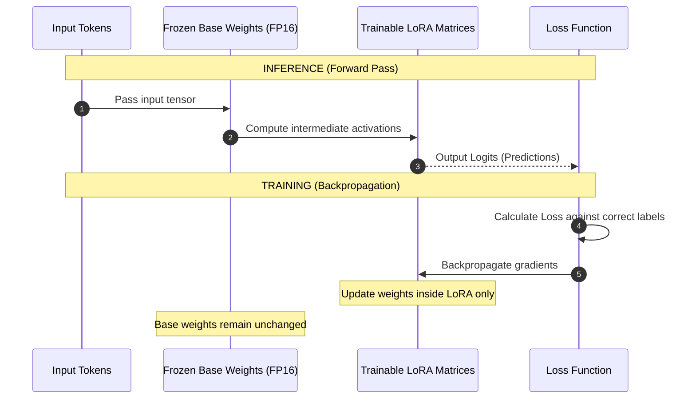

# Module 02: Inference vs. Training — Execution Graphs & LoRA Adapters

Welcome back, class. Today we analyze **Inference vs. Training (CS-523)**.

To build software around AI, you must understand what happens inside a neural network when it processes data. Many engineers mistake models for standard databases that can be dynamically updated with raw inserts. In reality, a model is a static mathematical function composed of billions of numbers called **Weights**. Modifying these weights (Training) is computationally expensive, while running data through them (Inference) is read-only.

Today, we will study **computational graphs**, analyze the difference between the forward pass and backpropagation, and explore **Parameter-Efficient Fine-Tuning (PEFT / LoRA)**.

---

## 1. Academic Lecture: Forward Passes, Backpropagation, and Adapters

Understanding the life cycle of model tensors is crucial for choosing the right development strategy:

### 1. Model Weights
A model's weights represent its "memory" and reasoning parameters. These weights are matrices of floats that scale inputs across layers of neurons. For example, a 7-billion parameter model (7B) contains 7,000,000,000 distinct floating-point weights.

### 2. Inference: The Forward Pass
Inference is the read-only execution of the model:
*   **The Flow**: Input tokens are converted into numerical tensors, which pass sequentially through the layer weights (the **Forward Pass**). The final layer outputs raw probability scores called **Logits**, which are translated back into predictions or text.
*   **Resource Constraints**: Inference only requires reading weights from memory once per request, making it suitable for real-time APIs.

### 3. Training: Backpropagation
Training is the process of adjusting the model weights to reduce prediction errors:
*   **The Flow**: We feed training data through a forward pass, compute the difference between the prediction and the correct label (the **Loss**), calculate how each weight contributed to the error (the **Gradients**), and traverse backward through the layers (the **Backward Pass / Backpropagation**) to update the weights.
*   **Resource Constraints**: Extremely expensive. Backpropagation requires storing gradients and optimizer states in GPU VRAM, consuming 3-4 times more memory than inference.

### 4. Fine-Tuning & LoRA (Low-Rank Adaptation)
Full fine-tuning updates all billions of weights, requiring massive cluster hardware. Today, engineers use **LoRA**:
*   **The Invariant**: We freeze the base model weights (they remain read-only). We insert tiny, low-rank adapter matrices adjacent to the frozen layers.
*   **The Benefit**: Only the tiny adapter weights (often <1% of the original model size) are trained. This reduces VRAM requirements by up to 80%, allowing developers to fine-tune models on standard developer workstations.



---

## 2. Theory vs. Production Trade-offs

### Model Fine-Tuning vs. Retrieval-Augmented Generation (RAG)
*   **Fine-Tuning (LoRA / QLoRA)**:
    *   *Pro*: Alters the model's behavior, tone, style, and syntax output. Excellent for teaching models to follow specific formatting templates (like generating JSON output formats).
    *   *Con*: High training latency. Cannot memorize changing facts reliably (e.g. fine-tuning a model to learn today's candidates list will hallucinate when candidates update tomorrow).
*   **Retrieval-Augmented Generation (RAG)**:
    *   *Pro*: Real-time database integration. We query a vector database for fresh documents (e.g. resumes) and inject them directly into the LLM's prompt context. The model reasons on the current data without any weight modifications.
    *   *Con*: High context window usage. Prompts become large, increasing token cost and inference latency.
*   **Production Rule**: Use **RAG** to feed factual, dynamic database information to your model. Use **Fine-Tuning (LoRA)** to customize the model's formatting style, output structure, or code generation syntax.

---

## 3. How to Use: Simulating Forward Passes and Inference

Let us write a compile-grade Python 3.11+ script using PyTorch that demonstrates a simple forward pass logic loop.

### A. The Endless Fine-Tuning Loop (Anti-Pattern)

Avoid attempting to update model weights in real-time response to dynamic database updates:

```python
# DANGER: Triggering training/fine-tuning loops inside web route handlers.
# Training takes minutes to hours, blocks CPU/GPU loops, and degrades performance,
# rendering your web app completely unresponsive.
def update_ats_model_vulnerable(candidate_resume_data: str):
    # Attempting to run backpropagation on a web request
    # model.train()
    # optimizer.step()
    return {"status": "Model trained with new resume data."}
```

### B. The Structured PyTorch Forward Pass (Production Pattern)

Here is the hardened pattern. We write a clean model executor class using PyTorch that performs inference (forward pass) using frozen weight tensors, ensuring memory optimization using `torch.no_grad()`.

```python
import torch
import torch.nn as nn
from typing import Tuple

# SECURE: Linear Inference Classifier Model
class SimpleATSClassifier(nn.Module):
    def __init__(self, input_dim: int, hidden_dim: int):
        super().__init__()
        # Define layer structures
        self.layer1 = nn.Linear(input_dim, hidden_dim)
        self.relu = nn.ReLU()
        self.layer2 = nn.Linear(hidden_dim, 1) # Outputs a single score
        self.sigmoid = nn.Sigmoid()

    def forward(self, x: torch.Tensor) -> torch.Tensor:
        # The Forward Pass execution graph
        out = self.layer1(x)
        out = self.relu(out)
        out = self.layer2(out)
        out = self.sigmoid(out)
        return out

class ModelInferenceRunner:
    def __init__(self, model: SimpleATSClassifier):
        self.model = model
        # SECURE: Force model into evaluation mode (disables dropout/batchnorm updates)
        self.model.eval()

    def execute_inference(self, feature_vector: list[float]) -> float:
        # Convert list input to PyTorch tensor
        input_tensor = torch.tensor([feature_vector], dtype=torch.float32)
        
        # SECURE: Disable gradient computations to conserve VRAM and CPU cycles
        # During inference, we do not need to track backpropagation gradients
        with torch.no_grad():
            output_tensor = self.model(input_tensor)
            
        # Extract scalar value from tensor
        score = float(output_tensor.item())
        return score
```

---

## 4. Common Errors & Pitfalls

### Pitfall 1: Leaking Gradients during Inference
Forgetting to wrap inference calls in `torch.no_grad()` or `with torch.inference_mode()`.
*   **Why it fails**: PyTorch tracks mathematical operations to build the backpropagation graph by default. Running inference without disabling gradient tracking causes memory usage to grow with every request, eventually triggering an Out-of-Memory (OOM) crash.
*   **Mitigation**: Always wrap your evaluation code in `with torch.no_grad():`.

### Pitfall 2: Confusing `model.eval()` with gradient disabling
Assuming that calling `model.eval()` disables gradient tracking.
*   **Why it fails**: `model.eval()` changes the behavior of layers like Dropout and Batch Normalization. It does *not* stop PyTorch from tracking gradients, meaning memory will still leak.
*   **Mitigation**: Use `model.eval()` and `torch.no_grad()` together.

---

## 5. Socratic Review Questions

### Question 1
Why does backpropagation require significantly more GPU VRAM than standard inference (forward pass) execution?

#### Answer
During inference, the GPU only needs to store the input activations of the current layer. Once the next layer is computed, the previous activations are discarded. During training backpropagation, the GPU must keep the activations of *all* layers in memory, along with gradients and optimizer states (e.g. Adam momentum trackers), to calculate the final weight adjustments.

### Question 2
How does a LoRA adapter modify the output of a frozen model layer mathematically?

#### Answer
If a frozen layer performs the matrix multiplication $h = W_0 x$, a LoRA adapter adds a parallel low-rank pathway:
$$h = W_0 x + \Delta W x = W_0 x + \frac{\alpha}{r} (B A x)$$
where $B$ and $A$ are small, trainable low-rank matrices. This allows the model to adjust its outputs without modifying the large $W_0$ matrix.

---

## 6. Hands-on Challenge: Implementing a Mock Forward Pass

### The Challenge
In this challenge, you will implement a mock forward pass using PyTorch weights and bias tensors.

Your task:
1.  Complete the function `calculate_linear_forward`.
2.  Input `x` is a 1D tensor, `weights` is a 2D tensor, and `bias` is a 1D tensor.
3.  Calculate the linear activation: $y = x \cdot W^T + b$ using `torch.matmul`.
4.  Apply the Sigmoid activation function using `torch.sigmoid`.
5.  Return the final tensor.

Complete the implementation below:

```python
import torch

def calculate_linear_forward(
    x: torch.Tensor,
    weights: torch.Tensor,
    bias: torch.Tensor
) -> torch.Tensor:
    # Disable gradient tracking for mock inference
    with torch.no_grad():
        # TODO: Complete this calculation.
        # 1. Multiply inputs and transposed weights: linear_out = torch.matmul(x, weights.t()) + bias
        # 2. Apply sigmoid: activation = torch.sigmoid(linear_out)
        # 3. Return the activation tensor.
        
        pass
        
    return torch.tensor([0.0])
```

Write the linear algebra multiplication and activation logic. Save the completed file and verify the activations output normalized floats inside `modules/02-inference-vs-training.md`.
