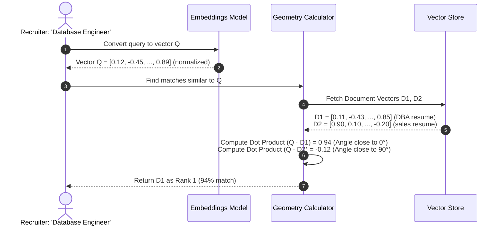

# Module 04: Vector Embeddings Theory — High-Dimensional Spaces & Similarity Metrics

Welcome back, class. Today we analyze **Vector Embeddings Theory (CS-523)**.

To understand how semantic search engines work under the hood, we must study high-dimensional geometry. When an embedding model converts a resume or a search query into a vector, it is mapping that text to a specific coordinate point in a space containing hundreds or thousands of dimensions. We determine how similar two pieces of text are by calculating the mathematical distance between their coordinates.

Today, we will study **vector spaces**, analyze the mathematical metrics used to measure semantic similarity (Cosine Similarity, Euclidean Distance, and Dot Product), and explore coordinate dimensions.

---

## 1. Academic Lecture: Dimensional Coordinates and Distance Functions

In software engineering, a vector is simply a list of floating-point numbers. In geometry, these numbers define a position:

### 1. High-Dimensional Vector Spaces
A traditional coordinate plane has two dimensions ($X$ and $Y$). A vector `[3.0, 4.0]` defines a point in that space.
*   An embedding model maps text into a high-dimensional space (e.g. 384 dimensions for lightweight models, 1536 dimensions for OpenAI models).
*   **The Invariant**: Each dimension represents a learned semantic concept (e.g. tense, gender, technical domain). Words or documents that share concepts are mapped to similar regions of the coordinate grid.

### 2. Distance and Similarity Metrics
To find matching resumes, we compute the distance between the query vector $Q$ and the document vector $D$:

#### A. Cosine Similarity (Recommended for Text)
Measures the cosine of the angle between two vectors. It ranges from `-1` (opposite meanings) to `1` (identical meanings):
$$\text{Cosine Similarity}(A, B) = \frac{A \cdot B}{\|A\| \|B\|} = \frac{\sum_{i=1}^n A_i B_i}{\sqrt{\sum_{i=1}^n A_i^2} \sqrt{\sum_{i=1}^n B_i^2}}$$
*   **The Advantage**: It ignores the *length* (magnitude) of the documents. If Resume A is 10 pages long and Resume B is 1 page long, but they contain the same technical skills, Cosine Similarity treats them as equal matches because their directional angle is the same.

#### B. Euclidean Distance (L2 Distance)
Measures the straight-line distance between two coordinate points:
$$d(A, B) = \sqrt{\sum_{i=1}^n (A_i - B_i)^2}$$
*   **The Disadvantage**: Highly sensitive to document length. Longer documents have larger vector magnitudes, pushing them further from the origin and making them appear "distant" from short queries, even if they are semantically relevant.

#### C. Dot Product (Inner Product)
Calculates the sum of the products of corresponding elements:
$$\text{Dot Product}(A, B) = \sum_{i=1}^n A_i B_i$$
*   If both vectors are **normalized** (scaled to a total magnitude of `1.0`), the Dot Product is mathematically identical to Cosine Similarity. Because Dot Product requires no square root calculations, it is the fastest similarity metric to compute in production.



---

## 2. Theory vs. Production Trade-offs

### Cosine Similarity vs. Normalized Dot Product
*   **Cosine Similarity (Direct Calculation)**:
    *   *Pro*: Safe. Works on any raw vectors returned by models, regardless of whether they have been scaled or normalized.
    *   *Con*: High CPU overhead. The denominator requires computing the square roots of the magnitudes for both vectors on every comparison. In a database of 100,000 resumes, this adds latency.
*   **Normalized Dot Product (Cosine Equivalent)**:
    *   *Pro*: Maximum throughput. If you normalize all vectors to unit length (`1.0`) *before* saving them to the database, you can use the raw dot product operator. This reduces the search to a simple multiply-and-add loop, optimizing database execution times.
    *   *Con*: Requires strict validation. If an un-normalized vector is inserted, search results will be corrupted.
*   **Production Rule**: Always **normalize your vectors** at your ingestion boundary, and run **Dot Product** inside your database queries to achieve maximum search throughput.

---

## 3. How to Use: Vector Operations in Python

Let us write a compile-grade Python 3.11+ application that calculates vector similarity metrics using NumPy.

### A. Raw Python Slices Loops (Anti-Pattern)

Avoid using standard Python loops to calculate vector math over large arrays:

```python
# DANGER: Looping through dimensions in raw Python.
# Python lists are slow for linear algebra. Running nested loops to compute
# cosine similarity over thousands of 768-dimension vectors will block
# CPU threads and slow down queries.
def cosine_similarity_vulnerable(a: list[float], b: list[float]) -> float:
    dot_product = sum(x * y for x, y in zip(a, b))
    magnitude_a = sum(x * x for x in a) ** 0.5
    magnitude_b = sum(x * x for x in b) ** 0.5
    
    if magnitude_a == 0 or magnitude_b == 0:
        return 0.0
    return dot_product / (magnitude_a * magnitude_b)
```

### B. Normalized Vector Math using NumPy (Production Pattern)

Here is the hardened pattern. We use NumPy's vectorized C-libraries to normalize vectors and calculate cosine similarity and dot product values efficiently.

```python
import numpy as np
from typing import List

# SECURE: Vectorized Similarity Engine
class VectorMathEngine:
    @staticmethod
    def normalize_vector(vector: List[float]) -> np.ndarray:
        """
        Scale a vector to a unit length of 1.0 (L2 Normalization).
        """
        arr = np.array(vector, dtype=np.float32)
        norm = np.linalg.norm(arr)
        if norm == 0:
            return arr
        # SECURE: Return array scaled to unit magnitude
        return arr / norm

    @staticmethod
    def compute_cosine_similarity(a: List[float], b: List[float]) -> float:
        """
        Calculate cosine similarity between two raw vectors (handles un-normalized inputs).
        """
        arr_a = np.array(a, dtype=np.float32)
        arr_b = np.array(b, dtype=np.float32)
        
        # Calculate dot product
        dot_val = np.dot(arr_a, arr_b)
        
        # Calculate magnitudes
        norm_a = np.linalg.norm(arr_a)
        norm_b = np.linalg.norm(arr_b)
        
        if norm_a == 0 or norm_b == 0:
            return 0.0
            
        return float(dot_val / (norm_a * norm_b))

    @classmethod
    def compute_fast_dot_product(cls, normalized_a: np.ndarray, normalized_b: np.ndarray) -> float:
        """
        Perform fast dot product matching. Assumes inputs are already normalized.
        """
        # SECURE: Simple dot product scales instantly on vectorized registers
        return float(np.dot(normalized_a, normalized_b))
```

---

## 4. Common Errors & Pitfalls

### Pitfall 1: Mixing Vectors from Different Models
Attempting to calculate similarity between a vector generated by OpenAI's embedder and a vector generated by a local Sentence-Transformers model.
*   **Why it fails**: Each embedding model trains its own coordinate dimensions. Dimension 42 in OpenAI might represent "technical skill", while in Sentence-Transformers it represents "past tense". Comparing them results in meaningless, random similarity scores.
*   **Mitigation**: Always ensure that all vectors stored and compared in your database are generated by the *exact same model*.

### Pitfall 2: Dimensionality Alignment Crashes
Attempting to compare vectors of different dimensions (e.g. 384 vs. 768).
*   **Why it fails**: Dot product calculations require both arrays to have the exact same length. A size mismatch raises a `ValueError` crash.
*   **Mitigation**: Lock your database schema dimensions using constraints (e.g. `vector(384)`).

---

## 5. Socratic Review Questions

### Question 1
Why does Cosine Similarity return a value of `1.0` for two identical sentences, even if one sentence is written in uppercase and the other in lowercase?

#### Answer
Before generating embeddings, the model's tokenizer normalizes the text (often converting characters to lowercase and resolving punctuation). Because the input strings map to the exact same tokens, the model generates identical vector coordinates, resulting in an angle of 0° and a cosine similarity of `1.0`.

### Question 2
If two vectors are already L2-normalized (magnitude equals `1.0`), what is the mathematical relationship between their Euclidean distance and their Cosine similarity?

#### Answer
For L2-normalized vectors $A$ and $B$, their squared Euclidean distance is directly proportional to their cosine similarity:
$$\|A - B\|^2 = \|A\|^2 + \|B\|^2 - 2(A \cdot B) = 2 - 2 \cdot \text{Cosine Similarity}(A, B)$$
Therefore, sorting vectors by minimum Euclidean distance yields the exact same ranked order as sorting them by maximum Cosine similarity.

---

## 6. Hands-on Challenge: Implementing Cosine Similarity in Pure Python

### The Challenge
In this challenge, you will implement the mathematical Cosine Similarity formula in pure Python without using external libraries.

Your task:
1.  Complete the function `calculate_pure_cosine`.
2.  Calculate the dot product of lists `a` and `b`.
3.  Calculate the L2 norm (magnitude) of list `a` and list `b`.
4.  If either magnitude is 0, return `0.0`.
5.  Return the dot product divided by the product of the magnitudes.

Complete the implementation below:

```python
import math

def calculate_pure_cosine(a: list[float], b: list[float]) -> float:
    if len(a) != len(b) or not a:
        raise ValueError("Vectors must be of equal, non-zero length")
        
    # TODO: Complete this calculator.
    # 1. Compute dot product: dot = sum(x * y for x, y in zip(a, b))
    # 2. Compute magnitude of a: mag_a = math.sqrt(sum(x * x for x in a))
    # 3. Compute magnitude of b: mag_b = math.sqrt(sum(x * x for x in b))
    # 4. If mag_a == 0.0 or mag_b == 0.0, return 0.0.
    # 5. Return dot / (mag_a * mag_b).
    
    return 0.0
```

Write the vector operations and check for zero-division boundaries. Save the completed file and verify the similarity outputs range correctly inside `modules/04-vector-embeddings-theory.md`.
