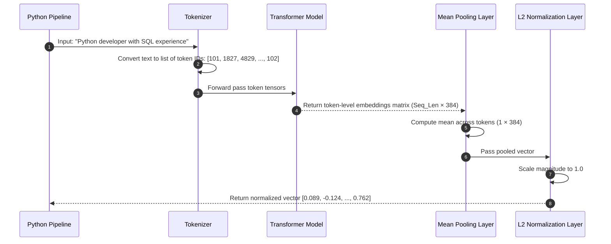

# Module 05: Generating Embeddings — sentence-transformers & Chunking Pipelines

Welcome back, class. Today we analyze **Generating Embeddings in Python (CS-523)**.

Once you understand the mathematical properties of high-dimensional vectors, you must implement the pipeline to generate them. In production, we use the **`sentence-transformers`** Python library (built on top of PyTorch and HuggingFace transformers) to run optimized embeddings models locally. However, writing a naive generation loop introduces critical issues: sending long resumes that exceed the model's token limits (causing silent text truncation) or saturating system memory during batch encoding.

Today, we will study **tokenization limits**, analyze **pooling layers**, and build a robust, chunked embeddings pipeline in Python.

---

## 1. Academic Lecture: Tokenization, Mean Pooling, and Context Windows

Generating sentence-level embeddings is a multi-step tensor pipeline:

### 1. Tokenization and Context Limits
Before text passes through a model, the tokenizer splits it into smaller sub-word units called **Tokens**.
*   **The Token Limit**: Every model has a maximum context window limit (e.g. `all-MiniLM-L6-v2` has a limit of **256 tokens**, roughly 190 words).
*   **The Hazard**: If you pass a 1,000-word candidate resume to the model, it will silently discard the last 800 words, ignoring all experience listed past the first paragraph. We resolve this by **chunking** the document into smaller, overlapping segments before generation.

### 2. Pooling Strategies
When a model processes tokens, it generates a vector for *each individual token*. To combine these token vectors into a single coordinate representing the entire text, we apply a **Pooling Layer**:
*   **Mean Pooling (Recommended)**: Calculates the average of all token vectors while ignoring padding tokens. This captures the aggregate meaning of the entire sentence.
*   **CLS Token Pooling**: Extracts the vector of the special classification token (`[CLS]`) placed at the start of the text.

### 3. Normalization
After pooling, the output vector has an arbitrary length. To enable fast Dot Product similarity search inside databases, we apply L2 normalization to scale the vector's Euclidean magnitude to exactly `1.0`.



---

## 2. Theory vs. Production Trade-offs

### Single Document Ingestion vs. Batch Encoding
*   **Single-Document Generation (`model.encode(text)`)**:
    *   *Pro*: Low latency for real-time operations. Ideal for generating the query vector when a recruiter submits a search query.
    *   *Con*: High overhead. Inefficient for indexing a folder of 10,000 resumes because PyTorch cannot parallelize the calculations across CPU/GPU cores.
*   **Batch Ingestion (`model.encode(list_of_texts, batch_size=32)`)**:
    *   *Pro*: Maximum throughput. Groups inputs into batches, allowing PyTorch to execute matrix multiplications in parallel on hardware cores.
    *   *Con*: High peak memory consumption. Setting the batch size too high will trigger VRAM/RAM Out-of-Memory crashes.
*   **Production Rule**: Use **Single-Document** encoding for search queries. Use **Batch Ingestion** with a validated, conservative batch size (e.g., `batch_size=32` or `64`) for bulk resume migrations and initial indexes.

---

## 3. How to Use: Building a Chunked Embeddings Pipeline

Let us write a compile-grade Python 3.11+ application that chunks long documents and generates normalized embeddings.

### A. The Truncation Data Loss (Anti-Pattern)

Avoid passing long files directly to models without validation:

```python
from sentence_transformers import SentenceTransformer

# DANGER: Directly passing long text.
# The model's context window limit will silently truncate the text,
# discarding the majority of the candidate's history.
def index_candidate_vulnerable(raw_resume_text: str):
    model = SentenceTransformer("all-MiniLM-L6-v2")
    # silently discards text past 256 tokens (~190 words)
    embedding = model.encode(raw_resume_text)
    return embedding
```

### B. The Hardened Chunked Ingestion Pipeline (Production Pattern)

Here is the hardened pattern. We write a clean text chunker that splits documents using a sliding window, generates batch embeddings, and normalizes the results.

```python
from pathlib import Path
from typing import List, Dict, Any
import numpy as np
from sentence_transformers import SentenceTransformer

class EmbeddingsPipeline:
    def __init__(self, model_name: str = "all-MiniLM-L6-v2"):
        # Load local model (downloads on first run, then caches locally)
        self.model = SentenceTransformer(model_name)
        # Extract model context limit (typically 256 or 512)
        self.max_tokens = self.model.max_seq_length

    def chunk_text_sliding_window(self, text: str, chunk_size_words: int = 150, overlap_words: int = 30) -> List[str]:
        """
        Splits a document into smaller overlapping chunks to prevent context truncation.
        """
        words = text.split()
        if len(words) <= chunk_size_words:
            return [text]
            
        chunks = []
        stride = chunk_size_words - overlap_words
        
        for i in range(0, len(words), stride):
            chunk_words = words[i:i + chunk_size_words]
            chunks.append(" ".join(chunk_words))
            if i + chunk_size_words >= len(words):
                break
                
        return chunks

    def generate_normalized_embeddings(self, texts: List[str]) -> np.ndarray:
        """
        Generate batch embeddings, ensuring L2 normalization.
        """
        # SECURE: model.encode has built-in normalize_embeddings option
        # which performs the L2 scaling mathematically on the model tensors
        embeddings = self.model.encode(
            texts,
            batch_size=32,
            show_progress_bar=False,
            normalize_embeddings=True
        )
        return embeddings

    def process_document(self, doc_id: int, raw_text: str) -> List[Dict[str, Any]]:
        # 1. Chunk document locally to fit context windows
        chunks = self.chunk_text_sliding_window(raw_text)
        
        # 2. Generate batch embeddings for chunks
        embeddings = self.generate_normalized_embeddings(chunks)
        
        # 3. Format output records
        records = []
        for idx, (chunk_text, vector) in enumerate(zip(chunks, embeddings)):
            records.append({
                "doc_id": doc_id,
                "chunk_index": idx,
                "text_snippet": chunk_text[:50] + "...",
                "vector": vector.tolist()  # Convert numpy array to list for JSON/DB
            })
        return records
```

---

## 4. Common Errors & Pitfalls

### Pitfall 1: GPU out of memory (OOM) during batch runs
Running embeddings pipelines on lists of thousands of documents without splitting them into batches.
*   **Why it fails**: PyTorch attempts to load the tokenizers and calculations for all inputs into VRAM simultaneously, causing immediate allocations failures.
*   **Mitigation**: Always pass `batch_size` configurations or split inputs into small generator chunks.

### Pitfall 2: Forgetting to verify model token limits
Assuming all models have the same token limit.
*   **Why it fails**: Models have different token limits (e.g. `all-MiniLM-L6-v2` has 256 tokens, while newer models support 8192 tokens). Running code with static hardcoded chunk sizes can lead to silent truncation.
*   **Mitigation**: Inspect `model.max_seq_length` programmatically to adjust chunk bounds.

---

## 5. Socratic Review Questions

### Question 1
Why does a sliding window overlap (e.g., 30 words) prevent semantic data loss at chunk boundaries?

#### Answer
If a candidate lists an experience like `"Developed high-frequency database replication systems using SQL"` right at a chunk split index, the sentence will be cut in half. Chunk 1 will get `"Developed high-frequency database"` and Chunk 2 will get `"replication systems using SQL"`. Neither chunk retains the complete semantic context. A sliding window overlap ensures that the complete sentence is preserved in at least one chunk.

### Question 2
What is the purpose of setting `normalize_embeddings=True` inside `model.encode()`?

#### Answer
It divides each output vector coordinate by the vector's Euclidean magnitude. This scales the vector to a length of exactly `1.0` ($L_2$ norm). Normalized vectors allow downstream databases to use the faster Dot Product operator to calculate cosine similarities.

---

## 6. Hands-on Challenge: Building a Secure Text Embedder

### The Challenge
In this challenge, you will implement a text chunker and embeddings generator using the `sentence-transformers` library.

Your task:
1.  Complete the function `generate_secure_chunks`.
2.  If the text exceeds `max_words`, split it into chunks of `max_words` with a `stride_overlap` word overlap.
3.  Compute the embeddings for all chunks using the provided `model` instance.
4.  Ensure the output vectors are L2-normalized.

Complete the implementation below:

```python
from sentence_transformers import SentenceTransformer

def generate_secure_chunks(
    model: SentenceTransformer,
    text: str,
    max_words: int = 100,
    stride_overlap: int = 20
) -> list[list[float]]:
    # Split text into words list
    words = text.split()
    chunks = []
    
    # TODO: Complete the sliding window chunker.
    # 1. Loop through index ranges with stride: range(0, len(words), max_words - stride_overlap)
    # 2. Slice words: chunk = words[i:i + max_words]
    # 3. Join words back to string: chunks.append(" ".join(chunk))
    # 4. If i + max_words >= len(words), break.
    
    # TODO: Generate normalized embeddings.
    # Use model.encode(chunks, normalize_embeddings=True)
    # Convert numpy arrays to float lists and return.
    
    return []
```

Write the sliding window loops and normalization settings. Save the completed file and verify the vectors load with dimensions matching your model parameters inside `modules/05-generating-embeddings-python.md`.
