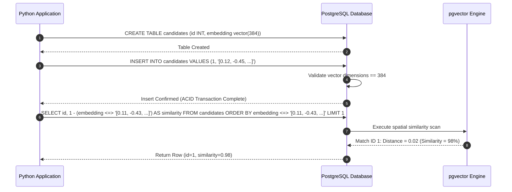

# Module 06: Database Vector Stores — PostgreSQL & pgvector Setup

Welcome back, class. Today we analyze **Database Vector Stores (CS-523)**.

In previous modules, we generated vector embeddings and compared them in system memory using NumPy. In a production software application, you cannot keep candidate vectors in temporary RAM buffers. You must persist them in a database, allowing you to join candidates' vector embeddings with traditional relational data like names, job titles, and locations. 

While dedicated vector databases exist, PostgreSQL offers the **`pgvector`** extension. This allows developers to store high-dimensional vectors directly inside relational tables, run distance calculations via standard SQL operators, and leverage transaction ACID safety. Today, we will study **pgvector schema design**, set up database connections, and write optimized vector queries.

---

## 1. Academic Lecture: pgvector schemas, Operators, and Relational Joins

The `pgvector` extension integrates spatial geometry primitives directly into PostgreSQL:

### 1. The `vector(N)` Data Type
Once the extension is enabled, PostgreSQL exposes a new data type: `vector(N)`, where `N` represents the fixed number of dimensions.
*   **The Invariant**: You must specify the dimensions to match your embedding model. If you use `all-MiniLM-L6-v2` (384 dimensions), the column must be declared as `vector(384)`. PostgreSQL rejects inserts of mismatched lengths.

### 2. Distance Operators in pgvector
To search vectors, SQL queries use dedicated operators. Note that databases calculate **Distance** (how far apart points are) rather than **Similarity** (how close they are).
*   **`<=>` Cosine Distance**: Calculates $1 - \text{Cosine Similarity}$. Distance ranges from `0` (identical direction) to `2` (opposite direction). To find the closest matches, we sort the query **ascending** (smallest distance first):
    ```sql
    SELECT * FROM resumes ORDER BY embedding <=> $1 LIMIT 5;
    ```
*   **`<->` L2 Euclidean Distance**: Calculates the straight-line distance.
*   **`<#>` Negative Inner Product (Dot Product)**: Returns the negative value of the dot product. PostgreSQL orders queries ascending, so minimizing the negative inner product maximizes the positive dot product.



---

## 2. Theory vs. Production Trade-offs

### Relational Extension (pgvector) vs. Dedicated Vector DB (Pinecone / Milvus)
*   **PostgreSQL with `pgvector`**:
    *   *Pro*: Architectural simplicity. No new database servers to maintain. You can write single SQL queries that join candidate metadata (e.g. `salary > 50000`) and vector distances (`embedding <=> $1`) in a single transaction, guaranteeing complete ACID safety.
    *   *Con*: Slower scaling. Under extremely high loads (millions of vectors), vector calculations consume massive CPU. This can slow down traditional relational transactions on the same database.
*   **Dedicated Vector Databases (e.g. Pinecone)**:
    *   *Pro*: High scale performance. Built to handle billions of vectors with sub-millisecond latencies using dedicated hardware clusters.
    *   *Con*: Two-system synchronization latency. You must sync updates from your primary relational database to the vector store. This risks data drift (e.g. deleting a candidate in Postgres but leaving their vector active in Pinecone).
*   **Production Rule**: Always start with **`pgvector`** in PostgreSQL. It simplifies development, security, backups, and relational joins. Only migrate to a **Dedicated Vector Database** if your data volume exceeds 10 million vector records or your search metrics saturate database CPU limits.

---

## 3. How to Use: SQL Schemas and Python Integrations

Let us write the SQL migrations and a compile-grade Python 3.11+ script using `psycopg` (v3) to insert and search vectors.

### A. String Serialization Inefficiency (Anti-Pattern)

Avoid storing vectors as raw comma-separated text strings or JSON arrays in standard database columns:

```sql
-- DANGER: Storing vectors as TEXT/JSON
-- Doing so makes index-assisted queries impossible. The database is forced
-- to fetch all records, deserialize the text in memory, and calculate similarity
-- using slow user-defined functions, crashing performance.
CREATE TABLE resumes_vulnerable (
    id SERIAL PRIMARY KEY,
    embedding_text TEXT -- DANGER: No type validations or spatial operations possible
);
```

### B. The Hardened pgvector Schema and Query API (Production Pattern)

Here is the production implementation. First, define the SQL schema migration:

```sql
-- 1. Enable the vector extension
CREATE EXTENSION IF NOT EXISTS vector;

-- 2. Define table with strict dimensional constraints
CREATE TABLE candidate_resumes (
    id SERIAL PRIMARY KEY,
    candidate_name VARCHAR(255) NOT NULL,
    resume_chunk_text TEXT NOT NULL,
    -- SECURE: vector type enforces exactly 384 dimensions matching our model
    embedding vector(384) NOT NULL
);
```

Next, write the Python database wrapper using `psycopg`:

```python
import numpy as np
from psycopg import Connection
from typing import List, Dict, Any

class CandidateVectorRepository:
    def __init__(self, db_conn: Connection):
        self.conn = db_conn

    def insert_candidate_chunk(self, name: str, chunk_text: str, embedding: List[float]):
        # Convert float list to numpy array representation for pgvector compatibility
        vector_array = np.array(embedding, dtype=np.float32)
        
        # SECURE: Bind parameters using standard placeholder queries
        # psycopg handles formatting the float array to the pgvector input syntax
        query = """
            INSERT INTO candidate_resumes (candidate_name, resume_chunk_text, embedding)
            VALUES (%s, %s, %s);
        """
        with self.conn.cursor() as cur:
            cur.execute(query, (name, chunk_text, vector_array))
        self.conn.commit()

    def search_similar_candidates(self, query_embedding: List[float], limit: int = 5) -> List[Dict[str, Any]]:
        vector_array = np.array(query_embedding, dtype=np.float32)
        
        # SECURE: Sort ascending by Cosine Distance (<=>)
        # Calculate Cosine Similarity as (1 - distance)
        query = """
            SELECT 
                id, 
                candidate_name, 
                resume_chunk_text, 
                1 - (embedding <=> %s) AS similarity_score
            FROM candidate_resumes
            ORDER BY embedding <=> %s
            LIMIT %s;
        """
        results = []
        with self.conn.cursor() as cur:
            cur.execute(query, (vector_array, vector_array, limit))
            for row in cur.fetchall():
                results.append({
                    "id": row[0],
                    "name": row[1],
                    "snippet": row[2][:100] + "...",
                    "similarity": float(row[3])
                })
        return results
```

---

## 4. Common Errors & Pitfalls

### Pitfall 1: Mismatched Vector Dimensions
Attempting to insert a 768-dimensional vector into a column defined as `vector(384)`.
*   **Why it fails**: PostgreSQL raises a SQL state exception: `ERROR: vector columns must have N dimensions`, terminating the transaction.
*   **Mitigation**: Always ensure your database schema dimensions exactly match the output dimensions of your embedding model.

### Pitfall 2: Confusing Distance and Similarity in Thresholds
Writing queries like `WHERE embedding <=> $1 > 0.8` to filter for 80% matches.
*   **Why it fails**: The `<=>` operator returns Cosine *Distance* (where smaller values mean more similar). A distance of `0.2` corresponds to a similarity of `0.8`. The query above actually filters for files with *less than 20% similarity*, returning irrelevant candidates.
*   **Mitigation**: Always convert distance to similarity mathematically: `1 - (embedding <=> $1) >= 0.8`.

---

## 5. Socratic Review Questions

### Question 1
Why does pgvector use the `<#>` operator (Negative Inner Product) for Dot Product searches instead of returning the raw positive inner product?

#### Answer
PostgreSQL query planner indexes are designed to optimize searches for the *minimum* value (ascending order, e.g. finding the smallest distance). Because maximizing a positive dot product is mathematically equivalent to minimizing its negative counterpart, pgvector returns the negative inner product (`<#>`) so queries can order ascending.

### Question 2
How does pgvector guarantee transaction consistency (ACID) when updating vectors?

#### Answer
Because pgvector stores vector columns directly inside standard PostgreSQL table rows, vector updates are managed by the database's default Write-Ahead Log (WAL) and MVCC (Multi-Version Concurrency Control) engines, ensuring updates are fully atomic and durable.

---

## 6. Hands-on Challenge: Implementing a Similarity Threshold Filter

### The Challenge
In this challenge, you will write a python database method using `psycopg` to search and filter candidates whose similarity score exceeds a minimum threshold.

Your task:
1.  Complete the SQL query in the `query_matches` method.
2.  Select the `candidate_name` and compute the similarity score: `1 - (embedding <=> query_vector)`.
3.  Filter results using a `WHERE` clause: `1 - (embedding <=> query_vector) >= threshold`.
4.  Order the results by Cosine Distance ascending.

Complete the implementation below:

```python
from psycopg import Connection

class DatabaseScanner:
    def __init__(self, conn: Connection):
        self.conn = conn

    def query_matches(self, query_vector: list[float], threshold: float) -> list[dict]:
        # TODO: Complete the SQL scanner.
        # 1. Define query string with parameters placeholders.
        # 2. SELECT candidate_name, 1 - (embedding <=> %s) AS score
        # 3. FROM candidate_resumes
        # 4. WHERE 1 - (embedding <=> %s) >= %s
        # 5. ORDER BY embedding <=> %s ASC
        
        query = ""
        results = []
        
        # Simulating cursor execution wrapper
        # with self.conn.cursor() as cur:
        #     cur.execute(query, (query_vector, query_vector, threshold, query_vector))
        #     for row in cur.fetchall():
        #         results.append({"name": row[0], "score": float(row[1])})
                
        return results
```

Write the SQL query placeholders and sorting rules. Save the completed file and verify the SQL statements match pgvector metrics inside `modules/06-vector-databases-pgvector.md`.
