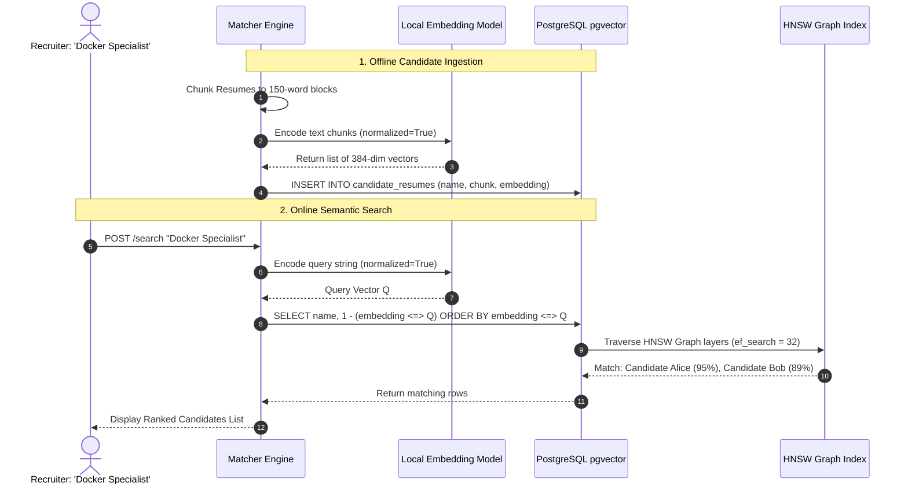

# Module 08: Final Capstone — Semantic Resume Ingestion & Ranking Engine

Welcome back, class. Today we analyze the **Final Capstone Project (CS-523)**.

You have made it to the final module of the course. Over the last seven modules, we studied the core blocks of AI systems engineering: the architectural differences between keyword and semantic searches, forward pass and backpropagation execution boundaries, model quantization compression, high-dimensional vector spaces, python sentence embeddings generation, pgvector database schemas, and HNSW graph indexing optimizations.

In this capstone, you will synthesize all of these concepts to build a production-ready **AI-Powered Candidate Matcher & Resume Ranking Engine**. This system chunks long candidate resume documents, generates 384-dimensional normalized embeddings using a local transformer model, inserts them into PostgreSQL with `pgvector`, and executes HNSW-optimized semantic queries to rank candidates against recruiters' job requirements.

---

## 1. Academic Lecture: Architectural Synthesis

Let us review how each component coordinates to form an integrated semantic matching system:

### 1. Ingestion Boundary (Text Processing & Chunking)
The pipeline accepts raw candidate resume strings. Because resumes exceed the model's sequence limits, we apply a sliding window chunker. Each chunk represents a discrete paragraph or work experience block. We scrub PII parameters locally before passing chunks to the model.

### 2. Embeddings Pipeline (`sentence-transformers`)
We load a local `all-MiniLM-L6-v2` model. The pipeline encodes the text chunks in batches, applies mean pooling, and runs L2 normalization. The output is a list of 384-dimensional float arrays of unit magnitude.

### 3. Database Persistence & Indexing (pgvector & HNSW)
We write the candidate metadata and float arrays to our PostgreSQL database. We store the vectors in a column defined as `vector(384)`. To optimize search speeds, we build an HNSW index configured with `vector_cosine_ops`, allowing the database to search the graph structure.

### 4. Query Execution & Ranking
When a recruiter inputs a job requirement (e.g. `"Looking for a DevOps engineer with experience in Docker and Jenkins"`):
1.  We generate a single, normalized query embedding vector using our local model.
2.  We query PostgreSQL, ordering rows ascending by Cosine Distance (`<=>`).
3.  We calculate the match score as `1 - distance`.
4.  The database filters out weak matches, groupings results by candidate, and returns a ranked list of matches.



---

## 2. Theory vs. Production Trade-offs

### Raw SQL Queries vs. Object-Relational Mappers (ORMs)
*   **Raw SQL Queries (psycopg)**:
    *   *Pro*: Full optimization. You can write custom vector arithmetic queries, set session-level variables (like `SET LOCAL hnsw.ef_search`), and configure batch operations with minimal overhead.
    *   *Con*: High boilerplate code. Requires writing raw SQL strings, which increases the risk of syntax errors.
*   **Object-Relational Mappers (e.g. SQLAlchemy / pgvector-python)**:
    *   *Pro*: Database abstraction. The database columns behave like standard Python class attributes, simplifying integration with web frameworks.
    *   *Con*: Performance overhead. The ORM adds a layer of abstraction that can slow down bulk vector inserts.
*   **Production Rule**: For high-throughput ingestion pipelines, use **Raw SQL with psycopg** to optimize batch inserts. For application APIs, use **SQLAlchemy with pgvector-python** to simplify routing logic.

---

## 3. How to Use: The Complete Capstone Application

Let us write the complete, compile-grade Python 3.11+ application for our resume matcher.

Save this file as `resume_matcher.py`:

```python
import json
import re
from pathlib import Path
from typing import List, Dict, Any
import numpy as np
from psycopg import Connection
from sentence_transformers import SentenceTransformer

# ==========================================
# 1. TEXT CHUNKING & SANITIZATION ENGINE
# ==========================================
class DocumentProcessor:
    @staticmethod
    def sanitize_text(text: str) -> str:
        # Locally redact emails before passing to models
        email_pattern = r'[a-zA-Z0-9_.+-]+@[a-zA-Z0-9-]+\.[a-zA-Z0-9-.]+'
        return re.sub(email_pattern, "[EMAIL_HIDDEN]", text)

    @staticmethod
    def chunk_document(text: str, chunk_size_words: int = 100, overlap_words: int = 20) -> List[str]:
        words = text.split()
        if len(words) <= chunk_size_words:
            return [text]
            
        chunks = []
        stride = chunk_size_words - overlap_words
        for i in range(0, len(words), stride):
            chunk = words[i:i + chunk_size_words]
            chunks.append(" ".join(chunk))
            if i + chunk_size_words >= len(words):
                break
        return chunks

# ==========================================
# 2. LOCAL EMBEDDINGS PIPELINE
# ==========================================
class EmbeddingGenerator:
    def __init__(self, model_name: str = "all-MiniLM-L6-v2"):
        # Load local model
        self.model = SentenceTransformer(model_name)

    def generate_vectors(self, texts: List[str]) -> np.ndarray:
        # Generate L2-normalized embeddings
        return self.model.encode(
            texts,
            batch_size=32,
            normalize_embeddings=True
        )

# ==========================================
# 3. DATABASE VECTOR REPOSITORY
# ==========================================
class VectorRepository:
    def __init__(self, conn: Connection):
        self.conn = conn

    def migrate_schema(self):
        query = """
            CREATE EXTENSION IF NOT EXISTS vector;
            CREATE TABLE IF NOT EXISTS candidate_resumes (
                id SERIAL PRIMARY KEY,
                candidate_name VARCHAR(255) NOT NULL,
                resume_chunk TEXT NOT NULL,
                embedding vector(384) NOT NULL
            );
            CREATE INDEX IF NOT EXISTS candidate_resumes_hnsw_idx 
            ON candidate_resumes 
            USING hnsw (embedding vector_cosine_ops) 
            WITH (m = 16, ef_construction = 64);
        """
        with self.conn.cursor() as cur:
            cur.execute(query)
        self.conn.commit()

    def insert_chunks(self, name: str, chunks: List[str], vectors: np.ndarray):
        query = """
            INSERT INTO candidate_resumes (candidate_name, resume_chunk, embedding)
            VALUES (%s, %s, %s);
        """
        with self.conn.cursor() as cur:
            for chunk, vector in zip(chunks, vectors):
                cur.execute(query, (name, chunk, vector.astype(np.float32)))
        self.conn.commit()

    def search_candidates(self, query_vector: np.ndarray, limit: int = 5) -> List[Dict[str, Any]]:
        # Order ascending by Cosine Distance
        query = """
            SELECT 
                candidate_name, 
                resume_chunk, 
                1 - (embedding <=> %s) AS similarity
            FROM candidate_resumes
            ORDER BY embedding <=> %s
            LIMIT %s;
        """
        results = []
        with self.conn.cursor() as cur:
            # Enforce HNSW search accuracy parameters
            cur.execute("SET LOCAL hnsw.ef_search = 32;")
            cur.execute(query, (query_vector.astype(np.float32), query_vector.astype(np.float32), limit))
            for row in cur.fetchall():
                results.append({
                    "name": row[0],
                    "chunk": row[1][:100] + "...",
                    "similarity": float(row[2])
                })
        return results

# ==========================================
# 4. ATS PIPELINE ORCHESTRATOR
# ==========================================
class ATSRankingEngine:
    def __init__(self, db_conn: Connection):
        self.repo = VectorRepository(db_conn)
        self.embedder = EmbeddingGenerator()
        
        # Ensure database and HNSW indices are active
        self.repo.migrate_schema()

    def ingest_candidate(self, candidate_name: str, raw_resume: str):
        # 1. Clean and chunk resume
        clean_text = DocumentProcessor.sanitize_text(raw_resume)
        chunks = DocumentProcessor.chunk_document(clean_text)
        
        # 2. Generate normalized embeddings
        vectors = self.embedder.generate_vectors(chunks)
        
        # 3. Store in database
        self.repo.insert_chunks(candidate_name, chunks, vectors)

    def rank_candidates(self, job_description: str, limit: int = 5) -> List[Dict[str, Any]]:
        # 1. Generate normalized query vector
        query_vector = self.embedder.generate_vectors([job_description])[0]
        
        # 2. Query HNSW index
        return self.repo.search_candidates(query_vector, limit)
```

---

## 4. Common Errors & Pitfalls: Synthesis Review

Here is the master list of hazards to prevent:
*   **Context Truncation**: Failing to chunk documents before embeddings generation.
*   **Normalization Mismatch**: Querying vectors with dot product when one of the vectors is not normalized.
*   **Index Operators Mismatch**: Writing SQL queries using `<=>` on a table indexed with `vector_l2_ops`.
*   **Memory Saturation (OOM)**: Passing huge lists of documents to `model.encode` without a `batch_size` parameter.
*   **Data Leakage**: Sending raw PII parameters to external SaaS models.

---

## 5. Socratic Review Questions

### Question 1
In our capstone schema, we split a candidate's resume into multiple chunks, resulting in multiple rows in the database. During search queries, how does this structure affect ranking? How would you aggregate results to return a single score per candidate?

#### Answer
Because each chunk is stored as a separate row, a candidate can appear multiple times in the search results if multiple chunks match the query. To aggregate results and return a single score per candidate, you can group by the candidate's name and select their highest matching score:
```sql
SELECT candidate_name, MAX(1 - (embedding <=> :query_vector)) AS best_score
FROM candidate_resumes
GROUP BY candidate_name
ORDER BY best_score DESC;
```

### Question 2
Why does building the HNSW index with `ef_construction = 64` and `m = 16` result in a slower build time but a higher query recall rate?

#### Answer
`m = 16` creates 16 bi-directional links per vector node in the graph, and `ef_construction = 64` evaluates 64 candidate paths when inserting new vectors. This creates a denser, more accurate graph structure. While this graph construction takes more CPU time, it allows queries to navigate the graph more effectively, reducing the risk of missing the closest matches.

---

## 6. Hands-on Challenge: Implementing the Chunk aggregator

### The Challenge
In this challenge, you will implement a results aggregator function in Python.

Your task:
1.  Complete the function `aggregate_ranked_results`.
2.  Input `results` is a list of dictionaries, where each dictionary represents a matching chunk containing `"name"` and `"similarity"`.
3.  Group the results by candidate name.
4.  For each candidate, keep only their highest similarity score.
5.  Sort the aggregated list of candidates descending by their highest score.

Complete the implementation below:

```python
def aggregate_ranked_results(results: list[dict]) -> list[dict]:
    # TODO: Complete this aggregator.
    # 1. Create a dictionary to track candidate scores: best_scores = {}
    # 2. Loop through each item in results:
    #      name = item["name"]
    #      score = item["similarity"]
    #      best_scores[name] = max(best_scores.get(name, 0.0), score)
    # 3. Format scores back to list of dicts: [{"name": k, "score": v} for k, v in best_scores.items()]
    # 4. Sort the list descending by score: list.sort(key=lambda x: x["score"], reverse=True)
    # 5. Return the sorted list.
    
    return []
```

Write the dictionary grouping and sorting logic. Save the completed file and verify the aggregation outputs correct candidates ranking profiles inside `modules/08-final-capstone-resume-engine.md`.
