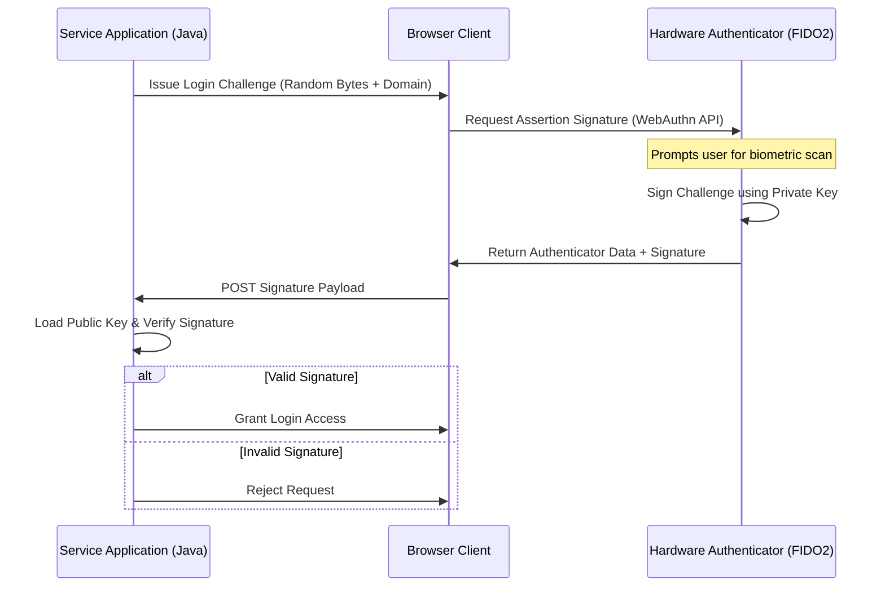

# Module 06: Multi-Factor Authentication (MFA) & WebAuthn

Welcome back class. Today we analyze **Multi-Factor Authentication (MFA) & WebAuthn (CS-527)**.

Single-factor password systems are no longer sufficient to protect critical enterprise endpoints. Attackers can bypass passwords through database leaks, credential stuffing, and phishing campaigns. To enforce modern zero-trust policies, we must require Multi-Factor Authentication (MFA). Traditional possession factors (like SMS OTP) are vulnerable to SIM-swapping intercept attacks. Consequently, we must deploy cryptographic possession systems like **Time-Based One-Time Passwords (TOTP)** and passwordless **WebAuthn/FIDO2 biometrics**.

Today we study MFA classification, analyze the mathematics behind TOTP token generation, explore public-key WebAuthn challenge assertions, and write a secure TOTP verification service in **Java 21**.

---

## 1. Academic Lecture: Multi-Factor Authentication Mechanics

### 1. The Three Authentication Factor Domains
Enterprise security requires combining factors across different conceptual boundaries:
*   **Knowledge Factor** (What you know): Passwords, PINs, answers to security questions.
*   **Possession Factor** (What you have): Hardware keys, mobile app authenticator generators, smart cards.
*   **Inherence Factor** (What you are): Fingerprints, facial biometric scans, voice recognition.

### 2. Time-Based One-Time Passwords (TOTP) Math (RFC 6238)
The TOTP algorithm is a standardized extension of the HMAC-Based One-Time Password (HOTP) spec. Instead of incrementing a sequential counter on every click, it calculates a dynamic counter derived from physical time:
1.  **Counter Calculation**: 

$$T = \lfloor \frac{\text{CurrentUnixTime} - T_0}{X} \rfloor$$

Where $T_0$ is the epoch start offset (usually `0`), and $X$ is the time step duration (standard is `30` seconds).
2.  **HMAC Signature**: Compute the HMAC-SHA1 hash using the shared secret key $K$ and the time counter $T$ represented as an 8-byte array.
3.  **Dynamic Truncation**: Extract a 4-byte segment from the resulting 20-byte HMAC hash dynamically.
    *   Let `offset` be the low 4 bits of the last byte in the hash.
    *   Copy 4 bytes starting from that `offset` index.
    *   Set the most significant bit to `0` to prevent negative signed integer calculations.
4.  **Modulo Operation**: Convert the 4 bytes to an integer and perform a modulo operation (`% 10^6` for a 6-digit code).

### 3. WebAuthn & FIDO2 Cryptographic Challenge-Response
WebAuthn replaces shared secrets (like passwords or TOTP keys) with asymmetric public-key cryptography:
*   **Registration**: The server issues a challenge byte array. The client's browser requests that the hardware authenticator (e.g. YubiKey, Windows Hello, FaceID) generate a new key pair. The private key remains locked inside the chip, while the public key is sent back to the server.
*   **Authentication**: The server challenges the client with random bytes. The authenticator requests biometric validation (fingerprint/face) or a PIN, signs the challenge bytes using the private key, and returns the signature. The server verifies this signature using the cached public key. This completely mitigates phishing, as authenticators link keys directly to domain origins.



---

## 2. Theory vs. Production Trade-offs

When choosing an MFA validation channel, balance user friction against attack resistance:

| MFA Mechanism | Pros | Cons | Attack Vulnerability |
| :--- | :--- | :--- | :--- |
| **SMS-Based OTP** | Easy setup; works on all mobile devices. | High operational cost; vulnerable to SIM-swap intercepts. | Weak (Phishable, network interceptable) |
| **App-Based TOTP** | Zero transactional cost; runs offline. | Requires time synchronization; vulnerable to proxy phishing. | Moderate (Phishable via lookalike sites) |
| **Push Notifications** | Excellent user experience (One-click). | Requires mobile app setup and data connection. | Moderate (Push fatigue/bombing attacks) |
| **WebAuthn (Passkeys)**| Highest security; phish-proof; biometrics. | Requires hardware support; complex implementation. | Excellent (Immune to phishing attacks) |

---

## 3. How to Use: Cryptographic TOTP Verification in Java

Let us write a compile-grade Java 21 implementation of a TOTP verification engine that calculates dynamic truncation hashes, checks timestamps, and accounts for clock drift.

### A. The Brittle TOTP Verification Pattern (Anti-Pattern)

Avoid verifying TOTP codes without validating input ranges or accounting for clock discrepancies:

```java
package com.security.api.mfa;

public class NaiveTotpVerifier {
    // DANGER: Directly validating against a single time step will cause legitimate
    // logins to fail if the user's mobile device clock drifts by even 1 second.
    // Furthermore, it does not prevent reuse of the same code within the same step.
    public boolean verifyCodeUnsafe(String userCode, String secret, long currentSeconds) {
        String expectedCode = calculateCode(secret, currentSeconds / 30);
        return expectedCode.equals(userCode); // VULNERABLE
    }

    private String calculateCode(String secret, long interval) {
        return "123456";
    }
}
```

### B. The Hardened TOTP Verification Service (Production Pattern)

Here is the hardened pattern. We write a validation class that decodes Base32 secret keys, generates the HMAC-SHA1 hash, performs dynamic truncation, and validates codes inside a sliding time-step window to accommodate client time drift.

```java
package com.security.api.mfa;

import java.nio.ByteBuffer;
import java.security.InvalidKeyException;
import java.security.NoSuchAlgorithmException;
import java.time.Instant;
import javax.crypto.Mac;
import javax.crypto.spec.SecretKeySpec;
import org.apache.commons.codec.binary.Base32;

public class SecureTotpService {

    private final String algo = "HmacSHA1";
    private final Base32 base32 = new Base32();

    public boolean verifyTotpCode(String secretBase32, String userCode, int driftStepsWindow) {
        if (userCode == null || !userCode.matches("\\d{6}")) {
            return false;
        }

        byte[] decodedKey = base32.decode(secretBase32);
        long currentEpochSecond = Instant.now().getEpochSecond();
        long currentInterval = currentEpochSecond / 30;

        // Verify code across sliding window: current, t-1, t+1 steps
        for (int i = -driftStepsWindow; i <= driftStepsWindow; i++) {
            long testInterval = currentInterval + i;
            try {
                String computedCode = generateCodeForInterval(decodedKey, testInterval);
                if (MessageDigestEqualCheck(computedCode, userCode)) {
                    // SECURE: Enforce single-use validation (store used code/interval combination in cache)
                    return true;
                }
            } catch (Exception e) {
                // Fail-safe logic: ignore hashing errors and proceed
            }
        }
        return false;
    }

    private String generateCodeForInterval(byte[] key, long interval) 
            throws NoSuchAlgorithmException, InvalidKeyException {
        
        // 1. Convert interval counter to 8-byte array
        ByteBuffer buffer = ByteBuffer.allocate(8);
        buffer.putLong(0, interval);
        byte[] counterBytes = buffer.array();

        // 2. Compute HMAC-SHA1
        SecretKeySpec signingKey = new SecretKeySpec(key, algo);
        Mac mac = Mac.getInstance(algo);
        mac.init(signingKey);
        byte[] hash = mac.doFinal(counterBytes);

        // 3. Execute Dynamic Truncation
        int offset = hash[hash.length - 1] & 0xf;
        int binary = ((hash[offset] & 0x7f) << 24) |
                     ((hash[offset + 1] & 0xff) << 16) |
                     ((hash[offset + 2] & 0xff) << 8) |
                     (hash[offset + 3] & 0xff);

        // 4. Modulo to generate 6-digit integer
        int otp = binary % 1000000;
        return String.format("%06d", otp);
    }

    private boolean MessageDigestEqualCheck(String a, String b) {
        return java.security.MessageDigest.isEqual(
            a.getBytes(java.nio.charset.StandardCharsets.UTF_8),
            b.getBytes(java.nio.charset.StandardCharsets.UTF_8)
        );
    }
}
```

---

## 4. Common Errors & Pitfalls

### Pitfall 1: Accepting Replayed Codes within the same 30-second window
Failing to track previously accepted OTP codes during their active 30-second window.
*   **Why it fails**: An attacker sniffing a login session can capture the active OTP code and submit it immediately afterwards. Since the time step is still active, the server accepts it again.
*   **Mitigation**: Once a TOTP code is validated, record the pair of `(User_ID, Interval_Index)` in a temporary cache database (e.g. Redis with a 60-second TTL). Reject any logins that present a code matching an active index.

### Pitfall 2: Relying on weak SHA-1 hashes for server secrets storage
Failing to protect the raw Base32 TOTP secret key inside the backend database.
*   **Why it fails**: Unlike passwords which are salted and hashed, TOTP secrets must be decrypted to verify signatures. If the database is compromised and secrets are stored in plaintext, attackers obtain all MFA keys.
*   **Mitigation**: Encrypt secret columns in the database using strong symmetric encryption (AES-256-GCM) with keys managed in a Hardware Security Module (HSM).

---

## 5. Socratic Review Questions

### Question 1
Why does the WebAuthn standard offer immunity to phishing attacks, whereas TOTP verification does not?

#### Answer
In a TOTP setup, a phishing site can display a lookalike form, collect the user's 6-digit code, and forward it to the real server immediately. WebAuthn authenticators bind credentials to the browser's origin domain (e.g. `login.realapp.com`). During authentication, the hardware signs the challenge along with the current browser origin. If a user tries to log in on `login.fakeapp.com`, the authenticator signs the challenge with the fake domain origin. When the real server validates the payload, the origin check fails, blocking access.

### Question 2
How does dynamic truncation extract 4 bytes from a 20-byte HMAC-SHA1 hash, and why is the last byte's lower nibble used?

#### Answer
The last byte's lower 4 bits (lower nibble) yield a value between `0` and `15`. This value is used as a dynamic starting offset index. Since the hash is 20 bytes long, starting at index 0-15 and reading 4 bytes guarantees we stay within the array bounds (maximum index is $15 + 3 = 18$). This dynamically shifts the location of the extracted integer based on the hash output itself, making prediction more difficult.

---

## 6. Hands-on Challenge: Drift-Compensating TOTP Verifier

### The Challenge
In this challenge, you will implement a TOTP verifier class in Java.
Your task:
1. Complete the implementation of `verifyCode` inside `ChallengeTotpVerifier`.
2. Compute the time-step counter based on `currentEpochSec`.
3. Check the code for the current interval, `interval - 1`, and `interval + 1`.
4. Perform constant-time comparisons.

Complete the implementation below:

```java
package com.security.api;

import java.nio.ByteBuffer;
import java.security.MessageDigest;
import javax.crypto.Mac;
import javax.crypto.spec.SecretKeySpec;
import org.junit.jupiter.api.Test;
import static org.junit.jupiter.api.Assertions.*;

class ChallengeTotpVerifier {
    private final String algo = "HmacSHA1";

    public boolean verifyCode(byte[] sharedSecret, String userCode, long currentEpochSec) {
        long currentInterval = currentEpochSec / 30;

        // TODO: Implement the verification checks:
        // 1. Iterate through intervals: currentInterval - 1, currentInterval, currentInterval + 1.
        // 2. For each interval, calculate the expected code:
        //    - Represent the interval as an 8-byte array.
        //    - Compute HmacSHA1 of the counter bytes using the sharedSecret key.
        //    - Extract the dynamic offset: hash[last_index] & 0x0F.
        //    - Extract 4 bytes at that offset, set the highest bit to 0 (binary & 0x7FFFFFFF).
        //    - Take modulo 1000000 and format as a 6-digit zero-padded string.
        // 3. Compare with userCode using MessageDigest.isEqual(...) constant-time checks.
        // 4. Return true if a match is found in the window. If not, return false.

        return false;
    }
}
```

Write the verification loops. Save the completed file and verify that the drift compensation tests pass under `modules/06-mfa-totp-webauthn.md`.
