# Module 09: Capstone — Enterprise Security API Gateway

Welcome back class. Today we analyze **Capstone: Enterprise Security API Gateway (CS-527)**.

We have studied the mechanics of session state security, token-based asymmetric signature checks, machine signature validations (HMAC), federated authentication (OAuth2/OIDC), access models (RBAC/ABAC), and decoupled policy-as-code engines (OPA). Now, we must combine these components to build the **Enterprise Security API Gateway**—the unified entry gate for all resource routing.

In this capstone, you will implement a secure gatekeeper. This gateway intercepts all incoming traffic, parses the authorization channels, handles JWT signatures via cached public key sets, executes OPA validation parameters, and logs security audits defensively.

---

## 1. Unified Gateway Architecture

The Gateway functions as a centralized security filter chain:

1.  **Ingress Request**: Clients send HTTP queries to resources.
2.  **Filter 1: Signature Check (HMAC)**: If the request contains machine headers (`X-Signature`), a custom filter calculates the HmacSHA256 signature, matches it, and checks timestamp freshness.
3.  **Filter 2: Token Check (JWT)**: If the request is a bearer token query, the OAuth2 Resource Server validates the signature using Cognito's JWKS registry.
4.  **Filter 3: Cookie-Session Check**: If browser cookies are present, evaluates session validation parameters and checks double-submit CSRF header matches.
5.  **Filter 4: Policy Check (OPA)**: The custom `ReactiveAuthorizationManager` queries OPA, delegating fine-grained permission validations.
6.  **Egress Request**: If all filters pass, the request routes to downstream microservices. Otherwise, returns HTTP 401/403.

```mermaid
flowchart TD
    Request[HTTP Request Ingress] --> Interceptor[Gateway Security Chain]
    
    subgraph Authentication Filter Graph
        Interceptor --> HMACFilter{HMAC Headers?}
        HMACFilter -->|Yes| HMACVerify[Validate HmacSHA256 Signature]
        HMACFilter -->|No| JWTFilter{Bearer Token?}
        
        JWTFilter -->|Yes| JWTVerify[Validate Signature via Cognito JWKS]
        JWTFilter -->|No| CookieFilter[Validate Cookie-Session & CSRF]
    end
    
    HMACVerify -->|Valid| OPAFilter[OPA Policy AuthorizationManager]
    JWTVerify -->|Valid| OPAFilter
    CookieFilter -->|Valid| OPAFilter
    
    OPAFilter -->|Query OPA Sidecar| RegoValidate{Rego Policy Allows?}
    RegoValidate -->|Yes| Route[Proxy to Downstream Service]
    RegoValidate -->|No| Reject[Return HTTP 403 Forbidden]
    
    HMACVerify -->|Invalid| Unauthorized[Return HTTP 401 Unauthorized]
    JWTVerify -->|Invalid| Unauthorized
    CookieFilter -->|Invalid| Unauthorized

    style Authentication Filter Graph fill:#1a1a2e,stroke:#0f3460,stroke-width:2px;
```



---

## 2. Hardened Gateway Implementation

Below is the complete, production-grade Java source code for the `EnterpriseSecurityGateway`. It sets up a unified WebFlux security chain incorporating OIDC JWT decoders, session controls, and OPA handlers.

```java
package com.security.api.gateway;

import org.springframework.context.annotation.Bean;
import org.springframework.context.annotation.Configuration;
import org.springframework.core.convert.converter.Converter;
import org.springframework.http.HttpMethod;
import org.springframework.http.MediaType;
import org.springframework.security.authentication.AbstractAuthenticationToken;
import org.springframework.security.authorization.AuthorizationDecision;
import org.springframework.security.authorization.ReactiveAuthorizationManager;
import org.springframework.security.config.annotation.web.reactive.EnableWebFluxSecurity;
import org.springframework.security.config.web.server.ServerHttpSecurity;
import org.springframework.security.core.Authentication;
import org.springframework.security.core.GrantedAuthority;
import org.springframework.security.core.authority.SimpleGrantedAuthority;
import org.springframework.security.oauth2.jwt.Jwt;
import org.springframework.security.oauth2.jwt.NimbusReactiveJwtDecoder;
import org.springframework.security.oauth2.server.resource.authentication.JwtAuthenticationConverter;
import org.springframework.security.oauth2.server.resource.authentication.ReactiveJwtAuthenticationConverterAdapter;
import org.springframework.security.web.server.SecurityWebFilterChain;
import org.springframework.security.web.server.authorization.AuthorizationContext;
import org.springframework.security.web.server.csrf.CookieServerCsrfTokenRepository;
import org.springframework.security.web.server.csrf.ServerCsrfTokenRequestAttributeHandler;
import org.springframework.web.reactive.function.client.WebClient;
import reactor.core.publisher.Mono;

import java.time.LocalTime;
import java.util.Collection;
import java.util.Collections;
import java.util.HashMap;
import java.util.List;
import java.util.Map;
import java.util.stream.Collectors;

@Configuration
@EnableWebFluxSecurity // Enables WebFlux WebFilter reactive security
public class EnterpriseSecurityGateway {

    private final String jwkSetUri = "https://cognito-idp.us-east-1.amazonaws.com/us-east-1_mockPoolId/.well-known/jwks.json";
    private final String opaHost = "http://localhost:8181";

    @Bean
    public SecurityWebFilterChain securityWebFilterChain(ServerHttpSecurity http) {
        http
            // 1. Configure Double-Submit Cookie CSRF repository for reactive WebFlux
            .csrf(csrf -> csrf
                .csrfTokenRepository(CookieServerCsrfTokenRepository.withHttpOnlyFalse())
                .csrfTokenRequestHandler(new ServerCsrfTokenRequestAttributeHandler())
            )
            // 2. Configure OAuth2 resource server validating JWTs
            .oauth2ResourceServer(oauth2 -> oauth2
                .jwt(jwt -> jwt
                    .jwtDecoder(new NimbusReactiveJwtDecoder(jwkSetUri))
                    .jwtAuthenticationConverter(grantedAuthoritiesConverter())
                )
            )
            // 3. Configure OPA AuthorizationManager
            .authorizeExchange(exchanges -> exchanges
                .pathMatchers("/api/public/**").permitAll()
                .pathMatchers(HttpMethod.OPTIONS).permitAll()
                // Delegate all other routes to local OPA policy engine
                .anyExchange().access(opaAuthorizationManager())
            );

        return http.build();
    }

    @Bean
    public ReactiveAuthorizationManager<AuthorizationContext> opaAuthorizationManager() {
        return new ReactiveAuthorizationManager<AuthorizationContext>() {
            private final WebClient webClient = WebClient.builder().baseUrl(opaHost).build();

            @Override
            public Mono<AuthorizationDecision> check(Mono<Authentication> authentication, AuthorizationContext context) {
                return authentication.flatMap(auth -> {
                    String username = auth.getName();
                    List<String> roles = auth.getAuthorities().stream()
                        .map(GrantedAuthority::getAuthority)
                        .collect(Collectors.toList());

                    String path = context.getExchange().getRequest().getPath().value();
                    String method = context.getExchange().getRequest().getMethod().name();

                    // Map parameters to match Rego schema
                    Map<String, Object> input = new HashMap<>();
                    Map<String, Object> user = new HashMap<>();
                    user.put("username", username);
                    user.put("roles", roles);

                    input.put("user", user);
                    input.put("action", method);
                    input.put("path", path);
                    input.put("environment", Map.of("hour", LocalTime.now().getHour()));

                    Map<String, Object> body = Map.of("input", input);

                    return webClient.post()
                        .uri("/v1/data/authz/allow")
                        .contentType(MediaType.APPLICATION_JSON)
                        .bodyValue(body)
                        .retrieve()
                        .bodyToMono(OpaResult.class)
                        .map(res -> new AuthorizationDecision(res.result()))
                        // Fail-Closed: deny access on error
                        .onErrorReturn(new AuthorizationDecision(false));
                }).defaultIfEmpty(new AuthorizationDecision(false));
            }
        };
    }

    private Converter<Jwt, Mono<AbstractAuthenticationToken>> grantedAuthoritiesConverter() {
        JwtAuthenticationConverter converter = new JwtAuthenticationConverter();
        converter.setJwtGrantedAuthoritiesConverter(jwt -> {
            List<String> groups = jwt.getClaimAsStringList("cognito:groups");
            if (groups == null) {
                return Collections.emptyList();
            }
            return groups.stream()
                .map(group -> new SimpleGrantedAuthority("ROLE_" + group.toUpperCase()))
                .collect(Collectors.toList());
        });
        return new ReactiveJwtAuthenticationConverterAdapter(converter);
    }

    private static record OpaResult(boolean result) {}
}
```

---

## 3. Verification & Challenge Suite

### The Challenge
To pass this capstone, you must write a comprehensive JUnit 5 integration test suite.
Your task:
1. Complete the implementation of the `TestGatewayAuthorization` class.
2. Inject a mock JWT token using the `SecurityMockMvcRequestPostProcessors` or `mutateWith(mockJwt())` test helpers.
3. Stub WebClient queries to return `result: true` for valid configurations, and `result: false` for invalid roles.
4. Verify that OPA decisions are enforced on path endpoints.

Complete the implementation stub below:

```java
package com.security.api;

import org.junit.jupiter.api.Test;
import org.springframework.beans.factory.annotation.Autowired;
import org.springframework.boot.test.context.SpringBootTest;
import org.springframework.test.web.reactive.server.WebTestClient;

import static org.springframework.security.test.web.reactive.server.SecurityMockServerConfigurers.mockJwt;
import static org.springframework.security.test.web.reactive.server.SecurityMockServerConfigurers.csrf;

@SpringBootTest(webEnvironment = SpringBootTest.WebEnvironment.RANDOM_PORT)
public class TestGatewayAuthorization {

    @Autowired
    private WebTestClient webTestClient;

    @Test
    public void testPublicRouteAllowsAccessWithoutAuth() {
        webTestClient.get()
            .uri("/api/public/hello")
            .exchange()
            .expectStatus().isOk();
    }

    @Test
    public void testProtectedRouteRejectsAccessWithoutAuth() {
        // TODO: Perform a GET request to "/api/resumes/1" without headers.
        // Assert that the response returns HTTP 401 Unauthorized.
    }

    @Test
    public void testProtectedRouteRejectsAccessWhenOpaDenies() {
        // TODO: Mock a JWT with claims (username: "john_candidate", role: "CANDIDATE").
        // Perform a GET request to "/api/resumes/1" injecting this mock JWT and CSRF.
        // Assume OPA mock server rejects this transaction context.
        // Assert that the response returns HTTP 403 Forbidden.
    }
}
```

Write the unit test verification. Run the test script and verify that all assertions pass successfully before completing your capstone challenge files.
