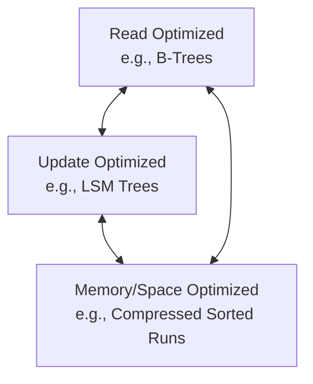

# Module 07: Log-Structured Storage

> "Accountants don’t use erasers or they end up in jail." — _Pat Helland_

When accountants need to modify a record, instead of erasing the existing value, they create a new record with a correction. When the quarterly report is published, it may contain minor updates that correct the previous quarter's results. To calculate the final bottom line, you must go through all the records and calculate a subtotal [HELLAND15].

Similarly, **immutable storage structures** do not allow modifications to existing files: tables are written once and are never changed again. Instead, new records are appended to a new file. To find the final value (or confirm its absence), records must be reconstructed from multiple files. In contrast, **mutable storage structures** modify records on disk in place.

Internally, immutable files can hold multiple copies of a record, with more recent ones overwriting the older ones, while mutable files generally hold only the most recent value. When accessed, immutable files are processed, redundant copies are reconciled, and the most recent values are returned to the client.

In this module, we use **B-Trees** as a typical example of a mutable structure and **Log-Structured Merge Trees (LSM Trees)** as an example of an immutable structure. Immutable LSM Trees use append-only storage and merge reconciliation, whereas B-Trees locate data records on disk and update pages at their original offsets in the file.

### Read/Write Performance Trade-offs

- **In-Place Update Structures (e.g., B-Trees)**: Optimized for **read performance** [GRAEFE04]. After locating the data on disk, the record can be returned to the client immediately. This comes at the expense of **write performance**, as every write first requires locating the page holding the data record on disk before modifying it.
- **Append-Only Storage Structures (e.g., LSM Trees)**: Optimized for **write performance**. Writes do not need to locate records on disk to overwrite them; they are simply appended. This comes at the expense of **read performance**, as reads must retrieve multiple data record versions and reconcile them.

> ### 💡 Beginner's Corner: Hardware Realities of Sequential vs. Random I/O
>
> - **What it is**: Sequential I/O refers to reading or writing data blocks at contiguous, consecutive physical addresses on a storage medium. Random I/O refers to reading or writing blocks at non-contiguous physical addresses.
> - **Why it exists & What problem it solves**: Databases are designed around hardware limitations. On Hard Disk Drives (HDDs), random I/O is extremely slow because it requires physical movement of a mechanical disk head to seek a new track and wait for the platter to rotate (taking 5–10 milliseconds per seek). Sequential I/O requires no head movement, making it up to 100 times faster. On Solid-State Drives (SSDs), there are no moving parts, but random writes are still slow because they trigger high write amplification, requiring the SSD controller to relocate data blocks and perform slow garbage collection cycles. Log-Structured Merge (LSM) Trees solve this by buffering writes in memory and flushing them to disk as a single, contiguous sequential write, converting slow random writes into fast sequential ones.
> - **Underlying Mechanism**: Writing sequentially allows the storage device to utilize its internal caches and write data at the maximum physical bus speed. On HDDs, the disk head stays on the same track and writes blocks continuously. On SSDs, sequential writes allow the controller to write to contiguous flash pages across multiple channels in parallel without creating fragmented, invalid pages that require garbage collection.

---

## LSM Trees

The **Log-Structured Merge Tree (LSM Tree)** is one of the most popular immutable on-disk storage structures. It uses buffering and append-only storage to achieve sequential writes. The LSM Tree is a disk-resident structure designed to keep nodes fully occupied and optimized for sequential disk access. This concept was first introduced by Patrick O’Neil and Edward Cheng [ONEIL96], taking inspiration from log-structured filesystems [ROSENBLUM92].

> [!NOTE]
> LSM Trees write immutable files and merge them together over time. These files usually contain an index of their own to help readers efficiently locate data. Although LSM Trees are often presented as an alternative to B-Trees, it is common for B-Trees to be used as the internal indexing structure for an LSM Tree's immutable files.

The word **"merge"** in LSM Trees indicates that tree contents are merged using an approach similar to merge sort. This occurs:

1.  During **maintenance (compaction)** to reclaim space occupied by redundant copies and deleted records.
2.  During **reads** to reconcile different versions of a record before returning it to the user.

LSM Trees defer writing data files by buffering changes in a memory-resident table (the **memtable**). These changes are later flushed to immutable disk files. All data records remain accessible in memory until the files are fully persisted on disk.

### Advantages of Immutability

- **Sequential Writes**: Data is written to disk in a single pass, which prevents file fragmentation.
- **High Page Density**: We do not reserve any extra space in pages for future writes or for records that might grow in size.
- **Simplified Concurrency**: Since files on disk are read-only, they can be accessed concurrently without complex segment locks or latches. LSM-based storage engines only need to guard concurrent access to the in-memory metadata managing these files.

---

### LSM Tree Structure

LSM Trees consist of smaller, memory-resident components and larger, disk-resident components.

#### The Memory-Resident Component (Memtable)

- **Mutable**: Buffers incoming data records and serves as the primary target for reads and writes.
- **Structure**: Usually implemented as a concurrent in-memory sorted tree (e.g., a skiplist) to keep keys in sorted order.
- **Durability**: Since updates are only in memory, a separate **Write-Ahead Log (WAL)** on disk is required. Data records are appended to the WAL before being committed to the memtable. If the system crashes, the memtable can be reconstructed by replaying the log.

> ### 💡 Beginner's Corner: The Memtable and Write-Ahead Log (WAL)
>
> - **What it is**: The Memtable is an in-memory, sorted data structure (usually a skiplist) where all database writes are temporarily stored. The Write-Ahead Log (WAL) is an append-only file on disk where every write operation is recorded sequentially before it is applied to the Memtable.
> - **Why it exists & What problem it solves**: An LSM Tree writes data sequentially to disk in large batches to maximize write speed. However, if the database only stored updates in memory (in the Memtable) until they were large enough to flush, a sudden power failure or system crash would cause all unwritten updates to be lost, violating the ACID Durability guarantee. The WAL solves this: by appending every write to an on-disk log first, the database guarantees that the write is safely persisted on stable storage. Because the WAL is append-only, writing to it is a fast sequential operation that does not hinder database performance.
> - **Underlying Mechanism**: When a write request arrives, the engine first serializes the operation and appends it to the WAL on disk, forcing a physical flush (using system calls like `fsync`). Once the WAL write is confirmed, the engine inserts the key-value pair into the Memtable. If the system crashes, the in-memory Memtable is lost, but upon reboot, the recovery engine reads the WAL from start to finish, replaying each operation in sequence to reconstruct the exact state of the Memtable before the crash. Once a Memtable is fully flushed to an SSTable on disk, its corresponding WAL segment is safely deleted.

#### The Disk-Resident Components

- **Immutable**: Created by flushing the sorted contents of the memtable to disk.
- **Read-Only**: Once written, these files are never modified. They are only read, merged, or deleted.

---

#### Two-Component LSM Tree

A **two-component LSM Tree** [ONEIL96] has only one disk-resident component, which is organized as a B-Tree with 100% node occupancy and read-only pages.

1.  **Buffering**: Incoming writes are buffered in the memory-resident tree.
2.  **Flushing**: When the memtable fills up, the engine finds the corresponding subtree in the disk-resident B-Tree.
3.  **Merging**: The engine reads the disk-resident subtree and the flushing memtable in lockstep, merging them into a new, fully packed disk segment.
4.  **Atomic Swap**: The pointer in the parent node of the disk B-Tree is atomically updated to point to the new merged segment, and the old disk and memory segments are discarded.

<div style="text-align: center;"></div>

<div style="text-align: center;"><div style="text-align: center;">Figure 7-1. Two-component LSM Tree before a flush. Flushing memory- and disk-resident segments are shown in gray.</div> </div>

<div style="text-align: center;"></div>

<div style="text-align: center;"><div style="text-align: center;">Figure 7-2. Two-component LSM Tree after a flush. Merged contents are shown in gray. Boxes with dashed lines depict discarded on-disk segments.</div> </div>

> [!IMPORTANT]
> Although two-component LSM Trees are useful for maintaining index structures, they are rarely used in practice. Because the entire disk B-Tree is involved in merges, write amplification remains relatively high.

---

#### Multicomponent LSM Trees

In a **multicomponent LSM Tree**, memtable flushes are written out as independent, self-contained disk-resident files. Over time, multiple flushes produce a growing number of disk files.

To prevent reads from having to search through too many files, a background process called **compaction** is periodically triggered to merge multiple files into a single, larger sorted file, discarding the old, redundant source files.

<div style="text-align: center;"></div>

<div style="text-align: center;"><div style="text-align: center;">Figure 7-3. Multicomponent LSM Tree data life cycle</div> </div>

The life cycle of data components in a multicomponent LSM Tree involves several states:

- **Current Memtable**: Actively receives writes and serves reads in memory.
- **Flushing Memtable**: Read-only in-memory table. It continues serving reads while its contents are written to disk.
- **On-Disk Flush Target**: The temporary file being written during a flush. It does not serve reads until the flush completes.
- **Flushed Tables**: Completed disk-resident tables, available for reads as soon as the flushing memtable is discarded.
- **Compacting Tables**: Active disk-resident tables currently being read and merged by a background compaction thread.
- **Compacted Tables**: New, larger disk-resident tables produced by compaction.

<div style="text-align: center;"></div>

<div style="text-align: center;"><div style="text-align: center;">Figure 7-4. LSM component structure</div> </div>

---

## Updates and Deletes

In LSM Trees, insert, update, and delete operations do not locate records on disk. Instead, conflicts and redundant records are resolved during reads.

### Handling Deletions: Tombstones

Simply removing a key from the memtable is insufficient because older versions of that key may still exist in older disk-resident files. If we only deleted the key from memory, flushing the memtable would **resurrect** the older disk-resident value.

For example, if key `k1` has value `v1` on disk and we write an update `v2` to the memtable:

| Component      | Key  | Value |
| :------------- | :--- | :---- |
| **Disk Table** | `k1` | `v1`  |
| **Memtable**   | `k1` | `v2`  |

If we delete `k1` by simply removing it from the memtable:

| Component      | Key     | Value   |
| :------------- | :------ | :------ |
| **Disk Table** | `k1`    | `v1`    |
| **Memtable**   | _empty_ | _empty_ |

The older value `v1` becomes the only remaining record, resurrecting the deleted data.

To prevent this, deletions are recorded explicitly by inserting a **tombstone** (or dormant certificate). A tombstone is a special record indicating that a key has been deleted:

| Component      | Key  | Value         |
| :------------- | :--- | :------------ |
| **Disk Table** | `k1` | `v1`          |
| **Memtable**   | `k1` | `<tombstone>` |

During a read, the reconciliation process spots the tombstone, ignores the shadowed older values, and reports that the key does not exist.

> ### 💡 Beginner's Corner: The Resurrection Problem & Tombstones
>
> - **What it is**: A tombstone is a special deletion marker (a record with a flag indicating deletion) inserted into the Memtable to logically delete a key, instead of deleting it physically.
> - **Why it exists & What problem it solves**: In an append-only storage engine like an LSM Tree, disk-resident SSTable files are completely immutable. When a user deletes a key, we cannot modify the existing SSTables on disk to erase that key. If we were to simply remove the key from our in-memory Memtable, the next lookup would scan the Memtable, find nothing, and then search the older disk-resident SSTables. Since the old SSTables still contain the key, the database would return the old value, effectively "resurrecting" the deleted key. Tombstones solve this by explicitly shadowing older versions of the key across all SSTables.
> - **Underlying Mechanism**: When a key is deleted, the database inserts a tombstone record for that key into the active Memtable. When a reader performs a lookup, the search traverses components from newest to oldest. If it encounters the tombstone in a newer component, the search immediately stops and reports that the key does not exist, ignoring any older values for that key that may reside in older SSTables. During background compaction, when the compaction thread merges multiple SSTables and encounters a tombstone alongside older versions of the same key, it discards both the tombstone and the old versions, physically reclaiming disk space.

### Range Tombstones

To delete a consecutive range of keys efficiently, engines use **predicate deletes** (or **range tombstones**).

A range tombstone contains a range predicate (e.g., `key >= "k2" AND key < "k4"`). During reads and compaction, any data records falling within this range are skipped.

| Disk Table 1                       | Disk Table 2                                     |
| :--------------------------------- | :----------------------------------------------- |
| `k1` $\rightarrow$ `v1`            | `k2` $\rightarrow$ `<start_tombstone_inclusive>` |
| `k2` $\rightarrow$ `v2` (shadowed) | `k4` $\rightarrow$ `<end_tombstone_exclusive>`   |
| `k3` $\rightarrow$ `v3` (shadowed) | `k4` $\rightarrow$ `v4`                          |

---

## LSM Tree Lookups

Because an LSM Tree's data is spread across the memtable and multiple disk-resident files, a lookup must search multiple components, merge their records, and reconcile conflicts before returning the final value.

### Multiway Merge-Iteration

Since the memtable and all disk-resident tables store records in sorted order, we can merge them using a **multiway merge-sort** algorithm.

The engine opens a sorted iterator (cursor) over each active component. To retrieve records in sorted order:

1.  The engine uses a **priority queue** (typically a min-heap) that holds up to $ N $ elements, where $ N $ is the number of active iterators.
2.  The head element of each iterator is placed into the priority queue. The queue automatically sorts them so that the smallest key is at the head.
3.  The engine pops the smallest element from the queue and appends it to the output.
4.  The engine reads the next element from the iterator that produced the popped element and inserts it into the queue.
5.  This process repeats until the query is satisfied or all iterators are exhausted.

<div style="text-align: center;"></div>

<div style="text-align: center;"><div style="text-align: center;">Figure 7-5. LSM merge mechanics</div> </div>

> ### 🚶‍♂️ Step-by-Step Breakdown: LSM Multiway Merge-Iteration
>
> 1. **Step 1 (Initialize Iterators)**: The reading engine opens a sorted iterator for the active Memtable and each disk-resident SSTable file that might contain keys in the query range. Each iterator points to the first (smallest) key in its respective component.
> 2. **Step 2 (Populate the Min-Heap)**: The engine initializes a min-heap (priority queue). It reads the current key-value pair from each iterator and inserts it into the heap. The heap automatically sorts these entries, placing the record with the smallest key at the top.
> 3. **Step 3 (Pop and Compare)**: The engine pops the top record from the min-heap. This is guaranteed to be the smallest key across all active components.
> 4. **Step 4 (Reconcile Duplicates)**: If the heap's new top record has the exact same key as the popped record, this indicates a duplicate key across different files (e.g., an update or a tombstone). The engine compares their timestamps, keeps the record with the highest timestamp, discards the older one, and pops it. This step repeats until all duplicates for this key are cleared.
> 5. **Step 5 (Output & Advance)**: The engine appends the consolidated, newest record for the key to the query output (unless it is a tombstone, in which case it is skipped).
> 6. **Step 6 (Refill & Loop)**: For each iterator whose record was popped in Step 3 or 4, the engine reads the next key-value pair from that iterator and inserts it into the min-heap. The engine loops back to Step 3 until the min-heap is completely empty or the query range is satisfied.

#### Merge-Iteration Example

Suppose we have two sorted disk iterators:

- **Iterator 1**: `[ {k2: v1}, {k4: v2} ]`
- **Iterator 2**: `[ {k1: v3}, {k2: v4}, {k3: v5} ]`

1.  **Initialize**: Fill the priority queue with the head of each iterator:
    - _Queue_: `[ {k1: v3}, {k2: v1} ]`
2.  **First Step**: Pop the smallest key (`k1`) from the queue and append to the output. Refill the queue from Iterator 2:
    - _Queue_: `[ {k2: v1}, {k2: v4} ]`
    - _Output_: `[ {k1: v3} ]`
3.  **Reconciliation**: Pop both `k2` entries. Since `k2` appears in multiple iterators, we compare their metadata (e.g., timestamps) to select the newest value (say `v4` from Iterator 2). Append `{k2: v4}` to the output and refill the queue from both iterators:
    - _Queue_: `[ {k3: v5}, {k4: v2} ]`
    - _Output_: `[ {k1: v3}, {k2: v4} ]`
4.  **Finalize**: Pop the remaining elements in order:
    - _Output_: `[ {k1: v3}, {k2: v4}, {k3: v5}, {k4: v2} ]`

> [!NOTE]
> Merging iterators requires $ O(N) $ memory space and takes $ O(\log N) $ time per step to re-sort the priority queue, where $ N $ is the number of active iterators.

---

### Conflict Reconciliation

When multiple records exist for the same key (e.g., an older value, a newer update, or a tombstone), the engine compares their **metadata** (usually a write timestamp) to resolve the conflict:

- The record with the **highest timestamp** takes precedence.
- Older records shadowed by newer updates or tombstones are discarded during reads and compaction.

> [!NOTE]
> An operation that inserts a record if it does not exist, and updates it otherwise, is called an **upsert**. In LSM Trees, inserts and updates are indistinguishable because the engine never checks prior state during writes. LSM Trees upsert by default.

---

## Maintenance in LSM Trees

To prevent read performance from degrading as the number of disk-resident tables grows, LSM Trees run a background maintenance process called **compaction**.

Compaction selects multiple disk-resident tables, reads them sequentially, merges and reconciles their contents, writes the sorted output to a new file, and deletes the old source files.

> [!IMPORTANT]
> **Tombstones and Compaction**: Tombstones cannot be discarded immediately during compaction because older versions of the deleted key might still reside in other, uncompacted files. Tombstones are only dropped when they reach the bottommost level (where no older files exist) or after a safety timeout (e.g., Cassandra's _GC Grace Seconds_) has passed to ensure all cluster nodes have observed the deletion.

---

### Leveled Compaction

**Leveled compaction** (used by engines like RocksDB) organizes disk-resident tables into numbered levels ($ L_0, L_1, L_2, \dots $), where target sizes grow exponentially (e.g., by a factor of 10) at each level.

1.  **Level 0 ($ L_0 $)**: Created by flushing memtables. Key ranges in $ L_0 $ files **can overlap**.
2.  **Level 1 ($ L_1 $) and Higher**: Key ranges in files on these levels **never overlap**.
3.  **Compaction Flow**: When a level exceeds its size threshold, one or more files from that level are selected and merged with all overlapping files on the next level ($ L\_{i+1} $).

<div style="text-align: center;"></div>

<div style="text-align: center;"><div style="text-align: center;">Figure 7-6. Compaction process. Gray boxes with dashed lines represent currently compacting tables. Level-wide boxes represent the target data size limit on the level. Level 1 is over the limit.</div> </div>

Because key ranges do not overlap on levels $\ge 1$, lookups only need to search at most one file per level, greatly improving read performance.

---

### Size-Tiered Compaction

**Size-tiered compaction** groups disk-resident tables based on their size rather than predefined levels:

- Smaller flushed files are grouped together.
- When a set of similarly sized files reaches a threshold count, they are merged into a single, larger file.
- This larger file is then grouped with other files of similar size, propagating data up a hierarchy of size tiers.

> [!WARNING]
> **Table Starvation**: If a merge discards many shadowed records or tombstones, the resulting file might be much smaller than expected. This can cause higher tiers to starve of compaction inputs, preventing older tombstones from being cleared and increasing read costs. In such cases, compaction must be forced manually.

Other specialized compaction strategies exist, such as **Time Window Compaction** (used in Cassandra for time-series data), which groups files by write timestamps. This allows dropping entire expired files once their Time-To-Live (TTL) passes, bypassing the need to rewrite their contents.

---

## Read, Write, and Space Amplification

Designing an LSM compaction strategy involves navigating a three-way trade-off between:

- **Read Amplification**: The overhead of searching and merging records across multiple files during lookups.
- **Write Amplification**: The overhead of repeatedly reading and rewriting the same data to disk during compaction.
- **Space Amplification**: The overhead of keeping redundant, shadowed records and tombstones on disk.

> [!NOTE]
> B-Trees and LSM Trees experience write amplification differently. B-Tree write amplification stems from random writebacks of entire pages for minor updates. LSM Tree write amplification comes from background compaction migrating and rewriting data across files.

---

### The RUM Conjecture

The **RUM Conjecture** [ATHANASSOULIS16] states that a database storage structure can only optimize for two of the following three overheads at the expense of the third:

1.  **Read Overhead** (R)
2.  **Update Overhead** (U)
3.  **Memory/Space Overhead** (M)



- **B-Trees (Read-Optimized)**: Provide fast reads. Writes are expensive because they require locating records on disk and rewriting pages. They also have higher space overhead due to reserved empty space in pages.
- **LSM Trees (Update-Optimized)**: Writes are extremely cheap since they are appended sequentially without locating records. They do not reserve empty page space. However, reads are more expensive because they must search and merge records from multiple tables.

---

## Implementation Details

### Sorted String Tables (SSTables)

Disk-resident tables in LSM Trees are typically implemented as **Sorted String Tables (SSTables)**.

An SSTable consists of two primary components:

1.  **Data File**: Contains concatenated key-value pairs written sequentially in sorted key order. Cells are immutable.
2.  **Index File**: Maps keys to their byte offsets within the data file. The index can be structured as a B-Tree or a hashtable.

Even if we use a hashtable for the index, we can still perform range scans. The hashtable is used to locate the start key of the range in the data file, and the subsequent records are read sequentially directly from the data file.

---

### SSTable-Attached Secondary Indexes (SASI)

To support lookups on fields other than the primary key, Apache Cassandra introduces **SSTable-Attached Secondary Indexes (SASI)**:

- The secondary index lifecycle is coupled with the SSTable.
- When a memtable is flushed, the secondary index file is built and written alongside the SSTable data and primary index files.
- During lookups, the engine searches the secondary index files, merges matching primary keys, and reconciles the records.
- This avoids the overhead of maintaining a global secondary index table.

---

### Bloom Filters

To reduce read amplification, engines use **Bloom filters** [BLOOM70] to quickly determine whether a disk-resident table contains a searched key.

A **Bloom filter** is a space-efficient, probabilistic data structure used to test set membership.

- **False Positives**: The filter may report that a key is in the set when it is not.
- **No False Negatives**: If the filter reports that a key is _not_ in the set, it is guaranteed to be absent.

```
Key -> [Hash 1, Hash 2, Hash 3] -> Bit Positions -> Set bits to 1
```

During a lookup, the engine calculates the hash positions for the searched key. If any of the bits at those positions in the Bloom filter's bit array are `0`, the file is guaranteed not to contain the key and is skipped. If all bits are `1`, the file is accessed.

<div style="text-align: center;"></div>

<div style="text-align: center;"><div style="text-align: center;">Figure 7-7. Bloom filter</div> </div>

> ### 💡 Beginner's Corner: Bloom Filter Mathematics & Bit Arrays
>
> - **What it is**: A Bloom filter is a space-efficient, probabilistic data structure that tests whether an element is a member of a set. It consists of a bit array of size $M$ (initialized to all `0`s) and a set of $K$ independent, uniform cryptographic or non-cryptographic hash functions (like MurmurHash3).
> - **Why it exists & What problem it solves**: In an LSM Tree, lookups must search multiple SSTable files on disk, which causes severe read amplification and triggers slow random disk I/O. If a key is not present in the database, the engine might have to read every single SSTable file to prove its absence. A Bloom filter solves this by allowing the engine to check a tiny, memory-resident bit array before performing any disk reads. If the filter says the key is not in the SSTable, the engine skips reading that file entirely.
> - **Underlying Mechanism**:
>     - **Writing**: When an SSTable is written, the engine inserts each key into the Bloom filter. For each key, it calculates $K$ different hash values, maps each hash value to an index in the bit array (using modulo $M$), and sets the bits at those indices to `1`.
>     - **Checking**: When a lookup request for a key occurs, the engine calculates the same $K$ hashes and checks the bits at those indices. If _any_ of the checked bits is `0`, the key is guaranteed not to be in the set, and the SSTable is skipped. If _all_ checked bits are `1`, the key _might_ be in the SSTable, so the engine proceeds to read the file from disk.
>     - **False Positives**: Because different keys can hash to the same bit indices (hash collisions), a Bloom filter can report that a key is present when it is not. The probability of these false positives can be mathematically controlled by tuning the bit array size $M$ and the number of hash functions $K$ relative to the number of elements $N$.

> [!TIP]
> Probabilistic structures like Bloom filters (for membership), **HyperLogLog** (for cardinality) [FLAJOLET12], and **CountMin Sketch** (for frequency) [CORMODE12] offer massive space savings at the cost of a controlled margin of error.

---

### Skiplists

The memtable requires an in-memory sorted structure that supports high-concurrency inserts. **Skiplists** [PUGH90b] are widely preferred for this role because of their simplicity and excellent concurrent write profiles.

A skiplist is a probabilistic alternative to a balanced search tree. It consists of a linked list where nodes are built with random, variable heights, creating hierarchical lanes that allow lookups to skip over ranges of elements.

<div style="text-align: center;"></div>

<div style="text-align: center;"><div style="text-align: center;">Figure 7-8. Skiplist</div> </div>

#### Skiplist Lookup Workflow (Searching for Key 7)

1.  **Start at Top**: Start at the highest level of the head node. Follow the link to the node holding key `10`.
2.  **Drop Down**: Since `7 < 10`, descend one level on the head node and follow the link to the node holding key `5`.
3.  **Scan Forward**: From the `5` node, check the next link on its highest level, which leads to `10`.
4.  **Descend & Find**: Since `7 < 10`, descend to the next level from node `5`, locating the target node holding key `7`.

To make skiplists thread-safe and lock-free, implementations use atomic Compare-and-Swap (CAS) operations along with a `fully_linked` flag to indicate when a node's multi-level pointers are completely installed [HERLIHY10].

---

### Disk Access and Unaligned Records

LSM Trees rely heavily on the OS page cache for caching reads. Because on-disk table files are immutable, they do not require locks or latches during reads. Instead, simple reference counting prevents pages from being evicted while in use.

Unlike B-Trees, data records in LSM Trees are not aligned with disk blocks. Records can cross block boundaries, which may require reading multiple contiguous blocks to retrieve a single record.

<div style="text-align: center;"></div>

<div style="text-align: center;"><div style="text-align: center;">Figure 7-9. Unaligned data records</div> </div>

---

### Page Compression and Indirection

Because LSM files are immutable and written in a single pass, they are highly suitable for block compression. However, compressed blocks are of variable sizes and no longer align with physical disk pages.

To keep compressed blocks addressable without losing compression efficiency (which would happen if we padded blocks with zeros), engines introduce an **indirection layer**:

- **Block Mapping**: A separate index maps the uncompressed block offsets to their compressed physical offsets and sizes on disk.
- **Read Path**: When reading, the engine looks up the compressed block offset and size in the mapping table, reads the exact compressed bytes from disk, decompresses them, and materializes the block in the page cache.

<div style="text-align: center;"></div>

<div style="text-align: center;"><div style="text-align: center;">Figure 7-10. Reading compressed blocks. Dotted lines represent pointers from the mapping table to the offsets of compressed pages on disk. Uncompressed pages reside in the page cache.</div> </div>

---

## Unordered LSM Storage

While sorted LSM Trees provide excellent write performance and support range scans, some applications only require point lookups. In these cases, storing data in insertion order (unordered) can further optimize write paths and reduce space overhead.

### Bitcask

**Bitcask** [SHEEHY10b] is an unordered log-structured storage engine. It bypasses memtables entirely and writes incoming records directly to append-only log files on disk.

- **Keydir**: To locate records, Bitcask maintains an in-memory hashmap called the **keydir**. The keydir maps each key to the file ID, offset, and size of its latest on-disk record.
- **Startup**: Because the keydir is entirely in memory, it must be rebuilt from scratch by scanning all log files sequentially when the database starts.
- **Writes**: Records are appended to the active log file, and the keydir is updated with the new offset. Since there is no separate WAL, write amplification is extremely low.
- **Reads**: The engine looks up the key in the keydir and performs a single random read from the log file at the specified offset. No merging is required.
- **Compaction**: Background threads merge log files by copying only the latest active records (referenced by the keydir) to a new log file and discarding old, shadowed records.

<div style="text-align: center;"></div>

<div style="text-align: center;"><div style="text-align: center;">Figure 7-11. Mapping between keydir and data files in Bitcask. Solid lines represent pointers from the key to the latest value. Shadowed key-value pairs are shown in light gray.</div> </div>

> [!IMPORTANT]
> Bitcask is simple and extremely fast for point queries, but it cannot perform range queries. Additionally, all keys must fit entirely in RAM, which limits scalability.

---

### WiscKey

**WiscKey** [LU16] separates keys from values to optimize both read and write performance on SSDs:

- **Index**: Keys are stored in a sorted LSM Tree, but the values associated with them are replaced by direct pointers to an unordered, append-only **value log (vLog)**.
- **Compaction**: Because keys are much smaller than values, compaction in the LSM Tree only handles keys, which reduces write amplification.
- **Range Queries**: Since the vLog is unsorted, range scans require random lookups to retrieve the values. WiscKey leverages the internal parallelism of SSDs to prefetch blocks in parallel, mitigating this random I/O penalty.

<div style="text-align: center;"></div>

<div style="text-align: center;"><div style="text-align: center;">Figure 7-12. Key components of WiscKey: index LSM Trees and vLog files, and relationships between them. Shadowed records in data files are shown in gray. Solid lines represent pointers from the key in the LSM tree to the latest value in the log file.</div> </div>

> ### 💡 Beginner's Corner: Unordered Storage, Keydirs & Value Logs
>
> - **What it is**: Bitcask is an unordered log-structured storage engine that writes all writes directly to append-only logs on disk and maintains an in-memory hashmap (the Keydir) containing the physical byte offsets of every key. WiscKey is a hybrid engine that separates keys from values, storing keys in a sorted LSM Tree and values in an unordered, append-only Value Log (vLog).
> - **Why it exists & What problem it solves**: Standard LSM Trees suffer from extremely high _write amplification_ because both keys and values are repeatedly copied, sorted, and rewritten to disk during background compaction. This wastes SSD write cycles and degrades performance. Bitcask solves this by eliminating sorting entirely, which minimizes write amplification, but it requires all keys to fit in RAM. WiscKey solves this for larger-than-memory datasets by only sorting the keys (which are small) in the LSM Tree and appending the values (which are large) directly to the vLog. This drastically reduces the size of the LSM Tree, cutting compaction write amplification by up to 10–100x.
> - **Underlying Mechanism**:
>     - **Bitcask**: Writes are appended directly to the active log file. The in-memory Keydir is updated to map the key to `(file_id, byte_offset, value_size)`. A lookup only requires reading the Keydir and performing a single, direct disk seek to retrieve the value. Range queries are impossible because the disk files are unsorted.
>     - **WiscKey**: When a write occurs, the value is appended to the end of the vLog on disk, returning a physical pointer `(vLog_file_id, byte_offset)`. The key and this physical pointer are then inserted into a standard sorted LSM Tree. A point lookup searches the LSM Tree to find the pointer, then reads the value from the vLog. A range query scans the sorted keys in the LSM Tree, gathers their vLog pointers, and uses asynchronous, parallel disk I/O to fetch the values from the vLog, leveraging the high parallel queue capabilities of modern SSDs.

To reclaim space in the vLog, WiscKey runs a background garbage collection process that reads the vLog sequentially, checks the sorted key index to see if the record is still active, rewrites active records to the end of the vLog, and updates their pointers in the key index.

---

## Concurrency in LSM Trees

The main concurrency challenges in LSM Trees involve:

1.  **Table View Swapping**: Atomically updating the active collection of memory- and disk-resident files when flushes or compactions complete.
2.  **Write-Ahead Log (WAL) Synchronization**: Coordinating memtable flushes with log truncation to prevent data loss.

### The Flush Synchronization Flow

To ensure correctness, the engine must execute the following steps during a memtable flush:

1.  **Memtable Switch**: Allocate a new memtable and make it the primary target for all incoming writes. The old memtable becomes read-only but remains fully visible for reads.
2.  **Flush**: Write the sorted contents of the old memtable to a new disk-resident table.
3.  **Atomic View Update**: Atomically update the active table view, replacing the old memtable with the new disk-resident table.
4.  **WAL Truncation**: Discard the WAL segment associated with the flushed memtable.

> [!WARNING]
> If a WAL segment is truncated before the corresponding memtable is fully flushed and verified on disk, a system crash will result in permanent **data loss** since the log cannot be replayed to recover the unwritten updates.

---

## Log Stacking

Many modern filesystems and storage devices (SSDs) are themselves log-structured:

- **Filesystems** (e.g., F2FS) buffer writes in memory and append them to disk.
- **SSDs** use an internal **Flash Translation Layer (FTL)** to write data in a log-structured manner to manage physical block constraints.

Stacking multiple log-structured systems on top of each other (e.g., an LSM Tree on a log-structured filesystem running on an SSD) can lead to **log stacking issues**, causing redundant garbage collection, high write amplification, and severe write performance drops [YANG14].

### The Flash Translation Layer (FTL)

SSDs are built from NAND flash memory cells, which have unique write constraints:

- Data can only be written to pages that have been **erased**.
- While reads and writes are performed at the **page level** (e.g., 4 KB - 16 KB), erasures can only be performed at the **block level** (e.g., 64 - 512 pages).
- The **Flash Translation Layer (FTL)** acts as an internal log-structured system, translating logical block addresses from the OS to physical pages on flash memory.

When the SSD runs out of erased blocks, it must perform internal **garbage collection**:

<div style="text-align: center;"></div>

<div style="text-align: center;"><div style="text-align: center;">Figure 7-13. SSD pages, grouped into blocks</div> </div>

To erase a block containing some live pages, the FTL must first copy those live pages to a new physical location before erasing the entire block:

<div style="text-align: center;"></div>

<div style="text-align: center;"><div style="text-align: center;">Figure 7-14. Page relocation during garbage collection</div> </div>

> ### 💡 Beginner's Corner: NAND Flash Physics & FTL Garbage Collection
>
> - **What it is**: NAND flash memory is the physical storage technology used in SSDs. The Flash Translation Layer (FTL) is a log-structured software subsystem running on the SSD's microcontroller that translates logical block addresses from the operating system into physical flash memory page addresses.
> - **Why it exists & What problem it solves**: NAND flash has unique physical constraints: data can only be written to pages that have been completely erased, but while reads and writes are performed at the _page level_ (e.g., 4KB–16KB), erasures can only be performed at the _block level_ (which contain 64–512 pages). This means an SSD cannot overwrite a page in place. To solve this, the FTL acts as an internal log-structured filesystem: it writes updates to new physical pages and marks the old pages as invalid.
> - **Underlying Mechanism**: When the SSD runs out of clean, erased blocks, the FTL must perform _garbage collection_ to reclaim space. It selects a block containing invalid (deleted/outdated) pages, copies any remaining valid pages from that block to a new, clean block, and then erases the entire source block. This process is slow and causes _write amplification_ at the hardware level. Stacking a log-structured database (like an LSM Tree) on top of a log-structured filesystem and a log-structured SSD causes _log stacking_: the database compaction, filesystem logging, and SSD garbage collection all perform redundant writes and block relocations, severely degrading write performance and wearing out the SSD cells.

Because flash cells wear out after a limited number of program-erase cycles, the FTL also performs **wear leveling** to distribute writes evenly across physical blocks, extending the life of the SSD.

---

### Filesystem Logging & Interleaved Streams

When the application log and the filesystem log stack, they perform redundant bookkeeping. If their write boundaries are misaligned, discarding a segment at the application level can cause fragmentation and trigger unnecessary page relocations at the filesystem or FTL level.

<div style="text-align: center;"></div>

<div style="text-align: center;"><div style="text-align: center;">Figure 7-15. Misaligned writes and discarding of a higher-level log segment</div> </div>

Furthermore, databases often run multiple concurrent write streams (e.g., WAL writes and SSTable flushes). When these streams interleave, they break the sequential write pattern, causing blocks to be written out of order on the physical medium, which leads to fragmentation.

<div style="text-align: center;"></div>

<div style="text-align: center;"><div style="text-align: center;">Figure 7-16. Unaligned multistream writes</div> </div>

> [!TIP]
> To prevent stream interleaving, it is highly recommended to isolate workloads by placing the database log (WAL) on a separate physical device, keeping partitions aligned to the hardware blocks, and ensuring writes match physical page sizes.

---

## LLAMA and Mindful Stacking

The **Bw-Tree** (discussed in Module 6) is layered on top of a **Latch-Free, Log-Structured, Access-Method Aware (LLAMA)** storage subsystem [LEVANDOSKI13].

This layering coordinates the storage engine and the database access methods:

- **Consolidation**: Instead of writing delta nodes in arbitrary insertion order, LLAMA's Bw-Tree awareness allows consolidating multiple deltas for a logical node into a single contiguous physical location during flushes.
- **Logical Garbage Collection**: If two delta nodes cancel each other out (e.g., an insert followed by a delete), LLAMA's garbage collector can discard them, writing only the final state.
- **GC Consolidation**: During LSS garbage collection, physical page relocation is combined with logical node consolidation. The garbage collector rewrites a delta chain and its base page as a single, fully consolidated base page in the new location, reducing read latency and space usage in a single pass.

### Open-Channel SSDs

To eliminate log stacking overheads completely, we can bypass the OS filesystem and SSD FTL altogether by writing directly to **Open-Channel SSDs**.

Open-Channel SSDs expose their internal physical layout, channels, and drive management directly to the application:

- **Direct Control**: The application manages its own data placement, wear-leveling, and garbage collection.
- **Reduced Write Amplification**: Implementations like **LOCS** [ZHANG13] and **Software Defined Flash (SDF)** [OUYANG14] align write units directly with physical erase blocks, eliminating the need for FTL-level page relocations.
- **Parallelism**: Applications can write to different hardware channels in parallel, maximizing the performance of solid-state drives.

---

## Summary

Log-structured storage is used across all layers of modern hardware and software systems—from SSD flash translation layers to filesystems and databases. It reduces write amplification by caching modifications in memory and writing them sequentially.

- **LSM Trees** apply log-structuring to database index structures, buffering updates in a memory-resident **memtable** and flushing them to sorted, immutable **SSTables** on disk.
- **Bloom Filters** and **SSTable Indexes** help to minimize read amplification by quickly identifying which files contain a searched key.
- **Compaction** runs in the background to merge and reconcile sorted files, cleaning up shadowed updates and tombstones to control space and read amplification.
- **Unordered Storage** (e.g., **Bitcask**, **WiscKey**) optimizes writes and point queries by storing records in insertion order, sacrificing range query performance unless combined with sorted key indexes.
- **Mindful Stacking** (e.g., **LLAMA**) and **Open-Channel SSDs** coordinate software and hardware layers to avoid log-stacking overheads and achieve maximum efficiency.

---

## Part I Conclusion

In Part I, we focused on **Storage Engines**. We started with high-level database architectures, explored on-disk storage structures, and learned how they interface with the rest of the database system.

We analyzed these storage structures through the lens of three fundamental properties:

1.  **Buffering**: Using in-memory caches to delay and batch write operations.
2.  **Immutability**: Writing read-only data files to avoid random in-place updates.
3.  **Ordering**: Maintaining keys in sorted order to allow fast lookups and range scans.

The table below summarizes how the discussed storage structures mix and match these properties to navigate architectural trade-offs:

### Storage Structure Property Comparison

| Storage Structure |   Buffered   | Mutable |   Ordered    |
| :---------------- | :----------: | :-----: | :----------: |
| **B+Trees**       |      No      |   Yes   |     Yes      |
| **WiredTiger**    |     Yes      |   Yes   |     Yes      |
| **LA-Trees**      |     Yes      |   Yes   |     Yes      |
| **COW B-Trees**   |      No      |   No    |     Yes      |
| **2C LSM Trees**  |     Yes      |   No    |     Yes      |
| **MC LSM Trees**  |     Yes      |   No    |     Yes      |
| **FD-Trees**      |     Yes      |   No    |     Yes      |
| **BitCask**       |      No      |   No    |      No      |
| **WiscKey**       | Yes $^{(1)}$ |   No    | Yes $^{(1)}$ |
| **Bw-Trees**      |      No      |   No    | No $^{(2)}$  |

<div style="font-size: 0.85em; margin-top: 10px; color: #555;">
    <strong>Notes:</strong><br>
    (1) WiscKey uses buffering and ordering only for its key-index LSM Tree; its value logs (vLogs) are unordered.<br>
    (2) Only consolidated Bw-Tree nodes hold ordered records; active delta chains are unordered linked lists.
</div>

<div style="text-align: center; margin-top: 15px;"><div style="text-align: center;">Figure I-1. Buffering, immutability, and ordering properties of discussed storage structures.</div></div>

---

### Looking Forward

Storage engine design is a game of trade-offs. Adding in-memory buffers reduces write amplification in mutable systems like WiredTiger. In immutable systems like LSM Trees, buffering also reduces write amplification but defers some overhead to background compaction. At the same time, immutability greatly simplifies concurrency and maximizes page occupancy.

Understanding these foundational concepts prepares you to read the source code of modern databases and explore emerging research:

- **Probabilistic structures** (like Bloom filters, HyperLogLog, and CountMin sketches) are increasingly vital for managing huge datasets.
- **Learned index structures** are applying machine learning models to predict data locations on disk [KRASKA18].
- **Byte-addressable, Non-Volatile Memory (NVM)** is blurring the line between RAM and disk, prompting new indexing architectures [VENKATARAMAN11].

Progress in computer science is incremental. Every new design borrows from, builds upon, and is inspired by the core concepts of buffering, immutability, and ordering.
