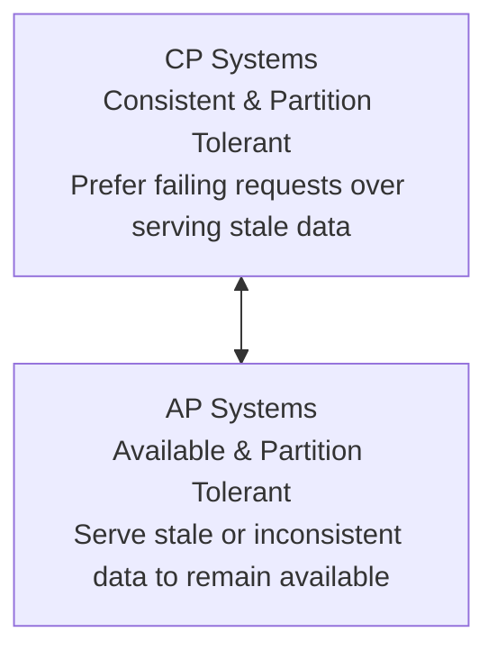

# Module 11: Replication and Consistency

Consistency models explain visibility semantics and the behavior of a distributed system when multiple copies of data are maintained.

Fault tolerance allows a system to continue operating correctly despite the failure of some of its components. The primary goal of fault tolerance is to remove single points of failure by introducing redundancy in mission-critical components, which is typically transparent to the user.

A system achieves redundancy by storing multiple copies of data (replication). When one machine fails, another can serve as a failover. 
*   **Primary/Replica (Master/Slave)**: Failover is explicit; a replica is promoted to become the new master when the master fails.
*   **Leaderless / Multi-Master**: Reconfiguration is not required; the system ensures consistency by collecting responses from a quorum of nodes during read and write queries.

Data replication introduces redundancy but updating multiple copies of data atomically is equivalent to solving consensus [MILOSEVIC11], which is highly expensive. To optimize performance, databases use more cost-effective replication strategies that allow some degree of divergence between replicas while still making data appear consistent from the client's perspective.

Replication is especially critical in multi-datacenter deployments (**geo-replication**):
*   **High Availability**: Withstands the complete failure of one or more datacenters.
*   **Low Latency**: Places copies of data physically closer to users.

---

## Achieving Availability

In the real world, nodes are not always online or able to communicate with each other. Intermittent failures should not impact availability: from the user's perspective, the system must continue operating normally.

System availability is critical. Downtime leads to lost revenue, frustrated users, and disrupted services. To build highly available systems, we must design them to handle the unavailability of one or more participants gracefully. This is achieved by introducing replication, data recovery, and synchronization mechanisms.

---

## The Infamous CAP Theorem

**Availability** measures the ability of a system to successfully return a response for every request. **Consistency** is defined here in its strongest form: atomic or linearizable consistency (linearizability), which makes a distributed system behave as if it were running on a single machine.

Eric Brewer formulated the **CAP Conjecture**, which states that in a distributed system, we can only guarantee two of the three properties in the presence of network partitions [BREWER00]:
*   **C**onsistency (Linearizability)
*   **A**vailability
*   **P**artition Tolerance

Seth Gilbert and Nancy Lynch mathematically proved that it is impossible to guarantee both availability and consistency in an asynchronous network in the presence of partitions [GILBERT02].



*   **CP Systems (Consistent & Partition Tolerant)**: In a network partition, these systems reject writes or reads to prevent inconsistent states, sacrificing availability (e.g., consensus-based systems requiring a majority quorum to progress).
*   **AP Systems (Available & Partition Tolerant)**: In a partition, nodes continue accepting writes and serving reads, sacrificing strong consistency and allowing data divergence.

The **PACELC Conjecture** [ABADI12] extends CAP:
*   If there is a **P**artition, how does the system choose between **A**vailability and **C**onsistency?
*   **E**lse (when the network is running normally), how does the system choose between **L**atency and **C**onsistency?

---

### Use CAP Carefully

*   **Partitions vs. Crashes**: CAP focuses specifically on network partitions (connectivity drops) rather than node crashes. A partitioned node can still serve inconsistent requests, while a crashed node cannot respond at all.
*   **No Tunable Partition Tolerance**: We cannot "trade" partition tolerance. Partitions are an inevitable reality of physical networks. The only real choice is between consistency and availability when a partition occurs [HALE10].
*   **CAP Consistency vs. ACID Consistency**:
    *   **ACID Consistency**: Refers to transaction invariants (e.g., maintaining database constraints and schema rules).
    *   **CAP Consistency**: Refers exclusively to **Linearizability** (every read must return the most recent write).
*   **CAP Availability vs. High Availability**: CAP availability requires *every* non-failing node to return a successful response, regardless of how many other nodes are down. It places no upper bounds on response latency [KLEPPMANN15].

---

### Harvest and Yield

Instead of a binary choice between absolute consistency and absolute availability, some applications can use weaker, relaxed definitions [FOX99]:

*   **Harvest**: Measures the completeness of a query's results. If a query should return 100 rows but only fetches 99 because one node is offline, serving 99 rows (99% harvest) is often better than failing the query completely.
*   **Yield**: Measures the percentage of requests completed successfully out of the total attempted requests. Yield is different from uptime: a busy node may be online but still drop requests due to queue saturation.

We can trade harvest for yield to build more resilient systems. For example, if a subset of nodes is down, we can continue serving complete requests for unaffected users (high yield) while serving degraded or partial results for affected users (reduced harvest).

---

## Shared Memory

For a client, the distributed system acts as if it has a single shared storage register, abstracting away network communication. A single unit of storage is called a **register**. Shared memory can be viewed as an array of these registers.

Every operation is bounded by an **invocation** event and a **completion** event:
*   **Sequential**: If the completion of operation $A$ occurs before the invocation of operation $B$, $A$ precedes $B$, and they are sequential.
*   **Concurrent**: If their invocation-to-completion intervals overlap, they are concurrent.

<div style="text-align: center;"></div>

<div style="text-align: center;"></div>

<div style="text-align: center;"></div>

<div style="text-align: center;">Figure 11-1. Sequential and concurrent operations: (a) sequential, (b) concurrent, (c) concurrent (nested).</div>

---

### Types of Registers

Registers are classified based on how they behave when read and write operations overlap:

1.  **Safe Register**: Reads concurrent with a write can return any arbitrary value within the register's range. The value can "flicker" between old and new values during the write.
2.  **Regular Register**: A read can only return the value of the most recently completed write, or the value of a write that overlaps with the read. However, different concurrent readers might still see different values (e.g., in databases where updates propagate asynchronously).
3.  **Atomic Register**: Guarantees **linearizability**. Every write has a single logical point in time: before this point, all reads return the old value; after this point, all reads return the new value.

---

## Consistency Models

A consistency model is a contract between the database and its clients, defining what guarantees the client can expect and what constraints the replicas must satisfy.

### Strict Consistency

Strict consistency is the ideal, complete replication transparency:
*   Any write is instantly visible to all subsequent reads across the entire cluster.
*   If `write(x, 1)` occurs at physical time $t_1$, any `read(x)` at $t_2 > t_1$ must return `1`.

> [!CAUTION]
> Strict consistency is a purely theoretical model. It is physically impossible to implement because information cannot travel faster than the speed of light, setting a hard physical limit on instantaneous synchronization [SINHA97].

---

### Linearizability

**Linearizability** is the strongest single-object, single-operation consistency model [HERLIHY90]:
*   The effects of a write become visible to all readers at a single point in time (the **linearization point**) between the write's invocation and completion.
*   Clients can never observe partial, unfinished, or incomplete state transitions.
*   Once a read returns a new value, all subsequent reads (in real time) must return that value or a more recent one [BAILIS14a].

If three processes execute concurrent operations:

<div style="text-align: center;"></div>

<div style="text-align: center;"><div style="text-align: center;">Figure 11-2. Example of linearizability</div> </div>

*   **a) First Read**: Can return `1`, `2`, or $\varnothing$ (initial state) because both writes are still in-flight.
*   **b) Second Read**: Must return `1` or `2`, because the write of `1` has completed, but the write of `2` is still in-flight. It cannot return $\varnothing$.
*   **c) Third Read**: Can only return `2`, because the write of `2` has completed, and it was ordered after the write of `1`.

---

#### The Linearization Point

The **linearization point** is the logical moment during an operation's execution when its effects become globally visible. It acts as a strict temporal cutoff:

<div style="text-align: center;"></div>

<div style="text-align: center;"><div style="text-align: center;">Figure 11-3. Time bounds of a linearizable operation</div> </div>

<div style="text-align: center;"></div>

<div style="text-align: center;"><div style="text-align: center;">Figure 11-4. Linearization point</div> </div>

To implement linearization points, systems use locks, mutexes, or atomic hardware instructions (e.g., Compare-and-Swap).

> [!NOTE]
> **The ABA Problem**: A common hazard in lock-free programming. If a Compare-and-Swap (CAS) expects value `A`, it will succeed even if another thread changed the value to `B` and then changed it back to `A` in the interim [DECHEV10]. Uniqueness tokens or version stamps are used to detect these hidden state changes.

#### Cost of Linearizability
Linearizability is expensive. In concurrent systems, it requires memory barriers (fences) that stall CPU cores and invalidate caches. In distributed systems, it requires consensus protocols (e.g., Paxos or Raft) to coordinate writes and reads across multiple nodes, adding network round-trip latencies. 

Linearizability is a **local property**: if every individual object in a system is linearizable, the system as a whole is linearizable [HERLIHY90]. However, this composition only applies to single-object operations. Multi-object operations (transactions) still require distributed locks or two-phase commit protocols.

---

#### Reusable Infrastructure for Linearizability (RIFL)

**RIFL** [LEE15] is an architectural framework designed to guarantee linearizable Remote Procedure Calls (RPCs):

*   **Lease-Based Client IDs**: RIFL assigns unique IDs to clients using short-term leases. If a client fails to renew its lease, the lease expires, and its pending operations are aborted to prevent late-arriving retries from executing.
*   **Durable Completion Objects**: If a server crashes after executing a write but before acknowledging it, the retrying client might reapply the write, corrupting the state. To prevent this, RIFL writes a **completion object** (storing the operation's result) atomically alongside the data mutation in durable storage.
*   **Deduplicated Replays**: When a retry arrives, the server spots the completion object and simply replays the stored result, ensuring the write is executed exactly once. Completion objects are garbage collected once the client acknowledges receipt or its lease expires.

---

### Sequential Consistency

**Sequential consistency** [LAMPORT79] relaxes the real-time constraints of linearizability:
*   Operations must be ordered as if they were executed in some global sequential order.
*   The program order of each individual process must be respected (i.e., if client $P_1$ writes $A$ then $B$, everyone must see $A$ before $B$).
*   All processes must agree on the same global sequence of events, but this sequence does not have to match real-world physical time. Replicas can be stale, as long as they are stale in the same order.

<div style="text-align: center;"></div>

<div style="text-align: center;"><div style="text-align: center;">Figure 11-5. Ordering in sequential consistency</div> </div>

Even if `write(x, 1)` occurs before `write(x, 2)` in real time, sequential consistency allows them to be ordered as $2 \rightarrow 1$. However, **both readers $P_3$ and $P_4$ must observe them in that same order** ($2 \rightarrow 1$), preventing them from seeing conflicting timelines.

> [!IMPORTANT]
> Unlike linearizability, **sequential consistency is not composable** [ATTIYA94]. A system composed of two independent sequentially consistent registers is not guaranteed to be sequentially consistent.

> ### 💡 Beginner's Corner: The Real-Time Distinction (Linearizability vs. Sequential Consistency)
> * **What it is**: Linearizability is a real-time, physical consistency model. Sequential consistency is a logical consistency model that ignores physical time, focusing only on logical program order.
> * **Why it exists & What problem it solves**: Building a globally distributed database that guarantees linearizability is extremely slow because nodes must coordinate to ensure every read observes the latest write in physical real-world time. If an application only requires that all users see the exact same sequence of events, but does not care if they see those events a fraction of a second late, we can use sequential consistency. This relaxes the latency cost while still preventing users from seeing contradictory timelines.
> * **Underlying Mechanism**:
>   * **Linearizability (Real-Time)**: If Client 1 writes $X = 1$ and receives a success acknowledgment at 12:00:00.001, any client globally that initiates a read of $X$ at 12:00:00.002 or later *must* observe $X = 1$ (or a later write). This requires physical time-ordering.
>   * **Sequential Consistency (Logical)**: Physical time is ignored. If Client 1 writes $X = 1$ and then Client 2 writes $X = 2$, the system can decide to order the writes as $2 \rightarrow 1$ globally. However, if it does so, *every single node* in the database must transition from state 2 to state 1, and *every client* must observe them in that exact order. A client can read a stale replica and see $X = 2$ at 12:00:00.005 (after the write of 1 completed), which would violate linearizability, but as long as that client eventually sees $X = 1$ and never sees the history jump back to 2, sequential consistency is satisfied.

---

### Causal Consistency

**Causal consistency** guarantees that operations that are **causally related** must be observed in the same order by all processes. Operations that are concurrent (not causally related) can be observed in different orders by different nodes.

If writes have no causal relationship, they can propagate out of order:

<div style="text-align: center;"></div>

<div style="text-align: center;"><div style="text-align: center;">Figure 11-6. Write operations with no causal relationship</div> </div>

Here, $P_3$ sees $1 \rightarrow 2$, while $P_4$ sees $2 \rightarrow 1$. Under causal consistency, this is perfectly valid because the writes were independent.

To enforce causal order, we attach logical clock values to writes:

<div style="text-align: center;"></div>

<div style="text-align: center;"><div style="text-align: center;">Figure 11-7. Causally related write operations</div> </div>

Process $P_1$ writes `1` with clock $t_1$. Process $P_2$ reads `1` and then writes `2`, marking it with dependency $t_1$. This establishes a causal **happened-before** relationship ($1 \rightarrow 2$).

If the write of `2` propagates to $P_4$ before `1` does, $P_4$'s replica will buffer it and refuse to make it visible until the missing dependency (`1`) arrives:

<div style="text-align: center;"></div>

<div style="text-align: center;"><div style="text-align: center;">Figure 11-8. Write operations with causal relationship</div> </div>

Both readers are guaranteed to observe the causally related writes in the correct logical sequence ($1 \rightarrow 2$).

Prominent implementations of causal consistency include **COPS** [LLOYD11] and **Eiger** [LLOYD13].

---

#### Vector Clocks

To track causal relationships without a centralized clock, databases like Dynamo [DECANDIA07] and Riak [SHEEHY10a] use **vector clocks** [LAMPORT78] [MATTERN88]:

*   Each node maintains a vector of logical counters: $V = [c_1, c_2, \dots, c_n]$, with one slot per node in the cluster.
*   When a node executes a local write, it increments its own slot in its vector clock.
*   When sending messages, the vector clock is attached. The receiver merges the incoming vector with its local vector by picking the maximum value for each slot:
    $$V_{\text{local}}[i] = \max(V_{\text{local}}[i], V_{\text{incoming}}[i])$$
*   **Conflict Detection**:
    *   If $V_A \ge V_B$ in all slots, $V_A$ dominates $V_B$ ($V_B$ is causally older and can be safely overwritten).
    *   If neither dominates (e.g., $V_A$ has a higher slot for Node 1, but $V_B$ has a higher slot for Node 2), a **write conflict** (divergence) has occurred.

When a conflict occurs, the database preserves both branches of history and presents them to the client for application-specific reconciliation during the next read.

<div style="text-align: center;"></div>

<div style="text-align: center;"><div style="text-align: center;">Figure 11-9. Divergent histories under causal consistency</div> </div>

> ### 💡 Beginner's Corner: Causal Happened-Before Logic & Vector Clock Math
> * **What it is**: Causal consistency is a consistency model that guarantees that operations that are causally related are observed in the same order by all nodes. Vector clocks are arrays of logical counters used to track and detect causal relationships between events in a distributed system.
> * **Why it exists & What problem it solves**: If a user posts a question on a forum (Event A) and another user posts an answer (Event B), Event B is causally dependent on Event A. If a database replicates these posts out of order, other users will see the answer before the question, which violates causal consistency. Vector clocks solve this: they allow nodes to detect when one write causally preceded another or when two writes occurred concurrently (a write conflict), without relying on physical clocks.
> * **Underlying Mechanism**:
>   * **Happened-Before Relation ($\rightarrow$)**: We define event $a \rightarrow b$ (read as "$a$ causally preceded $b$") if:
>     1. $a$ and $b$ occurred within the same process, and $a$ happened before $b$.
>     2. $a$ is the sending of a message and $b$ is the receipt of that message.
>     3. There exists an event $c$ such that $a \rightarrow c$ and $c \rightarrow b$ (transitivity).
>   * **Vector Clock Comparison**: In a cluster of $N$ nodes, each node maintains an array of size $N$, initialized to all `0`s. Let $V_A$ and $V_B$ be the vector clocks of two writes.
>     * $V_A \le V_B \iff \forall i \in [1, N], V_A[i] \le V_B[i]$.
>     * $V_A < V_B \iff V_A \le V_B \land \exists i, V_A[i] < V_B[i]$. This mathematically proves that write $A$ causally occurred before write $B$, so $B$ can safely overwrite $A$.
>     * **Conflict Detection**: If neither $V_A \le V_B$ nor $V_B \le V_A$ is true, the writes are concurrent ($V_A \parallel V_B$). For example, if $V_A = [1, 0]$ (Node 1 wrote) and $V_B = [0, 1]$ (Node 2 wrote), they did not know about each other's writes. The database detects this conflict, preserves both values (creating *siblings*), and returns them to the client to merge (e.g., merging two concurrent updates to a shopping cart).

---

## Session Models

While data-centric models describe how all cluster nodes behave, **session models** [VIOTTI16] (or **client-centric consistency models** [TANENBAUM06]) describe how a single client observes the state of the database while interacting with it.

1.  **Read-Own-Writes**: Guarantees that a client will always observe its own updates. If a client writes value $V$, any subsequent read by the same client on any replica must return $V$ or a newer value.
2.  **Monotonic Reads**: Guarantees that a client's view of time never jumps backward. If a client reads value $V$, all subsequent reads by the same client must return $V$ or a newer value, preventing the client from reading a stale replica that has not caught up.
3.  **Monotonic Writes**: Guarantees that a client's writes are applied in the order they were submitted. If the client writes $V_1$ and then $V_2$, all replicas must apply $V_1$ before $V_2$.
4.  **Writes-Follow-Reads (Session Causality)**: Guarantees that if a client reads value $V_1$ and then performs a write $V_2$, $V_2$ is causally ordered after $V_1$ cluster-wide.

> [!WARNING]
> Session models only put constraints on the operations of a **single client**. They make no guarantees about the order in which operations from different clients are observed.

Combining **Monotonic Reads**, **Monotonic Writes**, and **Read-Own-Writes** yields **Pipelined RAM (PRAM) Consistency** [LIPTON88], where writes from a single process propagate in FIFO order, but writes from different processes can be observed in different sequences by different nodes.

---

## Eventual Consistency

Under **eventual consistency**, updates propagate through the system asynchronously. It states that:

> If no new updates are made to a data item, eventually all replicas will converge and return the same, latest written value [VOGELS09].

Eventual consistency specifies no hard time bounds for synchronization. Replicas are allowed to accept conflicting writes, which are resolved later using conflict resolution strategies like **Last-Write-Wins (LWW)** (based on physical timestamps) or vector clocks.

---

## Tunable Consistency

Eventually consistent databases (like Apache Cassandra) implement **tunable consistency**, allowing clients to trade latency and consistency per request using three variables:

*   $N$: The **Replication Factor** (total number of replicas storing a copy of the data).
*   $W$: The **Write Consistency Level** (number of replicas that must acknowledge a write before it succeeds).
*   $R$: The **Read Consistency Level** (number of replicas that must respond to a read before returning the value).

### Quorums

A consistency level that requires a majority of nodes is called a **quorum**:
$$\text{Quorum} = \left\lfloor \frac{N}{2} \right\rfloor + 1$$

If we configure the read and write levels to overlap:
$$R + W > N$$

The system guarantees **strong consistency** (always returning the most recent write). Because of the mathematical pigeonhole principle, any quorum write set of size $W$ and any quorum read set of size $R$ must share at least one overlapping node, which will hold the most recent record.

*   **Example ($N=3, W=2, R=2$)**: Overlap is guaranteed ($2 + 2 > 3$). The system can tolerate the failure of any single node.
*   **Write-Heavy Configuration ($W=1, R=N$)**: Writes are extremely fast, but reads are slow and require all replicas to be online.
*   **Read-Heavy Configuration ($W=N, R=1$)**: Reads are instant, but writes must wait for all replicas.

> [!TIP]
> Tunable quorums alone do not prevent read flickering if a write fails halfway. If a write succeeded on only 1 out of 3 replicas and then timed out, subsequent reads might hit the updated replica or the two stale ones. To guarantee monotonic reads under these conditions, databases use **blocking read-repair** to update stale replicas before returning the value to the client.

> ### 💡 Beginner's Corner: Quorum Intersection & Blocking Read-Repair
> * **What it is**: Quorum intersection is the mathematical guarantee that a read quorum and a write quorum will overlap on at least one node. Blocking read-repair is a background or inline synchronization process that updates stale replicas before returning a value to the client.
> * **Why it exists & What problem it solves**: In eventually consistent databases (like Apache Cassandra), we want to avoid the high latency of writing to all replicas. Tunable consistency allows us to write to only a subset of nodes. However, to guarantee that readers always see the latest write, we must ensure that our read queries query enough nodes to intersect with the written nodes. If a write fails midway (e.g., written to 1 of 3 nodes before a timeout), some readers might get the new value and others the old, causing inconsistent, "flickering" reads. Read-repair solves this.
> * **Underlying Mechanism**:
>   * **Pigeonhole Principle**: If we have $N$ replicas, and we write to a subset of size $W$, and read from a subset of size $R$, the two subsets are guaranteed to intersect if $R + W > N$. For example, if $N=3, W=2, R=2$, the sum $2+2=4$, which is greater than $3$. Therefore, at least one node must have participated in both the write and the read. The reader queries 2 nodes, receives their timestamps, identifies the node with the higher timestamp as holding the latest write, and returns its value.
>   * **Blocking Read-Repair**: If a write is partially successful (e.g., client writes to Node 1, but Node 2 is slow, causing a write timeout), the database is in an inconsistent state. When a client performs a read with consistency level $R=2$, the coordinator queries Node 1 (new value) and Node 2 (old value). The coordinator detects this mismatch. Instead of immediately returning the new value, the coordinator *blocks* the client, sends a write command to Node 2 to update it to the new value, waits for Node 2's acknowledgment, and only then returns the new value to the client. This guarantees that subsequent reads never flicker back to the old value.

---

## Witness Replicas

Maintaining a high replication factor (e.g., $N=5$) to ensure high availability is expensive because it multiplies storage costs. To mitigate this, databases use **witness replicas**:

*   The replica set is divided into **copy replicas** (which store the full data records) and **witness replicas** (which do not store data under normal operation).
*   During normal writes, a witness replica only records a tiny metadata entry confirming that the write occurred.
*   **Failover**: If multiple copy replicas fail, the witness replicas are temporarily upgraded to store the full data records. Once the failed copy replicas recover, the data is synced back to them, and the witnesses revert to their metadata-only role.

For $n$ copy replicas and $m$ witness replicas, the system achieves the same availability guarantees as $n + m$ copies, provided that:
1.  Read and write operations are performed using majorities ($N/2 + 1$).
2.  At least one replica in the responding quorum is a copy replica.

Witness replicas are implemented in systems like **Spanner** [CORBETT12] and **Apache Cassandra** to reduce disk footprint while maintaining quorum safety.

---

## Strong Eventual Consistency and CRDTs

**Strong Eventual Consistency (SEC)** is a middle ground: updates can arrive at replicas late or out of order, but once all updates have been received, the replicas are guaranteed to resolve conflicts deterministically and arrive at the exact same state without needing active coordination.

This is achieved using **Conflict-Free Replicated Data Types (CRDTs)** [SHAPIRO11a]:

```
[ Replica 1 (Offline) ] ---> local writes ---> [ Merged State (Online) ]
                                                     ^
[ Replica 2 (Offline) ] ---> local writes -----------| (Deterministic Merge)
```

CRDTs allow concurrent updates to occur on isolated nodes (even during a network partition). Once the network heals, the states are merged. The merge operation is guaranteed to be:
1.  **Associative**: Grouping does not matter: $(x \cdot y) \cdot z = x \cdot (y \cdot z)$.
2.  **Commutative**: Order does not matter: $x \cdot y = y \cdot x$.
3.  **Idempotent**: Duplication does not matter: $x \cdot x = x$.

### Types of CRDTs

*   **Grow-Only Counter (G-Counter)**: An array of counters, one per node. A node only increments its own slot. Merging two vectors involves picking the maximum value for each slot:
    $$\text{merge}(V_1, V_2) = [\max(V_1[i], V_2[i])]$$
    The total counter value is the sum of all slots.
*   **Positive-Negative Counter (PN-Counter)**: Uses two internal G-Counters: one for increments ($P$) and one for decrements ($N$). The net value is $P - N$.
*   **LWW-Element-Register**: Stores a value alongside a physical timestamp. Conflicts are resolved by keeping only the value with the highest timestamp (Last-Write-Wins).
*   **Observed-Remove Set (OR-Set)**: Tracks additions and removals using unique tags. An element is in the set if its addition tags dominate its removal tags.

> ### 💡 Beginner's Corner: CRDT Mathematics & Join-Semilattices
> * **What it is**: A Conflict-Free Replicated Data Type (CRDT) is a class of data structures that can be replicated across multiple nodes, modified concurrently without coordination, and are mathematically guaranteed to converge to the exact same state once all replicas have exchanged their updates.
> * **Why it exists & What problem it solves**: Traditional conflict resolution (like Last-Write-Wins) is destructive: if two clients write concurrently, one write is simply discarded, causing data loss. If we want to allow concurrent writes (e.g., two offline users adding items to a shared todo-list) and merge them without losing data and without running expensive consensus protocols, we must use CRDTs.
> * **Underlying Mechanism**:
>   * **Join-Semilattice Math**: CRDTs are mathematically modeled as a *join-semilattice*. A join-semilattice is a partially ordered set where any two elements $x$ and $y$ have a unique least upper bound (known as the *join*, denoted as $x \sqcup y$). The merge operation of a CRDT is defined as this join. The mathematical properties of a join-semilattice guarantee:
>     1. **Associativity**: $(x \sqcup y) \sqcup z = x \sqcup (y \sqcup z)$. Replicas can group and merge updates in any combination.
>     2. **Commutativity**: $x \sqcup y = y \sqcup x$. Replicas can receive updates in any order.
>     3. **Idempotency**: $x \sqcup x = x$. Duplicate delivery of the same update has no effect.
>   * **State-Based CRDT (G-Counter)**: A Grow-Only Counter (G-Counter) is a simple CRDT. In a cluster of $N$ nodes, a G-Counter is represented as a vector of size $N$: $V = [c_1, c_2, \dots, c_n]$, where slot $c_i$ is owned by Node $i$. Node $i$ can only increment its own slot $c_i$. To merge two counter states $V_1$ and $V_2$, the engine calculates the element-wise maximum:
>     $$\text{merge}(V_1, V_2) = [\max(V_1[1], V_2[1]), \dots, \max(V_1[N], V_2[N])]$$
>     Because `max` is associative, commutative, and idempotent, the merge is guaranteed to converge. The logical value of the counter is the sum of all elements: $\sum V[i]$.

CRDTs are used in highly available databases like Redis Enterprise and Riak to provide conflict-free replication.

---

## Summary

Fault-tolerant distributed systems use replication to guarantee availability, but keeping replicas synchronized requires managing complex consistency trade-offs:

### Consistency Model Hierarchy

```
[ Linearizability ] (Strongest: respects real-time ordering)
       |
[ Sequential Consistency ] (Globally ordered, program order respected)
       |
[ Causal Consistency ] (Causally related ordered; concurrent can diverge)
       |
[ PRAM / FIFO Consistency ] (FIFO order per client; cross-client unordered)
```

*   **Linearizability**: Instantaneous visibility of updates respecting real physical time. Requires expensive consensus coordination.
*   **Sequential Consistency**: Global ordering of events that respects program order, but allows stale reads.
*   **Causal Consistency**: Restricts ordering to causally related events, allowing concurrent writes to be observed in different sequences.
*   **Session Models**: Focus on the perspective of a single client, ensuring intuitive behaviors like **Read-Own-Writes** and **Monotonic Reads**.
*   **Tunable Consistency**: Allows clients to balance latency, availability, and consistency by adjusting read/write quorum sizes ($R + W > N$).
*   **Strong Eventual Consistency (SEC)**: Uses mathematical structures like **CRDTs** to allow conflict-free, out-of-order state merges without active cluster coordination.

---

##### FURTHER READING

*   **Distributed Consistency**: Perrin, Matthieu. 2017. *Distributed Systems: Concurrency and Consistency (1st Ed.).* Elsevier, UK: ISTE Press.
*   **Non-Transactional Consistency**: Viotti et al., 2016. *"Consistency in Non-Transactional Distributed Storage Systems."* [ACM Computing Surveys](https://doi.org/10.1145/2926965)
*   **Highly Available Transactions**: Bailis et al., 2013. *"Highly available transactions: virtues and limitations."* [PVLDB](http://www.vldb.org/pvldb/vol7/p181-bailis.pdf)
*   **Faces of Consistency**: Aguilera et al., 2016. *"The Many Faces of Consistency."* [IEEE Data Engineering Bulletin](https://ieeexplore.ieee.org/document/8446210)

---

##### Footnotes

1. CAP conjecture is a foundational model, but real-world implementations require a more nuanced understanding of network and partition states.
2. The consistency models described here represent the classical single-operation, single-object taxonomy.
