# Module 0 — Concurrency Foundations

## Prerequisites
* Basic understanding of operating system concepts (CPUs, threads, and memory).
* Ability to run Go programs (`go run`).

## Learning Objectives
By the end of this module, you will be able to:
1. Articulate the precise difference between **concurrency** and **parallelism**.
2. Contrast CPU-bound and I/O-bound workloads, explaining the performance characteristics of each.
3. Compare the trade-offs of historical concurrency models (Thread-per-request, Event Loop, Actor, CSP).
4. Explain why Go chose the CSP model and how it avoids classic thread-overhead bottlenecks.
5. Simulate and benchmark sequential vs. concurrent execution in Go.

---

## 1. Concurrency vs. Parallelism

One of the most common points of confusion in software engineering is conflating *concurrency* with *parallelism*. While they are closely related, they represent distinct concepts. As Rob Pike, co-creator of Go, famously stated:

> "Concurrency is about *dealing* with lots of things at once. Parallelism is about *doing* lots of things at once."

### Concurrency: The Structural Property
Concurrency is the composition of independently executing processes or tasks. It is a **design and structural property** of your program. A program is concurrent if it is split into discrete, self-contained threads of execution that can run out-of-order, overlap in time, or run simultaneously without affecting the final outcome. 

Concurrency is about **structure**. It allows you to partition a problem into smaller, manageable pieces that can run asynchronously.

### Parallelism: The Execution Property
Parallelism is the simultaneous execution of multiple tasks. It is a **physical and runtime execution property** of the underlying hardware. For parallelism to occur, you need multi-core processors, multiple CPUs, or distributed nodes.

Parallelism is about **speed and execution**.

### Visualizing the Difference

Consider a single CPU core vs. a dual-core system executing three concurrent tasks (Task A, Task B, and Task C):

```mermaid
gantt
    title Concurrency vs Parallelism Execution Timeline
    dateFormat  X
    axisFormat %s
    
    section Single Core (Concurrent)
    Task A (Run 1) :active, a1, 0, 2
    Task B (Run 1) :active, b1, 2, 4
    Task A (Run 2) :active, a2, 4, 6
    Task C (Run 1) :active, c1, 6, 8
    Task B (Run 2) :active, b2, 8, 10
    
    section Dual Core (Parallel)
    Core 1 - Task A :crit, p_a1, 0, 5
    Core 1 - Task C :crit, p_c1, 5, 9
    Core 2 - Task B :p_b1, 0, 7
```



* **On a Single Core**: The OS context-switches between Task A, Task B, and Task C. They overlap in time conceptually, but at any physical nanosecond, only *one* task is running on the CPU. This is **concurrency without parallelism**.
* **On Dual Cores**: Core 1 runs Task A and Core 2 runs Task B simultaneously. This is **parallelism**.

### Key Takeaway
* You can write a concurrent program that runs on a single-core machine. It will context-switch and execute concurrently, but **not** in parallel.
* When you run that exact same concurrent program on a multi-core machine, Go's runtime will automatically distribute those concurrent tasks across cores, executing them in parallel without code changes.

---

## 2. Workload Analysis: CPU-Bound vs. I/O-Bound

Before deciding to run code concurrently, you must analyze the resource bottlenecks of your workload. Applying concurrency to the wrong problem can make your program slower due to scheduling and memory overhead.

### CPU-Bound Workloads
A CPU-bound workload is one where the execution time is determined primarily by the speed of the CPU. The processor is operating at or near 100% utilization, performing arithmetic calculations, parsing, sorting, or data compression.

* **Examples**: Cryptographic hashing (bcrypt, SHA-256), image/video processing, matrix multiplication, JSON parsing, garbage collection.
* **Concurrency Impact**: Adding more concurrent workers on a single-core machine will *hurt* performance because the single core must spend time switching contexts instead of doing calculations. Concurrency only helps CPU-bound workloads when there are **multiple cores** available, enabling true parallel execution.

### I/O-Bound Workloads
An I/O-bound workload is one where the execution time is determined by the time spent waiting for input/output operations to complete. The CPU is mostly idle, waiting for responses from external systems.

* **Examples**: Fetching data from a database, making HTTP requests to external APIs, reading/writing files from disk, waiting for socket connections.
* **Concurrency Impact**: Concurrency is highly beneficial for I/O-bound workloads, even on single-core systems. While one concurrent task is waiting for a database query to return, the CPU can immediately switch to processing another task, drastically increasing throughput.

### Throughput vs. Latency
* **Throughput**: The number of units of work completed in a given time period (e.g., requests per second).
* **Latency**: The time taken to complete a single unit of work (e.g., milliseconds per request).

> [!TIP]
> Concurrency typically maximizes **throughput** by keeping the CPU and network pipes busy. It may slightly increase the **latency** of individual requests due to context switching overhead, but the aggregate system performance improves dramatically.

---

## 3. Historical Concurrency Models

To appreciate why Go's concurrency model is so successful, we must first look at how other systems solved concurrency throughout history.

### Model 1: Thread-Per-Request
Historically, operating system threads were the primary abstraction for concurrency. When an HTTP server received a request, it spawned or assigned an OS thread to handle it.

* **How it works**: The thread is dedicated to the lifetime of the request. If the request calls a database, the thread blocks, yielding CPU control until the database replies.
* **The Problem**: OS threads are heavy. 
  * They typically require **1MB to 8MB** of virtual memory for their stack.
  * Creating and destroying OS threads is expensive (requires kernel system calls).
  * Context switching between OS threads requires saving CPU registers, flushing caches, and switching kernel modes, taking micro-seconds.
  * A server running this model can rarely scale past a few thousand concurrent connections before running out of RAM or drowning in context-switching overhead.

### Model 2: The Event Loop (Single-Threaded Asynchronous)
Popularized by Node.js, the event loop model uses a single thread to handle all requests. When an I/O operation is required, the thread registers a callback and moves on to the next request. When the I/O completes, an event is placed on a queue, and the thread executes the callback.

* **How it works**: Non-blocking system calls (like `epoll` on Linux or `kqueue` on macOS) notify the single thread when data is ready.
* **Pros**: Extremely lightweight. It can handle tens of thousands of concurrent connections using very little memory because there is only one stack and no OS context switches.
* **Cons**: Any CPU-bound operation (e.g., parsing a huge JSON body) blocks the entire event loop, freezing the server for all other users. Developers must also write asynchronous callback chains, leading to "callback hell" or complex promise chains. It also cannot scale across multiple CPU cores without running multiple processes.

### Model 3: The Actor Model
Popularized by Erlang and Akka, the actor model organizes code into self-contained entities called "Actors." 

* **How it works**: Actors do not share state. They communicate exclusively by sending asynchronous messages to each other's mailboxes. An actor processes messages from its mailbox sequentially.
* **Pros**: Excellent fault tolerance (let-it-crash philosophy, supervision trees) and easily distributable across physical servers.
* **Cons**: Can require significant boilerplate, enforces strict messaging protocols, and can make debugging stack traces difficult due to asynchronous message passing.

### Model 4: CSP (Communicating Sequential Processes)
Formalized by C.A.R. Hoare in 1978, CSP is a formal language for describing patterns of interaction in concurrent systems. 

* **Core Concept**: Concurrent processes execute independently (sequentially) and communicate by sending values over synchronized channels. 
* **The Slogan**: *Do not communicate by sharing memory; instead, share memory by communicating.*

---

## 4. Why Go Chose CSP-Inspired Concurrency

Go was designed at Google to build large-scale network services. The creators needed a model that was:
1. **Lightweight**: Capable of running millions of concurrent operations without consuming gigabytes of RAM.
2. **Simple**: Easy to read and reason about, avoiding callback spaghetti.
3. **Multi-core Friendly**: Able to scale across cores out of the box.

### The Go Solution: Goroutines and Channels
Instead of forcing developers to write callbacks or allocate heavy OS threads, Go built a **runtime scheduler** that multiplexes lightweight user-space threads—called **goroutines**—onto a pool of OS threads.

* **Goroutines**: Start at just **2KB** of stack space (compared to 1MB+ for OS threads).
* **Synchronous Style, Asynchronous Execution**: Under the hood, Go performs asynchronous I/O. When a goroutine makes a blocking network call, the Go runtime automatically parks that goroutine and executes another one on the OS thread. To the developer, the code looks synchronous and sequential, but the runtime executes it asynchronously.
* **Channels**: Provide built-in, type-safe mechanisms for goroutines to coordinate and pass data, preventing the messy synchronization locks common in shared-memory multithreading.

---

## 5. Hands-On: Simulating Sequential vs. Concurrent Workloads

Let's write a Go program that simulates fetching data from multiple APIs. We will measure the latency of fetching them sequentially versus concurrently.

Create a temporary directory in your workspace: `practice/module00` and create `main.go`.

### The Code (`main.go`)
```go
package main

import (
	"fmt"
	"net/http"
	"net/http/httptest"
	"sync"
	"time"
)

// simulateAPICall mimics a slow external dependency
func simulateAPICall(name string, delay time.Duration, url string) string {
	start := time.Now()
	resp, err := http.Get(url)
	if err != nil {
		return fmt.Sprintf("[%s] Error: %v", name, err)
	}
	defer resp.Body.Close()
	return fmt.Sprintf("[%s] Fetched in %v, status: %d", name, time.Since(start).Round(time.Millisecond), resp.StatusCode)
}

func runSequentially(urls []string, serverURL string) {
	fmt.Println("\n--- Starting Sequential Fetch ---")
	start := time.Now()

	for i, name := range []string{"Users API", "Orders API", "Products API"} {
		res := simulateAPICall(name, 500*time.Millisecond, serverURL+fmt.Sprintf("/?api=%d", i))
		fmt.Println(res)
	}

	fmt.Printf("Sequential execution finished. Total time: %v\n", time.Since(start).Round(time.Millisecond))
}

func runConcurrently(urls []string, serverURL string) {
	fmt.Println("\n--- Starting Concurrent Fetch ---")
	start := time.Now()

	var wg sync.WaitGroup
	results := make(chan string, len(urls))

	for i, name := range []string{"Users API", "Orders API", "Products API"} {
		wg.Add(1)
		// Launch each API call in its own goroutine
		go func(apiName string, apiIndex int) {
			defer wg.Done()
			res := simulateAPICall(apiName, 500*time.Millisecond, serverURL+fmt.Sprintf("/?api=%d", apiIndex))
			results <- res
		}(name, i)
	}

	// Wait for all fetches to complete, then close the results channel
	go func() {
		wg.Wait()
		close(results)
	}()

	// Read results as they arrive
	for res := range results {
		fmt.Println(res)
	}

	fmt.Printf("Concurrent execution finished. Total time: %v\n", time.Since(start).Round(time.Millisecond))
}

func main() {
	// Create a mock server that delays 500ms before responding
	mockServer := httptest.NewServer(http.HandlerFunc(func(w http.ResponseWriter, r *http.Request) {
		time.Sleep(500 * time.Millisecond)
		w.WriteHeader(http.StatusOK)
		w.Write([]byte("OK"))
	}))
	defer mockServer.Close()

	apis := []string{"users", "orders", "products"}

	runSequentially(apis, mockServer.URL)
	runConcurrently(apis, mockServer.URL)
}
```

### Analysis of the Experiment
If you execute this program, you will see output similar to this:
```text
--- Starting Sequential Fetch ---
[Users API] Fetched in 502ms, status: 200
[Orders API] Fetched in 501ms, status: 200
[Products API] Fetched in 502ms, status: 200
Sequential execution finished. Total time: 1.505s

--- Starting Concurrent Fetch ---
[Products API] Fetched in 503ms, status: 200
[Users API] Fetched in 503ms, status: 200
[Orders API] Fetched in 503ms, status: 200
Concurrent execution finished. Total time: 504ms
```

### Why does this happen?
* **Sequential**: The program must wait for `Users API` to finish completely (500ms) before it even initiates the connection to `Orders API`. Total latency is the **sum** of all response times: $500\text{ms} + 500\text{ms} + 500\text{ms} = 1500\text{ms}$.
* **Concurrent**: The program launches three independent goroutines. All three request connections start at the same time. The total latency is determined by the **slowest single request**: $\max(500\text{ms}, 500\text{ms}, 500\text{ms}) \approx 500\text{ms}$.

---

## Exercises

### Exercise 1: Classify the Bottlenecks
For each of the following scenarios, identify whether the workload is primarily **CPU-bound** or **I/O-bound**, and state whether concurrent design will significantly improve throughput.

1. **Scenario A**: An application that takes raw high-definition video frames and encodes them into H.264 format.
2. **Scenario B**: A microservice that processes CSV rows, checks if a user exists by calling a PostgreSQL database, and sends an email via an external SMTP server.
3. **Scenario C**: A server calculating the first 10,000 prime numbers on request.
4. **Scenario D**: A log processing daemon that tails a log file, aggregates message frequencies, and publishes the aggregates to a Redis cache every 10 seconds.

---

### Exercise 2: Predict the Execution Time
An application has to process 10 files.
* Reading a file from disk takes **100ms** (I/O-bound).
* Parsing the file contents and calculating MD5 hash takes **50ms** (CPU-bound).
* Uploading the result to AWS S3 takes **200ms** (I/O-bound).

1. How long will this take sequentially for 10 files?
2. If you execute the processing of each file concurrently on a dual-core CPU, what is the theoretical limit of execution time? Explain the bottleneck.

---

## Solutions

### Solution 1: Classify the Bottlenecks
1. **Scenario A (Video Encoding)**: **CPU-Bound**. Compressing video streams requires heavy mathematical computations (DCT, motion estimation). Concurrency will only help if distributed across multiple CPU cores. On a single-core CPU, concurrency will add context-switching overhead and slow it down.
2. **Scenario B (User Sync/Emails)**: **I/O-Bound**. The system spends nearly all its time waiting for the database query over TCP and SMTP network responses. Concurrency will *massively* increase throughput because the CPU can process other requests while waiting for these network handshakes.
3. **Scenario C (Primes Calculation)**: **CPU-Bound**. Mathematical calculation. Throughput scales with CPU clock speed and core availability.
4. **Scenario D (Log Parsing/Publishing)**: **Hybrid (Mostly I/O-Bound)**. Tail reading and Redis socket updates are I/O operations. Parsing and simple aggregation require minor CPU. Concurrency will be highly beneficial here to prevent tailing delays.

### Solution 2: Predict the Execution Time
1. **Sequential Time**:
   $$\text{Time per file} = 100\text{ms (Read)} + 50\text{ms (Hash)} + 200\text{ms (Upload)} = 350\text{ms}$$
   $$\text{Total Time} = 10 \times 350\text{ms} = 3500\text{ms} \ (3.5\text{ seconds})$$

2. **Concurrent Time on Dual Core**:
   * Reading and Uploading are I/O-bound, which can run fully asynchronously on network sockets and disk channels (non-blocking).
   * Parsing (50ms) is CPU-bound. Since we have 10 files, we have $10 \times 50\text{ms} = 500\text{ms}$ of total CPU work.
   * With a dual-core CPU, the maximum parallel execution rate for CPU tasks is 2 tasks at once. Therefore, the CPU work alone will take at least:
     $$\frac{500\text{ms}}{2\text{ cores}} = 250\text{ms}$$
   * Since the final stage is I/O-bound (uploading 200ms), the absolute fastest any single file can complete is $100\text{ms} + 50\text{ms} + 200\text{ms} = 350\text{ms}$.
   * Under fully pipelined, optimal conditions: The I/O reads can overlap, the CPU core is saturated for 250ms, and the uploads run in parallel. The total execution time will be bounded by the critical path of scheduling. It will take approximately **350ms to 450ms**, down from 3500ms. The primary bottleneck is the CPU core count (2 cores constraint on the 500ms computations).

---

## Reflection Questions
1. Why does a Thread-per-request model crash or hang when a downstream microservice starts running slow?
2. If concurrency is a *structural* property of a program, can a program be concurrent without utilizing multiple physical CPU cores? Explain.
3. Why did Go design channels instead of relying entirely on Mutexes and shared memory structures like Java or C++ historically did? (We will dive deep into this in Module 3, but write down your initial assumptions).
