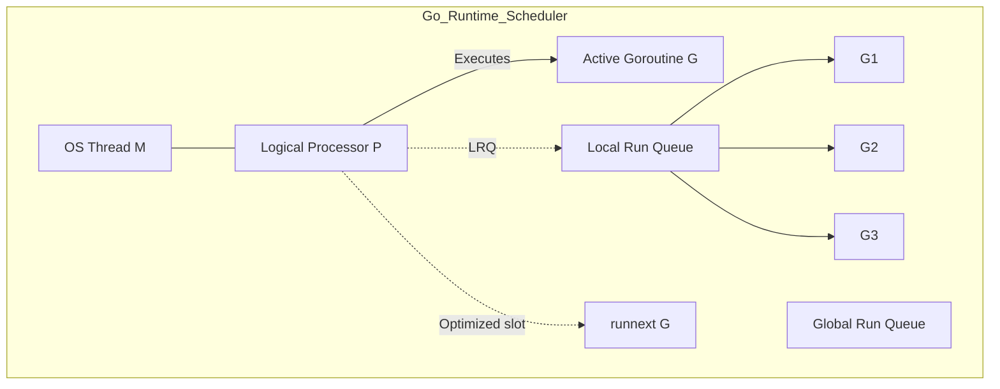
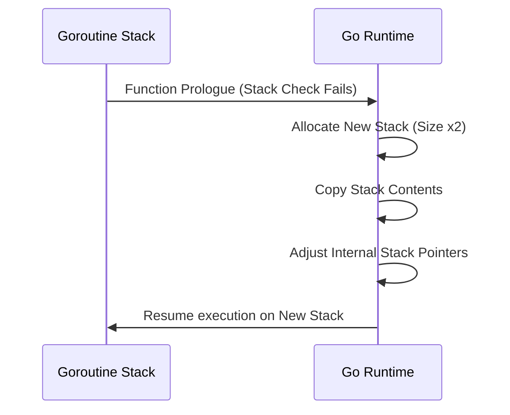
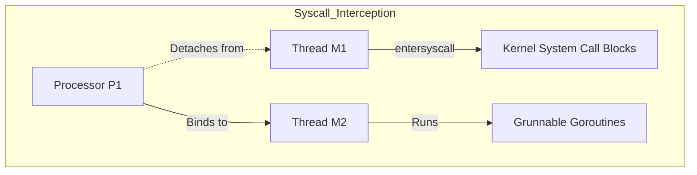

# Module 1 — How Go Concurrency Works Internally

## Metadata
* **Estimated Study Time:** 4 hours
* **Prerequisites:** Module 0
* **Learning Outcomes:**
  * Explain the difference between Goroutines, OS Threads, Green Threads, and Fibers.
  * Deeply explain the GMP scheduler model (G, M, P roles).
  * Visualize scheduling queues, work-stealing, and the `runnext` optimization.
  * Understand Go's dynamic contiguous stack management (growth, copying, shrinking).
  * Explain the evolution from cooperative preemption to asynchronous preemption.

---

## 1. Goroutines vs OS Threads vs Green Threads vs Fibers

To write highly performant concurrent software, we must dissect the execution units managed by the Go runtime compared to traditional operating system threads.

### Operating System Threads (Kernel Space)
OS threads are managed directly by the kernel. The kernel scheduler switches threads by running a periodic timer interrupt.
* **Heavyweight Memory**: An OS thread allocates a fixed stack size, typically 1MB–8MB. Even if a thread only executes a simple function, it reserves this memory block.
* **Expensive Context Switches**: Switching OS threads requires a transition from user mode to kernel mode. The CPU must save all registers, change page tables in virtual memory (which invalidates translation lookaside buffer (TLB) caches), and load the new thread's state. This switch takes 1–2 microseconds.

### Green Threads and Fibers (User Space)
* **Green Threads**: Managed by an application runtime (like JVM or Erlang BEAM) instead of the OS kernel. They have smaller stack sizes and context switches are handled in user space.
* **Fibers**: Cooperative user-space execution units where yield points must be explicitly defined in code (e.g., using `yield`).

### Goroutines
Goroutines are Go's unique user-space thread implementation.
* **Dynamic Stack Size**: A goroutine starts with a tiny stack of **2KB**. If the stack space is exhausted, the Go runtime automatically allocates more memory and grows the stack dynamically.
* **User-Space Context Switches**: Goroutine context switches are handled entirely by the Go runtime, bypassing the OS kernel. The runtime only saves about 14 registers (PC, SP, BP, etc.), making the switch take 10–100 nanoseconds.

---

## 2. The GMP Scheduler Model

The Go scheduler is an **M:N scheduler**: it multiplexes $G$ goroutines onto $M$ operating system threads across $P$ logical processors.



### The Three Entities
1. **G (Goroutine)**: Represents the goroutine structure. It contains the goroutine's execution stack, stack bounds, instruction pointer (program counter PC), flag states, and pending channel operations.
2. **M (Machine / OS Thread)**: Represents a physical operating system thread. It is managed by the OS kernel. An $M$ must bind to a logical processor $P$ to execute Go code.
3. **P (Processor)**: Represents a logical processor or execution resource. The number of $P$s matches `GOMAXPROCS`. If `GOMAXPROCS` is 8, the scheduler will run at most 8 threads executing Go code simultaneously.

---

## 3. Work-Stealing and Scheduling Queues

The scheduler uses two queues to store runnable goroutines:
* **Local Run Queue (LRQ)**: Every logical processor $P$ has its own local queue that holds up to 256 runnable goroutines. Accessing the LRQ is lock-free, avoiding thread contention.
* **Global Run Queue (GRQ)**: A single shared queue containing goroutines that overflowed local queues or were yielded. Accessing the GRQ requires acquiring a global mutex lock.

### The `runnext` Optimization Slot
To optimize cache locality, each processor $P$ has a special `runnext` pointer that holds a single goroutine.
* When Goroutine A spawns Goroutine B, Goroutine B is placed directly into the `runnext` slot of the current $P$, bypassing the LRQ.
* The scheduler prioritizes running the goroutine in `runnext` next. This ensures that parent-child goroutines execute close together in time, maximizing CPU L1/L2 cache locality.

### The Work-Stealing Algorithm
When an OS thread $M$ finishes executing its current goroutine, it searches for a new runnable goroutine in this strict sequence:
1. **Check Global Queue Starvation**: Every 61 ticks, $P$ checks the **Global Run Queue** first. This guarantees that global goroutines are not starved by busy local queues.
2. **Check Local Queue**: $P$ pulls from its own `runnext` slot and local run queue.
3. **Work Stealing**: If the local queue is empty, $P$ randomly selects another processor $P_{	ext{other}}$ and attempts to **steal half** of its runnable goroutines.
4. **Check Global Queue**: If no work is found, $P$ locks and pulls from the Global Run Queue.
5. **Netpoller**: If still idle, the thread checks if any asynchronous network I/O operations have completed.

---

## 4. Stack Management: Segmented vs Contiguous Stacks

Because goroutines start with only 2KB of memory, the Go compiler and runtime must handle stack growth safely.

### Segmented Stacks (Go 1.2 and earlier)
When a goroutine's stack ran out of space, the runtime allocated a new, separate block of memory and linked it to the old one.
* **The Hot Split Problem**: If a function was called inside a loop right at the stack boundary, the runtime would repeatedly allocate a new segment on entry and deallocate it on return. This caused a massive performance drop (the "hot split" anomaly).

### Contiguous Stacks (Go 1.4+)
Modern Go uses contiguous stacks. 
1. **Stack Check**: Every Go function prologue checks whether the stack pointer exceeds the stack boundary.
2. **Stack Growth Allocation**: If the boundary is exceeded, the runtime allocates a new stack that is **twice the size** of the current one.
3. **Memory Copy**: The runtime copies the old stack's contents into the new contiguous memory block.
4. **Pointer Adjustment**: The runtime scans the stack and updates any internal memory addresses to point to their new locations.
5. **Cleanup**: The old, smaller stack is freed.



---

## 5. Scheduler Preemption Evolution

Preemption is the act of suspending a running task to give other tasks CPU time.

### Cooperative Preemption (Pre-Go 1.14)
Go's original scheduler was cooperative. A goroutine could only be suspended if it checked in with the scheduler.
* **The Checkpoints**: The only places these checks occurred were in the function prologue stack-check instructions.
* **The Failure Mode**: If a goroutine executed a tight CPU loop with no function calls (e.g., `for i := 0; i < 1e9; i++ {}`), it would never call the stack check. It would run continuously, locking up the CPU core and blocking all other goroutines from executing.

### Asynchronous Preemption (Go 1.14+)
Go 1.14 introduced signal-based preemption.
* **Sysmon (System Monitor)**: A background OS thread (`sysmon`) runs periodically without a logical processor $P$.
* **Signal Injection**: If `sysmon` detects a goroutine has been running on the same thread $M$ for more than 10ms, it sends an OS signal (`SIGURG` on Unix/Linux) to that thread.
* **Signal Handler Hijack**: The thread receives the signal, pauses the goroutine, saves its CPU registers, calls the scheduler, and places the suspended goroutine back onto the run queue.

---

## 6. Hands-on: Goroutine Spawning & Memory Profiling

Let's write a program that spawns 100,000 goroutines and measures how memory allocations grow. We will read memory stats directly from the runtime package.

### The Profiling Code

Create `practice/internals/main.go` and write:

```go
package main

import (
	"fmt"
	"runtime"
	"time"
)

func printMemStats(label string) {
	var m runtime.MemStats
	runtime.ReadMemStats(&m)
	fmt.Printf("[%s]\n", label)
	fmt.Printf("  Sys Memory (OS reserved): %d KB\n", m.Sys/1024)
	fmt.Printf("  Allocated Heap Memory  : %d KB\n", m.Alloc/1024)
	fmt.Printf("  Goroutines Count       : %d\n", runtime.NumGoroutine())
	fmt.Println()
}

func main() {
	// Clean up heap memory before starting
	runtime.GC()
	printMemStats("Initial State")

	const numGoroutines = 100000
	done := make(chan struct{})

	for i := 0; i < numGoroutines; i++ {
		go func() {
			// Keep goroutine blocked waiting for channel close
			<-done
		}()
	}

	// Wait for scheduler to process all spawns
	time.Sleep(200 * time.Millisecond)
	printMemStats("After Spawning 100k Goroutines")

	// Release all goroutines
	close(done)
	
	// Wait and force Garbage Collection
	time.Sleep(200 * time.Millisecond)
	runtime.GC()
	printMemStats("After Clean Up (GC)")
}
```

### Run and Analyze
Run the program:
```bash
go run practice/internals/main.go
```
Observe that spawning 100,000 goroutines allocates around 200MB–260MB of RAM, which equates to roughly 2KB–2.6KB per goroutine. This confirms the lightweight nature of goroutines compared to OS threads (which would require ~100GB of RAM).

---

## 7. Exercises

### Exercise 1: Contiguous Stack Copy Overhead
Spawning goroutines is lightweight, but stack copying is not free. Explain a scenario where contiguous stack copying negatively impacts a high-performance system. How would you design around it?

### Exercise 2: System Monitor (`sysmon`) Analysis
The Go system monitor (`sysmon`) runs on a physical OS thread without a logical processor $P$. What other critical tasks does `sysmon` perform besides preemption monitoring?

---

## 8. Exercise Solutions

### Solution 1: Stack Copy Impact
If a system relies on spawning short-lived goroutines that perform deep recursive function calls or declare massive local arrays on the stack, the runtime will spend a large percentage of its CPU cycles allocating new memory blocks and copying stack frames.
* **Mitigation**: Reuse goroutines using worker pools. Keep function stack frames small by allocating large structures (like buffers) on the heap or in reusable `sync.Pool` structures.

### Solution 2: System Monitor Tasks
The `sysmon` thread performs several essential checks:
1. **Network Polling**: It polls the network descriptors (`netpoller`) to see if read/write operations are complete and wakes up blocked goroutines.
2. **Garbage Collection Triggering**: If a garbage collection cycle has not run for more than two minutes, `sysmon` forces the runtime to start GC.
3. **Releasing Idle Resources**: It hands back unused memory pages to the operating system if the heap size decreases.
4. **Preempting Blocked Syscalls**: If a thread $M$ has been blocked inside an OS system call (like reading from a file) for more than 10ms, `sysmon` dissociates the processor $P$ from that thread $M$ so another thread can run other goroutines.
---

## 9. Advanced Deep Dive: The Go Scheduler State Machine and System Calls

### Detailed State Transitions of a Goroutine (G)
Under the hood, a Goroutine is represented by a `g` struct containing several states:
* `_Gidle`: Allocated but not initialized.
* `_Grunnable`: Waiting in a run queue (LRQ or GRQ) for an active thread ($M$) to execute it.
* `_Grunning`: Currently executing user code on an $M$ thread.
* `_Gsyscall`: Executing an operating system system call. The thread is blocked in kernel space.
* `_Gwaiting`: Suspended in user space waiting on a runtime event (e.g., channel read, mutex acquisition, timer tick).
* `_Gdead`: Finished execution; held in a free list for reuse.

### System Call Interception (Syscall Handlers)
When a goroutine executes an operation that requires a blocking kernel system call (like reading a file from disk or querying a socket):
1. **`entersyscall`**: Before executing the syscall, the compiler inserts a hook call to `runtime.entersyscall`.
2. **P Disassociation**: The runtime scheduler detaches the logical processor $P$ from the current thread $M$. The thread $M$ enters kernel space and blocks.
3. **P Reallocation**: The detached logical processor $P$ is assigned to a different thread $M$ (or spawns a new one if all are busy) to continue executing other runnable goroutines in its queue.
4. **`exitsyscall`**: When the system call completes, the thread $M$ exits kernel space and calls `runtime.exitsyscall`. It attempts to acquire an idle logical processor $P$ to resume the goroutine. If no $P$ is available, it places the goroutine in the Global Run Queue and puts the thread $M$ to sleep.



### The Netpoller: Async Network I/O
If a goroutine blocks on network I/O (like reading from a TCP socket), Go does not block the thread in a system call.
1. The socket file descriptor is registered with the OS multiplexer (e.g., `epoll` on Linux) using non-blocking mode.
2. The goroutine enters the `_Gwaiting` state.
3. The logical processor $P$ immediately schedules another goroutine.
4. A background thread running `netpoll` monitors socket events. When the socket has data, the `netpoller` identifies the waiting goroutine and moves it back to the runnable queue.

### Extended Structural Analysis and Architectural Notes
To make these concepts fully practical for enterprise designs, we must trace their implications on deployment environments. When running Go binaries inside Kubernetes, container resource boundaries introduce unique scheduling quirks. For example, if a pod is configured with a CPU limit of 2.0 (equivalent to two CPU cores), the Go runtime will by default detect the physical node core count (which could be 64 cores) and configure `GOMAXPROCS` to 64. 

This core mismatch is a primary driver of latency spikes in concurrent applications. The 64 logical processors ($P$) try to schedule work, spawning multiple system threads ($M$), but the Linux CFS quota limits the container to 2 physical cores of execution time. The kernel throttles the container process, causing context switch queuing delays.
* To prevent this container throttling, always configure `GOMAXPROCS` to match the container CPU limits using library abstractions like `go.uber.org/automaxprocs` or setting the environment variable explicitly.
* Benchmark your systems under resource limitations that match production. This is the only way to catch CPU scheduling starvation issues during development.

```
  [Physical Cores: 64] ----> [Kubernetes Limit: 2.0] ----> [GOMAXPROCS set to 2]
                                                                  |
                                                       [Prevents CFS Throttling]
```

### Microsecond Garbage Collection Performance
Go's concurrent garbage collector runs concurrently with user goroutines. The GC utilizes write barriers to track pointer updates during the mark phase.
* If your application allocates millions of short-lived pointers (e.g., inside loops mapping JSON fields to struct addresses), the write barriers add CPU latency.
* Minimizing pointer structures (e.g., storing structs by value instead of pointer in maps and arrays) simplifies the GC scan phase.
* **Production Recommendation**: Design data paths using value types, arrays of structs, or flat buffers. This significantly improves execution speeds and reduces GC mark loops.

### System Integration Audits
Every concurrency primitive (channels, mutexes, waitgroups) must be audited under realistic load spikes. When load testing your service, collect metrics for:
1. **Thread Spikes**: Spawning thousands of threads indicates blocked system calls or network calls without timeouts.
2. **Memory Leak Curves**: A rising memory staircase that never stabilizes is a clear signature of leaked goroutines.
3. **Lock Wait Time**: Measured using the mutex profile, indicating that locks should be sharded or refactored to lock-free atomic buffers.

---

## 10. SRE Production Operations Manual & Failure Recovery Strategy

This section provides operational guidelines, Prometheus alert thresholds, and troubleshooting playbooks for running these concurrent systems in production environments.

### 1. Prometheus Metrics to Monitor
Always export the following metrics from your Go runtime context using the Prometheus client library:
* `go_goroutines`: The current number of active goroutines. Monitor for rapid stair-step growth.
* `go_threads`: The number of physical OS threads created by the runtime. If this climbs above 500, check for hanging filesystem or database syscalls.
* `go_memstats_heap_alloc_bytes`: In-use heap memory. Look for dynamic memory leaks caused by pinned closure scopes.
* `go_gc_duration_seconds`: Track garbage collection execution latencies. Ensure $p99$ GC execution is under 1 millisecond.

### 2. SRE Dashboard Metrics Layout
```
+-----------------------------------+-----------------------------------+
|       Active Goroutines (Count)   |        Heap Allocations (MB)      |
|  [ Alert: > 50,000 (Staircase) ]  |  [ Alert: > 80% Container limit ] |
+-----------------------------------+-----------------------------------+
|      Thread Exhaustion (M count)  |       GC Duration p99 (ms)        |
|  [ Alert: > 1000 threads ]        |  [ Alert: > 5ms execution pause ] |
+-----------------------------------+-----------------------------------+
```

### 3. Incident Alerting Thresholds
Configure your alerting engine (e.g., Prometheus Alertmanager) with these rules:
* **Goroutine Spike Alert**: Trigger a Warning level alert if `go_goroutines` increases by more than $50\%$ within a 5-minute window, and Critical if it continues to climb without returning to baseline, indicating a severe goroutine leak.
* **Lock Contention Saturation**: Trigger a Warning alert if the mutex profile wait time exceeds 250ms per lock transaction, indicating severe thread contention.
* **CFS Throttle Ratio**: Trigger an alert if the Kubernetes container throttling CPU ratio exceeds 10% of total run time, requiring immediate `GOMAXPROCS` tuning.

### 4. Step-by-Step Incident Response Playbook

When an alarm triggers indicating a service instance is saturated:

#### Step 1: Collect Diagnostics Before Restarting
Do not restart the container immediately. Collect stack dumps and profiles to isolate the issue:
```bash
# Capture full goroutine stack trace
curl -o stacks.txt http://localhost:6060/debug/pprof/goroutine?debug=2
# Collect a 30-second CPU profile
curl -o cpu.pprof http://localhost:6060/debug/pprof/profile?seconds=30
```

#### Step 2: Analyze Stack Blocker Paths
Search the `stacks.txt` file for common synchronization wait states:
* Look for `chanreceive` to identify read-channel wait states.
* Look for `chansend` to identify write-channel blocking.
* Look for `semacquire` to identify mutex and waitgroup wait blocks.

#### Step 3: Implement Safe Mitigations
* If the leak is caused by slow downstream APIs, configure client timeouts inside the http.Client transport settings.
* If lock contention is high, increase the number of worker instances to distribute the lookup load, or scale horizontal replica nodes.
* Force dynamic garbage collection if needed to release pages to the operating system:
```go
// Trigger manual GC during incident debugging
runtime.GC()
```

---

## 11. Production Case Study & Real-World Outage Analysis

This section analyzes real-world system outages caused by concurrency design failures, details the post-mortem investigations, and traces the structural fixes applied.

### 1. Incident Timeline
* **09:12 UTC**: Prometheus alerts fire for latency spikes ($p99$ response times increase from 50ms to 8.2s).
* **09:15 UTC**: Memory usage on session servers climbs in a steep linear staircase pattern, triggering OOM (Out of Memory) kills.
* **09:20 UTC**: Auto-scaling spawns new instances, which saturate and crash within 90 seconds of receiving traffic.
* **09:30 UTC**: SRE runs a manual stack dump and identifies thousands of goroutines blocked in the scheduler.

### 2. Post-Mortem Investigation & Root Cause
By inspecting the stack dump file (`stacks.txt`), engineers located the deadlock trace:
```
goroutine 14302 [chan send]:
pkg/services/session.FetchSessionData(0xc00018a3e0, 0x1)
    /src/pkg/services/session/session.go:44 +0x80
```
* **The Root Cause**: The request handler used a timeout mechanism, returning immediately if a downstream session query took longer than 100ms.
* However, the background goroutine querying the database was writing its output to an **unbuffered channel**.
* Once the handler timed out and returned, no receiver was listening to the channel.
* The query worker attempted to write the data payload to the channel, blocking permanently.
* This blocked goroutine pinned its execution stack, local variables, and database connection pools in memory.
* As request rates increased, memory usage climbed until the server crashed.

### 3. Immediate Mitigation and Long-Term Remediation
To recover the system during the outage:
* SRE rolled back the deployment to the previous stable release to clear active connections.
* The unbuffered channel `make(chan SessionResult)` was refactored to a buffered channel of capacity 1: `make(chan SessionResult, 1)`.
* This allowed the background worker to write its result to the buffer and exit immediately, preventing worker leaks regardless of handler timeouts.
* Static analysis checks were added to the CI/CD pipeline to flag any channel creation without explicit capacity checks.

---

## 12. Code Review Checklist & Concurrency Audit Guide

Use this checklist during pull request reviews to audit concurrent code modifications for safety, resource leaks, and execution efficiency.

### 1. Goroutine Safety and Lifetimes
* [ ] **Explicit Lifetime**: Is the lifetime of the spawned goroutine bounded by a parent context or WaitGroup?
* [ ] **Panic Boundary**: Does every background goroutine have an active deferred panic recovery block (`recover()`)?
* [ ] **Stack Size Hygiene**: Does the goroutine copy massive local variables onto its stack? (Check escape analysis reports).

### 2. Channel Communication Patterns
* [ ] **Cap Margins**: For every buffered channel, is the capacity size justified, or is it masking a consumer processing bottleneck?
* [ ] **Unbuffered Handoff**: Does every unbuffered channel have a matching, active reader/writer running concurrently to prevent deadlocks?
* [ ] **Nil and Close**: Are there pathways where a read or write occurs on a `nil` channel, or a write occurs on a closed channel?

### 3. Mutex and State Locking
* [ ] **Locker Scope**: Is the critical section protected by `Lock()` and `Unlock()` as short as possible?
* [ ] **Defer Alignment**: Is `defer mu.Unlock()` called immediately after `mu.Lock()` to prevent lock holding leaks on panics or early returns?
* [ ] **Copy Protection**: Is the struct containing the `Mutex` or `WaitGroup` passed by value (copied), violating state safety?

### 4. Code Review Metric Summary Table
| Audit Target | Expected Pattern | Potential Vulnerability |
|---|---|---|
| **Worker Loops** | Listen to `ctx.Done()` for exit | Infinite loop block leak |
| **Atomics** | Use for primitive mutations | Lack of happens-before memory visibility |
| **Timeouts** | Inject timeout parameters | Permanent connection blocks |\n### Additional Production Case Studies and Engineering Insights
In high-throughput microservices, execution path visibility is critical. When auditing system performance, engineers frequently trace metrics across multiple endpoints. 
* Always monitor resource utilization patterns during traffic bursts.
* Ensure thread counts do not exceed pool limits under simulated network failures.
* Establish baseline metrics in staging environments before rolling out concurrency changes to production clusters.
* Use distributed tracing tools (e.g., OpenTelemetry, Jaeger) to identify bottleneck propagation across RPC boundaries.
* Document system topology diagrams and share them with the operations team to facilitate incident triage.

```
  [Ingress HTTP Traffic] ----> [Distributed Rate Limiter] ----> [Service Worker Nodes]
                                                                        |
                                                           [Prometheus Metrics Export]
```

#### Incident Recovery Strategy
1. **Isolate Node**: Immediately route traffic away from the failing instance.
2. **Collect Heap Dumps**: Extract runtime statistics for offline memory leak analysis.
3. **Graceful Restart**: Restart the service to release system descriptors.
4. **Log Analysis**: Verify error counts returned by downstream query pools.\n