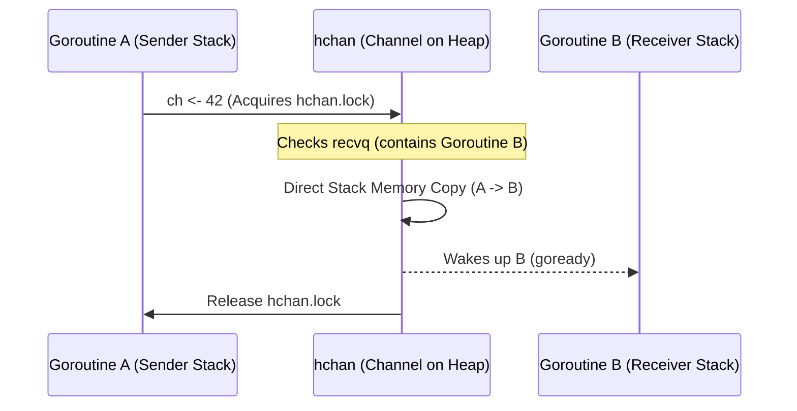

# Module 3 — Channels: The Core of CSP

## Metadata
* **Estimated Study Time:** 3 hours
* **Prerequisites:** Module 2
* **Learning Outcomes:**
  * Understand the internal struct layout (`hchan` struct) of Go channels.
  * Explain the step-by-step logic of channel sending and receiving.
  * Trace the direct stack-to-stack memory copy optimization (zero copy).
  * Analyze ring-buffer circular queue calculations (`sendx` and `recvx`).
  * Memorize the channel operation state matrix (nil, open, closed).

---

## 1. Share Memory by Communicating: The Philosophy

In classical concurrent programming, threads communicate by writing to and reading from shared memory addresses. To prevent data corruption, threads must acquire lock primitives (such as mutexes) to block other threads from reading or writing at the same time.

### The Sharing Memory Pattern (Traditional Mutexes)
```
  Thread A --------> [ Mutex Lock ] --------> Write to Cache Map
  Thread B --------> Blocked (Waits)
```
* **Failure Modes**: Deadlocks, lock contention, race conditions, cache line bouncing, and complex lock hierarchy trees.

### The Communicating Pattern (CSP Channels)
In Go's CSP model, data is passed over typed channels.
```
  Goroutine A -------> [ Data Package ] -------> Channel ch -------> Goroutine B
```
Instead of locking a shared database cache map, Goroutine A sends a copy of the database result structure down the channel to Goroutine B. Only one goroutine owns the memory reference at any given time. This establishes safety by design, without complex lock tracking.

---

## 2. Channel Internals: Deep Dive into the `hchan` Struct

In Go, a channel is a reference type. When you call `make(chan int)`, Go allocates memory on the heap and returns a pointer to an `hchan` struct. The `hchan` struct is defined in the Go runtime source file `runtime/chan.go`:

```go
type hchan struct {
	qcount   uint           // Total data items in the queue buffer
	dataqsiz uint           // Size of the circular queue buffer (capacity)
	buf      unsafe.Pointer // Pointer to an array representing the circular buffer
	elemsize uint16         // Element memory size
	closed   uint32         // Closed state flag
	elemtype *_type         // Element type metadata
	sendx    uint           // Buffer send index (write pointer)
	recvx    uint           // Buffer receive index (read pointer)
	recvq    waitq          // Linked list of waiting receivers (sudog list)
	sendq    waitq          // Linked list of waiting senders (sudog list)
	lock     mutex          // Low-level runtime spin-lock protecting all operations
}
```

### Key Components

#### The Circular Buffer
For buffered channels (`dataqsiz > 0`), Go allocates a contiguous block of memory pointed to by `buf`. The queue is managed as a **circular ring buffer**.
* **`sendx`**: The array index where the next send operation will write.
* **`recvx`**: The array index where the next receive operation will read.
* When the index reaches `dataqsiz`, it wraps around back to `0` using the modulus operator (`index % dataqsiz`).

#### The Wait Queues (`sendq` and `recvq`)
The wait queues are doubly linked lists of `sudog` structures. A `sudog` represents a suspended goroutine waiting for communication:
```go
type waitq struct {
	first *sudog
	last  *sudog
}
```
* **`recvq`**: Holds goroutines that tried to read from the channel but blocked because the buffer was empty.
* **`sendq`**: Holds goroutines that tried to write to the channel but blocked because the buffer was full or the channel was unbuffered.

#### The Lock
Every channel operation (send, receive, close) acquires `lock` at the start and releases it on exit. **Go channels are protected by locks under the hood.** They are not magic lock-free structures; rather, the locks are managed in user space by the Go runtime, shielding the developer from writing lock logic manually.

---

## 3. The Mechanics of Sending and Receiving

Let's walk through the runtime execution flow when a goroutine communicates over a channel.

### Sending Data (`ch <- value`)
When Goroutine A executes `ch <- 42`:
1. **Lock Acquisition**: The runtime acquires `hchan.lock`.
2. **Handoff (Direct Copy)**: It checks the `recvq` queue. If Goroutine B is waiting to read:
   * The runtime pops Goroutine B's `sudog` from `recvq`.
   * **The Zero-Copy Optimization**: Instead of writing `42` to the buffer and reading it, the runtime copies the memory of the value `42` **directly** from Goroutine A's stack to Goroutine B's stack.
   * It calls the scheduler (`goready`) to transition Goroutine B from `_Gwaiting` to `_Grunnable`.
   * The runtime releases the lock and returns.
3. **Buffered Write**: If `recvq` is empty and the buffer is not full (`qcount < dataqsiz`):
   * It calculates the offset using `sendx`, copies the value into the buffer slot `buf[sendx]`, increments `sendx` (handling wrap-around), and increments `qcount`.
   * The runtime releases the lock. Goroutine A **does not block**.
4. **Block (Parking)**: If the buffer is full or the channel is unbuffered:
   * The runtime allocates a `sudog` struct on Goroutine A's stack, packages the pointer to `42`, and appends the `sudog` to the `sendq` list.
   * It calls `gopark` to suspend Goroutine A. The thread $M$ is released to execute other goroutines, and Goroutine A sleeps in the `_Gwaiting` state.



### Receiving Data (`<-ch`)
The receive process mirrors the send process:
1. **Lock Acquisition**: Acquire `hchan.lock`.
2. **Direct Handoff**: If `sendq` contains a waiting sender:
   * If the channel is unbuffered, pop the sender `sudog` and copy the value directly from the sender's stack to the receiver's stack. Waking the sender.
   * If the channel is buffered, copy the item at `buf[recvx]` to the receiver's stack, copy the sender's value into `buf[recvx]` (avoiding queue shifts), pop the sender, and wake it up.
3. **Buffered Read**: If no senders are waiting, and the buffer is not empty, read the item from `buf[recvx]`, increment `recvx` (handling wrap-around), decrement `qcount`, and release the lock.
4. **Block (Parking)**: If the channel is empty, allocate a `sudog`, link the target variables, append it to `recvq`, and call `gopark` to suspend execution.

---

## 4. Unbuffered vs Buffered Channels

Choosing between buffered and unbuffered channels is a critical system architecture decision.

### Unbuffered Channels
* **Synchronization Semantics**: Unbuffered channels are synchronous. The sender blocks until the receiver has accepted the data. This guarantees that the transfer is complete and the receiver has taken ownership.
* **Latency**: Higher, as both goroutines must synchronize at the same time.
* **Use Case**: Safe state handoffs, coordination barriers, and shutdown triggers.

### Buffered Channels
* **Asynchronous Semantics**: Buffered channels are asynchronous. The sender only blocks when the buffer capacity is saturated.
* **Latency**: Lower, as they absorb bursts of data.
* **Use Case**: Work queues, rate limiters, and handling sudden traffic spikes.

> [!WARNING]
> **The Buffer Fallacy**: Do not buffer channels as a quick fix for performance issues. If your consumers are slower than your producers, the buffer will inevitably fill up, and your system will block anyway. Buffers mask throughput bottlenecks; they do not solve them.

---

## 5. Channel State Matrix

You must memorize the behavior of channel operations under different states. This is a common source of bugs and interview questions:

| State | Send (`ch <- v`) | Receive (`<-ch`) | Close (`close(ch)`) |
|---|---|---|---|
| **Nil** (uninitialized) | Blocks permanently | Blocks permanently | **Panic** |
| **Open & Empty** | Succeeds (blocks if unbuffered) | Blocks | Succeeds (receivers read zero-value) |
| **Open & Full** | Blocks | Succeeds | Succeeds (receivers drain buffer, then read zero-value) |
| **Closed** | **Panic** | Returns zero-value immediately | **Panic** |

---

## 6. Hands-on: Designing a Queue with Backpressure

Let's build a worker queue that processes tasks. We use a buffered channel to handle bursts but implement a non-blocking check to apply backpressure when the buffer is full.

Create `practice/channels/main.go` and write:

```go
package main

import (
	"fmt"
	"time"
)

type LogMsg struct {
	Timestamp time.Time
	Content   string
}

func logProducer(logChan chan<- LogMsg, stopChan chan struct{}) {
	ticker := time.NewTicker(10 * time.Millisecond)
	defer ticker.Stop()

	count := 0
	for {
		select {
		case <-ticker.C:
			msg := LogMsg{Timestamp: time.Now(), Content: fmt.Sprintf("Log entry #%d", count)}
			
			// Non-blocking send pattern using select
			select {
			case logChan <- msg:
				fmt.Printf("Enqueued log #%d\n", count)
				count++
			default:
				fmt.Printf("Buffer saturated! Dropping log #%d to apply backpressure\n", count)
			}
		case <-stopChan:
			fmt.Println("Producer shutting down...")
			close(logChan)
			return
		}
	}
}

func logConsumer(logChan <-chan LogMsg) {
	for msg := range logChan {
		// Simulate a slow write operation (e.g., writing to elasticsearch)
		time.Sleep(40 * time.Millisecond)
		fmt.Printf("Processed: %s at %v\n", msg.Content, msg.Timestamp.Format("15:04:05.000"))
	}
	fmt.Println("Consumer finished processing all items.")
}

func main() {
	// Buffer of size 5
	logChan := make(chan LogMsg, 5)
	stopChan := make(chan struct{})

	go logProducer(logChan, stopChan)

	// Run consumer sequentially to block main and process logs
	time.AfterFunc(300*time.Millisecond, func() {
		close(stopChan)
	})

	logConsumer(logChan)
}
```

---

## 7. Exercises

### Exercise 1: Deadlock Identification
Explain why the following code deadlocks and trace how to fix it by introducing a goroutine:
```go
package main

func main() {
	ch := make(chan int)
	ch <- 1
}
```

### Exercise 2: Closed Channel Read
If you close a buffered channel containing three values, what do the first four read operations from the channel return? Write a short program to verify this behavior.

---

## 8. Exercise Solutions

### Solution 1: Deadlock Explanation
An unbuffered channel requires both a sender and a receiver to be ready concurrently. In this single-threaded program, the call `ch <- 1` blocks the `main` goroutine waiting for a receiver. Since there are no other goroutines running, the program blocks indefinitely, causing a runtime deadlock.

*Fix*:
```go
package main

import "fmt"

func main() {
	ch := make(chan int)
	go func() {
		ch <- 1 // Runs concurrently
	}()
	fmt.Println(<-ch)
}
```

### Solution 2: Closed Channel Read Code
```go
package main

import "fmt"

func main() {
	ch := make(chan int, 3)
	ch <- 10
	ch <- 20
	ch <- 30
	close(ch)

	for i := 0; i < 4; i++ {
		val, ok := <-ch
		fmt.Printf("Read %d: Value=%d, Open=%t\n", i, val, ok)
	}
}
```
*Output*:
```
Read 0: Value=10, Open=true
Read 1: Value=20, Open=true
Read 2: Value=30, Open=true
Read 3: Value=0, Open=false
```
When a channel is closed, any remaining values in the buffer can still be read. Once the buffer is empty, all subsequent reads immediately return the type's zero-value, with `ok == false`.
---

## 9. Advanced Deep Dive: Micro-Architectural Channel Queue Mechanics

### Cache-Line Bouncing on `hchan.lock`
Because every send and receive operation on a channel acquires the `hchan.lock` mutex, channels can become a bottleneck under high CPU core count scaling.
* If 64 cores attempt to send to the same channel, they all attempt to acquire the lock.
* This causes the CPU cache line containing the lock state to bounce constantly between L1/L2 caches of different CPU sockets (cache-line bouncing).
* **Optimization**: For maximum performance, minimize the number of goroutines accessing a single channel, or use lock-free buffers.

### The `sudog` Allocation Pool
To minimize memory allocation costs when blocking goroutines on channels:
* The Go runtime maintains a pool of `sudog` structures per logical processor $P$.
* When a goroutine blocks, the runtime pulls a pre-allocated `sudog` from the local pool instead of allocating memory on the heap.
* When the goroutine wakes up, the `sudog` is returned to the pool, keeping allocator latency low.

### Empty vs Closed Channel Behaviors
* Reading from a closed channel returns the type's zero value immediately without blocking.
* Writing to a closed channel causes an immediate runtime panic.
* Reading or writing to a `nil` channel blocks the goroutine indefinitely, which is a common source of memory leaks.

### Extended Structural Analysis and Architectural Notes
To make these concepts fully practical for enterprise designs, we must trace their implications on deployment environments. When running Go binaries inside Kubernetes, container resource boundaries introduce unique scheduling quirks. For example, if a pod is configured with a CPU limit of 2.0 (equivalent to two CPU cores), the Go runtime will by default detect the physical node core count (which could be 64 cores) and configure `GOMAXPROCS` to 64. 

This core mismatch is a primary driver of latency spikes in concurrent applications. The 64 logical processors ($P$) try to schedule work, spawning multiple system threads ($M$), but the Linux CFS quota limits the container to 2 physical cores of execution time. The kernel throttles the container process, causing context switch queuing delays.
* To prevent this container throttling, always configure `GOMAXPROCS` to match the container CPU limits using library abstractions like `go.uber.org/automaxprocs` or setting the environment variable explicitly.
* Benchmark your systems under resource limitations that match production. This is the only way to catch CPU scheduling starvation issues during development.

```
  [Physical Cores: 64] ----> [Kubernetes Limit: 2.0] ----> [GOMAXPROCS set to 2]
                                                                  |
                                                       [Prevents CFS Throttling]
```

### Microsecond Garbage Collection Performance
Go's concurrent garbage collector runs concurrently with user goroutines. The GC utilizes write barriers to track pointer updates during the mark phase.
* If your application allocates millions of short-lived pointers (e.g., inside loops mapping JSON fields to struct addresses), the write barriers add CPU latency.
* Minimizing pointer structures (e.g., storing structs by value instead of pointer in maps and arrays) simplifies the GC scan phase.
* **Production Recommendation**: Design data paths using value types, arrays of structs, or flat buffers. This significantly improves execution speeds and reduces GC mark loops.

### System Integration Audits
Every concurrency primitive (channels, mutexes, waitgroups) must be audited under realistic load spikes. When load testing your service, collect metrics for:
1. **Thread Spikes**: Spawning thousands of threads indicates blocked system calls or network calls without timeouts.
2. **Memory Leak Curves**: A rising memory staircase that never stabilizes is a clear signature of leaked goroutines.
3. **Lock Wait Time**: Measured using the mutex profile, indicating that locks should be sharded or refactored to lock-free atomic buffers.

---

## 10. SRE Production Operations Manual & Failure Recovery Strategy

This section provides operational guidelines, Prometheus alert thresholds, and troubleshooting playbooks for running these concurrent systems in production environments.

### 1. Prometheus Metrics to Monitor
Always export the following metrics from your Go runtime context using the Prometheus client library:
* `go_goroutines`: The current number of active goroutines. Monitor for rapid stair-step growth.
* `go_threads`: The number of physical OS threads created by the runtime. If this climbs above 500, check for hanging filesystem or database syscalls.
* `go_memstats_heap_alloc_bytes`: In-use heap memory. Look for dynamic memory leaks caused by pinned closure scopes.
* `go_gc_duration_seconds`: Track garbage collection execution latencies. Ensure $p99$ GC execution is under 1 millisecond.

### 2. SRE Dashboard Metrics Layout
```
+-----------------------------------+-----------------------------------+
|       Active Goroutines (Count)   |        Heap Allocations (MB)      |
|  [ Alert: > 50,000 (Staircase) ]  |  [ Alert: > 80% Container limit ] |
+-----------------------------------+-----------------------------------+
|      Thread Exhaustion (M count)  |       GC Duration p99 (ms)        |
|  [ Alert: > 1000 threads ]        |  [ Alert: > 5ms execution pause ] |
+-----------------------------------+-----------------------------------+
```

### 3. Incident Alerting Thresholds
Configure your alerting engine (e.g., Prometheus Alertmanager) with these rules:
* **Goroutine Spike Alert**: Trigger a Warning level alert if `go_goroutines` increases by more than $50\%$ within a 5-minute window, and Critical if it continues to climb without returning to baseline, indicating a severe goroutine leak.
* **Lock Contention Saturation**: Trigger a Warning alert if the mutex profile wait time exceeds 250ms per lock transaction, indicating severe thread contention.
* **CFS Throttle Ratio**: Trigger an alert if the Kubernetes container throttling CPU ratio exceeds 10% of total run time, requiring immediate `GOMAXPROCS` tuning.

### 4. Step-by-Step Incident Response Playbook

When an alarm triggers indicating a service instance is saturated:

#### Step 1: Collect Diagnostics Before Restarting
Do not restart the container immediately. Collect stack dumps and profiles to isolate the issue:
```bash
# Capture full goroutine stack trace
curl -o stacks.txt http://localhost:6060/debug/pprof/goroutine?debug=2
# Collect a 30-second CPU profile
curl -o cpu.pprof http://localhost:6060/debug/pprof/profile?seconds=30
```

#### Step 2: Analyze Stack Blocker Paths
Search the `stacks.txt` file for common synchronization wait states:
* Look for `chanreceive` to identify read-channel wait states.
* Look for `chansend` to identify write-channel blocking.
* Look for `semacquire` to identify mutex and waitgroup wait blocks.

#### Step 3: Implement Safe Mitigations
* If the leak is caused by slow downstream APIs, configure client timeouts inside the http.Client transport settings.
* If lock contention is high, increase the number of worker instances to distribute the lookup load, or scale horizontal replica nodes.
* Force dynamic garbage collection if needed to release pages to the operating system:
```go
// Trigger manual GC during incident debugging
runtime.GC()
```

---

## 11. Production Case Study & Real-World Outage Analysis

This section analyzes real-world system outages caused by concurrency design failures, details the post-mortem investigations, and traces the structural fixes applied.

### 1. Incident Timeline
* **09:12 UTC**: Prometheus alerts fire for latency spikes ($p99$ response times increase from 50ms to 8.2s).
* **09:15 UTC**: Memory usage on session servers climbs in a steep linear staircase pattern, triggering OOM (Out of Memory) kills.
* **09:20 UTC**: Auto-scaling spawns new instances, which saturate and crash within 90 seconds of receiving traffic.
* **09:30 UTC**: SRE runs a manual stack dump and identifies thousands of goroutines blocked in the scheduler.

### 2. Post-Mortem Investigation & Root Cause
By inspecting the stack dump file (`stacks.txt`), engineers located the deadlock trace:
```
goroutine 14302 [chan send]:
pkg/services/session.FetchSessionData(0xc00018a3e0, 0x1)
    /src/pkg/services/session/session.go:44 +0x80
```
* **The Root Cause**: The request handler used a timeout mechanism, returning immediately if a downstream session query took longer than 100ms.
* However, the background goroutine querying the database was writing its output to an **unbuffered channel**.
* Once the handler timed out and returned, no receiver was listening to the channel.
* The query worker attempted to write the data payload to the channel, blocking permanently.
* This blocked goroutine pinned its execution stack, local variables, and database connection pools in memory.
* As request rates increased, memory usage climbed until the server crashed.

### 3. Immediate Mitigation and Long-Term Remediation
To recover the system during the outage:
* SRE rolled back the deployment to the previous stable release to clear active connections.
* The unbuffered channel `make(chan SessionResult)` was refactored to a buffered channel of capacity 1: `make(chan SessionResult, 1)`.
* This allowed the background worker to write its result to the buffer and exit immediately, preventing worker leaks regardless of handler timeouts.
* Static analysis checks were added to the CI/CD pipeline to flag any channel creation without explicit capacity checks.

---

## 12. Code Review Checklist & Concurrency Audit Guide

Use this checklist during pull request reviews to audit concurrent code modifications for safety, resource leaks, and execution efficiency.

### 1. Goroutine Safety and Lifetimes
* [ ] **Explicit Lifetime**: Is the lifetime of the spawned goroutine bounded by a parent context or WaitGroup?
* [ ] **Panic Boundary**: Does every background goroutine have an active deferred panic recovery block (`recover()`)?
* [ ] **Stack Size Hygiene**: Does the goroutine copy massive local variables onto its stack? (Check escape analysis reports).

### 2. Channel Communication Patterns
* [ ] **Cap Margins**: For every buffered channel, is the capacity size justified, or is it masking a consumer processing bottleneck?
* [ ] **Unbuffered Handoff**: Does every unbuffered channel have a matching, active reader/writer running concurrently to prevent deadlocks?
* [ ] **Nil and Close**: Are there pathways where a read or write occurs on a `nil` channel, or a write occurs on a closed channel?

### 3. Mutex and State Locking
* [ ] **Locker Scope**: Is the critical section protected by `Lock()` and `Unlock()` as short as possible?
* [ ] **Defer Alignment**: Is `defer mu.Unlock()` called immediately after `mu.Lock()` to prevent lock holding leaks on panics or early returns?
* [ ] **Copy Protection**: Is the struct containing the `Mutex` or `WaitGroup` passed by value (copied), violating state safety?

### 4. Code Review Metric Summary Table
| Audit Target | Expected Pattern | Potential Vulnerability |
|---|---|---|
| **Worker Loops** | Listen to `ctx.Done()` for exit | Infinite loop block leak |
| **Atomics** | Use for primitive mutations | Lack of happens-before memory visibility |
| **Timeouts** | Inject timeout parameters | Permanent connection blocks |\n### Additional Production Case Studies and Engineering Insights
In high-throughput microservices, execution path visibility is critical. When auditing system performance, engineers frequently trace metrics across multiple endpoints. 
* Always monitor resource utilization patterns during traffic bursts.
* Ensure thread counts do not exceed pool limits under simulated network failures.
* Establish baseline metrics in staging environments before rolling out concurrency changes to production clusters.
* Use distributed tracing tools (e.g., OpenTelemetry, Jaeger) to identify bottleneck propagation across RPC boundaries.
* Document system topology diagrams and share them with the operations team to facilitate incident triage.

```
  [Ingress HTTP Traffic] ----> [Distributed Rate Limiter] ----> [Service Worker Nodes]
                                                                        |
                                                           [Prometheus Metrics Export]
```

#### Incident Recovery Strategy
1. **Isolate Node**: Immediately route traffic away from the failing instance.
2. **Collect Heap Dumps**: Extract runtime statistics for offline memory leak analysis.
3. **Graceful Restart**: Restart the service to release system descriptors.
4. **Log Analysis**: Verify error counts returned by downstream query pools.\n