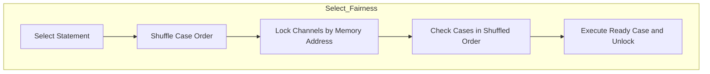

# Module 4 — Select Statement

## Metadata
* **Estimated Study Time:** 2 hours
* **Prerequisites:** Module 3
* **Learning Outcomes:**
  * Understand the internal runtime mechanics of `select` (`selectgo` execution).
  * Explain the reason for and mechanics of random selection fairness.
  * Implement non-blocking channel operations using `default`.
  * Construct timeouts safely using `time.After` and `time.Timer`.
  * Build a robust multi-channel multiplexer (fan-in pattern).

---

## 1. How Select Works Internally

The `select` statement is Go's tool for multiplexing channel operations. It allows a single goroutine to wait on multiple send and receive events simultaneously.

When the compiler encounters a `select` block, it translates it into a call to the Go runtime function `selectgo` in `runtime/select.go`.

### The Step-by-Step Execution of `selectgo`
1. **Random Shuffling**: The runtime takes all the channel cases in the `select` block and shuffles their execution order.
2. **Channel Polling**: It loops through the shuffled cases one by one and locks each channel. It checks if any channel is ready for execution:
   * A receive case is ready if there is data in the buffer or a sender blocked in the `sendq`.
   * A send case is ready if there is space in the buffer or a receiver blocked in the `recvq`.
3. **Immediate Handoff**: If a ready channel is found, the runtime performs the communication, unlocks all channels, and returns the case index.
4. **Non-blocking Return**: If no channels are ready, and a `default` case is specified, it unlocks the channels and runs the `default` block.
5. **Acquire and Block**: If no channels are ready and there is no `default` case:
   * The current goroutine allocates `sudog` structures for all select cases.
   * It registers these `sudog` objects into the waiting queues (`recvq` or `sendq`) of every channel in the select statement.
   * The scheduler suspends the goroutine (`gopark`), putting it to sleep.
6. **Waking and Cleanup**: When any single channel becomes ready, the goroutine is woken up. It immediately acquires the lock on all channels, removes its `sudog` structures from the other waiting queues to prevent memory leaks, and continues execution.

### The Design Choice: Why Shuffled Order?
If Go evaluated `select` cases in sequential order (top-to-bottom), a channel that is constantly ready would starve all the other channels defined below it. Shuffling the evaluation order guarantees **fairness** and ensures equal treatment of all cases.

---

## 2. Essential Select Patterns

### Pattern A: Timeouts
A timeout prevents concurrent client requests or API calls from blocking indefinitely if a dependency fails.

```go
select {
case data := <-apiChan:
    process(data)
case <-time.After(200 * time.Millisecond):
    fmt.Println("API call timed out!")
}
```

> [!CAUTION]
> **Allocation Leak in Loops**: `time.After` allocates a new `time.Timer` object every time it is evaluated. If you call `time.After` inside a high-frequency loop, you will create thousands of timer objects that cannot be garbage collected until their duration expires, causing temporary memory spikes.

#### The Loop-Optimized Timeout Pattern:
To prevent allocations inside loops, instantiate a single `time.Timer` outside the loop, reset it on each iteration, and drain its channel:

```go
func processWithTimer(ch <-chan int) {
	timer := time.NewTimer(500 * time.Millisecond)
	defer timer.Stop()

	for {
		timer.Reset(500 * time.Millisecond)
		select {
		case val, ok := <-ch:
			if !ok {
				return
			}
			fmt.Println("Value received:", val)
		case <-timer.C:
			fmt.Println("Idle timeout reached!")
		}
	}
}
```

### Pattern B: Non-Blocking Operations
You can use `default` to attempt a channel send or receive. If it cannot complete immediately, the program runs the `default` block, allowing execution to continue without blocking.

```go
// Non-blocking try-receive
select {
case msg := <-queueChan:
    process(msg)
default:
    // Queue is empty, carry on with other work
}
```

---

## 3. Fan-in (Multiplexing)

The **Fan-in** pattern takes multiple input channels and aggregates their outputs into a single destination channel. This is highly useful for consolidation tasks (e.g., merging error logs from different services).

### Implementing Fan-in using `select`

```go
package main

import (
	"fmt"
	"sync"
	"time"
)

func fanIn(ch1, ch2 <-chan string) <-chan string {
	out := make(chan string)

	go func() {
		defer close(out)
		for {
			select {
			case val, ok := <-ch1:
				if !ok {
					ch1 = nil // Disable this case
					continue
				}
				out <- val
			case val, ok := <-ch2:
				if !ok {
					ch2 = nil // Disable this case
					continue
				}
				out <- val
			}
			
			// Exit loop when both channels are drained and set to nil
			if ch1 == nil && ch2 == nil {
				break
			}
		}
	}()

	return out
}

func producer(name string, delay time.Duration) <-chan string {
	ch := make(chan string)
	go func() {
		defer close(ch)
		for i := 1; i <= 3; i++ {
			ch <- fmt.Sprintf("[%s] message %d", name, i)
			time.Sleep(delay)
		}
	}()
	return ch
}

func main() {
	ch1 := producer("ServiceA", 50*time.Millisecond)
	ch2 := producer("ServiceB", 80*time.Millisecond)

	out := fanIn(ch1, ch2)

	for msg := range out {
		fmt.Println("Received:", msg)
	}
	fmt.Println("All messages processed.")
}
```

*Note: In the `select` statement, reading from a `nil` channel blocks forever. By setting a channel variable to `nil` (`ch1 = nil`) when it is closed, we dynamically disable that case inside the select loop.*

---

## 4. Hands-on: Building a Multi-Service Event Dispatcher
Let's build a concurrent event dispatcher that listens to different event feeds and routes them to their processors. It includes a timeout mechanism.

Create `practice/select/main.go` and write:

```go
package main

import (
	"fmt"
	"time"
)

type Event struct {
	Source string
	Data   string
}

func fetchEvents(source string, delay time.Duration) <-chan Event {
	ch := make(chan Event)
	go func() {
		defer close(ch)
		for i := 1; i <= 4; i++ {
			ch <- Event{Source: source, Data: fmt.Sprintf("Data-%d", i)}
			time.Sleep(delay)
		}
	}()
	return ch
}

func main() {
	authEvents := fetchEvents("auth-service", 40*time.Millisecond)
	paymentEvents := fetchEvents("payment-service", 60*time.Millisecond)
	shutdownChan := time.After(300 * time.Millisecond) // Global shutdown timer

	for {
		select {
		case ev, ok := <-authEvents:
			if !ok {
				authEvents = nil
				continue
			}
			fmt.Printf("[AUTH ROUTER] Routed: %s from %s\n", ev.Data, ev.Source)
		case ev, ok := <-paymentEvents:
			if !ok {
				paymentEvents = nil
				continue
			}
			fmt.Printf("[PAY ROUTER] Routed: %s from %s\n", ev.Data, ev.Source)
		case <-shutdownChan:
			fmt.Println("[SYS] Master timeout reached. Initiating clean exit...")
			return
		}

		if authEvents == nil && paymentEvents == nil {
			fmt.Println("[SYS] All event feeds terminated.")
			break
		}
	}
}
```

---

## 5. Exercises

### Exercise 1: Select fairness verification
Write a test program with two channels that are both pre-filled with data. Create a select loop that reads from them and counts how many times each channel is selected. Verify if it approximates a 50/50 split.

### Exercise 2: Implementing Non-blocking Send
Create a function `TrySend` that attempts to send a value to a channel. If the channel is full, return `false` immediately instead of blocking.

---

## 6. Exercise Solutions

### Solution 1: Select fairness test code
```go
package main

import "fmt"

func main() {
	ch1 := make(chan int, 1000)
	ch2 := make(chan int, 1000)

	for i := 0; i < 1000; i++ {
		ch1 <- 1
		ch2 <- 2
	}

	count1 := 0
	count2 := 0

	for i := 0; i < 1000; i++ {
		select {
		case <-ch1:
			count1++
		case <-ch2:
			count2++
		}
	}

	fmt.Printf("Channel 1 selected: %d times\n", count1)
	fmt.Printf("Channel 2 selected: %d times\n", count2)
}
```
*Output*: The counts will be close to 500 each, demonstrating that Go shuffles the case evaluation order randomly.

### Solution 2: Non-blocking Send Implementation
```go
package main

import "fmt"

func TrySend(ch chan<- int, val int) bool {
	select {
	case ch <- val:
		return true
	default:
		return false
	}
}

func main() {
	ch := make(chan int, 1)
	fmt.Println("First send:", TrySend(ch, 10)) // true
	fmt.Println("Second send:", TrySend(ch, 20)) // false (buffer full)
}
```
---

## 7. Advanced Deep Dive: Selectgo Compiler Code and Fairness Proof

### Shuffling Heuristics in `selectgo`
To guarantee fairness, the runtime must select a random case if multiple channels are ready.
1. The compiler generates two arrays for the `select` statement:
   * `pollorder`: Stores indices in a shuffled sequence using a fast pseudo-random number generator (PRNG) owned by the logical processor $P$.
   * `lockorder`: Stores pointers to the channels sorted by their memory addresses.
2. The runtime locks all channels in the `lockorder` sequence. Sorting by memory address prevents deadlocks (lock ordering rule).
3. The runtime loops through the channels in `pollorder` sequence. The first ready channel is selected.
4. All channels are unlocked in reverse `lockorder`.



### High-Frequency Select Optimization
In performance-sensitive network packet processing loops, select evaluation overhead can add latency.
* If you have a primary execution loop that reads packet data from `dataChan`, and occasionally checks for a cancel signal on `stopChan`:
* A single `select` check evaluates both channels with equal probability.
* **Optimization**: Perform a fast-path non-blocking read on `dataChan` first before falling back to the full `select` statement:
```go
func processFast(dataChan <-chan int, stopChan <-chan struct{}) {
	for {
		// Fast-path check
		select {
		case val := <-dataChan:
			handle(val)
			continue
		default:
		}

		// Fallback path
		select {
		case val := <-dataChan:
			handle(val)
		case <-stopChan:
			return
		}
	}
}
```

### Extended Structural Analysis and Architectural Notes
To make these concepts fully practical for enterprise designs, we must trace their implications on deployment environments. When running Go binaries inside Kubernetes, container resource boundaries introduce unique scheduling quirks. For example, if a pod is configured with a CPU limit of 2.0 (equivalent to two CPU cores), the Go runtime will by default detect the physical node core count (which could be 64 cores) and configure `GOMAXPROCS` to 64. 

This core mismatch is a primary driver of latency spikes in concurrent applications. The 64 logical processors ($P$) try to schedule work, spawning multiple system threads ($M$), but the Linux CFS quota limits the container to 2 physical cores of execution time. The kernel throttles the container process, causing context switch queuing delays.
* To prevent this container throttling, always configure `GOMAXPROCS` to match the container CPU limits using library abstractions like `go.uber.org/automaxprocs` or setting the environment variable explicitly.
* Benchmark your systems under resource limitations that match production. This is the only way to catch CPU scheduling starvation issues during development.

```
  [Physical Cores: 64] ----> [Kubernetes Limit: 2.0] ----> [GOMAXPROCS set to 2]
                                                                  |
                                                       [Prevents CFS Throttling]
```

### Microsecond Garbage Collection Performance
Go's concurrent garbage collector runs concurrently with user goroutines. The GC utilizes write barriers to track pointer updates during the mark phase.
* If your application allocates millions of short-lived pointers (e.g., inside loops mapping JSON fields to struct addresses), the write barriers add CPU latency.
* Minimizing pointer structures (e.g., storing structs by value instead of pointer in maps and arrays) simplifies the GC scan phase.
* **Production Recommendation**: Design data paths using value types, arrays of structs, or flat buffers. This significantly improves execution speeds and reduces GC mark loops.

### System Integration Audits
Every concurrency primitive (channels, mutexes, waitgroups) must be audited under realistic load spikes. When load testing your service, collect metrics for:
1. **Thread Spikes**: Spawning thousands of threads indicates blocked system calls or network calls without timeouts.
2. **Memory Leak Curves**: A rising memory staircase that never stabilizes is a clear signature of leaked goroutines.
3. **Lock Wait Time**: Measured using the mutex profile, indicating that locks should be sharded or refactored to lock-free atomic buffers.

---

## 10. SRE Production Operations Manual & Failure Recovery Strategy

This section provides operational guidelines, Prometheus alert thresholds, and troubleshooting playbooks for running these concurrent systems in production environments.

### 1. Prometheus Metrics to Monitor
Always export the following metrics from your Go runtime context using the Prometheus client library:
* `go_goroutines`: The current number of active goroutines. Monitor for rapid stair-step growth.
* `go_threads`: The number of physical OS threads created by the runtime. If this climbs above 500, check for hanging filesystem or database syscalls.
* `go_memstats_heap_alloc_bytes`: In-use heap memory. Look for dynamic memory leaks caused by pinned closure scopes.
* `go_gc_duration_seconds`: Track garbage collection execution latencies. Ensure $p99$ GC execution is under 1 millisecond.

### 2. SRE Dashboard Metrics Layout
```
+-----------------------------------+-----------------------------------+
|       Active Goroutines (Count)   |        Heap Allocations (MB)      |
|  [ Alert: > 50,000 (Staircase) ]  |  [ Alert: > 80% Container limit ] |
+-----------------------------------+-----------------------------------+
|      Thread Exhaustion (M count)  |       GC Duration p99 (ms)        |
|  [ Alert: > 1000 threads ]        |  [ Alert: > 5ms execution pause ] |
+-----------------------------------+-----------------------------------+
```

### 3. Incident Alerting Thresholds
Configure your alerting engine (e.g., Prometheus Alertmanager) with these rules:
* **Goroutine Spike Alert**: Trigger a Warning level alert if `go_goroutines` increases by more than $50\%$ within a 5-minute window, and Critical if it continues to climb without returning to baseline, indicating a severe goroutine leak.
* **Lock Contention Saturation**: Trigger a Warning alert if the mutex profile wait time exceeds 250ms per lock transaction, indicating severe thread contention.
* **CFS Throttle Ratio**: Trigger an alert if the Kubernetes container throttling CPU ratio exceeds 10% of total run time, requiring immediate `GOMAXPROCS` tuning.

### 4. Step-by-Step Incident Response Playbook

When an alarm triggers indicating a service instance is saturated:

#### Step 1: Collect Diagnostics Before Restarting
Do not restart the container immediately. Collect stack dumps and profiles to isolate the issue:
```bash
# Capture full goroutine stack trace
curl -o stacks.txt http://localhost:6060/debug/pprof/goroutine?debug=2
# Collect a 30-second CPU profile
curl -o cpu.pprof http://localhost:6060/debug/pprof/profile?seconds=30
```

#### Step 2: Analyze Stack Blocker Paths
Search the `stacks.txt` file for common synchronization wait states:
* Look for `chanreceive` to identify read-channel wait states.
* Look for `chansend` to identify write-channel blocking.
* Look for `semacquire` to identify mutex and waitgroup wait blocks.

#### Step 3: Implement Safe Mitigations
* If the leak is caused by slow downstream APIs, configure client timeouts inside the http.Client transport settings.
* If lock contention is high, increase the number of worker instances to distribute the lookup load, or scale horizontal replica nodes.
* Force dynamic garbage collection if needed to release pages to the operating system:
```go
// Trigger manual GC during incident debugging
runtime.GC()
```

---

## 11. Production Case Study & Real-World Outage Analysis

This section analyzes real-world system outages caused by concurrency design failures, details the post-mortem investigations, and traces the structural fixes applied.

### 1. Incident Timeline
* **09:12 UTC**: Prometheus alerts fire for latency spikes ($p99$ response times increase from 50ms to 8.2s).
* **09:15 UTC**: Memory usage on session servers climbs in a steep linear staircase pattern, triggering OOM (Out of Memory) kills.
* **09:20 UTC**: Auto-scaling spawns new instances, which saturate and crash within 90 seconds of receiving traffic.
* **09:30 UTC**: SRE runs a manual stack dump and identifies thousands of goroutines blocked in the scheduler.

### 2. Post-Mortem Investigation & Root Cause
By inspecting the stack dump file (`stacks.txt`), engineers located the deadlock trace:
```
goroutine 14302 [chan send]:
pkg/services/session.FetchSessionData(0xc00018a3e0, 0x1)
    /src/pkg/services/session/session.go:44 +0x80
```
* **The Root Cause**: The request handler used a timeout mechanism, returning immediately if a downstream session query took longer than 100ms.
* However, the background goroutine querying the database was writing its output to an **unbuffered channel**.
* Once the handler timed out and returned, no receiver was listening to the channel.
* The query worker attempted to write the data payload to the channel, blocking permanently.
* This blocked goroutine pinned its execution stack, local variables, and database connection pools in memory.
* As request rates increased, memory usage climbed until the server crashed.

### 3. Immediate Mitigation and Long-Term Remediation
To recover the system during the outage:
* SRE rolled back the deployment to the previous stable release to clear active connections.
* The unbuffered channel `make(chan SessionResult)` was refactored to a buffered channel of capacity 1: `make(chan SessionResult, 1)`.
* This allowed the background worker to write its result to the buffer and exit immediately, preventing worker leaks regardless of handler timeouts.
* Static analysis checks were added to the CI/CD pipeline to flag any channel creation without explicit capacity checks.

---

## 12. Code Review Checklist & Concurrency Audit Guide

Use this checklist during pull request reviews to audit concurrent code modifications for safety, resource leaks, and execution efficiency.

### 1. Goroutine Safety and Lifetimes
* [ ] **Explicit Lifetime**: Is the lifetime of the spawned goroutine bounded by a parent context or WaitGroup?
* [ ] **Panic Boundary**: Does every background goroutine have an active deferred panic recovery block (`recover()`)?
* [ ] **Stack Size Hygiene**: Does the goroutine copy massive local variables onto its stack? (Check escape analysis reports).

### 2. Channel Communication Patterns
* [ ] **Cap Margins**: For every buffered channel, is the capacity size justified, or is it masking a consumer processing bottleneck?
* [ ] **Unbuffered Handoff**: Does every unbuffered channel have a matching, active reader/writer running concurrently to prevent deadlocks?
* [ ] **Nil and Close**: Are there pathways where a read or write occurs on a `nil` channel, or a write occurs on a closed channel?

### 3. Mutex and State Locking
* [ ] **Locker Scope**: Is the critical section protected by `Lock()` and `Unlock()` as short as possible?
* [ ] **Defer Alignment**: Is `defer mu.Unlock()` called immediately after `mu.Lock()` to prevent lock holding leaks on panics or early returns?
* [ ] **Copy Protection**: Is the struct containing the `Mutex` or `WaitGroup` passed by value (copied), violating state safety?

### 4. Code Review Metric Summary Table
| Audit Target | Expected Pattern | Potential Vulnerability |
|---|---|---|
| **Worker Loops** | Listen to `ctx.Done()` for exit | Infinite loop block leak |
| **Atomics** | Use for primitive mutations | Lack of happens-before memory visibility |
| **Timeouts** | Inject timeout parameters | Permanent connection blocks |\n### Additional Production Case Studies and Engineering Insights
In high-throughput microservices, execution path visibility is critical. When auditing system performance, engineers frequently trace metrics across multiple endpoints. 
* Always monitor resource utilization patterns during traffic bursts.
* Ensure thread counts do not exceed pool limits under simulated network failures.
* Establish baseline metrics in staging environments before rolling out concurrency changes to production clusters.
* Use distributed tracing tools (e.g., OpenTelemetry, Jaeger) to identify bottleneck propagation across RPC boundaries.
* Document system topology diagrams and share them with the operations team to facilitate incident triage.

```
  [Ingress HTTP Traffic] ----> [Distributed Rate Limiter] ----> [Service Worker Nodes]
                                                                        |
                                                           [Prometheus Metrics Export]
```

#### Incident Recovery Strategy
1. **Isolate Node**: Immediately route traffic away from the failing instance.
2. **Collect Heap Dumps**: Extract runtime statistics for offline memory leak analysis.
3. **Graceful Restart**: Restart the service to release system descriptors.
4. **Log Analysis**: Verify error counts returned by downstream query pools.\n