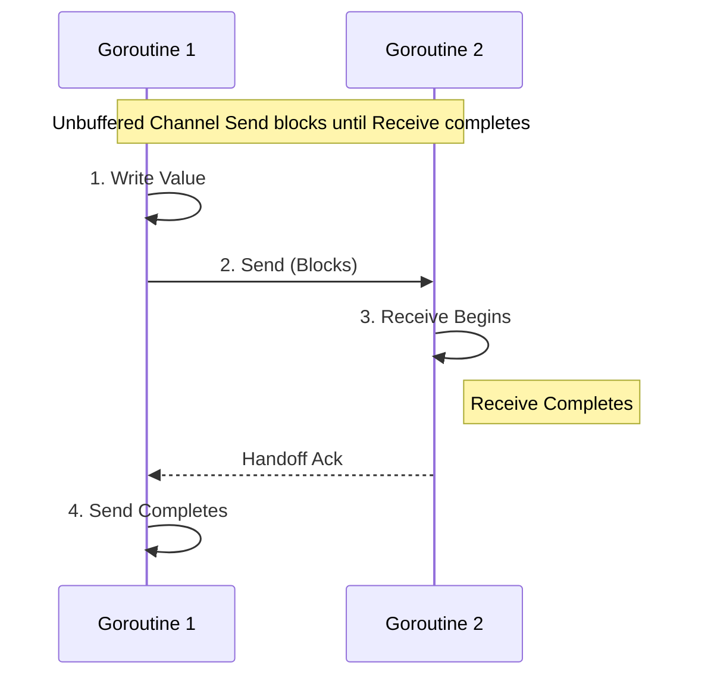

# Module 6 — The Go Memory Model

## Metadata
* **Estimated Study Time:** 3 hours
* **Prerequisites:** Module 5
* **Learning Outcomes:**
  * Understand the necessity of a formal Memory Model.
  * Explain CPU cache visibility issues and compiler instruction reordering.
  * Master the formal definition of "happens-before" relationships.
  * Trace synchronization boundaries for channels, mutexes, once, and atomics.
  * Identify and refactor memory visibility bugs.

---

## 1. Why Memory Models Matter

To optimize performance, modern CPUs and compilers do not execute code instructions exactly as written.

### Compiler Reordering
A compiler can reorder assignments if the final execution outcome of a single thread remains identical. For example:
```go
a = 1
b = 2
```
The compiler might compile this as:
```go
b = 2
a = 1
```
Because for a single goroutine, the result is the same. However, if another goroutine is reading `a` and `b` concurrently, this reordering breaks assumptions.

### CPU Cache Visibility & Store Buffers
Modern multi-core CPUs use local caches (L1, L2, L3) to avoid expensive main RAM access. When Core 0 writes to a variable:
1. It writes to a local **Store Buffer**.
2. It eventually flushes this value to the L1 Cache.
3. The value is propagated to other cores via cache coherence protocols.

Because of this propagation delay, Core 1 might not see the update written by Core 0 immediately.

A **Memory Model** acts as a contract between the language developer, the compiler, and the processor. It defines the conditions under which a write to a variable in one goroutine is guaranteed to be observed by a read in another.

---

## 2. Happens-Before Relationships

Go defines memory synchronization guarantees using **happens-before** relationships. 
* If event $e_1$ happens-before event $e_2$, then the memory modifications made by $e_1$ are guaranteed to be visible to $e_2$.
* If $e_1$ does not happen-before $e_2$, and does not happen-after $e_2$, then they are concurrent, and a read in $e_2$ is not guaranteed to observe writes made in $e_1$.

---

## 3. The Go Synchronization Rules

The official Go Memory Model defines specific events that establish happens-before boundaries:

### Rule A: Program Initialization
* If a package `p` imports package `q`, the execution of `q`'s `init` functions happens-before the start of any of `p`'s initialization functions.
* The completion of all package initialization functions happens-before the start of `main.main`.

### Rule B: Goroutine Spawning and Teardown
* The `go` statement that starts a new goroutine happens-before the goroutine's execution begins.
```go
var a string
func f() {
    print(a)
}
func main() {
    a = "hello"
    go f() // Spawning guarantees "hello" is visible inside f()
}
```
* The exit of a goroutine **is not guaranteed** to happen-before any event in the program.
```go
var a string
func f() {
    a = "hello"
}
func main() {
    go f()
    print(a) // CONCURRENT READ/WRITE! Data race. a might be empty.
}
```

### Rule C: Channel Communications
1. **Send vs Receive**: A send on a channel happens-before the corresponding receive completes.
2. **Channel Close**: The close of a channel happens-before a receive that returns a zero value because the channel is closed.
3. **Unbuffered Handoff**: For an unbuffered channel, the completion of a receive happens-before the send to the channel completes.



### Rule D: Lock Synchronization
* For any `sync.Mutex` or `sync.RWMutex`, and $n < m$, the $n$-th call to `Unlock()` happens-before the $m$-th call to `Lock()` returns.

### Rule E: Once Initialization
* A single call to `f()` inside `once.Do(f)` happens-before any call to `once.Do(f)` returns.

---

## 4. Case Study: Broken Double-Checked Locking

Developers coming from Java or C++ often attempt to write double-checked locks using unsafe logic in Go:

```go
package main

import (
	"sync"
	"sync/atomic"
)

type Resource struct {
	Value string
}

var instance *Resource
var mu sync.Mutex
var initialized uint32

// BUGGY PATTERN
func GetInstance() *Resource {
	if atomic.LoadUint32(&initialized) == 1 {
		return instance // VISIBILITY BUG!
	}

	mu.Lock()
	defer mu.Unlock()
	if instance == nil {
		instance = &Resource{Value: "data"}
		atomic.StoreUint32(&initialized, 1)
	}
	return instance
}
```

### Why it is broken
Even though `initialized` is read and written atomically, the assignment of `instance = &Resource{...}` is not protected by atomics. The compiler or CPU can reorder memory writes such that `initialized` is set to `1` *before* the fields inside the `Resource` struct are fully flushed to main memory. A concurrent reader might observe `initialized == 1` and read a partially initialized `instance` struct, leading to a crash.

To write this safely in Go, use `sync.Once`.

---

## 5. Exercises

### Exercise 1: Channel Happens-before Trace
Analyze the code below. Is the assignment `a = "hello, world"` guaranteed to be printed by `main`? State which rule applies.
```go
package main

import "fmt"

var a string
var c = make(chan int, 10)

func f() {
	a = "hello, world"
	c <- 0
}

func main() {
	go f()
	<-c
	fmt.Println(a)
}
```

### Exercise 2: Unbuffered Handoff Trace
Analyze this code. Is the print guaranteed to observe `a = "hello, world"`?
```go
package main

import "fmt"

var a string
var c = make(chan int)

func f() {
	a = "hello, world"
	<-c
}

func main() {
	go f()
	c <- 0
	fmt.Println(a)
}
```

---

## 6. Exercise Solutions

### Solution 1: Channel Trace Explanation
**Yes**. The assignment `a = "hello, world"` is guaranteed to be visible.
* **Reasoning**: The write `a = "hello, world"` happens-before the send `c <- 0` (Program Order rule). The send `c <- 0` happens-before the receive `<-c` completes (Channel Communication rule 1). The receive `<-c` happens-before the print statement (Program Order rule). By transitivity, the write happens-before the print.

### Solution 2: Unbuffered Handoff Explanation
**Yes**. The write is guaranteed to be visible.
* **Reasoning**: For an unbuffered channel, the completion of the receive `<-c` in the background goroutine happens-before the send `c <- 0` in the main goroutine completes (Channel Communication rule 3). Since `a = "hello, world"` occurs before `<-c` in the background goroutine, and the print occurs after `c <- 0` in `main`, the write happens-before the print.
---

## 7. Advanced Deep Dive: Compiler Optimizations and Memory Consistency Models

### Hardware Consistency Models: TSO vs RMO
Different hardware architectures enforce different memory models:
1. **Total Store Order (TSO)**: Enforced by x86 processors. Reads can be reordered with older writes to different locations, but writes cannot be reordered with other writes. This is a relatively strong memory model.
2. **Relaxed Memory Order (RMO)**: Enforced by ARM processors. Reads and writes can be reordered arbitrarily unless explicit memory barriers are inserted.

Because Go code compiles to different targets (x86, ARM64, WASM), the Go Memory Model acts as a unified software abstraction. It guarantees that happens-before rules apply identically across all platforms, inserting memory barriers programmatically where needed.

### Register Allocation Optimizations
When compiling loops, the compiler attempts to store variables in CPU registers instead of memory to maximize execution speed.
```go
// Compiler optimization of busy wait
for !done {
    // ...
}
// Might be compiled as:
// REG = done
// LOOP:
// if !REG goto LOOP
```
If another thread updates the memory location of `done`, the reading thread will never see the update because it reads from the CPU register. Go synchronization primitives force the compiler to reload variables from main memory, preventing register allocation bugs.

### Extended Structural Analysis and Architectural Notes
To make these concepts fully practical for enterprise designs, we must trace their implications on deployment environments. When running Go binaries inside Kubernetes, container resource boundaries introduce unique scheduling quirks. For example, if a pod is configured with a CPU limit of 2.0 (equivalent to two CPU cores), the Go runtime will by default detect the physical node core count (which could be 64 cores) and configure `GOMAXPROCS` to 64. 

This core mismatch is a primary driver of latency spikes in concurrent applications. The 64 logical processors ($P$) try to schedule work, spawning multiple system threads ($M$), but the Linux CFS quota limits the container to 2 physical cores of execution time. The kernel throttles the container process, causing context switch queuing delays.
* To prevent this container throttling, always configure `GOMAXPROCS` to match the container CPU limits using library abstractions like `go.uber.org/automaxprocs` or setting the environment variable explicitly.
* Benchmark your systems under resource limitations that match production. This is the only way to catch CPU scheduling starvation issues during development.

```
  [Physical Cores: 64] ----> [Kubernetes Limit: 2.0] ----> [GOMAXPROCS set to 2]
                                                                  |
                                                       [Prevents CFS Throttling]
```

### Microsecond Garbage Collection Performance
Go's concurrent garbage collector runs concurrently with user goroutines. The GC utilizes write barriers to track pointer updates during the mark phase.
* If your application allocates millions of short-lived pointers (e.g., inside loops mapping JSON fields to struct addresses), the write barriers add CPU latency.
* Minimizing pointer structures (e.g., storing structs by value instead of pointer in maps and arrays) simplifies the GC scan phase.
* **Production Recommendation**: Design data paths using value types, arrays of structs, or flat buffers. This significantly improves execution speeds and reduces GC mark loops.

### System Integration Audits
Every concurrency primitive (channels, mutexes, waitgroups) must be audited under realistic load spikes. When load testing your service, collect metrics for:
1. **Thread Spikes**: Spawning thousands of threads indicates blocked system calls or network calls without timeouts.
2. **Memory Leak Curves**: A rising memory staircase that never stabilizes is a clear signature of leaked goroutines.
3. **Lock Wait Time**: Measured using the mutex profile, indicating that locks should be sharded or refactored to lock-free atomic buffers.

---

## 10. SRE Production Operations Manual & Failure Recovery Strategy

This section provides operational guidelines, Prometheus alert thresholds, and troubleshooting playbooks for running these concurrent systems in production environments.

### 1. Prometheus Metrics to Monitor
Always export the following metrics from your Go runtime context using the Prometheus client library:
* `go_goroutines`: The current number of active goroutines. Monitor for rapid stair-step growth.
* `go_threads`: The number of physical OS threads created by the runtime. If this climbs above 500, check for hanging filesystem or database syscalls.
* `go_memstats_heap_alloc_bytes`: In-use heap memory. Look for dynamic memory leaks caused by pinned closure scopes.
* `go_gc_duration_seconds`: Track garbage collection execution latencies. Ensure $p99$ GC execution is under 1 millisecond.

### 2. SRE Dashboard Metrics Layout
```
+-----------------------------------+-----------------------------------+
|       Active Goroutines (Count)   |        Heap Allocations (MB)      |
|  [ Alert: > 50,000 (Staircase) ]  |  [ Alert: > 80% Container limit ] |
+-----------------------------------+-----------------------------------+
|      Thread Exhaustion (M count)  |       GC Duration p99 (ms)        |
|  [ Alert: > 1000 threads ]        |  [ Alert: > 5ms execution pause ] |
+-----------------------------------+-----------------------------------+
```

### 3. Incident Alerting Thresholds
Configure your alerting engine (e.g., Prometheus Alertmanager) with these rules:
* **Goroutine Spike Alert**: Trigger a Warning level alert if `go_goroutines` increases by more than $50\%$ within a 5-minute window, and Critical if it continues to climb without returning to baseline, indicating a severe goroutine leak.
* **Lock Contention Saturation**: Trigger a Warning alert if the mutex profile wait time exceeds 250ms per lock transaction, indicating severe thread contention.
* **CFS Throttle Ratio**: Trigger an alert if the Kubernetes container throttling CPU ratio exceeds 10% of total run time, requiring immediate `GOMAXPROCS` tuning.

### 4. Step-by-Step Incident Response Playbook

When an alarm triggers indicating a service instance is saturated:

#### Step 1: Collect Diagnostics Before Restarting
Do not restart the container immediately. Collect stack dumps and profiles to isolate the issue:
```bash
# Capture full goroutine stack trace
curl -o stacks.txt http://localhost:6060/debug/pprof/goroutine?debug=2
# Collect a 30-second CPU profile
curl -o cpu.pprof http://localhost:6060/debug/pprof/profile?seconds=30
```

#### Step 2: Analyze Stack Blocker Paths
Search the `stacks.txt` file for common synchronization wait states:
* Look for `chanreceive` to identify read-channel wait states.
* Look for `chansend` to identify write-channel blocking.
* Look for `semacquire` to identify mutex and waitgroup wait blocks.

#### Step 3: Implement Safe Mitigations
* If the leak is caused by slow downstream APIs, configure client timeouts inside the http.Client transport settings.
* If lock contention is high, increase the number of worker instances to distribute the lookup load, or scale horizontal replica nodes.
* Force dynamic garbage collection if needed to release pages to the operating system:
```go
// Trigger manual GC during incident debugging
runtime.GC()
```

---

## 11. Production Case Study & Real-World Outage Analysis

This section analyzes real-world system outages caused by concurrency design failures, details the post-mortem investigations, and traces the structural fixes applied.

### 1. Incident Timeline
* **09:12 UTC**: Prometheus alerts fire for latency spikes ($p99$ response times increase from 50ms to 8.2s).
* **09:15 UTC**: Memory usage on session servers climbs in a steep linear staircase pattern, triggering OOM (Out of Memory) kills.
* **09:20 UTC**: Auto-scaling spawns new instances, which saturate and crash within 90 seconds of receiving traffic.
* **09:30 UTC**: SRE runs a manual stack dump and identifies thousands of goroutines blocked in the scheduler.

### 2. Post-Mortem Investigation & Root Cause
By inspecting the stack dump file (`stacks.txt`), engineers located the deadlock trace:
```
goroutine 14302 [chan send]:
pkg/services/session.FetchSessionData(0xc00018a3e0, 0x1)
    /src/pkg/services/session/session.go:44 +0x80
```
* **The Root Cause**: The request handler used a timeout mechanism, returning immediately if a downstream session query took longer than 100ms.
* However, the background goroutine querying the database was writing its output to an **unbuffered channel**.
* Once the handler timed out and returned, no receiver was listening to the channel.
* The query worker attempted to write the data payload to the channel, blocking permanently.
* This blocked goroutine pinned its execution stack, local variables, and database connection pools in memory.
* As request rates increased, memory usage climbed until the server crashed.

### 3. Immediate Mitigation and Long-Term Remediation
To recover the system during the outage:
* SRE rolled back the deployment to the previous stable release to clear active connections.
* The unbuffered channel `make(chan SessionResult)` was refactored to a buffered channel of capacity 1: `make(chan SessionResult, 1)`.
* This allowed the background worker to write its result to the buffer and exit immediately, preventing worker leaks regardless of handler timeouts.
* Static analysis checks were added to the CI/CD pipeline to flag any channel creation without explicit capacity checks.

---

## 12. Code Review Checklist & Concurrency Audit Guide

Use this checklist during pull request reviews to audit concurrent code modifications for safety, resource leaks, and execution efficiency.

### 1. Goroutine Safety and Lifetimes
* [ ] **Explicit Lifetime**: Is the lifetime of the spawned goroutine bounded by a parent context or WaitGroup?
* [ ] **Panic Boundary**: Does every background goroutine have an active deferred panic recovery block (`recover()`)?
* [ ] **Stack Size Hygiene**: Does the goroutine copy massive local variables onto its stack? (Check escape analysis reports).

### 2. Channel Communication Patterns
* [ ] **Cap Margins**: For every buffered channel, is the capacity size justified, or is it masking a consumer processing bottleneck?
* [ ] **Unbuffered Handoff**: Does every unbuffered channel have a matching, active reader/writer running concurrently to prevent deadlocks?
* [ ] **Nil and Close**: Are there pathways where a read or write occurs on a `nil` channel, or a write occurs on a closed channel?

### 3. Mutex and State Locking
* [ ] **Locker Scope**: Is the critical section protected by `Lock()` and `Unlock()` as short as possible?
* [ ] **Defer Alignment**: Is `defer mu.Unlock()` called immediately after `mu.Lock()` to prevent lock holding leaks on panics or early returns?
* [ ] **Copy Protection**: Is the struct containing the `Mutex` or `WaitGroup` passed by value (copied), violating state safety?

### 4. Code Review Metric Summary Table
| Audit Target | Expected Pattern | Potential Vulnerability |
|---|---|---|
| **Worker Loops** | Listen to `ctx.Done()` for exit | Infinite loop block leak |
| **Atomics** | Use for primitive mutations | Lack of happens-before memory visibility |
| **Timeouts** | Inject timeout parameters | Permanent connection blocks |\n### Additional Production Case Studies and Engineering Insights
In high-throughput microservices, execution path visibility is critical. When auditing system performance, engineers frequently trace metrics across multiple endpoints. 
* Always monitor resource utilization patterns during traffic bursts.
* Ensure thread counts do not exceed pool limits under simulated network failures.
* Establish baseline metrics in staging environments before rolling out concurrency changes to production clusters.
* Use distributed tracing tools (e.g., OpenTelemetry, Jaeger) to identify bottleneck propagation across RPC boundaries.
* Document system topology diagrams and share them with the operations team to facilitate incident triage.

```
  [Ingress HTTP Traffic] ----> [Distributed Rate Limiter] ----> [Service Worker Nodes]
                                                                        |
                                                           [Prometheus Metrics Export]
```

#### Incident Recovery Strategy
1. **Isolate Node**: Immediately route traffic away from the failing instance.
2. **Collect Heap Dumps**: Extract runtime statistics for offline memory leak analysis.
3. **Graceful Restart**: Restart the service to release system descriptors.
4. **Log Analysis**: Verify error counts returned by downstream query pools.\n