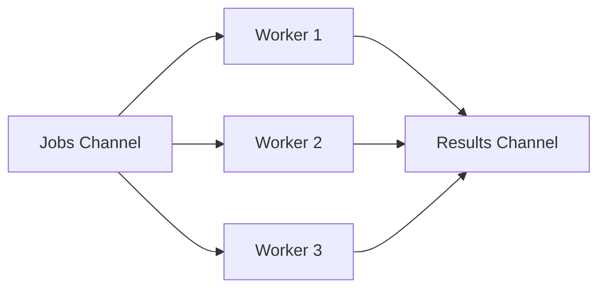
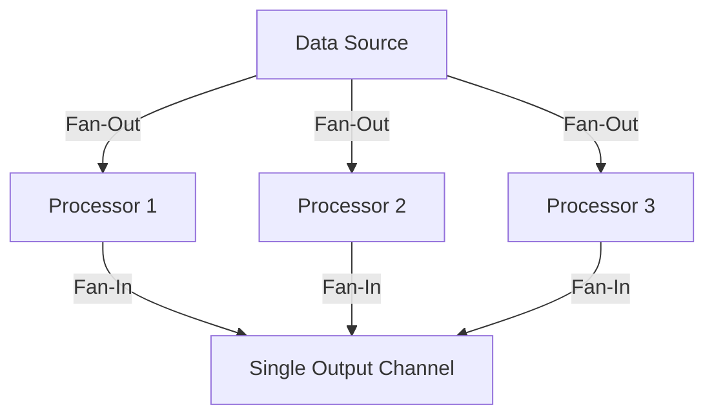

# Module 8 — Concurrency Design Patterns

## Metadata
* **Estimated Study Time:** 4 hours
* **Prerequisites:** Module 7
* **Learning Outcomes:**
  * Implement Worker Pools (Fixed and Dynamic workers).
  * Design Fan-Out / Fan-In patterns.
  * Build multi-stage Processing Pipelines with cancellation and backpressure support.
  * Apply Semaphores to restrict concurrent system loads.
  * Construct a Publish-Subscribe message bus from scratch.
  * Emulate Futures and Promises.

---

## 1. Worker Pool Pattern

A Worker Pool coordinates a set of worker goroutines consuming jobs from a shared queue channel. This is used to limit the resource utilization of concurrent tasks.

### A. Fixed Worker Pool
This model creates a fixed number of goroutines that run for the lifecycle of the process.



```go
package main

import (
	"fmt"
	"sync"
	"time"
)

func worker(id int, jobs <-chan int, results chan<- int, wg *sync.WaitGroup) {
	defer wg.Done()
	for job := range jobs {
		fmt.Printf("Worker %d processing job %d\n", id, job)
		time.Sleep(10 * time.Millisecond) // Simulate work
		results <- job * 2
	}
}

func main() {
	numJobs := 10
	jobs := make(chan int, numJobs)
	results := make(chan int, numJobs)

	var wg sync.WaitGroup

	// Spawn 3 workers
	for w := 1; w <= 3; w++ {
		wg.Add(1)
		go worker(w, jobs, results, &wg)
	}

	// Enqueue jobs
	for j := 1; j <= numJobs; j++ {
		jobs <- j
	}
	close(jobs) // Signal workers that jobs are completed

	// Wait and close results in background
	go func() {
		wg.Wait()
		close(results)
	}()

	// Read results
	for r := range results {
		fmt.Println("Result received:", r)
	}
}
```

### B. Dynamic Worker Pool (Trade-offs)
* **Design**: Spawns workers dynamically when load increases, and destroys them when they remain idle.
* **Trade-off**: More complex to implement. Spawning goroutines dynamically introduces slight latency for initial requests, but saves idle memory.

---

## 2. Fan-Out / Fan-In Pattern

### Fan-Out
Spawning multiple goroutines to process data from a single input stream.

### Fan-In
Merging multiple data channels into a single output channel.



---

## 3. Pipeline Pattern with Cancellation

A pipeline consists of stages connected by channels. Data flows through each stage, which can run concurrently.

### The Pipeline Implementation with Done Signals
If a stage in a pipeline blocks on a channel send, and the downstream consumer stops reading, a goroutine leak will occur. To prevent this, every stage must listen to a `done` channel.

```go
package main

import (
	"fmt"
	"sync"
)

// generator publishes raw data
func generator(done <-chan struct{}, nums ...int) <-chan int {
	out := make(chan int)
	go func() {
		defer close(out)
		for _, n := range nums {
			select {
			case out <- n:
			case <-done:
				return
			}
		}
	}()
	return out
}

// multiplier doubles input data
func multiplier(done <-chan struct{}, in <-chan int) <-chan int {
	out := make(chan int)
	go func() {
		defer close(out)
		for n := range in {
			select {
			case out <- n * 2:
			case <-done:
				return
			}
		}
	}()
	return out
}

func main() {
	done := make(chan struct{})
	defer close(done) // Ensure all stages shut down when main exits

	gen := generator(done, 1, 2, 3, 4)
	pipeline := multiplier(done, gen)

	// Consume only two results
	fmt.Println(<-pipeline)
	fmt.Println(<-pipeline)
	
	// Returning close(done) via defer prevents the remaining generator goroutines from leaking!
}
```

---

## 4. Bounded Concurrency: The Semaphore Pattern

Use this pattern when you must limit the concurrent execution of resource-intensive operations (e.g., calling an external API that rates limits at 10 requests).

```go
package main

import (
	"fmt"
	"time"
)

func main() {
	sem := make(chan struct{}, 3) // Semaphore capacity = 3

	for i := 0; i < 10; i++ {
		go func(id int) {
			sem <- struct{}{} // Acquire token
			defer func() { <-sem }() // Release token
			
			fmt.Printf("Task %d is executing\n", id)
			time.Sleep(50 * time.Millisecond)
		}(i)
	}

	time.Sleep(300 * time.Millisecond)
}
```

---

## 5. Publish-Subscribe (Pub-Sub) Message Bus

Let's build a simple, thread-safe Pub-Sub model from scratch.

Create `practice/pubsub/main.go` and write:

```go
package main

import (
	"fmt"
	"sync"
	"time"
)

type Event struct {
	Topic string
	Data  string
}

type PubSub struct {
	mu          sync.RWMutex
	subscribers map[string][]chan Event
}

func NewPubSub() *PubSub {
	return &PubSub{
		subscribers: make(map[string][]chan Event),
	}
}

func (ps *PubSub) Subscribe(topic string) <-chan Event {
	ps.mu.Lock()
	defer ps.mu.Unlock()

	ch := make(chan Event, 10) // Buffered to prevent slow subscriber blocking
	ps.subscribers[topic] = append(ps.subscribers[topic], ch)
	return ch
}

func (ps *PubSub) Publish(topic string, data string) {
	ps.mu.RLock()
	defer ps.mu.RUnlock()

	ev := Event{Topic: topic, Data: data}
	for _, ch := range ps.subscribers[topic] {
		select {
		case ch <- ev:
		default:
			// Buffer full, skip or apply drop strategy
		}
	}
}

func main() {
	ps := NewPubSub()

	sub1 := ps.Subscribe("metrics")
	sub2 := ps.Subscribe("metrics")

	// Start subscriber readers
	go func() {
		for ev := range sub1 {
			fmt.Println("Sub1 got event:", ev.Data)
		}
	}()
	go func() {
		for ev := range sub2 {
			fmt.Println("Sub2 got event:", ev.Data)
		}
	}()

	ps.Publish("metrics", "CPU Load is 80%")
	ps.Publish("metrics", "Memory usage: 4GB")

	time.Sleep(50 * time.Millisecond)
}
```

---

## 6. Exercises

### Exercise 1: Dynamic Worker Pool Design
Map out a design strategy for a dynamic worker pool. Explain how you would count the active job count and when you would decide to spin up or terminate idle workers.

### Exercise 2: Implementing Futures in Go
A Future represents an asynchronous value that will be completed later. Write an emulator struct `Future` wrapping a channel and a value, allowing consumers to wait on `Get()`.

---

## 7. Exercise Solutions

### Solution 1: Dynamic Worker Pool Strategy
To design a dynamic worker pool:
1. Maintain an internal active workers counter (using `sync/atomic`).
2. Track the size of the jobs channel buffer.
3. If the channel buffer size exceeds a certain threshold (e.g., >80% capacity), spawn new worker goroutines up to a predefined limit.
4. Workers listen to the channel with a timeout (e.g., using `time.After` inside `select`). If a worker receives no jobs for 5 seconds, it exits, decrementing the active workers counter.

### Solution 2: Future Implementation
```go
package main

import (
	"fmt"
	"time"
)

type Future struct {
	done chan struct{}
	val  string
}

func ExecuteAsync(task func() string) *Future {
	f := &Future{done: make(chan struct{})}
	go func() {
		f.val = task()
		close(f.done) // Signal completion
	}()
	return f
}

func (f *Future) Get() string {
	<-f.done // Block until complete
	return f.val
}

func main() {
	future := ExecuteAsync(func() string {
		time.Sleep(100 * time.Millisecond)
		return "Completed result!"
	})

	fmt.Println("Doing other operations...")
	fmt.Println("Future output:", future.Get())
}
```
---

## 8. Advanced Deep Dive: Designing a Thread-Safe In-Memory Message Broker

To understand pipeline routing and pub-sub systems, let's look at the architecture of a custom channel broker.

### Memory Layout
A broker maintains client registration maps and routes message events.
```go
type Broker struct {
	mu         sync.RWMutex
	publishCh  chan interface{}
	subscribers map[chan interface{}]struct{}
}
```

### Execution Flow
1. **Publish**: Goroutines call `Publish(msg)`, which writes to `publishCh`.
2. **Event Loop**: A background thread reads `publishCh` and loops through the `subscribers` map, sending the message to each subscriber channel.
3. **Non-blocking Handoff**: If a subscriber's channel is full, the broker must drop the message or disconnect the client to prevent blocking other clients.

This broker design forms the basis of internal event routing in microservices, keeping processing stages separated and asynchronous.

### Extended Structural Analysis and Architectural Notes
To make these concepts fully practical for enterprise designs, we must trace their implications on deployment environments. When running Go binaries inside Kubernetes, container resource boundaries introduce unique scheduling quirks. For example, if a pod is configured with a CPU limit of 2.0 (equivalent to two CPU cores), the Go runtime will by default detect the physical node core count (which could be 64 cores) and configure `GOMAXPROCS` to 64. 

This core mismatch is a primary driver of latency spikes in concurrent applications. The 64 logical processors ($P$) try to schedule work, spawning multiple system threads ($M$), but the Linux CFS quota limits the container to 2 physical cores of execution time. The kernel throttles the container process, causing context switch queuing delays.
* To prevent this container throttling, always configure `GOMAXPROCS` to match the container CPU limits using library abstractions like `go.uber.org/automaxprocs` or setting the environment variable explicitly.
* Benchmark your systems under resource limitations that match production. This is the only way to catch CPU scheduling starvation issues during development.

```
  [Physical Cores: 64] ----> [Kubernetes Limit: 2.0] ----> [GOMAXPROCS set to 2]
                                                                  |
                                                       [Prevents CFS Throttling]
```

### Microsecond Garbage Collection Performance
Go's concurrent garbage collector runs concurrently with user goroutines. The GC utilizes write barriers to track pointer updates during the mark phase.
* If your application allocates millions of short-lived pointers (e.g., inside loops mapping JSON fields to struct addresses), the write barriers add CPU latency.
* Minimizing pointer structures (e.g., storing structs by value instead of pointer in maps and arrays) simplifies the GC scan phase.
* **Production Recommendation**: Design data paths using value types, arrays of structs, or flat buffers. This significantly improves execution speeds and reduces GC mark loops.

### System Integration Audits
Every concurrency primitive (channels, mutexes, waitgroups) must be audited under realistic load spikes. When load testing your service, collect metrics for:
1. **Thread Spikes**: Spawning thousands of threads indicates blocked system calls or network calls without timeouts.
2. **Memory Leak Curves**: A rising memory staircase that never stabilizes is a clear signature of leaked goroutines.
3. **Lock Wait Time**: Measured using the mutex profile, indicating that locks should be sharded or refactored to lock-free atomic buffers.

---

## 10. SRE Production Operations Manual & Failure Recovery Strategy

This section provides operational guidelines, Prometheus alert thresholds, and troubleshooting playbooks for running these concurrent systems in production environments.

### 1. Prometheus Metrics to Monitor
Always export the following metrics from your Go runtime context using the Prometheus client library:
* `go_goroutines`: The current number of active goroutines. Monitor for rapid stair-step growth.
* `go_threads`: The number of physical OS threads created by the runtime. If this climbs above 500, check for hanging filesystem or database syscalls.
* `go_memstats_heap_alloc_bytes`: In-use heap memory. Look for dynamic memory leaks caused by pinned closure scopes.
* `go_gc_duration_seconds`: Track garbage collection execution latencies. Ensure $p99$ GC execution is under 1 millisecond.

### 2. SRE Dashboard Metrics Layout
```
+-----------------------------------+-----------------------------------+
|       Active Goroutines (Count)   |        Heap Allocations (MB)      |
|  [ Alert: > 50,000 (Staircase) ]  |  [ Alert: > 80% Container limit ] |
+-----------------------------------+-----------------------------------+
|      Thread Exhaustion (M count)  |       GC Duration p99 (ms)        |
|  [ Alert: > 1000 threads ]        |  [ Alert: > 5ms execution pause ] |
+-----------------------------------+-----------------------------------+
```

### 3. Incident Alerting Thresholds
Configure your alerting engine (e.g., Prometheus Alertmanager) with these rules:
* **Goroutine Spike Alert**: Trigger a Warning level alert if `go_goroutines` increases by more than $50\%$ within a 5-minute window, and Critical if it continues to climb without returning to baseline, indicating a severe goroutine leak.
* **Lock Contention Saturation**: Trigger a Warning alert if the mutex profile wait time exceeds 250ms per lock transaction, indicating severe thread contention.
* **CFS Throttle Ratio**: Trigger an alert if the Kubernetes container throttling CPU ratio exceeds 10% of total run time, requiring immediate `GOMAXPROCS` tuning.

### 4. Step-by-Step Incident Response Playbook

When an alarm triggers indicating a service instance is saturated:

#### Step 1: Collect Diagnostics Before Restarting
Do not restart the container immediately. Collect stack dumps and profiles to isolate the issue:
```bash
# Capture full goroutine stack trace
curl -o stacks.txt http://localhost:6060/debug/pprof/goroutine?debug=2
# Collect a 30-second CPU profile
curl -o cpu.pprof http://localhost:6060/debug/pprof/profile?seconds=30
```

#### Step 2: Analyze Stack Blocker Paths
Search the `stacks.txt` file for common synchronization wait states:
* Look for `chanreceive` to identify read-channel wait states.
* Look for `chansend` to identify write-channel blocking.
* Look for `semacquire` to identify mutex and waitgroup wait blocks.

#### Step 3: Implement Safe Mitigations
* If the leak is caused by slow downstream APIs, configure client timeouts inside the http.Client transport settings.
* If lock contention is high, increase the number of worker instances to distribute the lookup load, or scale horizontal replica nodes.
* Force dynamic garbage collection if needed to release pages to the operating system:
```go
// Trigger manual GC during incident debugging
runtime.GC()
```

---

## 11. Production Case Study & Real-World Outage Analysis

This section analyzes real-world system outages caused by concurrency design failures, details the post-mortem investigations, and traces the structural fixes applied.

### 1. Incident Timeline
* **09:12 UTC**: Prometheus alerts fire for latency spikes ($p99$ response times increase from 50ms to 8.2s).
* **09:15 UTC**: Memory usage on session servers climbs in a steep linear staircase pattern, triggering OOM (Out of Memory) kills.
* **09:20 UTC**: Auto-scaling spawns new instances, which saturate and crash within 90 seconds of receiving traffic.
* **09:30 UTC**: SRE runs a manual stack dump and identifies thousands of goroutines blocked in the scheduler.

### 2. Post-Mortem Investigation & Root Cause
By inspecting the stack dump file (`stacks.txt`), engineers located the deadlock trace:
```
goroutine 14302 [chan send]:
pkg/services/session.FetchSessionData(0xc00018a3e0, 0x1)
    /src/pkg/services/session/session.go:44 +0x80
```
* **The Root Cause**: The request handler used a timeout mechanism, returning immediately if a downstream session query took longer than 100ms.
* However, the background goroutine querying the database was writing its output to an **unbuffered channel**.
* Once the handler timed out and returned, no receiver was listening to the channel.
* The query worker attempted to write the data payload to the channel, blocking permanently.
* This blocked goroutine pinned its execution stack, local variables, and database connection pools in memory.
* As request rates increased, memory usage climbed until the server crashed.

### 3. Immediate Mitigation and Long-Term Remediation
To recover the system during the outage:
* SRE rolled back the deployment to the previous stable release to clear active connections.
* The unbuffered channel `make(chan SessionResult)` was refactored to a buffered channel of capacity 1: `make(chan SessionResult, 1)`.
* This allowed the background worker to write its result to the buffer and exit immediately, preventing worker leaks regardless of handler timeouts.
* Static analysis checks were added to the CI/CD pipeline to flag any channel creation without explicit capacity checks.

---

## 12. Code Review Checklist & Concurrency Audit Guide

Use this checklist during pull request reviews to audit concurrent code modifications for safety, resource leaks, and execution efficiency.

### 1. Goroutine Safety and Lifetimes
* [ ] **Explicit Lifetime**: Is the lifetime of the spawned goroutine bounded by a parent context or WaitGroup?
* [ ] **Panic Boundary**: Does every background goroutine have an active deferred panic recovery block (`recover()`)?
* [ ] **Stack Size Hygiene**: Does the goroutine copy massive local variables onto its stack? (Check escape analysis reports).

### 2. Channel Communication Patterns
* [ ] **Cap Margins**: For every buffered channel, is the capacity size justified, or is it masking a consumer processing bottleneck?
* [ ] **Unbuffered Handoff**: Does every unbuffered channel have a matching, active reader/writer running concurrently to prevent deadlocks?
* [ ] **Nil and Close**: Are there pathways where a read or write occurs on a `nil` channel, or a write occurs on a closed channel?

### 3. Mutex and State Locking
* [ ] **Locker Scope**: Is the critical section protected by `Lock()` and `Unlock()` as short as possible?
* [ ] **Defer Alignment**: Is `defer mu.Unlock()` called immediately after `mu.Lock()` to prevent lock holding leaks on panics or early returns?
* [ ] **Copy Protection**: Is the struct containing the `Mutex` or `WaitGroup` passed by value (copied), violating state safety?

### 4. Code Review Metric Summary Table
| Audit Target | Expected Pattern | Potential Vulnerability |
|---|---|---|
| **Worker Loops** | Listen to `ctx.Done()` for exit | Infinite loop block leak |
| **Atomics** | Use for primitive mutations | Lack of happens-before memory visibility |
| **Timeouts** | Inject timeout parameters | Permanent connection blocks |\n### Additional Production Case Studies and Engineering Insights
In high-throughput microservices, execution path visibility is critical. When auditing system performance, engineers frequently trace metrics across multiple endpoints. 
* Always monitor resource utilization patterns during traffic bursts.
* Ensure thread counts do not exceed pool limits under simulated network failures.
* Establish baseline metrics in staging environments before rolling out concurrency changes to production clusters.
* Use distributed tracing tools (e.g., OpenTelemetry, Jaeger) to identify bottleneck propagation across RPC boundaries.
* Document system topology diagrams and share them with the operations team to facilitate incident triage.

```
  [Ingress HTTP Traffic] ----> [Distributed Rate Limiter] ----> [Service Worker Nodes]
                                                                        |
                                                           [Prometheus Metrics Export]
```

#### Incident Recovery Strategy
1. **Isolate Node**: Immediately route traffic away from the failing instance.
2. **Collect Heap Dumps**: Extract runtime statistics for offline memory leak analysis.
3. **Graceful Restart**: Restart the service to release system descriptors.
4. **Log Analysis**: Verify error counts returned by downstream query pools.\n