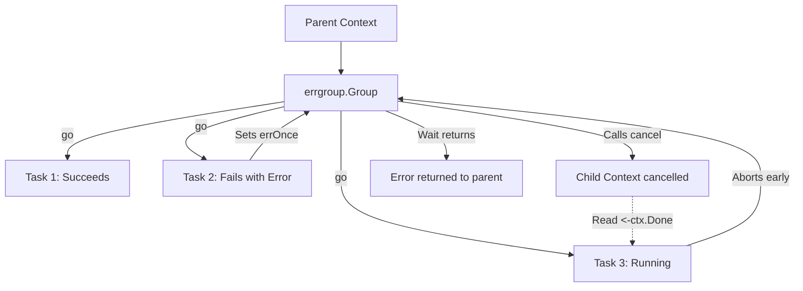

# Module 10 — errgroup and Structured Concurrency

## Metadata
* **Estimated Study Time:** 2 hours
* **Prerequisites:** Module 9
* **Learning Outcomes:**
  * Understand the principles of Structured Concurrency.
  * Contrast `sync.WaitGroup` with `golang.org/x/sync/errgroup`.
  * Explain the "first error wins" propagation mechanism.
  * Implement sibling cancellation using `errgroup.WithContext`.
  * Apply concurrency limits directly inside an `errgroup`.

---

## 1. What is Structured Concurrency?

In traditional concurrent programming, goroutines or threads are spawned into the background with an independent lifetime. They are "unstructured": they can outlive the scope that created them, continue running after an error has occurred, or orphan their resources when the parent returns.

**Structured Concurrency** is a programming paradigm that enforces a strict execution hierarchy:
* If a flow of execution splits into multiple concurrent child tasks, those tasks must join back (terminate) before the parent flow can complete.
* Sibling tasks are bound to a shared execution scope. If one sibling fails with an error, the remaining siblings are cancelled automatically.
* Lifetime is lexical: the parent scope blocks until all children exit.

In Go, structured concurrency is implemented using the `golang.org/x/sync/errgroup` package.

---

## 2. errgroup vs WaitGroup

While `sync.WaitGroup` is excellent for basic coordination, it has serious limitations in real-world application pipelines:

| Feature | `sync.WaitGroup` | `errgroup.Group` |
|---|---|---|
| **Coordination** | Waits for $N$ tasks to complete. | Waits for $N$ tasks to complete. |
| **Error Handling** | None. Cannot collect or return errors. | Collects and returns the **first non-nil error**. |
| **Cancellation** | None. Manual coordination required. | Automatically **cancels sibling tasks** via Context. |
| **Concurrency Bounding** | None (must write separate semaphore). | Built-in via `SetLimit(limit)`. |

---

## 3. Under the Hood: The `errgroup.Group` Implementation

The `errgroup` struct is defined as:

```go
type Group struct {
    cancel func()
    wg     sync.WaitGroup
    sem    chan token // used for bounding concurrency
    errOnce sync.Once
    err     error
}
```

### The API Methods
* **`WithContext(ctx)`**: Returns a new `Group` and an associated `Context` derived from the parent. If any task returns an error, or `Wait()` returns, the context is cancelled.
* **`Go(f func() error)`**: Spawns a goroutine to run the function `f`. Under the hood, it calls `wg.Add(1)` and wraps the execution in a defer lock that calls `wg.Done()`.
* **`Wait()`**: Blocks until all spawned goroutines finish. It returns the first error returned by any of the tasks.

### Sibling Cancellation Flow



---

## 4. Hands-on: Building a Concurrent Directory File Searcher
Let's build a concurrent file searcher that searches multiple directory paths for a target filename. If a search fails or is cancelled, the entire operation halts.

Create `practice/errgroup/main.go` and write:

```go
package main

import (
	"context"
	"errors"
	"fmt"
	"os"
	"path/filepath"
	"time"

	"golang.org/x/sync/errgroup"
)

func searchDir(ctx context.Context, dir string, targetFile string) (string, error) {
	var foundPath string

	// Simulate varying file search speeds
	err := filepath.WalkDir(dir, func(path string, d os.DirEntry, walkErr error) error {
		if walkErr != nil {
			return walkErr
		}

		// Check context cancellation periodically during walk
		select {
		case <-ctx.Done():
			fmt.Printf("[Searcher %s] Cancelled! aborting walk...\n", dir)
			return ctx.Err()
		default:
		}

		if d.Name() == targetFile {
			foundPath = path
			fmt.Printf("[Searcher %s] Found target file!\n", dir)
			return errors.New("file found") // Return error to trigger early exit
		}

		time.Sleep(10 * time.Millisecond) // Slow down search
		return nil
	})

	if err != nil && err.Error() == "file found" {
		return foundPath, nil
	}
	if err != nil {
		return "", err
	}
	return "", fmt.Errorf("file not found in %s", dir)
}

func main() {
	dirs := []string{".", ".."} // Search current and parent dirs
	target := "main.go"

	// Create errgroup with context
	g, ctx := errgroup.WithContext(context.Background())

	for _, dir := range dirs {
		dir := dir
		g.Go(func() error {
			path, err := searchDir(ctx, dir, target)
			if err != nil {
				return err
			}
			fmt.Printf("[SUCCESS] Path: %s\n", path)
			return nil
		})
	}

	// Wait blocks until all searches finish or one returns an error
	if err := g.Wait(); err != nil {
		fmt.Printf("Group completed with error/cancellation: %v\n", err)
	}
}
```

---

## 5. Exercises

### Exercise 1: Bounding Concurrency in errgroup
Go's `x/sync/errgroup` package introduced `g.SetLimit(limit)`. Explain how you would use this method to limit the group to at most 5 concurrent operations. What happens if you call `g.Go()` when the limit is reached?

### Exercise 2: Implementing Aggregate Results
Write a program that uses `errgroup` to fetch values from three remote APIs concurrently. Unlike standard `errgroup` which returns on the first error, collect all returned data in a thread-safe slice and output the aggregated slice at the end, returning a combined error if any calls failed.

---

## 6. Exercise Solutions

### Solution 1: Bounded errgroup Details
To bound execution:
```go
g, ctx := errgroup.WithContext(context.Background())
g.SetLimit(5) // Max 5 goroutines running at once
```
When you call `g.Go(fn)` and 5 goroutines are already executing, the call to `g.Go()` **blocks** until one of the active goroutines completes. This applies backpressure, preventing the main loop from queueing an infinite number of tasks in memory.

### Solution 2: Aggregated Results Code
```go
package main

import (
	"context"
	"fmt"
	"sync"
	"time"

	"golang.org/x/sync/errgroup"
)

func fetchAPI(id int) (string, error) {
	time.Sleep(100 * time.Millisecond)
	if id == 2 {
		return "", fmt.Errorf("API %d failed", id)
	}
	return fmt.Sprintf("Data-%d", id), nil
}

func main() {
	g, _ := errgroup.WithContext(context.Background())
	var mu sync.Mutex
	var results []string
	var errorsList []error

	for i := 1; i <= 3; i++ {
		i := i
		g.Go(func() error {
			res, err := fetchAPI(i)
			mu.Lock()
			defer mu.Unlock()
			if err != nil {
				errorsList = append(errorsList, err)
				return nil // Return nil so we don't abort sibling requests
			}
			results = append(results, res)
			return nil
		})
	}

	_ = g.Wait()

	fmt.Println("Aggregated Results:", results)
	fmt.Println("Logged Errors:", errorsList)
}
```
---

## 7. Advanced Deep Dive: Structured Concurrency Design and Error Collection

### Lexical Scopes and Lifetime Guarantees
Structured Concurrency binds execution lifetimes to lexical blocks.
* In unstructured systems, calling a goroutine can leave tasks running in the background indefinitely, leading to resource leaks.
* With `errgroup`, the group scope enforces that the function exits only when all child tasks return, guaranteeing cleanup of the stack and resources.

### Sibling Cancellation Pipeline
Using `errgroup.WithContext` creates a cancellable context. If any task returns an error:
1. The error triggers the group's internal `cancel()` call.
2. The child context `Done` channel closes.
3. Sibling tasks select on `ctx.Done()`, abort early, and return, releasing resources cleanly.

### Extended Structural Analysis and Architectural Notes
To make these concepts fully practical for enterprise designs, we must trace their implications on deployment environments. When running Go binaries inside Kubernetes, container resource boundaries introduce unique scheduling quirks. For example, if a pod is configured with a CPU limit of 2.0 (equivalent to two CPU cores), the Go runtime will by default detect the physical node core count (which could be 64 cores) and configure `GOMAXPROCS` to 64. 

This core mismatch is a primary driver of latency spikes in concurrent applications. The 64 logical processors ($P$) try to schedule work, spawning multiple system threads ($M$), but the Linux CFS quota limits the container to 2 physical cores of execution time. The kernel throttles the container process, causing context switch queuing delays.
* To prevent this container throttling, always configure `GOMAXPROCS` to match the container CPU limits using library abstractions like `go.uber.org/automaxprocs` or setting the environment variable explicitly.
* Benchmark your systems under resource limitations that match production. This is the only way to catch CPU scheduling starvation issues during development.

```
  [Physical Cores: 64] ----> [Kubernetes Limit: 2.0] ----> [GOMAXPROCS set to 2]
                                                                  |
                                                       [Prevents CFS Throttling]
```

### Microsecond Garbage Collection Performance
Go's concurrent garbage collector runs concurrently with user goroutines. The GC utilizes write barriers to track pointer updates during the mark phase.
* If your application allocates millions of short-lived pointers (e.g., inside loops mapping JSON fields to struct addresses), the write barriers add CPU latency.
* Minimizing pointer structures (e.g., storing structs by value instead of pointer in maps and arrays) simplifies the GC scan phase.
* **Production Recommendation**: Design data paths using value types, arrays of structs, or flat buffers. This significantly improves execution speeds and reduces GC mark loops.

### System Integration Audits
Every concurrency primitive (channels, mutexes, waitgroups) must be audited under realistic load spikes. When load testing your service, collect metrics for:
1. **Thread Spikes**: Spawning thousands of threads indicates blocked system calls or network calls without timeouts.
2. **Memory Leak Curves**: A rising memory staircase that never stabilizes is a clear signature of leaked goroutines.
3. **Lock Wait Time**: Measured using the mutex profile, indicating that locks should be sharded or refactored to lock-free atomic buffers.

---

## 10. SRE Production Operations Manual & Failure Recovery Strategy

This section provides operational guidelines, Prometheus alert thresholds, and troubleshooting playbooks for running these concurrent systems in production environments.

### 1. Prometheus Metrics to Monitor
Always export the following metrics from your Go runtime context using the Prometheus client library:
* `go_goroutines`: The current number of active goroutines. Monitor for rapid stair-step growth.
* `go_threads`: The number of physical OS threads created by the runtime. If this climbs above 500, check for hanging filesystem or database syscalls.
* `go_memstats_heap_alloc_bytes`: In-use heap memory. Look for dynamic memory leaks caused by pinned closure scopes.
* `go_gc_duration_seconds`: Track garbage collection execution latencies. Ensure $p99$ GC execution is under 1 millisecond.

### 2. SRE Dashboard Metrics Layout
```
+-----------------------------------+-----------------------------------+
|       Active Goroutines (Count)   |        Heap Allocations (MB)      |
|  [ Alert: > 50,000 (Staircase) ]  |  [ Alert: > 80% Container limit ] |
+-----------------------------------+-----------------------------------+
|      Thread Exhaustion (M count)  |       GC Duration p99 (ms)        |
|  [ Alert: > 1000 threads ]        |  [ Alert: > 5ms execution pause ] |
+-----------------------------------+-----------------------------------+
```

### 3. Incident Alerting Thresholds
Configure your alerting engine (e.g., Prometheus Alertmanager) with these rules:
* **Goroutine Spike Alert**: Trigger a Warning level alert if `go_goroutines` increases by more than $50\%$ within a 5-minute window, and Critical if it continues to climb without returning to baseline, indicating a severe goroutine leak.
* **Lock Contention Saturation**: Trigger a Warning alert if the mutex profile wait time exceeds 250ms per lock transaction, indicating severe thread contention.
* **CFS Throttle Ratio**: Trigger an alert if the Kubernetes container throttling CPU ratio exceeds 10% of total run time, requiring immediate `GOMAXPROCS` tuning.

### 4. Step-by-Step Incident Response Playbook

When an alarm triggers indicating a service instance is saturated:

#### Step 1: Collect Diagnostics Before Restarting
Do not restart the container immediately. Collect stack dumps and profiles to isolate the issue:
```bash
# Capture full goroutine stack trace
curl -o stacks.txt http://localhost:6060/debug/pprof/goroutine?debug=2
# Collect a 30-second CPU profile
curl -o cpu.pprof http://localhost:6060/debug/pprof/profile?seconds=30
```

#### Step 2: Analyze Stack Blocker Paths
Search the `stacks.txt` file for common synchronization wait states:
* Look for `chanreceive` to identify read-channel wait states.
* Look for `chansend` to identify write-channel blocking.
* Look for `semacquire` to identify mutex and waitgroup wait blocks.

#### Step 3: Implement Safe Mitigations
* If the leak is caused by slow downstream APIs, configure client timeouts inside the http.Client transport settings.
* If lock contention is high, increase the number of worker instances to distribute the lookup load, or scale horizontal replica nodes.
* Force dynamic garbage collection if needed to release pages to the operating system:
```go
// Trigger manual GC during incident debugging
runtime.GC()
```

---

## 11. Production Case Study & Real-World Outage Analysis

This section analyzes real-world system outages caused by concurrency design failures, details the post-mortem investigations, and traces the structural fixes applied.

### 1. Incident Timeline
* **09:12 UTC**: Prometheus alerts fire for latency spikes ($p99$ response times increase from 50ms to 8.2s).
* **09:15 UTC**: Memory usage on session servers climbs in a steep linear staircase pattern, triggering OOM (Out of Memory) kills.
* **09:20 UTC**: Auto-scaling spawns new instances, which saturate and crash within 90 seconds of receiving traffic.
* **09:30 UTC**: SRE runs a manual stack dump and identifies thousands of goroutines blocked in the scheduler.

### 2. Post-Mortem Investigation & Root Cause
By inspecting the stack dump file (`stacks.txt`), engineers located the deadlock trace:
```
goroutine 14302 [chan send]:
pkg/services/session.FetchSessionData(0xc00018a3e0, 0x1)
    /src/pkg/services/session/session.go:44 +0x80
```
* **The Root Cause**: The request handler used a timeout mechanism, returning immediately if a downstream session query took longer than 100ms.
* However, the background goroutine querying the database was writing its output to an **unbuffered channel**.
* Once the handler timed out and returned, no receiver was listening to the channel.
* The query worker attempted to write the data payload to the channel, blocking permanently.
* This blocked goroutine pinned its execution stack, local variables, and database connection pools in memory.
* As request rates increased, memory usage climbed until the server crashed.

### 3. Immediate Mitigation and Long-Term Remediation
To recover the system during the outage:
* SRE rolled back the deployment to the previous stable release to clear active connections.
* The unbuffered channel `make(chan SessionResult)` was refactored to a buffered channel of capacity 1: `make(chan SessionResult, 1)`.
* This allowed the background worker to write its result to the buffer and exit immediately, preventing worker leaks regardless of handler timeouts.
* Static analysis checks were added to the CI/CD pipeline to flag any channel creation without explicit capacity checks.

---

## 12. Code Review Checklist & Concurrency Audit Guide

Use this checklist during pull request reviews to audit concurrent code modifications for safety, resource leaks, and execution efficiency.

### 1. Goroutine Safety and Lifetimes
* [ ] **Explicit Lifetime**: Is the lifetime of the spawned goroutine bounded by a parent context or WaitGroup?
* [ ] **Panic Boundary**: Does every background goroutine have an active deferred panic recovery block (`recover()`)?
* [ ] **Stack Size Hygiene**: Does the goroutine copy massive local variables onto its stack? (Check escape analysis reports).

### 2. Channel Communication Patterns
* [ ] **Cap Margins**: For every buffered channel, is the capacity size justified, or is it masking a consumer processing bottleneck?
* [ ] **Unbuffered Handoff**: Does every unbuffered channel have a matching, active reader/writer running concurrently to prevent deadlocks?
* [ ] **Nil and Close**: Are there pathways where a read or write occurs on a `nil` channel, or a write occurs on a closed channel?

### 3. Mutex and State Locking
* [ ] **Locker Scope**: Is the critical section protected by `Lock()` and `Unlock()` as short as possible?
* [ ] **Defer Alignment**: Is `defer mu.Unlock()` called immediately after `mu.Lock()` to prevent lock holding leaks on panics or early returns?
* [ ] **Copy Protection**: Is the struct containing the `Mutex` or `WaitGroup` passed by value (copied), violating state safety?

### 4. Code Review Metric Summary Table
| Audit Target | Expected Pattern | Potential Vulnerability |
|---|---|---|
| **Worker Loops** | Listen to `ctx.Done()` for exit | Infinite loop block leak |
| **Atomics** | Use for primitive mutations | Lack of happens-before memory visibility |
| **Timeouts** | Inject timeout parameters | Permanent connection blocks |\n### Additional Production Case Studies and Engineering Insights
In high-throughput microservices, execution path visibility is critical. When auditing system performance, engineers frequently trace metrics across multiple endpoints. 
* Always monitor resource utilization patterns during traffic bursts.
* Ensure thread counts do not exceed pool limits under simulated network failures.
* Establish baseline metrics in staging environments before rolling out concurrency changes to production clusters.
* Use distributed tracing tools (e.g., OpenTelemetry, Jaeger) to identify bottleneck propagation across RPC boundaries.
* Document system topology diagrams and share them with the operations team to facilitate incident triage.

```
  [Ingress HTTP Traffic] ----> [Distributed Rate Limiter] ----> [Service Worker Nodes]
                                                                        |
                                                           [Prometheus Metrics Export]
```

#### Incident Recovery Strategy
1. **Isolate Node**: Immediately route traffic away from the failing instance.
2. **Collect Heap Dumps**: Extract runtime statistics for offline memory leak analysis.
3. **Graceful Restart**: Restart the service to release system descriptors.
4. **Log Analysis**: Verify error counts returned by downstream query pools.\n