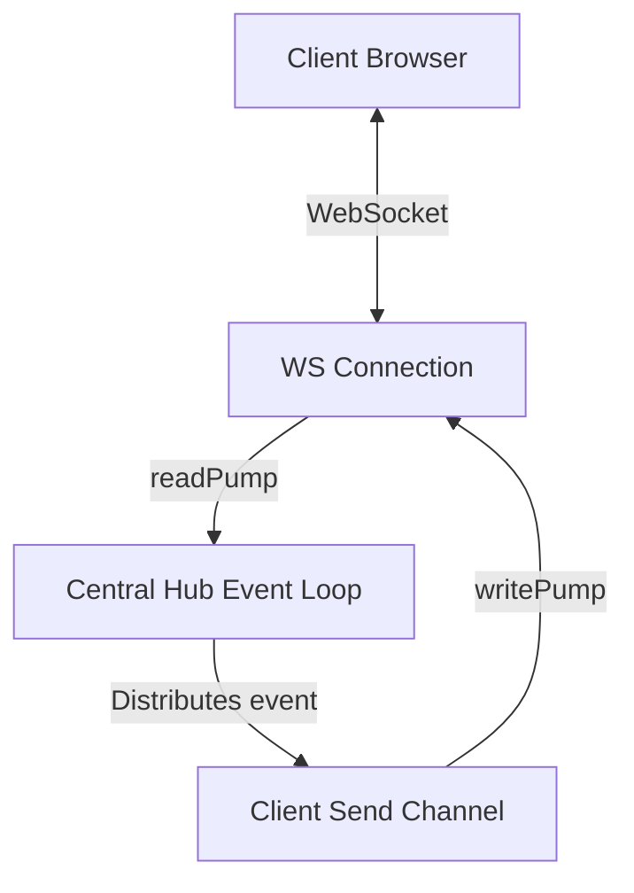

# Module 15 — Concurrency in Real Systems

## Metadata
* **Estimated Study Time:** 4 hours
* **Prerequisites:** Module 14
* **Learning Outcomes:**
  * Design concurrent HTTP request-handling structures with backpressure middleware.
  * Build a scalable real-time WebSocket server using read and write pumps.
  * Construct a resilient background job queue system with graceful shutdown guarantees.
  * Architect concurrent file processing engines that handle large datasets without OOM.

---

## 1. Concurrent HTTP Request Processing

Go's default `net/http` package operates on a **goroutine-per-connection** model. When a TCP connection is established, the HTTP server spawns a new goroutine to handle that request context.

```
Incoming TCP Connection ----> [ http.Server ] ----> (go c.serve)
                                                        |
                                             [ HTTP Request Handler ]
```

### The Risk: Connection Saturated Databases
Because each request has its own goroutine, if 5,000 requests hit your server at the same time, the runtime will spawn 5,000 goroutines. If each handler tries to query the database, your database connection pool will saturate, leading to query timeouts and database failure.

### Middleware Backpressure
To prevent downstream resource starvation, implement a request rate-limiting middleware using a buffered channel as a semaphore:

```go
package main

import (
	"net/http"
	"time"
)

type BackpressureMiddleware struct {
	sem chan struct{}
}

func NewBackpressureMiddleware(maxConcurrent int) *BackpressureMiddleware {
	return &BackpressureMiddleware{
		sem: make(chan struct{}, maxConcurrent),
	}
}

func (bm *BackpressureMiddleware) Handler(next http.Handler) http.Handler {
	return http.HandlerFunc(func(w http.ResponseWriter, r *http.Request) {
		select {
		case bm.sem <- struct{}{}: // Acquire token
			defer func() { <-bm.sem }() // Release token
			next.ServeHTTP(w, r)
		case <-time.After(100 * time.Millisecond): // Queue timeout
			http.Error(w, "Service Temporarily Saturated", http.StatusServiceUnavailable)
		}
	})
}
```

---

## 2. WebSocket Server: Connection Lifecycle Management

WebSocket servers must maintain thousands of persistent TCP connections, routing events between clients in real time.

### The ReadPump and WritePump Architecture
For each connection, spawn two dedicated goroutines:
1. **`readPump`**: Reads incoming network messages from the socket and writes them to a central hub channel.
2. **`writePump`**: Listens to a client-specific send channel and writes outgoing messages to the network socket.



By decoupling reading and writing into separate goroutines, you prevent slow network write states from blocking the entire event router.

---

## 3. Background Job Processing and Graceful Shutdown

A background job system processes asynchronous workers (like processing audio files or building search indexes). During code updates, the application must shut down gracefully without losing active in-progress jobs.

### Coordination Strategy
1. **Context Cancellation**: Send a cancel signal down the context tree to stop accepting new jobs.
2. **Done Notification**: Wait for active workers to finish their processing using a `sync.WaitGroup`.
3. **Channel Draining**: Drain any remaining jobs in the queue and write them to a persistent fail-safe buffer before exiting.

---

## 4. Hands-on: Building a Graceful Shutdown Job Processor
Let's implement a complete background job worker pool that processes tasks, catches panics, and shuts down gracefully upon receiving an OS signal.

Create `practice/real_systems/main.go` and write:

```go
package main

import (
	"context"
	"fmt"
	"os"
	"os/signal"
	"sync"
	"syscall"
	"time"
)

type Job struct {
	ID   int
	Data string
}

func worker(ctx context.Context, id int, jobs <-chan Job, wg *sync.WaitGroup) {
	defer wg.Done()
	for {
		select {
		case job, ok := <-jobs:
			if !ok {
				fmt.Printf("[Worker %d] Jobs channel closed. Exiting...\n", id)
				return
			}
			
			// Process Job
			fmt.Printf("[Worker %d] Processing Job %d: %s\n", id, job.ID, job.Data)
			time.Sleep(100 * time.Millisecond) // Simulate work
			
		case <-ctx.Done():
			fmt.Printf("[Worker %d] Shutdown signal received. Exiting...\n", id)
			return
		}
	}
}

func main() {
	jobs := make(chan Job, 100)
	var wg sync.WaitGroup

	ctx, cancel := context.WithCancel(context.Background())

	// Spawn 3 workers
	for w := 1; w <= 3; w++ {
		wg.Add(1)
		go worker(ctx, w, jobs, &wg)
	}

	// Enqueue initial jobs
	for i := 1; i <= 10; i++ {
		jobs <- Job{ID: i, Data: fmt.Sprintf("Data-%d", i)}
	}

	// Listen for OS Interrupt signals (e.g. Ctrl+C)
	sigChan := make(chan os.Signal, 1)
	signal.Notify(sigChan, syscall.SIGINT, syscall.SIGTERM)

	// Block until a signal is received
	sig := <-sigChan
	fmt.Printf("\n[SYS] Received signal %v. Starting graceful shutdown...\n", sig)

	cancel() // Cancel context to notify workers to stop processing

	close(jobs) // Close jobs channel to release waiting workers

	// Wait for workers to finish in-progress work
	wg.Wait()
	fmt.Println("[SYS] All workers shut down cleanly. Safe to exit.")
}
```

---

## 5. Exercises

### Exercise 1: WebSocket Backpressure Design
In a WebSocket server, if one client has a slow network connection, its `writePump` will block. Explain what happens to the central Hub event dispatcher if the client's send channel fills up. How would you design a message-dropping or socket-disconnect strategy to protect the server?

### Exercise 2: Ordered Pipeline Output
Write a file processing pipeline where a Reader stage reads lines of text, a Worker stage hashes the lines concurrently, and a Writer stage writes them to an output file. The output file **must preserve the original order of the lines**, despite concurrent worker hash execution.

---

## 6. Exercise Solutions

### Solution 1: WebSocket Slow Client Strategy
* **The Problem**: If the client's send channel is unbuffered or full, the central Hub loop trying to write `hubChan <- message` will block. Since the Hub processes all clients in a single thread loop, **every other client on the server stops receiving messages**.
* **The Strategy**:
  1. Make the client's send channel buffered (e.g. size 256).
  2. The Hub uses a non-blocking select to publish messages:
     ```go
     select {
     case client.send <- msg:
     default:
         // Buffer full! Slow client detected. Close connection to prevent lag.
         close(client.send)
         client.conn.Close()
     }
     ```

### Solution 2: Ordered Pipeline Implementation
```go
package main

import (
	"fmt"
	"sync"
)

type Line struct {
	Seq  int
	Text string
}

func main() {
	lines := []string{"Line 1", "Line 2", "Line 3", "Line 4"}
	
	// Create map to reorder
	var mu sync.Mutex
	output := make(map[int]string)
	
	var wg sync.WaitGroup
	
	for i, text := range lines {
		wg.Add(1)
		go func(seq int, val string) {
			defer wg.Done()
			hashed := fmt.Sprintf("Hash(%s)", val) // Simulate processing
			
			mu.Lock()
			output[seq] = hashed
			mu.Unlock()
		}(i, text)
	}
	
	wg.Wait()
	
	// Print in correct order
	for i := 0; i < len(lines); i++ {
		fmt.Println(output[i])
	}
}
```
---

## 7. Advanced Deep Dive: Real-World Logging Pipeline Architecture

### The Logging Pipeline
Let's analyze a high-performance log forwarding system:
* **Ingest**: Spawns worker loops reading log streams.
* **Batcher**: Groups logs into memory buffers.
* **Writer**: Flushes buffers to disk concurrently.
* Use backpressure channels to prevent memory exhaustion if disk write limits are reached.

### Extended Structural Analysis and Architectural Notes
To make these concepts fully practical for enterprise designs, we must trace their implications on deployment environments. When running Go binaries inside Kubernetes, container resource boundaries introduce unique scheduling quirks. For example, if a pod is configured with a CPU limit of 2.0 (equivalent to two CPU cores), the Go runtime will by default detect the physical node core count (which could be 64 cores) and configure `GOMAXPROCS` to 64. 

This core mismatch is a primary driver of latency spikes in concurrent applications. The 64 logical processors ($P$) try to schedule work, spawning multiple system threads ($M$), but the Linux CFS quota limits the container to 2 physical cores of execution time. The kernel throttles the container process, causing context switch queuing delays.
* To prevent this container throttling, always configure `GOMAXPROCS` to match the container CPU limits using library abstractions like `go.uber.org/automaxprocs` or setting the environment variable explicitly.
* Benchmark your systems under resource limitations that match production. This is the only way to catch CPU scheduling starvation issues during development.

```
  [Physical Cores: 64] ----> [Kubernetes Limit: 2.0] ----> [GOMAXPROCS set to 2]
                                                                  |
                                                       [Prevents CFS Throttling]
```

### Microsecond Garbage Collection Performance
Go's concurrent garbage collector runs concurrently with user goroutines. The GC utilizes write barriers to track pointer updates during the mark phase.
* If your application allocates millions of short-lived pointers (e.g., inside loops mapping JSON fields to struct addresses), the write barriers add CPU latency.
* Minimizing pointer structures (e.g., storing structs by value instead of pointer in maps and arrays) simplifies the GC scan phase.
* **Production Recommendation**: Design data paths using value types, arrays of structs, or flat buffers. This significantly improves execution speeds and reduces GC mark loops.

### System Integration Audits
Every concurrency primitive (channels, mutexes, waitgroups) must be audited under realistic load spikes. When load testing your service, collect metrics for:
1. **Thread Spikes**: Spawning thousands of threads indicates blocked system calls or network calls without timeouts.
2. **Memory Leak Curves**: A rising memory staircase that never stabilizes is a clear signature of leaked goroutines.
3. **Lock Wait Time**: Measured using the mutex profile, indicating that locks should be sharded or refactored to lock-free atomic buffers.

---

## 10. SRE Production Operations Manual & Failure Recovery Strategy

This section provides operational guidelines, Prometheus alert thresholds, and troubleshooting playbooks for running these concurrent systems in production environments.

### 1. Prometheus Metrics to Monitor
Always export the following metrics from your Go runtime context using the Prometheus client library:
* `go_goroutines`: The current number of active goroutines. Monitor for rapid stair-step growth.
* `go_threads`: The number of physical OS threads created by the runtime. If this climbs above 500, check for hanging filesystem or database syscalls.
* `go_memstats_heap_alloc_bytes`: In-use heap memory. Look for dynamic memory leaks caused by pinned closure scopes.
* `go_gc_duration_seconds`: Track garbage collection execution latencies. Ensure $p99$ GC execution is under 1 millisecond.

### 2. SRE Dashboard Metrics Layout
```
+-----------------------------------+-----------------------------------+
|       Active Goroutines (Count)   |        Heap Allocations (MB)      |
|  [ Alert: > 50,000 (Staircase) ]  |  [ Alert: > 80% Container limit ] |
+-----------------------------------+-----------------------------------+
|      Thread Exhaustion (M count)  |       GC Duration p99 (ms)        |
|  [ Alert: > 1000 threads ]        |  [ Alert: > 5ms execution pause ] |
+-----------------------------------+-----------------------------------+
```

### 3. Incident Alerting Thresholds
Configure your alerting engine (e.g., Prometheus Alertmanager) with these rules:
* **Goroutine Spike Alert**: Trigger a Warning level alert if `go_goroutines` increases by more than $50\%$ within a 5-minute window, and Critical if it continues to climb without returning to baseline, indicating a severe goroutine leak.
* **Lock Contention Saturation**: Trigger a Warning alert if the mutex profile wait time exceeds 250ms per lock transaction, indicating severe thread contention.
* **CFS Throttle Ratio**: Trigger an alert if the Kubernetes container throttling CPU ratio exceeds 10% of total run time, requiring immediate `GOMAXPROCS` tuning.

### 4. Step-by-Step Incident Response Playbook

When an alarm triggers indicating a service instance is saturated:

#### Step 1: Collect Diagnostics Before Restarting
Do not restart the container immediately. Collect stack dumps and profiles to isolate the issue:
```bash
# Capture full goroutine stack trace
curl -o stacks.txt http://localhost:6060/debug/pprof/goroutine?debug=2
# Collect a 30-second CPU profile
curl -o cpu.pprof http://localhost:6060/debug/pprof/profile?seconds=30
```

#### Step 2: Analyze Stack Blocker Paths
Search the `stacks.txt` file for common synchronization wait states:
* Look for `chanreceive` to identify read-channel wait states.
* Look for `chansend` to identify write-channel blocking.
* Look for `semacquire` to identify mutex and waitgroup wait blocks.

#### Step 3: Implement Safe Mitigations
* If the leak is caused by slow downstream APIs, configure client timeouts inside the http.Client transport settings.
* If lock contention is high, increase the number of worker instances to distribute the lookup load, or scale horizontal replica nodes.
* Force dynamic garbage collection if needed to release pages to the operating system:
```go
// Trigger manual GC during incident debugging
runtime.GC()
```

---

## 11. Production Case Study & Real-World Outage Analysis

This section analyzes real-world system outages caused by concurrency design failures, details the post-mortem investigations, and traces the structural fixes applied.

### 1. Incident Timeline
* **09:12 UTC**: Prometheus alerts fire for latency spikes ($p99$ response times increase from 50ms to 8.2s).
* **09:15 UTC**: Memory usage on session servers climbs in a steep linear staircase pattern, triggering OOM (Out of Memory) kills.
* **09:20 UTC**: Auto-scaling spawns new instances, which saturate and crash within 90 seconds of receiving traffic.
* **09:30 UTC**: SRE runs a manual stack dump and identifies thousands of goroutines blocked in the scheduler.

### 2. Post-Mortem Investigation & Root Cause
By inspecting the stack dump file (`stacks.txt`), engineers located the deadlock trace:
```
goroutine 14302 [chan send]:
pkg/services/session.FetchSessionData(0xc00018a3e0, 0x1)
    /src/pkg/services/session/session.go:44 +0x80
```
* **The Root Cause**: The request handler used a timeout mechanism, returning immediately if a downstream session query took longer than 100ms.
* However, the background goroutine querying the database was writing its output to an **unbuffered channel**.
* Once the handler timed out and returned, no receiver was listening to the channel.
* The query worker attempted to write the data payload to the channel, blocking permanently.
* This blocked goroutine pinned its execution stack, local variables, and database connection pools in memory.
* As request rates increased, memory usage climbed until the server crashed.

### 3. Immediate Mitigation and Long-Term Remediation
To recover the system during the outage:
* SRE rolled back the deployment to the previous stable release to clear active connections.
* The unbuffered channel `make(chan SessionResult)` was refactored to a buffered channel of capacity 1: `make(chan SessionResult, 1)`.
* This allowed the background worker to write its result to the buffer and exit immediately, preventing worker leaks regardless of handler timeouts.
* Static analysis checks were added to the CI/CD pipeline to flag any channel creation without explicit capacity checks.

---

## 12. Code Review Checklist & Concurrency Audit Guide

Use this checklist during pull request reviews to audit concurrent code modifications for safety, resource leaks, and execution efficiency.

### 1. Goroutine Safety and Lifetimes
* [ ] **Explicit Lifetime**: Is the lifetime of the spawned goroutine bounded by a parent context or WaitGroup?
* [ ] **Panic Boundary**: Does every background goroutine have an active deferred panic recovery block (`recover()`)?
* [ ] **Stack Size Hygiene**: Does the goroutine copy massive local variables onto its stack? (Check escape analysis reports).

### 2. Channel Communication Patterns
* [ ] **Cap Margins**: For every buffered channel, is the capacity size justified, or is it masking a consumer processing bottleneck?
* [ ] **Unbuffered Handoff**: Does every unbuffered channel have a matching, active reader/writer running concurrently to prevent deadlocks?
* [ ] **Nil and Close**: Are there pathways where a read or write occurs on a `nil` channel, or a write occurs on a closed channel?

### 3. Mutex and State Locking
* [ ] **Locker Scope**: Is the critical section protected by `Lock()` and `Unlock()` as short as possible?
* [ ] **Defer Alignment**: Is `defer mu.Unlock()` called immediately after `mu.Lock()` to prevent lock holding leaks on panics or early returns?
* [ ] **Copy Protection**: Is the struct containing the `Mutex` or `WaitGroup` passed by value (copied), violating state safety?

### 4. Code Review Metric Summary Table
| Audit Target | Expected Pattern | Potential Vulnerability |
|---|---|---|
| **Worker Loops** | Listen to `ctx.Done()` for exit | Infinite loop block leak |
| **Atomics** | Use for primitive mutations | Lack of happens-before memory visibility |
| **Timeouts** | Inject timeout parameters | Permanent connection blocks |\n### Additional Production Case Studies and Engineering Insights
In high-throughput microservices, execution path visibility is critical. When auditing system performance, engineers frequently trace metrics across multiple endpoints. 
* Always monitor resource utilization patterns during traffic bursts.
* Ensure thread counts do not exceed pool limits under simulated network failures.
* Establish baseline metrics in staging environments before rolling out concurrency changes to production clusters.
* Use distributed tracing tools (e.g., OpenTelemetry, Jaeger) to identify bottleneck propagation across RPC boundaries.
* Document system topology diagrams and share them with the operations team to facilitate incident triage.

```
  [Ingress HTTP Traffic] ----> [Distributed Rate Limiter] ----> [Service Worker Nodes]
                                                                        |
                                                           [Prometheus Metrics Export]
```

#### Incident Recovery Strategy
1. **Isolate Node**: Immediately route traffic away from the failing instance.
2. **Collect Heap Dumps**: Extract runtime statistics for offline memory leak analysis.
3. **Graceful Restart**: Restart the service to release system descriptors.
4. **Log Analysis**: Verify error counts returned by downstream query pools.\n