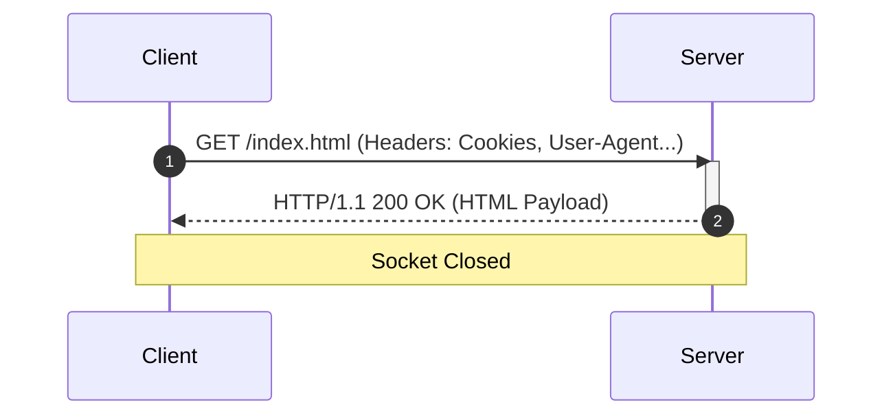
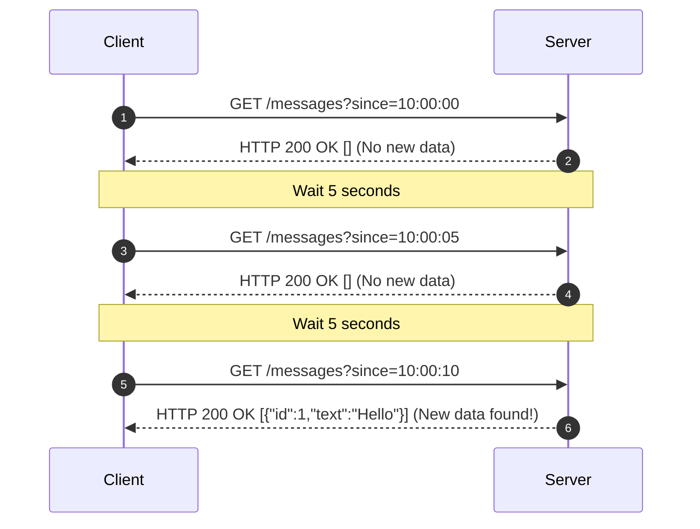
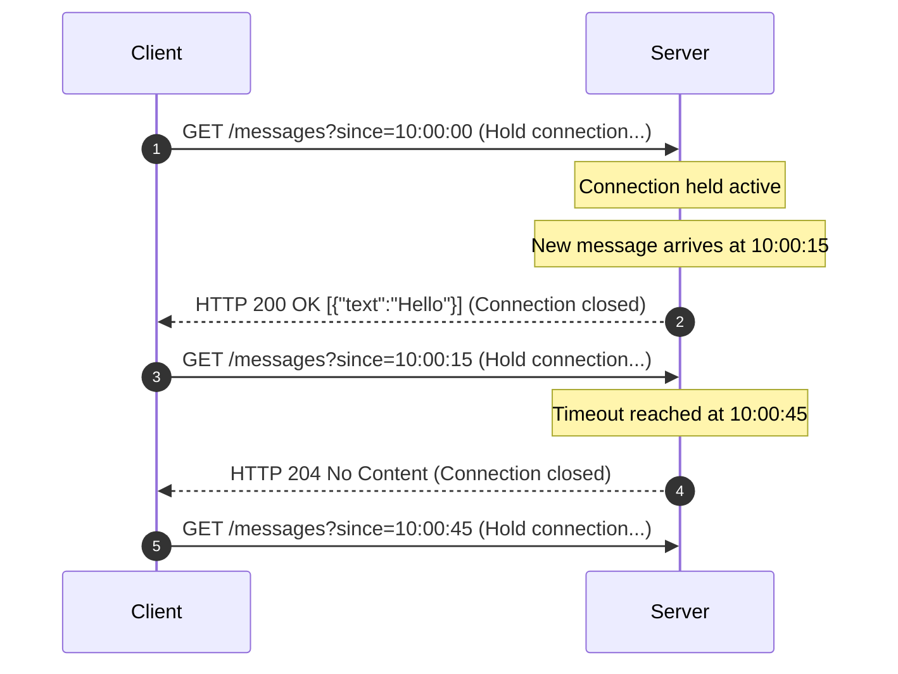
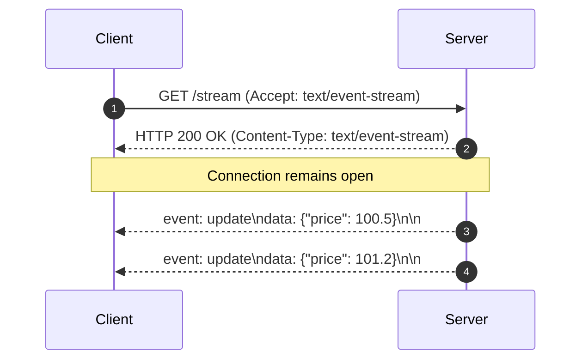
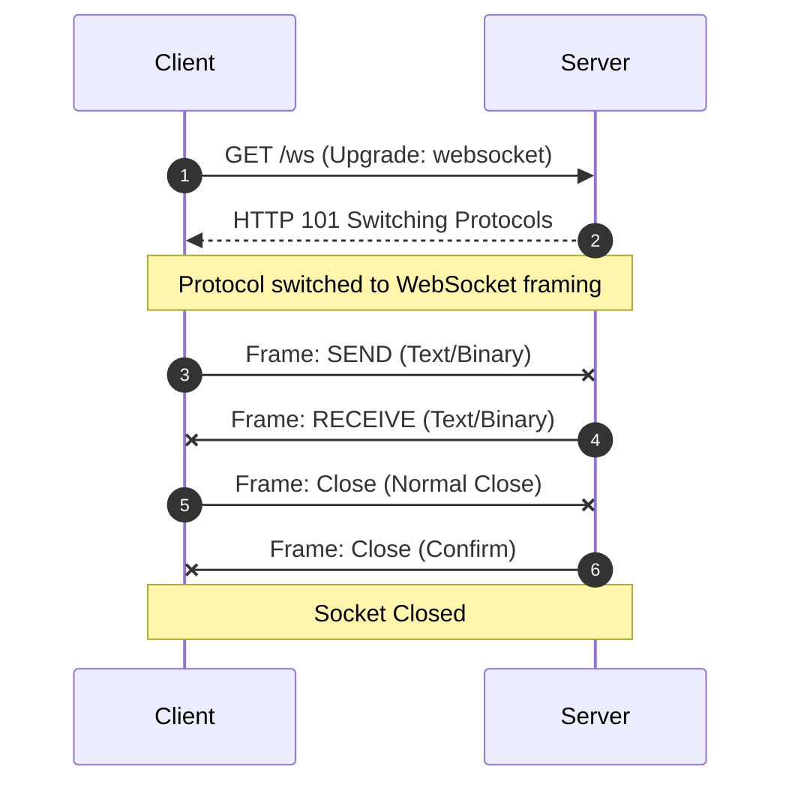
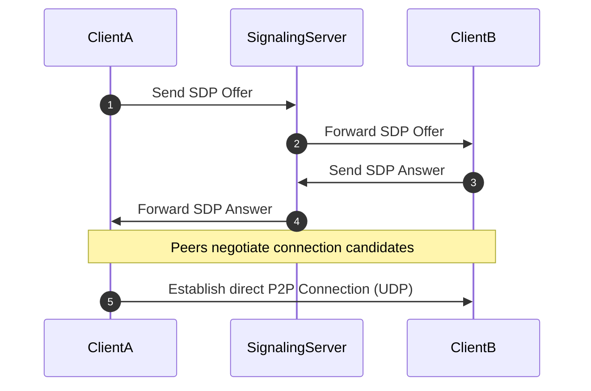

# Module 0: Introduction to Real-Time Communication

The classic World Wide Web was built as a document-sharing repository. When a browser requested a page, the server returned HTML text, and the connection was immediately closed. This stateless, client-initiated request-response architecture is perfect for static blogs, news sites, and simple e-commerce portals.

However, modern web applications—such as collaborative document editors, live stock broker portals, team messaging hubs, and multiplayer games—require instant, two-way data streaming. If a stock price drops or a colleague sends a chat, the server must push that update to the client instantly.

This introductory module explores the evolution of real-time web communication. We will trace the transition from stateless request-response to stateful event-driven models, examine the mechanics of short polling, long polling, Server-Sent Events (SSE), WebSockets, and WebRTC, and analyze the trade-offs of each transport technology.

---

## Learning Objectives
By the end of this module, you will be able to:
1. **Explain the limitations of the HTTP request-response cycle** when applied to real-time systems.
2. **Contrast the mechanics of Short Polling and Long Polling**, detailing their respective resource footprints.
3. **Analyze the Server-Sent Events (SSE) protocol** and detail its unidirectional framing format.
4. **Explain how the WebSocket protocol** upgrades an HTTP connection to a persistent, bidirectional, full-duplex TCP channel.
5. **Describe the signaling and NAT traversal steps** required to establish a peer-to-peer WebRTC connection.
6. **Formulate a technology selection strategy** to match application requirements (latency, directionality, complexity) to the correct transport protocol.

---

## 1. Evolution of Real-Time Communication

To appreciate why WebSockets exist, we must understand the historical hacks developers used to force real-time capabilities out of standard HTTP.

### The Standard HTTP Request-Response Cycle
In standard HTTP/1.1:
- **Client-Initiated**: The browser must open the socket and send a request. The server **cannot** push data to the client unsolicited.
- **Unidirectional**: Communication flows in one direction at a time. The client requests, then the server responds.
- **Stateless**: The server does not maintain an active connection context for the client after the response is completed.
- **Header Overhead**: Every request automatically includes cookie values, user-agent strings, and caching headers. A request that carries a 10-byte payload often includes 800 bytes of HTTP headers, consuming excessive network bandwidth.



---

## 2. Request-Response vs. Event-Driven Communication

Before diving into transport protocols, let us compare the two primary communication paradigms:

### Pull-Based Request-Response (Stateless)
- **Concept**: The client periodically requests the server for updates. The server responds with the latest state.
- **Direction**: Always client-initiated.
- **State**: Server does not track connection state, making horizontal scaling behind round-robin load balancers straightforward.
- **Sizing**: High database read load under high client counts, as most requests return empty data.

### Push-Based Event-Driven (Stateful)
- **Concept**: The client establishes a persistent connection. The server pushes updates to the client as soon as they occur.
- **Direction**: Server-initiated (after initial client setup).
- **State**: Stateful. The server must keep TCP socket connections active in memory, requiring sticky sessions or a shared pub/sub message bus (e.g. Redis) to route events across servers.
- **Sizing**: Low database load. Sockets idle in memory, consuming file descriptors and TCP buffers, but do not execute active database read queries until an event occurs.

---

## 3. The Math of HTTP Header Overhead

In real-time systems, transmitting tiny payloads (like a chat message or a coordinate update) occurs frequently. Let us look at the raw bytes transmitted over the network for standard HTTP requests versus WebSocket frames.

### Anatomy of a Standard HTTP Request Header Block
Suppose a client sends a 5-byte JSON message `{"a":1}` to the server. The browser automatically appends the standard HTTP/1.1 request headers:

```http
POST /api/updates HTTP/1.1
Host: api.example.com
User-Agent: Mozilla/5.0 (Windows NT 10.0; Win64; x64) AppleWebKit/537.36 (KHTML, like Gecko) Chrome/120.0.0.0 Safari/537.36
Accept: application/json, text/plain, */*
Accept-Language: en-US,en;q=0.9
Content-Type: application/json
Content-Length: 9
Connection: keep-alive
Origin: https://app.example.com
Referer: https://app.example.com/dashboard
Cookie: session_token=abc123xyz456_secure_cookie_id_value_longer_for_auth_verification; preferences_theme=dark
Cache-Control: no-cache
Pragma: no-cache

{"a":1}
```

* **Headers Size**: $\approx 640$ bytes.
* **Payload Size**: 9 bytes.
* **Total Bytes Sent**: 649 bytes.
* **Overhead Ratio**: $98.6\%$ of the transmitted bytes are metadata headers, not actual application data.

### Anatomy of a WebSocket Frame Header
When the protocol upgrades to WebSockets, standard HTTP headers are eliminated. The same 9-byte payload `{"a":1}` is wrapped inside a binary WebSocket frame.
- For client-to-server frames, the protocol requires a 4-byte masking key.
- **Header Bytes**:
  - Byte 1: `FIN` and `Opcode` (1 byte)
  - Byte 2: `MASK` and `Payload Length` (1 byte)
  - Bytes 3–6: `Masking Key` (4 bytes)
- **Total Overhead**: **6 bytes**.
- **Total Bytes Sent**: 15 bytes (6 bytes header + 9 bytes payload).
- **Bandwidth Savings**: A single WebSocket frame saves **634 bytes** compared to the HTTP request. If 10,000 clients send 1 message per second, WebSockets save:
  $$\text{Bandwidth Saved} = 10,000 \times 634 \text{ bytes/s} = 6,340,000 \text{ bytes/s} \approx 6.34 \text{ MB/s}$$
  Over a single day, this reduces bandwidth consumption by **547 GB**.

---

## 4. Short Polling

Short Polling is a pull-based emulation of real-time communication.



### Technical Implementation

#### Client JavaScript Loop:
```javascript
// Poll the server every 5 seconds for new messages
const pollInterval = 5000;
let lastSeenTimestamp = new Date().toISOString();

function pollServer() {
    fetch(`/api/messages?since=${encodeURIComponent(lastSeenTimestamp)}`)
        .then(response => response.json())
        .then(messages => {
            if (messages && messages.length > 0) {
                // Update timestamp to the latest message received
                lastSeenTimestamp = messages[messages.length - 1].timestamp;
                renderMessages(messages);
            }
        })
        .catch(err => System.err.println("Polling error:", err))
        .finally(() => {
            // Trigger next poll request
            setTimeout(pollServer, pollInterval);
        });
}

// Start polling loop
setTimeout(pollServer, pollInterval);
```

#### Go (Gin) Handler:
```go
package main

import (
	"net/http"
	"time"
	"github.com/gin-gonic/gin"
)

type Message struct {
	ID        int64     `json:"id"`
	Text      string    `json:"text"`
	Timestamp time.Time `json:"timestamp"`
}

func handleGetMessages(c *gin.Context) {
	sinceStr := c.Query("since")
	sinceTime, err := time.Parse(time.RFC3339, sinceStr)
	if err != nil {
		c.JSON(http.StatusBadRequest, gin.H{"error": "Invalid date format"})
		return
	}

	// Query database or cache for new messages since 'sinceTime'
	newMessages := queryNewMessages(sinceTime)
	
	if len(newMessages) == 0 {
		// Return 204 No Content or empty list to indicate no changes
		c.JSON(http.StatusOK, []Message{})
		return
	}

	c.JSON(http.StatusOK, newMessages)
}
```

### Advantages:
- **Simple to Implement**: Requires only basic REST controllers and standard client-side fetch loops.
- **Proxy Friendly**: Works over all standard corporate proxies, firewalls, and load balancers because each request is standard HTTP.
- **Stateless**: Server nodes do not keep persistent connections open, allowing easy horizontal scaling.

### Disadvantages:
- **High Latency**: If new data arrives at the server at 10:00:01, but the client's next poll is not scheduled until 10:00:05, the data is delayed on the server for 4 seconds.
- **Bandwidth Waste**: If 10,000 active users poll every 5 seconds, the server processes 2,000 requests per second. If 99% of those polls return no new data, the server wastes massive CPU and network bandwidth transmitting HTTP headers for empty responses.
- **Database/Cache Saturation**: Each poll triggers a query to the database or cache. This can quickly exhaust database connection pools under moderate client traffic.

---

## 5. Long Polling

Long Polling (sometimes called Comet) was developed to resolve the latency issues of short polling.



### Technical Implementation

#### Client JavaScript Loop:
```javascript
let lastSeenTimestamp = new Date().toISOString();

function longPoll() {
    fetch(`/api/messages/long?since=${encodeURIComponent(lastSeenTimestamp)}`)
        .then(response => {
            if (response.status === 204) {
                // Connection timed out with no data. Reconnect immediately.
                return [];
            }
            return response.json();
        })
        .then(messages => {
            if (messages && messages.length > 0) {
                lastSeenTimestamp = messages[messages.length - 1].timestamp;
                renderMessages(messages);
            }
            // Trigger next long poll request immediately
            longPoll();
        })
        .catch(err => {
            console.error("Long poll error. Retrying in 5s...", err);
            // Introduce a short delay on error to prevent spinning loops
            setTimeout(longPoll, 5000);
        });
}

// Start loop
longPoll();
```

#### Go (Gin) Long-Polling Handler:
```go
package main

import (
	"context"
	"net/http"
	"time"
	"github.com/gin-gonic/gin"
)

// Global hub channel transmitting new message events
var messageEventChannel = make(chan Message, 100)

func handleLongPoll(c *gin.Context) {
	sinceStr := c.Query("since")
	sinceTime, _ := time.Parse(time.RFC3339, sinceStr)

	// 1. Immediate check: does data already exist?
	newMessages := queryNewMessages(sinceTime)
	if len(newMessages) > 0 {
		c.JSON(http.StatusOK, newMessages)
		return
	}

	// 2. Suspend request: wait for new message or timeout
	// We create a context that expires after 30 seconds
	ctx, cancel := context.WithTimeout(c.Request.Context(), 30*time.Second)
	defer cancel()

	// Internal channel matching client subscription
	clientChan := make(chan Message, 1)
	
	// Register this client subscription to the global channel mapping (simplistic logic)
	registerClient(clientChan)
	defer deregisterClient(clientChan)

	select {
	case msg := <-clientChan:
		// Return the new message immediately, closing the HTTP connection
		c.JSON(http.StatusOK, []Message{msg})
		
	case <-ctx.Done():
		if ctx.Err() == context.DeadlineExceeded {
			// Return 204 No Content to notify client timeout reached
			c.Status(http.StatusNoContent)
		} else {
			// Client disconnected prematurely (context cancelled)
			c.Status(http.StatusClientClosedRequest)
		}
	}
}
```

### Advantages:
- **Low Latency**: When data arrives on the server, it is pushed to the client immediately, resolving the polling delay of short polling.
- **Proxy Friendly**: Reuses standard HTTP ports (80/443), bypassing firewall blockages.

### Disadvantages:
- **Thread Pools Starvation**: In traditional thread-per-request web servers (like classic Java Tomcat or Apache), holding a request open blocks a worker thread. If 1,000 users connect, the server must allocate 1,000 threads. This exhausts thread limits and crashes the server. Go resolves this partially using lightweight goroutines, but network descriptors are still consumed.
- **Header Overhead**: Although connections are held open longer, every new update closes the request, requiring the client to send a new HTTP request with header overhead.
- **Message Race Conditions**: If a message arrives during the brief millisecond gap when the client has received a response but has not yet opened its next request, the message must be buffered on the server, requiring complex queue management.

---

## 6. Server-Sent Events (SSE)

Server-Sent Events (SSE) is a standardized, unidirectional real-time protocol built on top of persistent HTTP connections.



### Technical Implementation

#### Client Browser JavaScript:
```javascript
// Connect to the Server-Sent Events endpoint
const eventSource = new EventSource("/api/price-stream");

// Listen for default message events
eventSource.onmessage = function(event) {
    const data = JSON.parse(event.data);
    updatePriceUI(data);
};

// Listen for custom named events
eventSource.addEventListener("priceAlert", function(event) {
    const alert = JSON.parse(event.data);
    showNotification(alert.message);
});

eventSource.onerror = function(err) {
    console.error("SSE connection dropped. Browser will automatically reconnect.", err);
};
```

#### Go (Gin) SSE Stream Handler:
```go
package main

import (
	"io"
	"net/http"
	"time"
	"github.com/gin-gonic/gin"
)

func handlePriceStream(c *gin.Context) {
	c.Writer.Header().Set("Content-Type", "text/event-stream")
	c.Writer.Header().Set("Cache-Control", "no-cache")
	c.Writer.Header().Set("Connection", "keep-alive")
	c.Writer.Header().Set("Transfer-Encoding", "chunked")

	// Flush headers to client immediately to establish stream
	c.Writer.Flush()

	// Create channel monitoring updates
	priceChan := make(chan float64, 10)
	registerPriceListener(priceChan)
	defer deregisterPriceListener(priceChan)

	// Stream updates loop
	c.Stream(func(w io.Writer) bool {
		select {
		case price, ok := <-priceChan:
			if !ok {
				return false // Channel closed, terminate stream
			}
			// Write SSE frame syntax block: "event: [name]\ndata: [value]\n\n"
			c.SSEvent("priceUpdate", map[string]interface{}{
				"price":     price,
				"timestamp": time.Now().Format(time.RFC3339),
			})
			return true // Continue streaming
			
		case <-c.Request.Context().Done():
			// Client disconnected, clean up
			return false
		}
	})
}
```

### Advantages:
- **Native Reconnection**: Browser client libraries automatically attempt to reconnect if the stream is lost, sending a `Last-Event-ID` header so the server can replay missed messages.
- **Low Overhead**: Built on top of HTTP, requiring no custom protocol framing layers or handshakes.
- **HTTP/2 Multiplexing Friendly**: When run over HTTP/2, SSE streams are multiplexed over a single TCP connection, avoiding browser concurrent connection limits.

### Disadvantages:
- **Unidirectional**: Senders can only transmit data **from server to client**. If the client wants to send data back, it must open separate HTTP POST requests.
- **Browser Socket Limits (HTTP/1.1)**: If run over HTTP/1.1, browsers limit connections to the same domain to 6 active sockets. If a user opens 6 tabs, they can exhaust the browser's socket pool, blocking all standard page loads.

---

## 7. WebSocket

The WebSocket protocol (RFC 6455) upgrades a standard HTTP request to a persistent, bidirectional, full-duplex TCP channel.



### Under the Hood: The HTTP Upgrade Handshake

Before switching to the binary framing layer, the browser negotiates the switch using HTTP GET upgrade headers.

#### The Client Request:
```http
GET /chat HTTP/1.1
Host: server.example.com
Upgrade: websocket
Connection: Upgrade
Sec-WebSocket-Key: dGhlIHNhbXBsZSBub25jZQ==
Sec-WebSocket-Version: 13
Origin: http://example.com
```

- **`Upgrade: websocket`**: Notifies the server that the client wants to switch protocols.
- **`Connection: Upgrade`**: Instructs the HTTP router that the socket connection should be kept active and upgraded.
- **`Sec-WebSocket-Key`**: A random 16-byte base64-encoded nonce used to prevent caching proxies from routing old connections.

#### The Server Response:
If the server accepts the upgrade, it responds with:
```http
HTTP/1.1 101 Switching Protocols
Upgrade: websocket
Connection: Upgrade
Sec-WebSocket-Accept: s3pPLMBiTxaQ9kYGzzhZRbK+xOo=
```

- **`Sec-WebSocket-Accept`**: Proven confirmation that the server supports WebSockets. The value is calculated using a standard hashing formula:
  $$\text{Accept Value} = \text{Base64}\left(\text{SHA-1}\left(\text{Sec-WebSocket-Key} + \text{"258EAFA5-E914-47DA-95CA-C5AB0DC85B11"}\right)\right)$$

Once this validation hash is verified by the browser, the handshake completes, and the socket communication switches to binary frames.

---

## 8. WebRTC

WebRTC (Web Real-Time Communication) is an open-source framework designed for peer-to-peer (P2P) direct audio, video, and data streaming.



### The Complexity of Signaling and NAT Traversal
Because user routers assign local network IPs (like `192.168.1.15`), browsers cannot connect to each other directly without help:

#### 1. The Signaling Server
Peers must use a broker channel (usually a WebSocket server) to exchange connection details:
- **SDP (Session Description Protocol) Offer**: Client A's media codecs, frame rates, and settings.
- **SDP Answer**: Client B's matching configurations.

#### 2. STUN Servers (Session Traversal Utilities for NAT)
To connect, Client A needs to discover its public IP address. It sends an empty request to a public **STUN** server, which returns Client A's public IP and port (e.g. `203.0.113.44:50002`).

#### 3. TURN Servers (Traversal Using Relays around NAT)
If Client A and B are behind symmetric firewalls, direct P2P connection is impossible. The connection falls back to routing traffic through a **TURN** relay server. Because TURN servers proxy all media stream bytes, they are expensive to run.

---

## 9. Sizing and Comparison Matrix

The table below highlights the transport characteristics of each technology:

| Metric | Short Polling | Long Polling | Server-Sent Events (SSE) | WebSocket | WebRTC |
| :--- | :--- | :--- | :--- | :--- | :--- |
| **Duplex** | Half | Half | Unidirectional | Full | Full |
| **Direction** | Client $\rightarrow$ Server | Client $\rightarrow$ Server | Server $\rightarrow$ Client | Bidirectional | Peer-to-Peer |
| **Protocol** | HTTP/1.1 or HTTP/2 | HTTP/1.1 or HTTP/2 | HTTP/1.1 or HTTP/2 | TCP binary framing | UDP (media/data) |
| **Latency** | High (Poll Interval) | Medium | Low | Low (sub-50ms) | Ultra-Low (Real-time) |
| **Header Overhead** | Extremely High (600B+) | High (on new requests) | Low (Stream headers once) | Minimal (2–10 bytes) | Minimal |
| **Browser Support**| Universal | Universal | Native (EventSource) | Universal | Modern Browsers |
| **Memory Footprint**| Low (Transient requests) | High (Suspended threads)| Moderate | Moderate | High (Client CPU) |
| **CORS / Security**| Standard HTTP CORS | Standard HTTP CORS | Standard HTTP CORS | Handshake CORS | Complex DTLS/SRTP |

---

## 10. Hands-On Scenario Exercises

Analyze the requirements for each system below and choose the most appropriate transport protocol.

### Exercise 1: Multi-User Collaborative Whiteboard
* **System Requirements**: Users draw on a shared canvas. When a user drags their mouse, their coordinates are drawn on other participants' screens within 50 milliseconds.
* **Analysis**:
  - *Directionality*: Bidirectional. Clients send coordinates, and clients receive other users' drawings.
  - *Frequency*: High frequency (dozens of coordinates per second).
  - *Latency*: Very low.
* **Selection**: **WebSocket**
* **Explanatory Answer**: High frequency, bidirectional communication requires the low framing overhead and full-duplex capabilities of WebSockets. Polling is too slow and generates excessive header overhead, while SSE is unidirectional and would require opening separate HTTP POST requests for every mouse movement, saturating the connection pool.

### Exercise 2: Live Stock Ticker
* **System Requirements**: A financial portal displays stock price updates. The server pushes updates to the client as price changes occur (typically 1–5 updates per second). Clients do not send data back.
* **Analysis**:
  - *Directionality*: Unidirectional (Server-to-Client).
  - *Frequency*: Moderate.
  - *Latency*: Low.
* **Selection**: **Server-Sent Events (SSE)**
* **Explanatory Answer**: Since data flows only in one direction, SSE is the most efficient choice. It is lighter to configure than WebSockets, supports native reconnection rules out of the box, and reuses standard HTTP channels, making it easy to scale behind standard proxies.

### Exercise 3: Peer-to-Peer Video Call App
* **System Requirements**: A website supports direct video and audio calls between two users. Latency must be kept under 100ms to prevent conversations from overlapping.
* **Analysis**:
  - *Data Type*: High-bandwidth media streams.
  - *Latency*: Critical (UDP preferred).
* **Selection**: **WebRTC**
* **Explanatory Answer**: Video and audio streaming require high bandwidth and ultra-low latency. Routing these media streams through an application server incurs high hosting costs. WebRTC establishes a direct P2P link over UDP, minimizing transport latency.

### Exercise 4: Server Health Monitoring Dashboard
* **System Requirements**: A server dashboard displays CPU and memory metrics. Metrics update once every 5 minutes.
* **Analysis**:
  - *Frequency*: Extremely low (5 minutes).
* **Selection**: **Short Polling**
* **Explanatory Answer**: Keeping a persistent WebSocket connection active in memory for 5 minutes just to send a few bytes of metrics is a waste of server resources. A simple HTTP GET request once every 5 minutes is the most efficient choice.

---

## Summary
- **Stateless HTTP** request-response models are inefficient for real-time systems because they require client initiation and add header overhead.
- **Short Polling** wastes server bandwidth and database connection pools. **Long Polling** resolves latency issues but blocks server execution threads.
- **SSE** is a standardized, unidirectional transport built on top of HTTP.
- **WebSockets** upgrade HTTP to a persistent, bidirectional, full-duplex TCP channel, optimizing two-way data streaming.
- **WebRTC** targets peer-to-peer media streaming over UDP, bypassing the server but adding signaling complexity.
- Select the transport protocol based on directionality, update frequency, and latency requirements.
