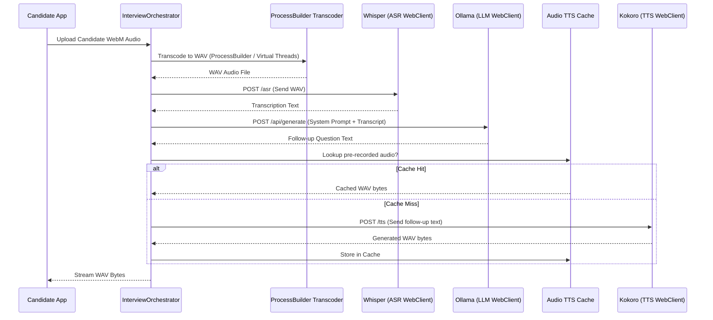

# Module 05: Capstone: Reactive AI Interview Coordinator Pipeline Architecture

Welcome class. Today we analyze **Reactive AI Interview Coordinator Pipeline Architecture (CS-528)**.

In this capstone design module, we construct a fully reactive orchestration pipeline. In real-world enterprise architectures, AI features do not live in isolation. We must stitch together high-latency, error-prone AI endpoints—speech transcription (Whisper), large language models (Ollama), and speech synthesis (Kokoro)—into a cohesive candidate interview workflow.

If any component in this chain behaves synchronously, blocks, or leaks system resources, the entire pipeline collapses. We will design a non-blocking coordinator using Project Reactor, incorporating caching policies and graceful degradations.

---

## 1. Academic Lecture: Designing Resilient Multi-Stage AI Pipelines

### 1. The Pipeline Blueprint
An interactive voice-based AI interviewer follows a sequence of stages:
1.  **Ingestion & Transcoding**: The browser captures WebM or Ogg audio. The Java backend transcodes it to linear 16kHz PCM WAV formats required by Whisper.
2.  **Speech-to-Text (ASR)**: The transcoded WAV bytes are dispatched to Whisper for transcription.
3.  **The LLM Brain**: The transcribed question is combined with an interview rubric system prompt and sent to Ollama to evaluate the response and generate the next Socratic follow-up question.
4.  **Text-to-Speech (TTS)**: The follow-up question is converted to audio bytes via Kokoro.
5.  **Audio Streaming**: The candidate receives the audio feed.

### 2. Cascading Failures and Circuit Breakers
In a multi-stage pipeline, if Whisper experiences load and takes 10 seconds to transcribe, or Ollama times out, the candidate should not get a generic 500 error. We use Reactor operators like `.timeout()`, `.onErrorResume()`, and `.fallback()` to return graceful defaults. For instance, if Kokoro TTS fails, the pipeline should fall back to streaming the raw text, letting the candidate's browser use its native Web Speech Synthesis API.

### 3. Caching Static TTS Audios
Synthesizing audio (TTS) is a GPU/CPU-heavy task. Since the initial welcome questions and introductory rubrics in an interview process are identical for all candidates, querying Kokoro repeatedly for static text is a waste of processing resources. We introduce a caching layer mapping SHA-256 hashes of text fragments to stored audio bytes, bypassing TTS completely on cache hits.



---

## 2. Theory vs. Production Trade-offs

When coordinating multi-service architectures, compare these pipeline structures:

| Dimension / Metric | Synchronous Orchestrator | CompletableFuture Async | Reactive Mono/Flux Pipeline |
| :--- | :--- | :--- | :--- |
| **Concurrency Overhead** | High (1 thread per step) | Moderate (Thread pool callbacks) | Very Low (Event-driven Netty) |
| **Error Propagation** | Simple try-catch blocks | `.exceptionally()` chaining | Native `.onErrorResume()`, `.onErrorReturn()` |
| **Resource Reclamation**| Blocked threads until finish| Manual listener cleanup | Auto-cleanup via reactive cancels |
| **Backpressure Support** | None (OS sockets buffer) | None (Callbacks buffer) | Direct flow-control (TCP window maps) |
| **Readability** | High (Linear code) | Moderate (Completable chain) | Complex (Functional reactive streams) |

---

## 3. How to Use: Core Orchestrator Design

Let us define the core interfaces of our AI services and the pipeline coordinator that ties them together reactively.

### A. Component Interfaces

We define isolated, non-blocking contracts for each stage:

```java
package com.security.api.pipeline;

import reactor.core.publisher.Mono;

public interface TranscodingService {
    // Transcodes incoming audio file bytes (e.g. webm) to PCM WAV 16kHz
    Mono<byte[]> transcodeToWav(byte[] inputAudioBytes);
}
```

```java
package com.security.api.pipeline;

import reactor.core.publisher.Mono;

public interface TranscriptionService {
    // Sends WAV bytes to Whisper server for STT
    Mono<String> transcribe(byte[] wavBytes);
}
```

```java
package com.security.api.pipeline;

import reactor.core.publisher.Mono;

public interface InterviewBrainService {
    // Sends candidate response transcript to Ollama for evaluation and follow-up question
    Mono<String> generateFollowUp(String candidateTranscript, String contextPrompt);
}
```

```java
package com.security.api.pipeline;

import reactor.core.publisher.Mono;

public interface SpeechSynthesisService {
    // Converts text feedback to speech audio (WAV) via Kokoro
    Mono<byte[]> synthesizeSpeech(String text);
}
```

### B. Hardened Pipeline Coordinator (Production Pattern)

Here is the hardened production coordinator. It chains the stages reactively, enforces timeouts on external endpoints, manages the audio cache, and implements fallback paths for downstream AI failures.

```java
package com.security.api.pipeline;

import org.slf4j.Logger;
import org.slf4j.LoggerFactory;
import reactor.core.publisher.Mono;
import java.time.Duration;
import java.util.Map;
import java.util.concurrent.ConcurrentHashMap;

public class InterviewOrchestrator {

    private static final Logger log = LoggerFactory.getLogger(InterviewOrchestrator.class);
    
    private final TranscodingService transcodingService;
    private final TranscriptionService transcriptionService;
    private final InterviewBrainService brainService;
    private final SpeechSynthesisService synthesisService;
    
    // In-memory cache to save CPU cycles for static welcome/closing audios
    private final Map<String, byte[]> ttsAudioCache = new ConcurrentHashMap<>();

    public InterviewOrchestrator(
            TranscodingService transcodingService,
            TranscriptionService transcriptionService,
            InterviewBrainService brainService,
            SpeechSynthesisService synthesisService) {
        this.transcodingService = transcodingService;
        this.transcriptionService = transcriptionService;
        this.brainService = brainService;
        this.synthesisService = synthesisService;
    }

    public Mono<InterviewResponse> coordinateSession(byte[] incomingAudio, String promptContext) {
        return transcodingService.transcodeToWav(incomingAudio)
            .timeout(Duration.ofSeconds(10)) // Strict transcoding timeout
            .flatMap(wavBytes -> transcriptionService.transcribe(wavBytes)
                .timeout(Duration.ofSeconds(15))
                .onErrorReturn(" [Audio transcription failed: defaulting response] "))
            .flatMap(transcript -> brainService.generateFollowUp(transcript, promptContext)
                .timeout(Duration.ofSeconds(20))
                .onErrorReturn("I understood your response, but my network connection to the evaluation brain timed out. Could you expand on that?")
                .flatMap(followUpText -> getCachedOrSynthesizedAudio(followUpText)
                    .map(audioBytes -> new InterviewResponse(transcript, followUpText, audioBytes))
                )
            )
            .doOnError(err -> log.error("Pipeline failure in interview coordinator", err));
    }

    private Mono<byte[]> getCachedOrSynthesizedAudio(String text) {
        String textHash = String.valueOf(text.hashCode()); // Simple hash for local cache matching
        if (ttsAudioCache.containsKey(textHash)) {
            log.info("TTS Cache HIT for text: {}", textHash);
            return Mono.just(ttsAudioCache.get(textHash));
        }

        return synthesisService.synthesizeSpeech(text)
            .timeout(Duration.ofSeconds(10))
            // If Kokoro fails, return an empty array (tells front-end to fall back to screen text display)
            .onErrorResume(err -> {
                log.warn("Speech Synthesis failed. Falling back to text-only mode", err);
                return Mono.just(new byte[0]);
            })
            .doOnNext(audioBytes -> {
                if (audioBytes.length > 0) {
                    ttsAudioCache.put(textHash, audioBytes);
                }
            });
    }

    public record InterviewResponse(
        String candidateTranscript,
        String nextFollowUpText,
        byte[] nextFollowUpAudio
    ) {}
}
```

---

## 4. Common Errors & Pitfalls

### Pitfall 1: Swallowing Exceptions and Returning Nulls
Returning a `null` value inside `.onErrorResume()` instead of an empty Mono wrapper or standard placeholder object.
*   **Why it fails**: Project Reactor operators like `.flatMap()` throw a `NullPointerException` instantly if a preceding stage returns a `null` payload. This breaks the downstream pipeline execution immediately.
*   **Mitigation**: Always wrap fallbacks in valid Monos (e.g. `Mono.just(new byte[0])` or `Mono.empty()`).

### Pitfall 2: High Latency Cascades Without Timeouts
Excluding timeouts on remote WebClient calls inside the pipeline.
*   **Why it fails**: If Whisper or Kokoro hangs indefinitely due to backend network issues, the coordinate session stream stays open. The Netty connection is held, eventually depleting the WebClient connection pool and locking all sessions.
*   **Mitigation**: Set explicit timeouts at the individual operation level using `.timeout(Duration.ofSeconds(N))`. Always ensure this timeout is shorter than the client gateway timeout (e.g., 30s).

---

## 5. Socratic Review Questions

### Question 1
Why do we perform transcoding using an external ProcessBuilder inside the reactive pipeline, and how do we ensure it doesn't block the reactive Netty thread pool?

#### Answer
WebM-to-WAV transcoding requires compiling and invoking binary codec tools like FFmpeg. Executing a ProcessBuilder shell invocation is an OS-blocking call. To prevent this from blocking the Netty event loops, the `TranscodingService` must dispatch the `ProcessBuilder` execution onto a dedicated, isolated thread pool, such as Spring's custom Virtual Thread executor or Project Reactor's `Schedulers.boundedElastic()`.

### Question 2
What is the advantage of using `.onErrorResume` over `.onErrorReturn` when a service endpoint fails?

#### Answer
`.onErrorReturn` replaces the failing signal with a static, pre-constructed object instance. `.onErrorResume` accepts a dynamic mapper function returning a new publisher stream. This allows the system to fire fallback remote API queries (e.g., query a secondary Whisper model node on a backup host, or write error telemetry logs to an external analytics pipeline) instead of immediately returning static defaults.

---

## 6. Hands-on Challenge: Reactive Pipeline Error Recovery

### The Challenge
In this challenge, you will implement pipeline error-handling and fallback logic.
Your task:
1. Complete `orchestrateSpeechPipeline` in `SpeechPipelineCoordinator`.
2. Retrieve the text using `transcriptionService.transcribe(...)`.
3. If transcription fails, capture the exception, log it, and run a fallback transcription query using `backupTranscriptionService.transcribe(...)`.
4. Enforce a strict 3-second timeout limit on the primary transcription request.

Complete the implementation stub below:

```java
package com.security.api;

import reactor.core.publisher.Mono;
import java.time.Duration;

class SpeechPipelineCoordinator {

    private final TranscriptionEngine primary;
    private final TranscriptionEngine backup;

    public SpeechPipelineCoordinator(TranscriptionEngine primary, TranscriptionEngine backup) {
        this.primary = primary;
        this.backup = backup;
    }

    public Mono<String> orchestrateSpeechPipeline(byte[] audioBytes) {
        // TODO: Implement the pipeline:
        // 1. Query primary.transcribe(audioBytes).
        // 2. Add a timeout of 3 seconds.
        // 3. Chain onErrorResume: if any error or timeout occurs on primary,
        //    fall back to calling backup.transcribe(audioBytes) with a 5-second timeout.
        
        return Mono.empty();
    }
}

interface TranscriptionEngine {
    Mono<String> transcribe(byte[] audioBytes);
}
```

### Verification JUnit 5 Test

Write a test file named `src/test/java/com/security/api/SpeechPipelineCoordinatorTest.java` (or run locally) to assert that backup nodes trigger correctly when the primary node encounters timeouts:

```java
package com.security.api;

import org.junit.jupiter.api.Test;
import reactor.core.publisher.Mono;
import reactor.test.StepVerifier;
import java.time.Duration;

class SpeechPipelineCoordinatorTest {

    @Test
    void testPrimaryTimeoutTriggersBackup() {
        TranscriptionEngine primary = audio -> Mono.<String>never(); // Never emits, forcing timeout
        TranscriptionEngine backup = audio -> Mono.just("Backup Transcription Success");

        SpeechPipelineCoordinator coordinator = new SpeechPipelineCoordinator(primary, backup);

        StepVerifier.create(coordinator.orchestrateSpeechPipeline(new byte[]{0x01}))
            .expectNext("Backup Transcription Success")
            .expectComplete()
            .verify();
    }
}
```

Ensure your pipeline gracefully transitions to the backup service upon encountering primary service failures.
