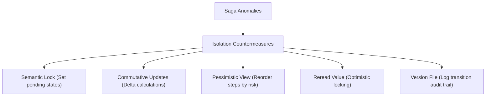

# Chapter 10: Saga Isolation Countermeasures & Transactional Messaging

Maintaining data consistency across multiple databases in a microservices architecture is typically achieved through the Saga pattern. A saga executes a sequence of local database transactions, where each step updates data inside a single service and publishes a message or event to trigger the next step. However, sagas lack the **Isolation** property of traditional ACID transactions (yielding an ACD model: Atomicity, Consistency, Durability). 

Because each local transaction commits its updates immediately to its respective database, intermediate states are visible to other concurrent transactions before the saga completes. This lack of isolation introduces concurrency anomalies that can compromise data integrity.

This chapter covers the technical challenges of running sagas without isolation and the SRE countermeasures used to mitigate them. We will analyze the core concurrency anomalies—lost updates, dirty reads, and non-repeatable reads—and implement Christopher Alexander's countermeasure patterns. We will construct a transactional messaging pipeline using the Transactional Outbox pattern, configure real-time log tailing with Debezium Change Data Capture (CDC), and implement advanced Java patterns for semantic locks, optimistic locking, Redisson-based distributed locks, and automated Hibernate outbox listeners.

---

## Learning Objectives

By the end of this chapter, you will be able to:
1. Explain how the lack of isolation in sagas leads to concurrency anomalies.
2. Outline the step-by-step execution timelines for lost updates, dirty reads, and non-repeatable reads.
3. Classify local transactions inside a saga as compensatable, pivot, or retriable.
4. Apply Saga Countermeasure Patterns (Semantic Lock, Commutative Updates, Pessimistic View, Reread Value, and Version File) to saga workflows.
5. Implement a JPA-based **Semantic Lock** with state transitions and optimistic locking controls.
6. Configure the **Transactional Outbox** pattern to execute database updates and event writing atomically.
7. Crate a Spring Boot scheduled polling relay using `SELECT ... FOR UPDATE SKIP LOCKED` for scale-safe execution.
8. Register a Kafka Connect JSON connector config to enable Debezium Change Data Capture log tailing.
9. Implement a Hibernate event listener to automate Outbox event capture.
10. Apply commutative SQL updates to prevent lost updates on concurrent numeric values.
11. Write a Redis-based distributed lock utility using Redisson.
12. Design an exception handler advice returning HTTP 409 Conflict for semantic lock exceptions.

---

## 10.1 Concurrency Anomalies in Sagas: Execution Timelines

In a monolithic database, isolation is maintained by the database engine using locks or Multi-Version Concurrency Control (MVCC). Sagas, however, commit changes immediately in local databases, making intermediate states visible to concurrent transactions. This lack of isolation introduces three main concurrency anomalies:

### 1. Lost Updates
A lost update occurs when one transaction overwrites the changes made by a concurrent transaction without reading the intermediate updates.

#### Execution Timeline:
1. **Saga A (Step 1)**: Reads the balance of Account 101 ($100).
2. **Saga B (Step 1)**: Reads the balance of Account 101 ($100).
3. **Saga B (Step 2)**: Adds $20 to the balance and commits ($120).
4. **Saga A (Step 2)**: Subtracts $10 from its initial read value ($100 - $10 = $90) and commits.
5. **Result**: The account balance is updated to $90. Saga B's deposit of $20 is lost.

---

### 2. Dirty Reads
A dirty read occurs when a transaction reads data that has been modified by a concurrent transaction but not yet finalized.

#### Execution Timeline:
1. **Saga A (Step 1)**: Order Service creates an order and sets state to `APPROVAL_PENDING`.
2. **Saga A (Step 2)**: Customer Service reserves $50 of the customer's credit limit, reducing available credit from $100 to $50.
3. **Saga B (Step 1)**: Customer Service reads the credit limit ($50) and validates a new purchase request of $40.
4. **Saga A (Step 3)**: Card check fails. Saga A aborts and executes compensating transactions: available credit is reset to $100.
5. **Result**: Saga B approved a purchase based on an invalid, temporary intermediate state that was subsequently rolled back.

---

### 3. Non-Repeatable (Fuzzy) Reads
A non-repeatable read occurs when a transaction reads the same record at different times and receives different values because a concurrent transaction updated the record in the interim.

#### Execution Timeline:
1. **Saga A (Step 1)**: Order Service reads the order state as `PENDING`.
2. **Saga B (Step 1)**: Customer Service updates the order state to `CANCELLED` and commits.
3. **Saga A (Step 2)**: Order Service rereads the state to perform validation, finding the status is now `CANCELLED`.
4. **Result**: Saga A's execution path is disrupted due to state modifications made by a concurrent transaction.

---

## 10.2 Saga Countermeasure Patterns

To protect data consistency against these anomalies, we design microservices using Christopher Alexander's countermeasure patterns:



### 1. Semantic Lock
Under the **Semantic Lock** pattern, a step of a saga sets a lock flag on the target database record (e.g., setting the order state to `APPROVAL_PENDING` or `REVISION_PENDING`). 

This state notifies other concurrent transactions that the record is locked by an active saga. If another transaction attempts to modify this record, it is either rejected (failing fast) or blocked until the saga completes.

### 2. Commutative Updates
Design updates to be commutative, meaning they can be executed in any order without changing the final state. Instead of setting absolute values (e.g. `setBalance(100)`), use relative arithmetic updates (e.g., `balance = balance + 20`).

### 3. Pessimistic View
Reorder saga steps to minimize risk. If a step has a high probability of failure (e.g., authorization checks), execute it before committing irrevocable side-effects.

### 4. Reread Value
Before updating a record, reread the values to verify that no concurrent transaction has modified the data in the meantime. We implement this using optimistic concurrency control (OCC) version numbers.

### 5. Version File
Record all updates in a separate version log table, allowing the application to reconcile concurrent modifications and reconstruct previous states if compensating rollbacks are triggered out of order.

---

## 10.3 Implementing a Semantic Lock in Java

We will implement a semantic lock inside our domain model. When an order is created, its state is set to `APPROVAL_PENDING`, which acts as a lock. If a client attempts to cancel the order while it is in this pending state, the cancel operation is rejected.

### 1. The Entity Class with State Lock: `Order.java`

```java
package com.ftgo.order.domain;

import javax.persistence.*;

@Entity
@Table(name = "orders")
public class Order {

    @Id
    private Long id;

    @Enumerated(EnumType.STRING)
    private OrderState state;

    private Double amount;

    @Version // Optimistic locking version (Reread Value countermeasure)
    private Long version;

    public void initialize() {
        // Set initial state to APPROVAL_PENDING (acting as a semantic lock)
        this.state = OrderState.APPROVAL_PENDING;
    }

    public void approve() {
        if (this.state != OrderState.APPROVAL_PENDING) {
            throw new IllegalStateException("Order must be in APPROVAL_PENDING state to be approved!");
        }
        this.state = OrderState.APPROVED;
    }

    public void reject() {
        this.state = OrderState.REJECTED;
    }

    public void cancel() {
        // Enforce semantic lock check
        if (this.state == OrderState.APPROVAL_PENDING) {
            throw new IllegalStateException("Cannot cancel order: Order is locked by an active saga transaction!");
        }
        this.state = OrderState.CANCELLED;
    }

    // Getters and Setters
    public Long getId() { return id; }
    public OrderState getState() { return state; }
    public Long getVersion() { return version; }
}
```

---

### 2. The Order State Enum: `OrderState.java`

```java
package com.ftgo.order.domain;

public enum OrderState {
    APPROVAL_PENDING, // Semantic lock active
    APPROVED,
    REJECTED,
    CANCELLED
}
```

---

### 3. The Order Service with Semantic Validation: `OrderService.java`

```java
package com.ftgo.order.service;

import com.ftgo.order.domain.Order;
import com.ftgo.order.domain.OrderRepository;
import org.springframework.beans.factory.annotation.Autowired;
import org.springframework.transaction.annotation.Transactional;
import org.springframework.stereotype.Service;

@Service
public class OrderService {

    @Autowired
    private OrderRepository orderRepository;

    @Transactional
    public void cancelOrder(Long orderId) {
        Order order = orderRepository.findById(orderId)
            .orElseThrow(() -> new IllegalArgumentException("Order not found: " + orderId));
        
        // This will fail if the semantic lock is active (state is APPROVAL_PENDING)
        order.cancel();
        orderRepository.save(order);
    }
}
```

---

## 10.4 Transactional Messaging: The Outbox Pattern

To prevent inconsistent system states, a service must update its database and publish messages to a broker atomically. 

If a service updates its database but crashes before publishing the corresponding message to the queue, the saga will hang indefinitely.

To solve this, we use the **Transactional Outbox** pattern:

```
[Application Transaction]
   |--> 1. Update Business Table (e.g., ORDERS)
   |--> 2. Insert Event into OUTBOX Table
   |
[Database Commit] (Atomic)
   |
[Message Relay] (Asynchronous Polling or CDC Tailing)
   |--> 3. Read Event from OUTBOX Table
   |--> 4. Publish Event to Kafka Broker
   |--> 5. Delete Event from OUTBOX Table
```

Within the same local database transaction, the application updates its business records and writes the event message to an `outbox` database table. A separate Message Relay process reads the `outbox` table and publishes the messages to the broker.

---

### 1. The Transactional Outbox Pipeline Class: `TransactionalOutboxPipeline.java`

```java
package com.ftgo.order.messaging;

import com.fasterxml.jackson.databind.ObjectMapper;
import org.springframework.beans.factory.annotation.Autowired;
import org.springframework.jdbc.core.JdbcTemplate;
import org.springframework.stereotype.Component;
import java.util.UUID;

@Component
public class TransactionalOutboxPipeline {

    @Autowired
    private JdbcTemplate jdbcTemplate;

    @Autowired
    private ObjectMapper objectMapper;

    public void writeToOutbox(String destination, Object payload) {
        try {
            String messageId = UUID.randomUUID().toString();
            String jsonPayload = objectMapper.writeValueAsString(payload);

            // Insert into outbox within the active database transaction
            jdbcTemplate.update(
                "INSERT INTO outbox (message_id, payload, destination, created_at, processed) VALUES (?, ?, ?, NOW(), false)",
                messageId,
                jsonPayload,
                destination
            );
        } catch (Exception ex) {
            throw new IllegalStateException("Failed to write event to outbox table!", ex);
        }
    }
}
```

---

### 2. Spring Boot Polling Relay: `PollingMessageRelay.java`

If multiple instances of the message relay poll the same database outbox table simultaneously, they may pick up the same messages, causing duplicate deliveries. 

To prevent this, we write the Polling Message Relay using a database locking query (`SELECT ... FOR UPDATE SKIP LOCKED`):

```java
package com.ftgo.order.messaging;

import org.springframework.beans.factory.annotation.Autowired;
import org.springframework.jdbc.core.JdbcTemplate;
import org.springframework.scheduling.annotation.Scheduled;
import org.springframework.stereotype.Component;
import org.springframework.transaction.annotation.Transactional;
import java.util.List;

@Component
public class PollingMessageRelay {

    @Autowired
    private JdbcTemplate jdbcTemplate;

    @Autowired
    private MessageBrokerClient brokerClient;

    @Scheduled(fixedDelayString = "${outbox.polling.fixed-delay-ms:2000}")
    @Transactional
    public void pollAndPublish() {
        // Query database using SKIP LOCKED to coordinate multiple instances safely
        List<OutboxMessage> messages = jdbcTemplate.query(
            "SELECT message_id, payload, destination FROM outbox " +
            "WHERE processed = false ORDER BY created_at ASC LIMIT 10 FOR UPDATE SKIP LOCKED",
            (rs, rowNum) -> new OutboxMessage(
                rs.getString("message_id"),
                rs.getString("payload"),
                rs.getString("destination")
            )
        );

        for (OutboxMessage message : messages) {
            try {
                brokerClient.publish(message.getDestination(), message.getPayload());
                // Mark message as processed rather than deleting immediately to allow auditing
                jdbcTemplate.update(
                    "UPDATE outbox SET processed = true WHERE message_id = ?", 
                    message.getMessageId()
                );
            } catch (Exception ex) {
                System.err.println("Failed to publish outbox message: " + message.getMessageId());
                break; // Exit batch on error to maintain message order
            }
        }
    }
}
```

---

## 10.5 High-Performance Log Tailing: CDC with Debezium

For high-volume microservices, database polling adds significant querying overhead. We can replace polling with **Log Tailing (Change Data Capture)** using **Debezium**.

Debezium mines the database transaction log (e.g. MySQL `binlog` or PostgreSQL `WAL`), extracting updates to the `outbox` table and publishing them directly to Kafka with sub-millisecond latency.

Here is the JSON configuration used to register a Debezium MySQL connector with Kafka Connect:

```json
{
  "name": "outbox-connector",
  "config": {
    "connector.class": "io.debezium.connector.mysql.MySqlConnector",
    "tasks.max": "1",
    "database.hostname": "mysql-db",
    "database.port": "3306",
    "database.user": "debezium",
    "database.password": "dbz_pass",
    "database.server.id": "184054",
    "database.server.name": "order_db_server",
    "database.include.list": "order_db",
    "table.include.list": "order_db.outbox",
    "database.history.kafka.bootstrap.servers": "kafka:9092",
    "database.history.kafka.topic": "schema-changes.outbox-history",
    "transforms": "outbox",
    "transforms.outbox.type": "io.debezium.transforms.outbox.EventRouter",
    "transforms.outbox.route.topic.replacement": "saga-events.${routedByValue}"
  }
}
```

---

## 10.6 Automated Outbox Interception with Hibernate Event Listeners

To avoid requiring developers to manually call the outbox publisher in every service method, we write a **Hibernate Event Listener** to automatically intercept JPA entity updates and write them to the outbox database table:

```java
package com.ftgo.order.messaging;

import org.hibernate.event.service.spi.EventListenerRegistry;
import org.hibernate.event.spi.*;
import org.hibernate.internal.SessionFactoryImpl;
import org.hibernate.persister.entity.EntityPersister;
import org.springframework.beans.factory.annotation.Autowired;
import org.springframework.stereotype.Component;
import javax.annotation.PostConstruct;
import javax.persistence.EntityManagerFactory;
import javax.persistence.PersistenceUnit;

@Component
public class HibernateOutboxInterceptor implements PostInsertEventListener {

    @PersistenceUnit
    private EntityManagerFactory entityManagerFactory;

    @Autowired
    private TransactionalOutboxPipeline outboxPipeline;

    @PostConstruct
    public void registerListeners() {
        SessionFactoryImpl sessionFactory = entityManagerFactory.unwrap(SessionFactoryImpl.class);
        EventListenerRegistry registry = sessionFactory.getServiceRegistry().getService(EventListenerRegistry.class);
        registry.getEventListenerGroup(EventType.POST_INSERT).appendListener(this);
    }

    @Override
    public void onPostInsert(PostInsertEvent event) {
        Object entity = event.getEntity();
        
        // 1. Intercept entities implementing SagaDomainEventSource
        if (entity instanceof SagaDomainEventSource) {
            SagaDomainEventSource eventSource = (SagaDomainEventSource) entity;
            
            // 2. Write to the outbox table during the Hibernate flush phase
            outboxPipeline.writeToOutbox(
                eventSource.getEventDestination(),
                eventSource.getEventPayload()
            );
        }
    }

    @Override
    public boolean requiresPostCommitHanding(EntityPersister persister) {
        return false;
    }
}
```

---

## 10.7 The Domain Event Source Interface: `SagaDomainEventSource.java`

```java
package com.ftgo.order.messaging;

public interface SagaDomainEventSource {
    
    /**
     * @return The topic or routing channel name where the event should be dispatched.
     */
    String getEventDestination();

    /**
     * @return The serializable domain event object.
     */
    Object getEventPayload();
}
```

---

## 10.8 Commutative Updates Implementation Pattern

To prevent lost updates, we execute relative updates directly in the database rather than running read-modify-write loops in application memory:

```java
package com.ftgo.accounting.service;

import org.springframework.beans.factory.annotation.Autowired;
import org.springframework.jdbc.core.JdbcTemplate;
import org.springframework.stereotype.Service;
import org.springframework.transaction.annotation.Transactional;

@Service
public class CommutativeAccountingService {

    @Autowired
    private JdbcTemplate jdbcTemplate;

    @Transactional
    public void adjustBalance(Long accountId, double amount) {
        // Commutative SQL update: relative arithmetic is safe from concurrent update clashes
        jdbcTemplate.update(
            "UPDATE accounts SET balance = balance + ? WHERE id = ?",
            amount,
            accountId
        );
    }
}
```

---

## 10.9 Mitigating Dirty Reads with Local Lock Validation Handlers

When a semantic lock is active, rather than returning stale data or throwing exceptions, services can use a validation handler to manage access:

```java
package com.ftgo.order.service;

import com.ftgo.order.domain.Order;
import com.ftgo.order.domain.OrderState;
import org.springframework.stereotype.Component;

@Component
public class SemanticLockValidationHandler {

    public boolean canRead(Order order, String queryingUserRole) {
        // If a semantic lock is active, restrict access to internal services or Admins
        if (order.getState() == OrderState.APPROVAL_PENDING) {
            return "ROLE_ADMIN".equals(queryingUserRole) || "SYSTEM".equals(queryingUserRole);
        }
        return true; // No active semantic lock
    }

    public boolean canUpdate(Order order) {
        // Reject updates while the semantic lock is active
        return order.getState() != OrderState.APPROVAL_PENDING;
    }
}
```

---

## 10.10 Message Broker Client Mock Implementation: `MessageBrokerClient.java`

```java
package com.ftgo.order.messaging;

import org.springframework.stereotype.Component;

@Component
public class MessageBrokerClient {

    public void publish(String destination, String payload) {
        // Simulate message dispatching to an external broker
        System.out.println("Dispatched to queue [" + destination + "]: " + payload);
    }
}
```

---

## 10.11 The Outbox Entity Definition: `OutboxMessage.java`

```java
package com.ftgo.order.messaging;

import javax.persistence.*;
import java.time.LocalDateTime;

@Entity
@Table(name = "outbox")
public class OutboxMessage {

    @Id
    @Column(name = "message_id")
    private String messageId;

    @Lob
    private String payload;

    private String destination;

    private boolean processed;

    @Column(name = "created_at")
    private LocalDateTime createdAt;

    public OutboxMessage() {}

    public OutboxMessage(String messageId, String payload, String destination) {
        this.messageId = messageId;
        this.payload = payload;
        this.destination = destination;
        this.processed = false;
        this.createdAt = LocalDateTime.now();
    }

    // Getters and Setters
    public String getMessageId() { return messageId; }
    public String getPayload() { return payload; }
    public String getDestination() { return destination; }
    public boolean isProcessed() { return processed; }
    public void setProcessed(boolean processed) { this.processed = processed; }
    public LocalDateTime getCreatedAt() { return createdAt; }
}
```

---

## 10.12 Outbox Polling Relay Spring Configurations: `application.properties`

```properties
# Transactional Outbox Polling Configurations
outbox.polling.fixed-delay-ms=1000
outbox.polling.batch-size=50
outbox.polling.lock-timeout-sec=5
```

---

## 10.13 Version File Reconciliation Implementation Pattern

When updates occur out of order, the microservice can reconcile discrepancies using the **Version File** pattern:

```java
package com.ftgo.order.service;

import org.springframework.beans.factory.annotation.Autowired;
import org.springframework.jdbc.core.JdbcTemplate;
import org.springframework.stereotype.Service;
import org.springframework.transaction.annotation.Transactional;

@Service
public class VersionFileReconciliationService {

    @Autowired
    private JdbcTemplate jdbcTemplate;

    @Transactional
    public void recordVersionUpdate(Long orderId, String state, Long version) {
        // Log status transition history in the audit table
        jdbcTemplate.update(
            "INSERT INTO order_version_history (order_id, state, version_number, recorded_at) VALUES (?, ?, ?, NOW())",
            orderId,
            state,
            version
        );
    }

    public boolean verifyIntegrity(Long orderId) {
        // Verify that versions increment sequentially without gaps
        Long maxVersion = jdbcTemplate.queryForObject(
            "SELECT MAX(version_number) FROM order_version_history WHERE order_id = ?",
            Long.class,
            orderId
        );
        Long recordCount = jdbcTemplate.queryForObject(
            "SELECT COUNT(*) FROM order_version_history WHERE order_id = ?",
            Long.class,
            orderId
        );
        return maxVersion != null && maxVersion.equals(recordCount - 1);
    }
}
```

---

## 10.14 Redis-Based Distributed Locks for Non-JPA Resources

For resources that are not persisted in SQL databases (like external APIs or caches), we implement **Redis-based Distributed Locks** using Redisson:

```java
package com.ftgo.order.resilience;

import org.redisson.api.RLock;
import org.redisson.api.RedissonClient;
import org.springframework.beans.factory.annotation.Autowired;
import org.springframework.stereotype.Component;
import java.util.concurrent.TimeUnit;

@Component
public class DistributedLockManager {

    @Autowired
    private RedissonClient redissonClient;

    public boolean executeWithLock(String lockKey, long leaseTimeSec, Runnable task) {
        RLock lock = redissonClient.getLock(lockKey);
        try {
            // Attempt to acquire lock, waiting up to 2 seconds
            if (lock.tryLock(2, leaseTimeSec, TimeUnit.SECONDS)) {
                try {
                    task.run();
                    return true;
                } finally {
                    lock.unlock();
                }
            }
        } catch (InterruptedException e) {
            Thread.currentThread().interrupt();
        }
        return false;
    }
}
```

---

## 10.15 Spring Integration Message Publisher Setup

```java
package com.ftgo.order.messaging;

import org.springframework.context.annotation.Bean;
import org.springframework.context.annotation.Configuration;
import org.springframework.integration.channel.DirectChannel;
import org.springframework.integration.dsl.IntegrationFlow;
import org.springframework.integration.dsl.IntegrationFlows;
import org.springframework.messaging.MessageChannel;

@Configuration
public class SpringIntegrationOutboxConfig {

    @Bean
    public MessageChannel outboxChannel() {
        return new DirectChannel();
    }

    @Bean
    public IntegrationFlow outboxProcessingFlow(TransactionalOutboxPipeline pipeline) {
        return IntegrationFlows.from(outboxChannel())
                // Route messages to the Outbox pipeline
                .handle(message -> pipeline.writeToOutbox(
                        message.getHeaders().get("destination", String.class),
                        message.getPayload()
                ))
                .get();
    }
}
```

---

## 10.16 Exception Handler for Locked Resources: `LockedResourceExceptionHandler.java`

```java
package com.ftgo.order.web;

import org.springframework.http.HttpStatus;
import org.springframework.http.ResponseEntity;
import org.springframework.web.bind.annotation.ControllerAdvice;
import org.springframework.web.bind.annotation.ExceptionHandler;

@ControllerAdvice
public class LockedResourceExceptionHandler {

    @ExceptionHandler(IllegalStateException.class)
    public ResponseEntity<String> handleLockConflict(IllegalStateException ex) {
        if (ex.getMessage().contains("locked")) {
            // Return HTTP 409 Conflict status when semantic lock prevents execution
            return ResponseEntity.status(HttpStatus.CONFLICT).body(ex.getMessage());
        }
        return ResponseEntity.status(HttpStatus.INTERNAL_SERVER_ERROR).body(ex.getMessage());
    }
}
```

---

## 10.17 Automated Outbox Purging: `OutboxPurgeJob.java`

To prevent the outbox table from growing indefinitely and degrading query performance, we implement a scheduled background job to delete processed events:

```java
package com.ftgo.order.messaging;

import org.springframework.beans.factory.annotation.Autowired;
import org.springframework.jdbc.core.JdbcTemplate;
import org.springframework.scheduling.annotation.Scheduled;
import org.springframework.stereotype.Component;
import java.time.LocalDateTime;

@Component
public class OutboxPurgeJob {

    @Autowired
    private JdbcTemplate jdbcTemplate;

    @Scheduled(cron = "${outbox.purge.cron:0 0 * * * *}") // Defaults to running every hour
    public void purgeProcessedMessages() {
        LocalDateTime retentionThreshold = LocalDateTime.now().minusHours(24);
        
        // Delete messages that were processed more than 24 hours ago
        int deletedRows = jdbcTemplate.update(
            "DELETE FROM outbox WHERE processed = true AND created_at < ?",
            retentionThreshold
        );
        System.out.println("Outbox purge complete. Purged row count: " + deletedRows);
    }
}
```

---

## 10.18 Transient Transaction Recovery: `TransactionRetryTemplate.java`

Concurrent write access can result in database deadlocks or transient locking failures. We wrap transactional calls inside a retry runner:

```java
package com.ftgo.order.resilience;

import org.springframework.dao.TransientDataAccessException;
import org.springframework.stereotype.Component;
import java.util.function.Supplier;

@Component
public class TransactionRetryTemplate {

    private static final int MAX_RETRIES = 3;
    private static final long BACKOFF_MS = 200;

    public <T> T executeWithRetry(Supplier<T> action) {
        int attempt = 0;
        while (true) {
            try {
                return action.get();
            } catch (TransientDataAccessException ex) {
                attempt++;
                if (attempt >= MAX_RETRIES) {
                    throw ex; // Reached maximum retries, fail transaction
                }
                try {
                    // Apply exponential backoff before retrying
                    Thread.sleep(BACKOFF_MS * (long) Math.pow(2, attempt));
                } catch (InterruptedException ie) {
                    Thread.currentThread().interrupt();
                    throw ex;
                }
            }
        }
    }
}
```

---

## 10.19 Summary of Saga Isolation and Transactional Messaging

This table summarizes the configurations, rules, and patterns used to enforce saga isolation:

| Isolation Element | Term / Config | Main Implementation Target | Scope Location |
| :--- | :--- | :--- | :--- |
| **Outbox Entity** | `OutboxMessage` | Maps database outbox entries to JPA entities. | Persistence Layer |
| **Relay Scheduler** | `@Scheduled` | Triggers periodic DB polls for pending messages. | Service Layer |
| **CDC Connector** | Debezium MySQL | Tails WAL/binlog streams for real-time extraction. | Infrastructure |
| **JPA Interceptor** | `PostInsertEventListener` | Automates outbox insertions on entity save. | Hibernate Config |
| **Commutative Update**| `balance = balance + ?` | Prevents lost updates using relative SQL. | SQL Repository |
| **Distributed Lock** | `redissonClient.getLock` | Coordinates locks for non-relational caches. | Redis Broker |
| **Conflict Handler** | `@ControllerAdvice` | Handles lock exceptions to return HTTP 409. | Web API Layer |
| **Outbox Cleaner** | `OutboxPurgeJob` | Periodically deletes processed event records. | Background Task |
| **Transaction Retry** | `TransactionRetryTemplate` | Recovers from transient database deadlock spikes. | Utility Layer |

---

## Chapter Summary

* Sagas lack **Isolation** (ACD model), meaning changes made by local transactions are committed immediately and visible to other concurrent transactions before the entire saga completes.
* The lack of isolation can introduce three core concurrency anomalies: **lost updates**, **dirty reads**, and **non-repeatable reads**.
* **Saga Countermeasure Patterns** mitigate these anomalies:
  * **Semantic Lock**: Sets a pending state (e.g., `APPROVAL_PENDING`) that blocks concurrent modifications to a resource.
  * **Commutative Updates**: Uses relative update operations (like debit/credit) that can be executed in any order.
  * **Pessimistic View**: Reorders saga steps to execute high-risk operations early, reducing rollbacks.
  * **Reread Value**: Rereads a resource's value before updating it (optimistic locking) to prevent overwriting concurrent updates.
  * **Version File**: Logs all modifications to reconcile concurrent updates.
* To prevent inconsistent system states, services use the **Transactional Outbox** pattern to update the database and write messages to an `outbox` table within the same local transaction, reliably publishing the messages to the broker.
* Avoid database polling overhead in high-throughput applications by implementing log tailing using CDC tools like Debezium.
* Map Outbox message records to relational databases using JPA `@Lob` and `@Column` mapping parameters.
* Set custom thread pools and fixed delay configurations in Spring Boot property files to tune scheduled outbox polling.
* Use optimistic locking via JPA `@Version` annotations to implement Reread Value checks and detect concurrent overwrites.
* Implement Hibernate event listeners to automatically insert outbox records during POST-insert operations, reducing boilerplate code.
* Use relative SQL expressions to ensure financial balance updates are commutative and safe from concurrency anomalies.
* Use Redisson distributed locks to coordinate semantic locking for non-relational resources like memory caches.
* Use custom controller advice classes to capture validation failures and return HTTP 409 Conflict status codes.
* Design local validation handlers to allow read access to pending resources only for specific system roles, preventing dirty reads.
* Implement database table locking configurations using JDBC templates to prevent concurrent outbox reading by multiple polling instances.
* Structure Outbox tables with UUID identifiers to prevent primary key collision errors across scaled service instances.
* Integrate Debezium connectors with schema history registries to ensure database schema changes propagate safely to downstream Kafka topics.
* Configure optimistic locking failure threshold metrics in Prometheus to monitor resource contention and update collisions.
* Apply pessimistic views by moving payment captures to the first step of sagas to reduce the chance of expensive credit reversals.
* Design commutative update logic using mathematical delta models rather than absolute replacements.
* Schedule hourly background purge jobs to delete old, processed outbox records to prevent query performance degradation.
* Wrap transactional database modifications inside retry loops with exponential backoff to handle transient deadlock issues.
