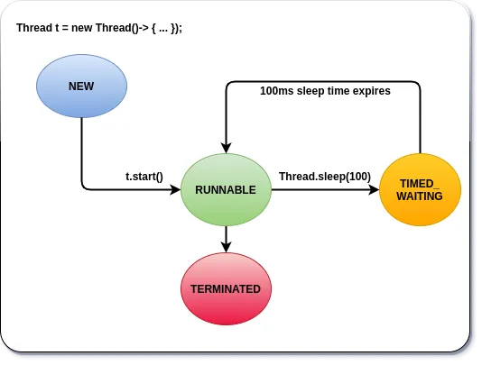

# Life Cycle of a thread with Methods in Thread Class

For managing threads in java, we have many static and instance methods in the Thread class. We can use these methods for creating, starting, pausing, and stopping threads.

## Static Methods

```java
static int activeCount()
static Thread currentThread()
static void dumpStack()
static boolean interrupted()
static void sleep()
static void yield()
```

## Instance Methods

```java
void start()
long getId()
String getName()
int getPriority()
void interrupt()
boolean isInterrupted()
boolean isAlive()
void join()
String toString()
```

This is not the complete list and we will not even cover all of the above. There are other methods but we don’t really need them unless we build some tiny multithreading frameworks ourselves.

Here in this article, we will discuss the methods related to the lifecycle of threads in Java:start() and sleep(). We will also discuss some of the states in the thread’s lifecycle.

So, the first step is to create an instance of thread.

```java
public class Greeter extends Thread {
    @Override
    public void run() {
        for (int i = 0; i < 10000000; i++) {
            if (i == 1000000) {
                try {
                    Thread.sleep(1000);
                } catch (InterruptedException e) {
                    e.printStackTrace();
                }
            }
        }
    }
}


Thread greeterThread = new Greeter();
```

As you can see at line 16, we have created a Thread instance named greeterThread and we have overridden therun()method that performs the actual task. But nothing is happening yet. At this stage, all we’ve got is a plain old Java object of type Thread. It is not yet a thread of execution. A thread of execution means it has its own Execution Context: call stack, variable stack, state, pc register and etc. So it is not considered *alive* yet. At this stage, the thread is said to be in the NEW state. In order to make the thread alive, we have to invoke start()method on it as below.

```java
greenThread.start();
```

Once the start() method is invoked, the thread is considered alive. The method isAlive() comes in handy to check whether the thread is alive or not. At this point, the run() method may not have actually started executing yet but the thread is considered alive.

So, this part of the thread’s life is called RUNNABLE. What does it exactly mean when we say a thread is inRUNNABLE state? Well, it is executing in JVM but it may be waiting for other resources from the operating system such as the CPU core in which case run() method’s execution is delayed till the processor is available for this thread.

Next, what if a CPU core is available and the thread’s run() method is now executing? Well, we still say that the thread is in RUNNABLE state. In few books, it is mentioned that the thread goes intorunning state but there is no such state as RUNNING in Java. All the states that we specify here in capital letters are the enums of type State in Thread class.

```java
public class Thread implements Runnable {
    // ...............
    // ...............
    public enum State {
        NEW,
        RUNNABLE,
        BLOCKED,
        WAITING,
        TIMED_WAITING,
        TERMINATED;
    }
    // ......................
    // ......................
}
```

So what’s next after RUNNABLE?

A thread goes into one of four states from RUNNABLE: BLOCKED, WAITING, TIMED_WAITING, andTERMINATED. We will look at BLOCKED and WAITING in later parts. But we will now cover TIMED_WAITING and TERMINATED here.

If we call sleep() method in the current running thread, the thread goes into TIMED_WAITING state. The state name TIMED_WAITING makes sense right? Because we are specifying the amount of time that the thread should go to sleep.

When the time expires the thread will eventually come back to the RUNNABLE state and continue from where it left off. (More on this later parts as there other states involved in between)

_NOTE: Remember sleep() is a static method and should always be called in the running thread as you can see in line 7 in Fig 3.1. above._

The next is the dead stage that happens after the successful/abnormal completion of the run() method — then the thread is considered to be TERMINATED. Again the method isAlive() comes in handy to check whether the thread is alive or not.

Here is the simple thread lifecycle. We will cover WAITED and BLOCKED states in later parts.

Simple Life Cycle of a Thread


## Summary

Creating an instance of the type Thread just creates a java thread but it is not yet the thread of execution. Thread of execution means, the thread has its own execution context like call stack, local variable stack, state, and etc.

When a thread is created, it is said to be in NEW state.

Upon calling start() method on thread object, the thread of execution is created and the thread is said to be in RUNNABLE state.

Calling start() does not necessarily mean the thread’s run() method is executing. run() method’s execution may be deferred.

When the thread is in RUNNABLE we can call sleep() which puts the thread into TIMED_WAITING state.

When the time expires, the thread eventually comes back to RUNNABLE state and continues from where it left off.

Upon the successful or abnormal completion of run() method, the thread goes into TERMINATED state.
