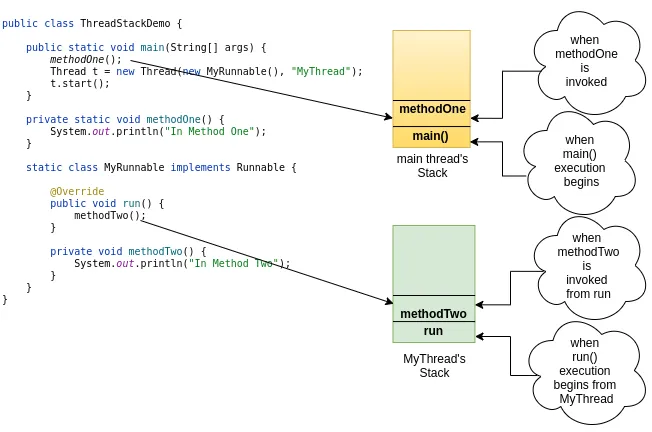

# Multiple Threads and their Stacks

In  we have seen how threads can be created and we also explored the life cycle of a thread to some extent. In this article, we will look at how threads maintain their local variables and call stacks.

Each thread in Java has a private stack associated with it. When a thread is created in Java Virtual Machine, a JVM stack local to that thread is also created.

Below is a simple java application that has one user-defined thread named MyThread along with the main thread.

```java
public class ThreadStackDemo {


    public static void main(String[] args) {
        methodOne();
        Thread t = new Thread(new MyRunnable(), "MyThread");
        t.start();
    }


    private static void methodOne() {
        System.out.println("In Method One");
    }


    static class MyRunnable implements Runnable {


        @Override
        public void run() {
            methodTwo();
        }


        private void methodTwo() {
            System.out.println("In Method Two");
        }
    }
}
```

As you can see in the above program there are two threads: main and MyThread.

Three things are happening in main thread.

The main() is invoked from themain thread. main() and main are different. main() — A regular java method. main: without parenthesis, a java thread).

main() in turn calls methodOne()

main() creates and stars a user-defined thread named MyThread.

Now MyThread simply calls methodTwo.

Here is how the stacks look like for each of these two threads.

Java Virtual Machine’s stack is private to a JVM thread. Every method call that happens in that thread will have an entry in its private stack. Now, what all can a JVM stack store.

Well, Java Virtual Machine specification says, a JVM stack stores frames. A frame can be thought of as a wrapper that is used to store local variables, operand stacks, a reference to the run-time constant pool, dispatch exceptions and etc. For further information on frames, you can have a look .

Now, the key point to be understood here is, JVM stacks only store the data that is local to that particular thread and no other thread has access to the other thread’s stack.

Now that we understood how stacks are created for a particular thread, there is often confusion among novice programmers that what if we run multiple threads with the same runnable object. Yes, we can give the same runnable object to different threads, in which case, every thread performs the same task in its own context (because it has its own stack). Look at the below program that illustrates this:

```java
public class MultipleThreadSameRunnableDemo {


    public static void main(String[] args) {
        MyRunnable task = new MyRunnable();
        Thread t
= new Thread(task, "t1");
        Thread t
= new Thread(task, "t2");
        Thread t
= new Thread(task, "t3");
        t1.start();
        t2.start();
        t3.start();
    }


    private static void methodOne() {
        System.out.println("In Method One");
    }


    static class MyRunnable implements Runnable {


        @Override
        public void run() {
            for (int i = 0; i < 10; i++) {
                System.out.println(String.format("From %s :: %d", Thread.currentThread().getName(), i));
            }
        }
    }
}
```

hosted with ❤ by 

Now, in this case, the threads t1, t2 and t3 will have their own stack and the local variable variable iin the run() method is stored in the stack wrapped in a frame. So each thread prints from 0 to 9 as shown below.

_From t2 :: 0**
From t1 :: 0**
From t3 :: 0**
From t2 :: 1**
From t1 :: 1**
From t2 :: 2**
From t3 :: 1**
From t1 :: 2**
From t2 :: 3**
From t3 :: 2**
From t1 :: 3**
From t2 :: 4**
From t3 :: 3**
From t1 :: 4**
From t2 :: 5**
From t3 :: 4**
From t1 :: 5**
From t2 :: 6**
From t3 :: 5**
From t1 :: 6**
From t2 :: 7**
From t3 :: 6**
From t1 :: 7**
From t2 :: 8**
From t1 :: 8**
From t3 :: 7**
From t2 :: 9**
From t1 :: 9**
From t3 :: 8\*\*
From t3 :: 9_

In this article, we have seen that every thread has a separate copy of the local variable because of its own stack. In later parts of this series, we will have a look at how threads can access global or shared data and how inter-thread communication happens.

## Summary

Each thread in Java has a private stack associated with it, created along with the thread.

Each entry in JVM Stack is called a frame.

A frame contains local variables, operand stacks, method calls, reference to a run-time constant pool, and an Exception dispatcher.

Multiple threads can execute the same runnable since each thread performs the task in its own context.

Each thread can have its own Runnable.
