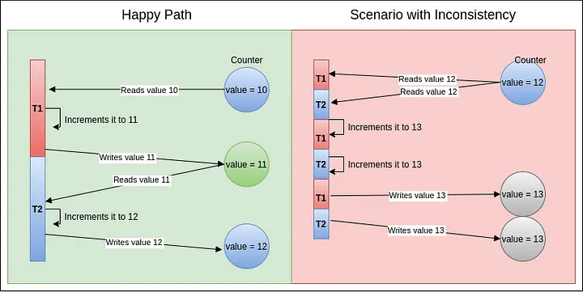

# Synchronizing the Threads with synchronized

In the previous modules, we explored the methods `join()`, `sleep()`, and `yield()` and their behaviors. Now, we will look at how threads can be synchronized to safely access shared data. In Java, **shared data** simply means an object instance (like a `Counter` class) that contains mutable state accessed by multiple threads.

Simply put, in a multi-threaded environment, a **race condition** occurs when two or more threads attempt to update mutable shared data at the same time. Java offers a mechanism to avoid race conditions by synchronizing thread access to shared data. A piece of logic marked with `synchronized` becomes a **synchronized block**, allowing only one thread to execute it at any given time.

---

## The Problem: Unsynchronized Shared State (Race Conditions)

To understand why synchronization is necessary, let's explore two concrete examples of race conditions: one using raw threads in a loop, and another using modern thread pools and JUnit assertions.

### Example 1: Multithreaded Counter (Raw Threads)

Let's imagine a common scenario of displaying the number of hits of a particular website on a UI. The backend servers need to maintain a counter that keeps track of the number of hits. For every request, there is a request handler running in a specific thread that needs to access this counter object and increment it.

In the program below, we have two threads accessing the same `Counter` object. Each thread increments the counter 100,000 times. The expected final count should be exactly 200,000.

```java
package org.vit.threads;

class Counter {
    private int value;

    public void increment() {
        ++value;
    }

    public int get() {
        return value;
    }
}

public class CounterDemo {
    public static void main(String[] args) throws InterruptedException {
        Counter counter = new Counter();

        Runnable incrementTask = () -> {
            for (int i = 0; i < 100000; i++) {
                counter.increment();
            }
        };

        Thread t1 = new Thread(incrementTask, "T1");
        Thread t2 = new Thread(incrementTask, "T2");

        long start = System.nanoTime();
        t1.start();
        t2.start();

        t1.join(); // Wait here till T1 completes
        t2.join(); // Wait here till T2 completes
        long end = System.nanoTime();

        String timeTaken = String.format("%.2f", (end - start) / 1000000.0);
        System.out.println("Final Counter Value: " + counter.get() + " Time Taken: " + timeTaken + " millis");
    }
}
```

Running this program multiple times yields inconsistent results:
*   **RUN #1:** Final Counter Value: `108815` (Time Taken: 9.63 ms)
*   **RUN #2:** Final Counter Value: `174793` (Time Taken: 3.13 ms)
*   **RUN #3:** Final Counter Value: `138996` (Time Taken: 8.55 ms)

None of the runs show the correct result of 200,000.

### Example 2: Multithreaded Summation (Thread Pools and JUnit)

Let's consider another typical race condition where we calculate a sum, and multiple threads execute a `calculate()` method concurrently:

```java
public class SynchronizedMethods {

    private int sum = 0;

    public void calculate() {
        setSum(getSum() + 1);
    }

    public int getSum() {
        return sum;
    }

    public void setSum(int sum) {
        this.sum = sum;
    }
}
```

We can write a unit test to execute this calculation concurrently using an `ExecutorService` thread pool:

```java
@Test
public void givenMultiThread_whenNonSyncMethod() throws InterruptedException {
    ExecutorService service = Executors.newFixedThreadPool(3);
    SynchronizedMethods summation = new SynchronizedMethods();

    IntStream.range(0, 1000)
      .forEach(count -> service.submit(summation::calculate));
    service.awaitTermination(1000, TimeUnit.MILLISECONDS);

    assertEquals(1000, summation.getSum());
}
```

We are using an `ExecutorService` with a 3-thread pool to execute the `calculate()` method 1,000 times. If executed sequentially, the expected output would be exactly 1,000. However, the multi-threaded execution fails almost every time with an inconsistent actual output:

```text
java.lang.AssertionError: expected:<1000> but was:<965>
at org.junit.Assert.fail(Assert.java:88)
at org.junit.Assert.failNotEquals(Assert.java:834)
...
```

---

> **Problem: The Race Condition**
> The place where things go wrong is the unsynchronized increment operation (`++value` or `setSum(getSum() + 1)`). These statements appear to be single, atomic operations in Java, but at the bytecode level, they translate to multiple instructions. When multiple threads interleave these instructions without synchronization, updates are silently overwritten, resulting in a race condition.

---

## Bytecode Analysis of ++value

We can inspect the compiled bytecode of the `Counter` class using the JDK's disassembler tool:

```bash
javap -c Counter.class
```

This command outputs the following bytecode for the `increment()` method:

```text
  public void increment();
    Code:
       0: aload_0
       1: dup
       2: getfield      #7                  // Field value:I
       5: iconst_1
       6: iadd
       7: putfield      #7                  // Field value:I
      10: return
```

The single Java statement `++value` is compiled into six bytecode instructions. We can group them into three primary operations:

1.  **Read Operation (`aload_0`, `dup`, `getfield`):** Fetches the current value of the field from the object instance and loads it onto the operand stack.
2.  **Increment Operation (`iconst_1`, `iadd`):** Pushes the constant integer `1` onto the stack and adds it to the value.
3.  **Write Operation (`putfield`):** Writes the sum back to the object's instance variable in heap memory.

Because the CPU executes these operations in interleaved sequences, thread context switches can happen at any instruction boundary.

---

### The Happy Path vs. The Inconsistent Path

#### The Happy Path
If the threads execute sequentially without interruption:

*Figure 7.1: Thread Interleaving*


1.  `T1` reads the counter value (e.g., `10`).
2.  `T1` increments it to `11` in its local execution frame.
3.  `T1` writes `11` back to the shared heap variable.
4.  `T2` reads the updated value (`11`).
5.  `T2` increments it to `12`.
6.  `T2` writes `12` back.
*   **Result:** `12` (Correct).

#### The Inconsistent Path
If a context switch occurs mid-operation:
1.  `T1` reads the counter value (e.g., `12`).
2.  `T1` increments it to `13` in its local stack frame. **[Context Switch]**
3.  `T2` preempts `T1` and reads the counter value. Because `T1` has not written its result yet, `T2` reads `12`.
4.  `T2` increments it to `13` in its local stack frame. **[Context Switch]**
5.  `T1` writes its local result (`13`) back to the heap.
6.  `T2` writes its local result (`13`) back to the heap, overwriting `T1`'s write.
*   **Result:** `13` instead of `14`. One increment is completely lost!

---

## The Solution: Thread Synchronization

To prevent race conditions, we must ensure that only one thread can execute the **critical section** (the code accessing shared mutable state) at any given time. This is called **mutual exclusion**.

Java provides the built-in `synchronized` keyword to achieve this. There are two primary ways to apply it to instance members:

### 1. Synchronized Instance Methods

We can add the `synchronized` keyword to the method declaration. When an instance method is synchronized, it locks over the **instance of the class** owning the method (`this`). This means only one thread per instance of the class can execute this method at any given time.

Let's synchronize the `increment()` method in our `Counter` class:

```java
public synchronized void increment() {
    ++value;
}
```

Once synchronized, the `CounterDemo` program will always print exactly `200000`.

Similarly, we can synchronize the `calculate()` method in the `SynchronizedMethods` class:

```java
public synchronized void synchronisedCalculate() {
    setSum(getSum() + 1);
}
```

We can verify this with a concurrent unit test:

```java
@Test
public void givenMultiThread_whenMethodSync() throws InterruptedException {
    ExecutorService service = Executors.newFixedThreadPool(3);
    SynchronizedMethods method = new SynchronizedMethods();

    IntStream.range(0, 1000)
      .forEach(count -> service.submit(method::synchronisedCalculate));
    service.awaitTermination(100, TimeUnit.MILLISECONDS);

    assertEquals(1000, method.getSum());
}
```

With the method marked `synchronized`, the test case passes with the correct output of `1000`.

---

### 2. Synchronized Blocks Within Methods

Sometimes, synchronizing the entire method is unnecessary and restricts concurrency too much. We can synchronize only a specific block of instructions within the method instead.

We pass a monitor object reference (like `this`) as a parameter to the synchronized block. The code inside the block gets synchronized on that monitor object:

```java
public void increment() {
    synchronized (this) {
        ++value;
    }
}
```

For our summation class, we can implement it as follows:

```java
public class SynchronizedBlocks {

    private int count = 0;

    public void performSynchronisedTask() {
        synchronized (this) {
            setCount(getCount() + 1);
        }
    }

    public int getCount() {
        return count;
    }

    public void setCount(int count) {
        this.count = count;
    }
}
```

We can verify that this synchronized block passes the concurrent test suite:

```java
@Test
public void givenMultiThread_whenBlockSync() throws InterruptedException {
    ExecutorService service = Executors.newFixedThreadPool(3);
    SynchronizedBlocks synchronizedBlocks = new SynchronizedBlocks();

    IntStream.range(0, 1000)
      .forEach(count -> 
        service.submit(synchronizedBlocks::performSynchronisedTask));
    service.awaitTermination(100, TimeUnit.MILLISECONDS);

    assertEquals(1000, synchronizedBlocks.getCount());
}
```

---

> **Mental Model: The Mutual Exclusion Gateway**
> Think of a synchronized block or method as a guarded gate. To enter the gate, a thread must acquire the single **Key** (the monitor lock) associated with the guard object (like `this`). Once inside, the thread holds the key. Any other thread arriving at the gate will find it locked, entering a **BLOCKED** state until the first thread exits the gate and returns the key.

---

> **Pitfalls: Performance and Thread Contention**
> While marking methods as `synchronized` is simple, it blocks all other threads trying to access any synchronized members on the same instance. This causes thread contention, context switching overhead, and severely limits the parallelism of your application. Never synchronize blocks that perform blocking I/O or long-running computations.

---

> **Insights: Granularity Control**
> Always prefer synchronized blocks over synchronized methods when possible. Synchronized blocks allow you to specify **finer granularity**, minimizing the size of the critical section and restricting locking to only the lines of code that touch shared mutable data. This keeps the lock hold time short and improves overall application throughput.

---

## Summary

*   **Race Conditions:** Occur when multiple threads concurrently read and write to a shared variable. What appears as a single statement (like `++value` or `setSum(getSum() + 1)`) is actually multiple bytecode operations (Read-Modify-Write) that can be interleaved.
*   **Mutual Exclusion:** The mechanism of ensuring only one thread executes a critical section of code at a time to maintain data consistency.
*   **The `synchronized` Keyword:** Java's built-in tool for mutual exclusion. It can be applied at the method level or as a block.
*   **Lock Scope:** Instance synchronized methods and blocks using `this` lock on the specific object instance. Only one thread can execute any synchronized code on that instance at a time.
*   **Granularity:** Synchronized blocks allow for finer control over which sections of code are guarded, improving performance compared to synchronizing entire methods.
