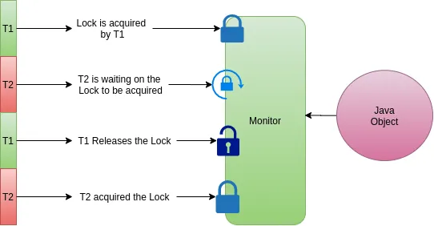

# Synchronized and the Depths of It — The Monitors

In the previous module, we saw how to make a class thread-safe using the `synchronized` keyword. Now, we will gain an in-depth understanding of how synchronization works under the hood in the JVM.

---

## Intrinsic Locks (Monitors)

When a synchronized method or block is executed, a **lock** must be acquired. In Java, this lock is always associated with a specific **Object**.

> **Mental Model: Intrinsic Locks**
> Every object in Java has a built-in lock associated with it. In Java vocabulary, this is called an **Intrinsic Lock** or **Monitor** (and sometimes a **Mutual Exclusion Lock** or **Mutex**). Gaining a lock on an object means a thread is taking exclusive ownership of that object's monitor.

On which object is the lock acquired?
*   **Synchronized Methods:** The lock is acquired on the object instance that called the method (`this`).
*   **Synchronized Blocks:** You must explicitly specify the object on which the lock is acquired (e.g., `synchronized(lockObj)`).

```java
private final Object lockObj = new Object();

public void increment() {
    synchronized (lockObj) { // Lock is acquired on lockObj
        ++value;
    }
}
```

Every object also has a **waitset** associated with it, which is used for thread communication (which we will explore in detail when discussing `wait()`, `notify()`, and `notifyAll()`).

---

## Bytecode Analysis: Synchronized Methods vs. Blocks

Let's examine how the JVM handles these two different synchronization approaches at the bytecode level.

### 1. Synchronized Methods
Disassembling a class with a synchronized method:

```text
public synchronized void increment();
  Code:
     0: aload_0
     1: dup
     2: getfield      #2                  // Field value:I
     5: iconst_1
     6: iadd
     7: putfield      #2                  // Field value:I
    10: return
```

**Analysis:** The bytecode for a synchronized method is nearly identical to a non-synchronized method. The JVM handles synchronization implicitly using the `ACC_SYNCHRONIZED` flag in the method's access flags table. When a thread calls a method with this flag, it automatically acquires the monitor of the calling object before execution and releases it upon method return.

### 2. Synchronized Blocks
Disassembling a class with a synchronized block:

```text
public void increment();
  Code:
     0: aload_0
     1: dup
     2: astore_1
     3: monitorenter                     // Gaining monitor ownership
     4: aload_0
     5: dup
     6: getfield      #2                  // Field value:I
     9: iconst_1
    10: iadd
    11: putfield      #2                  // Field value:I
    14: aload_1
    15: monitorexit                      // Releasing monitor ownership
    16: goto          24
    19: astore_2
    20: aload_1
    21: monitorexit                      // Releasing monitor if an exception occurs
    22: aload_2
    23: athrow
    24: return
```

**Analysis:** Inside a synchronized block, the JVM uses two explicit bytecode instructions:
*   **`monitorenter` (Line 3):** The thread attempts to gain ownership of the monitor of the object on the stack (in this case, `this` loaded at line 0).
*   **`monitorexit` (Line 15 & 21):** The thread releases ownership of the monitor. Notice that the compiler generates *two* `monitorexit` instructions—one for the normal execution path and one in the exception handler block (lines 19–23) to ensure that the lock is guaranteed to be released even if the code throws an exception.

> **Pitfall: NullPointerExceptions with monitorenter**
> If the object reference passed to a synchronized block is `null` (e.g., `synchronized(nullObj)`), the `monitorenter` instruction will immediately throw a `NullPointerException`. Always ensure your lock references are initialized and marked `final`.

---

## Gaining Monitor Ownership

When a thread executes a `monitorenter` instruction, three scenarios can play out:

### 1. The Monitor is Free
If no thread owns the monitor of the target object, the current thread becomes its owner and sets the monitor's entry count to `1`.

### 2. The Monitor is Already Owned by Another Thread
If another thread owns the monitor, the current thread is blocked and cannot proceed. It enters the **`BLOCKED`** state and is placed in the lock queue, waiting for the owner thread to release the monitor via `monitorexit`.

### 3. The Monitor is Already Owned by the Current Thread
If the current thread already owns the monitor, it is allowed to enter the block again. The monitor increments an internal **entry count** counter. 

> **Mental Model: Lock Reentrancy**
> Intrinsic locks in Java are **reentrant**. This means a thread cannot block itself if it tries to acquire a lock it already holds. The monitor keeps track of the lock ownership and increments the entry count. Every `monitorexit` decrements the count. The lock is only fully released back to other threads when the count reaches `0`.

For example, a thread can repeatedly acquire the same monitor lock in nested blocks without blocking itself:

```java
Object lock = new Object();
synchronized (lock) {
    System.out.println("First time acquiring it");

    synchronized (lock) {
        System.out.println("Entering again");

        synchronized (lock) {
            System.out.println("And again");
        }
    }
}
```

Below is the conceptual flow of thread transitions around a monitor:

*Figure 8.1: Thread Monitor Ownership*


---

## Summary

*   **Intrinsic Locks/Monitors:** Every object in Java has an associated monitor that threads must acquire to execute synchronized code.
*   **Reentrancy:** Intrinsic locks are reentrant. A thread holding a lock can re-acquire it without blocking; the monitor maintains an acquisition count.
*   **`monitorenter` & `monitorexit`:** These explicit bytecode instructions are generated for synchronized blocks. The compiler guarantees that `monitorexit` is called on all paths (including exceptional exits).
*   **BLOCKED State:** A thread trying to enter a monitor owned by another thread enters the `BLOCKED` state until the owner exits the monitor.
