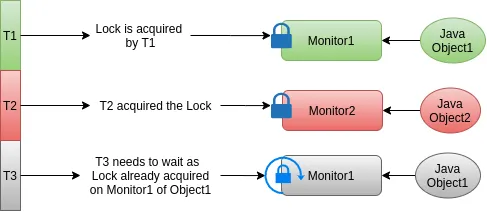

# Synchronized on class objects and the scenarios of thread blockings

In  we have seen how the synchronized keyword works and its two bytecodes the monitorenter and monitorexit. But we have seen in the context of instance methods. Now we will see what happens with static methods.

_NOTE: The words lock and monitor are used interchangeably here. Both are the same in our context._

With the static methods, the synchronization happens the same way except for the object on which the monitor is acquired. The lock/monitor is acquired on the class object.

When we use synchronized with the *instance* methods, the monitor is acquired on thethis object and when used with *static* methods the lock is acquired on the .class object.

Here is our Counter class with static synchronized methods.

```java
class Counter {


    private static int value;


    public static synchronized void increment() {
        ++value;
    }


    public static int get() {
        return value;
    }
}
```

hosted with ❤ by 

And here is the bytecode snapshot of increment() method.

```java
  public static synchronized void increment();
    Code:
       0: getstatic     #
// Field value:I
       3: iconst_
4: iadd
       5: putstatic     #
// Field value:I
       8: return
```

hosted with ❤ by 

You can see the getstatic and putstatic instructions since the value is a static variable. And we already know monitorenter and monitorexit will not come into the picture with synchronized methods. They will only come into the scene when we use synchronized blocks.

We can also rewrite the increment() method as below which would have exactly the same effect but the bytecodes will be different.

```java
private static int value;


public static void increment() {
    synchronized (Counter.class) {
        ++value;
    }
}
```

hosted with ❤ by 

```java
  public static void increment();
    Code:
       0: ldc           #
// class org/vit/threads/Counter
       2: dup
       3: astore_
4: monitorenter
       5: getstatic     #
// Field value:I
       8: iconst_
9: iadd
      10: putstatic     #
// Field value:I
      13: aload_
14: monitorexit
      15: goto
18: astore_
19: aload_
20: monitorexit
      21: aload_
22: athrow
      23: return
    Exception table:
       from    to  target type


any


any
```

hosted with ❤ by 

Now you can see there aren’t much difference b/w static and non-static methods when we use synchronized blocks. So, with the synchronized block, it doesn’t really matter whether it is a static method or a non-static method. It all depends on the object that we use in the synchronized block statement. This is as good as using synchronized(this) { ++value; }.

_With the synchronized block, it doesn’t really matter whether it is a static method or a non-static method. It all depends on which object we are using in synchronized block statement. In our case we are using Counter.class object just to demonstrate it is equal to using static synchronized method._

So let's look at a few scenarios with static and non-static synchronized methods and the thread blockings between these two. I am mentioning these simple scenarios because I have interviewed people on these lines and 90% of the candidates have not answered these properly. Let’s consider the below program to understand scenarios easily.

```java
public class ThreadBlockingDemo {


    // Non-Static Synchronized method-
public synchronized void nonStaticSyncMethod1() {
        // Some Code
    }


    // Non-Static Synchronized method-
public synchronized void nonStaticSyncMethod2() {
        // Some Code
    }


    // Static Synchronized method-
public static synchronized void staticSyncMethod1() {
        // Some Code
    }


    // Static Synchronized method-
public static synchronized void staticSyncMethod2() {
        // Some Code
    }


    // Instance Methods with No Synchronization
    public void instanceMethod1() {


    }


    public void instanceMethod2() {


    }

    // Non-Static Synchronized method-
public void syncBlockWithThisObject() {
        synchronized (this) {
            // do something
        }
    }


    // Non-Static Synchronized method-
public void syncBlockWithClassObject() {
        synchronized (ThreadBlockingDemo.class) {
            // do something
        }
    }


}
```

hosted with ❤ by 

In the above program, we have eight methods in total:

Two static: staticSyncMethod1 and staticSyncMethod2

Two non-static: nonStaticSyncMethod1 and nonStaticSyncMethod2

Two non-synchronized: instanceMethod1 and instanceMethod2

Two synchronized block: syncBlockWithThisObject and syncBlockWithClassObject

And assume that there are two threads: T1 and T2 executing simultaneously.

## Scenario #1 — Both the threads execute two non-synchronized methods:

**Context:** T1 is executing instanceMethod1() and T2 is executing instanceMethod2()

**Question**: Will these two threads be blocked on each other?

**Answer**: No

**Reason**: There is no use of synchronization on these two methods. So the threads won’t block on each other. If these methods mutate any *shared data* or in simple words *a common variable* we will have inconsistent results.

## Scenario #2 — T1 & T2 executing synchronized non-static methods:

**Context**: While T1 is executing nonStaticSyncMethod1, T2 tries to execute nonStaticSyncMethod2

**Question**: Will these two threads be blocked on each other?

**Answer**: Yes

**Reason**: T1 is executing the synchronized method, which means, it has already acquired the lock/monitor on the object this . So when T2 tries to execute the method nonStaticSyncMethod2 it also tries to acquire the lock on the this object. But it is already acquired by T1. So T2 will be in BLOCKED state until T1 releases the lock (In other words till T1 executes monitorexit statement).

## Scenario #3 — T1 & T2 executing static synchronized methods:

**Context**: While T1 is executing staticSyncMethod1, T2 tries to execute staticSyncMethod2

**Question**: Will these two threads be blocked on each other?

**Answer**: Yes

**Reason**: T1 is executing the synchronized static method, which means, it has already acquired the lock/monitor on the class object in our case ThreadBlockingDemo.class. So when T2 tries to execute the method staticSyncMethod2 it also tries to acquire the lock on the class object — ThreadBlockingDemo.class. But it is already acquired by T1. So T2 will be in BLOCKED state until T1 releases the lock (In other words till T1 executes monitorexit statement).

## Scenario #4— T1 static synchronized method & T2 executing non-static synchronized method:

**Context**: While T1 is executing staticSyncMethod1, T2 tries to execute nonStaticSyncMethod1

**Question**: Will these two threads be blocked on each other?

**Answer**: No

**Reason**: T1 is executing the synchronized static method, which means, it has acquired the lock/monitor on the class object in our case ThreadBlockingDemo.class. Now T2 tries to execute the method nonStaticSyncMethod2 . So it tries to acquire the lock on the this object. Since there is no thread holding the lock on thethis object, T2 successfully acquires the lock and proceed with its job. But assume there is another thread, T3, executing either of the synchronized methods, it will be blocked because both the objects’ locks: the this and the ThreadBlockingDemo.class already acquired by T2 & T1 respectively.

**_Scenario #5 — T1 is executing non-static synchronized method and T2 — the method with synchronized block with “this” object._**

**Context**: While T1 is executing nonStaticSyncMethod1, T2 tries to execute syncBlockWithThisObject

**Question**: Will these two threads be blocked on each other?

**Answer**: Yes

**Reason**: T1 is executing the synchronized method, which means, it has already acquired the lock/monitor on the this object. So when T2 tries to execute the method syncBlockWithThisObject as soon as it enters the synchronized block, it tries to acquire the lock on the this object because that is what is specified in the synchronized block statement. But the lock on this object has already been acquired by T1. So T2 will be in BLOCKED state until T1 releases the lock. But if T2 had tried to execute the method syncBlockWithClassObject it would not have been blocked because the lock on class object had not been acquired by any other thread.

**_Scenario #5 — T1 is executing static synchronized method and T2 — the method with synchronized block with “ThreadBlockingDemo.class” object._**

**Context**: While T1 is executing staticSyncMethod1, T2 tries to execute syncBlockWithClassObject

**Question**: Will these two threads be blocked on each other?

**Answer**: Yes

**Reason**: T1 is executing the static synchronized method, which means, it has already acquired the lock/monitor on the ThreadBlockingDemo.class object. So when T2 tries to execute the method syncBlockWithClassObject, as soon as it enters the synchronized block, it tries to acquire the lock on the ThreadBlockingDemo.class object because that is what is specified in the synchronized block statement. But the lock on ThreadBlockingDemo.class object has already been acquired by T1. So T2 will be in BLOCKED state until T1 releases the lock. But if T2 had tried to execute the method syncBlockWithThisObject it would not have been blocked because the lock on this object had not been acquired by any other thread.

Now that we understood most of the jargon around synchronized keyword, let me add the key points to summarize the locks/monitors.

## Summary

The synchronized keyword can be used in two ways: With methods and with block statements.

For the non-static synchronized methods, the lock is acquired on this object and for the static synchronized methods, the lock is acquired on the class object — The class in which the static method is defined.

Every object in Java has a monitor associated with it. We call this an *Intrinsic Lock* or *Mutual Exclusion Lock*.

For the synchronized blocks, the lock is acquired on the object that is specified in the synchronized block statement.

When we say a thread acquires a lock on an object, it means, the thread got the ownership of the monitor associated with that object.

When one thread gets the ownership of the monitor associated with an object, any other thread that wants to get the lock on the same object will get into BLOCKED state until the lock is released.

As a thumb rule of when threads block on each other, we have to look at the object on which each thread acquires a lock. If they try to acquire a lock the same object, one of them will get blocked. If they acquire a lock on a different object, then there is no question of blocking.

A thread cannot block on itself. What does this mean is, if we have two synchronized methods say M1 and M2, and M1 is calling M2; then if a thread, T1, calls M1 will acquire a lock on the object that is calling this method, and when it calls M2 from M1, the monitor count is increased to 2 saying that the same thread acquired the lock twice. When the thread returns to M1 after completing M2, it will reduce the monitor count to 1.

JVM maintains the monitor count for every object.
