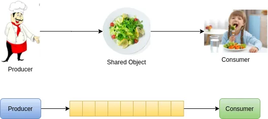
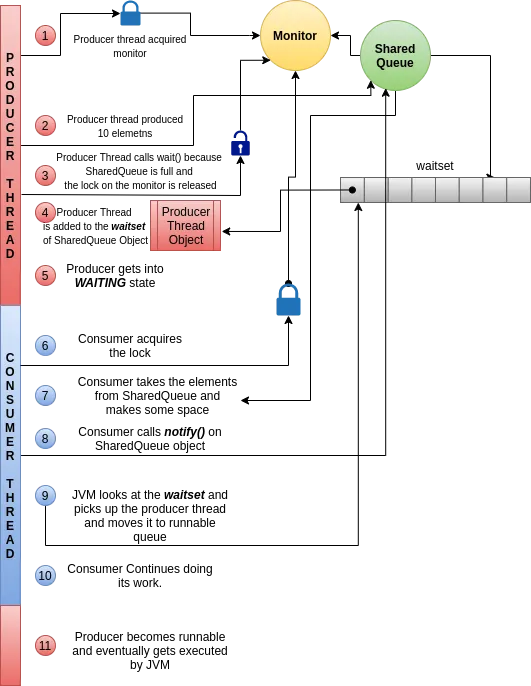

# The Interthread Communication — wait, notify, and notifyAll

In the previous module, we explored various scenarios where threads block on each other. In this module, we will discuss how threads can cooperatively communicate and coordinate their execution using the `wait()`, `notify()`, and `notifyAll()` methods.

---

## Purpose of wait and notify

A common pattern in multi-threaded programming is to have threads communicate with each other. The `wait` and `notify` mechanism is designed specifically for this. It allows one thread to signal to another that a particular condition or event has occurred.

> **Pitfall: wait/notify does NOT replace synchronization**
> The `wait` and `notify` mechanism does not replace the `synchronized` keyword; it cannot solve race conditions on its own. In fact, **`wait` and `notify` must always be used in conjunction with `synchronized`** to prevent race conditions. Attempting to call `wait()` or `notify()` outside of a synchronized context will throw an `IllegalMonitorStateException`.

---

## The Producer-Consumer Pattern

To understand `wait` and `notify`, let's explore a classic concurrency problem: the **Producer-Consumer** pattern.

> **Mental Model: The Restaurant Analogy**
> Think of a restaurant scenario to visualize this pattern:
> *   **The Chef (Producer):** Prepares food and puts it on a serving window.
> *   **The Guest (Consumer):** Takes food from the serving window and eats it.
> *   **The Serving Window (Shared Resource):** A bounded space that holds a limited number of plates.
> 
> **Coordination Flow:**
> 1.  If the serving window is full, the Chef (Producer) must wait for the Guest to eat and clear some space.
> 2.  If the serving window is empty, the Guest (Consumer) must wait for the Chef to prepare and serve a plate.
> 3.  When the Chef serves a plate, they notify the Guest. When the Guest clears a plate, they notify the Chef.

*Figure 10.1: Producer Consumer Analogy*


In programming, this shared space is typically a **Bounded Queue** (or ring buffer) of a fixed size. The threads coordinate as follows:
*   **Producer Thread:** Puts elements into the queue. If the queue is full, it calls `wait()`.
*   **Consumer Thread:** Removes elements from the queue. If the queue is empty, it calls `wait()`.

---

### Code Implementation

Here is a thread-safe implementation of a bounded shared queue:

```java
package org.vit.threads;

import java.util.ArrayList;
import java.util.List;

public class SharedQueue<E> {
    private final List<E> buffer = new ArrayList<>(10);
    private static final int MAX_BUFFER_SIZE = 10;

    public synchronized void produce(E e) throws InterruptedException {
        // Always check wait conditions in a loop to prevent spurious wakeups
        while (buffer.size() == MAX_BUFFER_SIZE) {
            System.out.println(Thread.currentThread().getName() + " BUFFER IS FULL. Going into Wait State!");
            wait(); // Releases lock and goes into WAITING state
        }
        buffer.add(e);
        System.out.println(Thread.currentThread().getName() + " Produced Element: " + e);
        notify(); // Wakes up a waiting consumer thread
    }

    public synchronized E consume() throws InterruptedException {
        while (buffer.size() == 0) {
            System.out.println(Thread.currentThread().getName() + " BUFFER IS EMPTY. Going into Wait State!");
            wait(); // Releases lock and goes into WAITING state
        }
        E e = buffer.remove(0);
        System.out.println(Thread.currentThread().getName() + " Consumed Element: " + e);
        notify(); // Wakes up a waiting producer thread
        return e;
    }
}
```

And here is the driver program to run the producer and consumer threads:

```java
package org.vit.threads;

public class SharedQueueDemo {
    private static final SharedQueue<Integer> sharedQueue = new SharedQueue<>();

    public static void main(String[] args) throws InterruptedException {
        Runnable produceTask = () -> {
            int i = 1;
            while (true) {
                try {
                    sharedQueue.produce(i++);
                } catch (InterruptedException e) {
                    e.printStackTrace();
                }
            }
        };

        Runnable consumerTask = () -> {
            while (true) {
                try {
                    sharedQueue.consume();
                } catch (InterruptedException e) {
                    e.printStackTrace();
                }
            }
        };

        Thread tProducer = new Thread(produceTask, "Producer");
        Thread tConsumer = new Thread(consumerTask, "Consumer");

        tProducer.start();
        tConsumer.start();

        tProducer.join();
        tConsumer.join();
    }
}
```

---

## Under the Hood: The waitset

In Java, every object has two special JVM structures associated with it:
1.  **The Monitor (Intrinsic Lock):** Governs mutual exclusion (which thread can execute synchronized blocks).
2.  **The Waitset:** A queue/set maintained by the JVM that holds threads that have voluntarily paused their execution on this object.

> **Insight: Mechanics of wait() and notify()**
> When a thread executes `wait()` on an object:
> 1.  **Lock Release:** The thread immediately **releases the monitor** (lock) it holds on that object, allowing other threads to acquire the lock.
> 2.  **Transition to WAITING:** The thread is placed into the **waitset** of that object and enters the **`WAITING`** state.
> 
> When a thread executes `notify()` on an object:
> 1.  **Signal Transmission:** The JVM selects a thread from the object's **waitset** and moves it to the **`RUNNABLE`** queue. Note that `notify()` picks a thread at random; `notifyAll()` moves *all* threads in the waitset back to the runnable queue.
> 2.  **Re-acquiring the Monitor:** The awakened thread cannot resume execution immediately. It must wait to re-acquire the monitor (lock) of the object when the notifying thread exits its synchronized block. Once the lock is re-acquired, it resumes execution from the exact instruction after `wait()`.

Below is the lifecycle flow of threads communicating through a waitset and monitor:

*Figure 10.2: Wait and Notify Flow*


---

## Summary

*   **Thread Communication:** `wait()`, `notify()`, and `notifyAll()` allow threads to coordinate based on shared state conditions.
*   **Synchronized Context:** You must hold the object's lock (monitor) before calling `wait()` or `notify()`, otherwise an `IllegalMonitorStateException` is thrown.
*   **Waitset:** Along with a monitor, every object has a waitset. Calling `wait()` releases the lock and puts the thread in the object's waitset.
*   **Waking Up:** `notify()` wakes up a single random thread from the waitset; `notifyAll()` wakes up all threads. Awakened threads enter the `RUNNABLE` state and must re-acquire the monitor before resuming.
*   **Condition Loops:** Always invoke `wait()` inside a `while` loop that checks the condition, never in an `if` statement, to guard against spurious wakeups.
