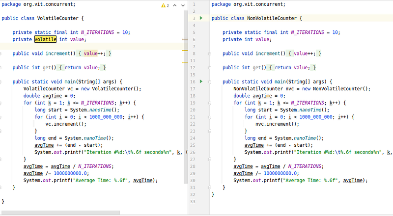

# Volatiles

So far, we have seen synchronization using locking via the `synchronized` keyword, which is a strong primitive for writing concurrent programs in Java. In this module, we will explore a weaker yet highly effective form of synchronization construct: **volatile** variables.

---

## Terminology: synchronized vs. synchronization

Before diving into volatiles, it is crucial to distinguish between these two similar terms:
*   **`synchronized`:** The Java keyword that provides a mutual exclusion lock, restricting execution of a block or method to a single thread at a time.
*   **`synchronization`:** A broader concept that refers to any mechanism used to coordinate thread execution and ensure memory visibility (including locks, volatile variables, atomic classes, and the Lock API).

The **volatile** keyword is a lightweight form of synchronization. Its main purpose is to establish a predictable order of **Synchronization Actions** (a term defined in the Java Language Specification, JLS 17.4) and ensure memory visibility.

---

## Shared Multiprocessor Architecture

Processors are responsible for executing program instructions. To do so, they must retrieve instructions and required data from the main system memory (RAM). 

Because CPUs execute billions of instructions per second, fetching data from RAM on every operation is too slow and creates a bottleneck. To optimize performance, modern processors use tricks like **Out-of-Order Execution**, **Branch Prediction**, **Speculative Execution**, and **Caching**.

This introduces a multi-level CPU cache hierarchy:

```text
+------------------------------------------+
|                Main Memory (RAM)         |
+------------------------------------------+
                     |
         +-----------+-----------+
         |                       |
+-----------------+     +-----------------+
|    L3 Cache     |     |    L3 Cache     |
+-----------------+     +-----------------+
         |                       |
+-----------------+     +-----------------+
|    L2 Cache     |     |    L2 Cache     |
+-----------------+     +-----------------+
         |                       |
+-----------------+     +-----------------+
| L1 Cache (Core1)|     | L1 Cache (Core2)|
+-----------------+     +-----------------+
         |                       |
+-----------------+     +-----------------+
|     Core 1      |     |     Core 2      |
+-----------------+     +-----------------+
```

*Figure 12.1: Modern multi-core CPU cache hierarchy*

As different CPU cores execute instructions, they fill their local, ultra-fast caches (L1 and L2) with relevant data. While this dramatically improves overall execution speed, it introduces severe **Cache Coherence** challenges in concurrent environments where threads run on different cores and share variables.

---

## Cache Coherence Challenges: The TaskRunner Example

To understand cache coherence and how it impacts concurrent Java programs, let's look at a classic example from the book *Java Concurrency in Practice*:

```java
public class TaskRunner {

    private static int number;
    private static boolean ready;

    private static class Reader extends Thread {
        @Override
        public void run() {
            while (!ready) {
                Thread.yield(); // Yield CPU time slice
            }
            System.out.println(number);
        }
    }

    public static void main(String[] args) {
        new Reader().start();
        number = 42;
        ready = true;
    }
}
```

*Figure 12.2: TaskRunner demonstrating memory visibility and reordering anomalies*

> **Problem**
> In shared multiprocessor architectures, a lack of proper memory visibility and instruction reordering can cause threads running on different CPU cores to see inconsistent states of shared variables, leading to silent data corruption, stale reads, or infinite loops.

At first glance, you might expect this program to start the `Reader` thread, wait for the `main` thread to set `number = 42` and `ready = true`, exit the `while` loop, and print **42**.

However, without proper synchronization, this program can exhibit three highly unexpected behaviors:
1.  **Infinite Loop (Liveness Failure)**: The `Reader` thread may spin in the `while` loop forever, never seeing `ready` become `true`.
2.  **Print Zero**: The `Reader` thread may exit the loop but print **0** instead of 42.
3.  **Variable Delay**: The thread may print 42, but only after an unpredictable and significant delay.

These anomalies are caused by two fundamental concurrency issues: **Memory Visibility** and **Instruction Reordering**.

### 1. Memory Visibility
When the `main` thread and the `Reader` thread are scheduled on different CPU cores, they each load copies of `ready` and `number` into their respective local L1/L2 caches.
- Modern processors do not write updates directly to RAM. Instead, writes are queued in a local **write buffer** and flushed to main memory in batches later.
- If the `main` thread updates `ready` in its write buffer, there is no guarantee when that update will be flushed to RAM, or when the `Reader` thread's core will invalidate its own L1 cache and fetch the updated value from RAM. As a result, the `Reader` thread may never see `ready == true`.

### 2. Instruction Reordering
To maximize execution speed, the JIT compiler, JVM, and CPU are allowed to **reorder program instructions**, as long as the execution results remain identical *within that thread in isolation*.

In the `main` method, the program text specifies:
```java
number = 42;
ready = true;
```

However, because these two operations are independent, the compiler or the CPU's out-of-order execution engine may reorder them:
```java
ready = true;
number = 42;
```

If this reordering occurs:
1.  The `main` thread sets `ready = true` and flushes it to main memory.
2.  The `Reader` thread sees `ready == true`, exits its loop, and prints `number`.
3.  Because `number = 42` has not yet been executed or flushed, the `Reader` thread reads the default uninitialized value of `number` from RAM, printing **0**.

---

## The Volatile Solution

> **Mental Model: The Direct RAM Pipeline**
> Visualize a `volatile` field as establishing a direct pipeline between your application threads and the main system memory (RAM). Writing to a volatile variable immediately flushes the thread's local cache modifications to RAM. Reading from a volatile variable instantly invalidates the thread's local cache, forcing it to fetch the latest values directly from RAM.

To resolve these cache coherence and reordering issues, we can apply the **`volatile`** modifier to our shared variables:

```java
public class TaskRunner {
    private volatile static int number;
    private volatile static boolean ready;

    // ... (rest of the code remains identical)
}
```

When a variable is declared `volatile`, the JVM and CPU are instructed to enforce two strict rules:

### 1. Direct Memory Access (No Caching)
Volatile variables are never cached in CPU registers or local L1/L2 caches. 
- **Volatile Writes**: Any write to a volatile variable is immediately flushed past the local write buffers directly to **Main Memory (RAM)**.
- **Volatile Reads**: Any read of a volatile variable bypasses local CPU caches and is fetched directly from **Main Memory (RAM)**.
This ensures that updates made by one thread are immediately visible to all other threads, preventing memory visibility failures.

### 2. Disabling Instruction Reordering (Memory Barriers)
The JVM inserts **memory barriers (fences)** in the generated machine code around volatile reads and writes. This prevents the compiler, JIT, and CPU from reordering instructions across the barrier. Any instruction appearing before the volatile write in the program text is guaranteed to execute before the write occurs.

Below is a visual representation of how volatile writes force data propagation directly to RAM:



*Figure 12.3: Volatile writes bypassing local CPU caches to write directly to RAM*

---

## Volatile and Thread Synchronization

In multithreaded programming, consistent behavior requires two properties:
1.  **Mutual Exclusion (Locking)**: Ensures only one thread can execute a critical section of code at a time.
2.  **Memory Visibility**: Ensures changes made by one thread to shared data are immediately visible to other threads.

Standard synchronization blocks (`synchronized`) provide both properties but incur a heavy performance cost because they force thread blocking, lock acquisition, and context switches.

The **`volatile`** keyword is a lightweight synchronization mechanism because it **guarantees memory visibility without enforcing mutual exclusion**. 
- Multiple threads can execute code containing volatile variables in parallel without blocking.
- However, because it does not enforce mutual exclusion, it does not guarantee atomicity.

### Volatile vs. Synchronized Comparison

| Feature | `volatile` | `synchronized` |
| :--- | :--- | :--- |
| **Type** | Field modifier | Method / Block modifier |
| **Mutual Exclusion** | No | Yes |
| **Visibility Guarantee** | Yes | Yes |
| **Atomicity** | No (except for 64-bit reads/writes) | Yes |
| **Thread Blocking** | No (non-blocking) | Yes (threads can block waiting for the lock) |
| **Performance Overhead** | Low (direct memory access, no context switching) | High (thread context switching, locking overhead) |
| **Compiler Optimization** | Prevents reordering around the variable | Prevents reordering inside the synchronized block |

> **Pitfalls: The Atomicity Trap**
> The `volatile` modifier is **not** a complete replacement for `synchronized` or locks. While it guarantees that a thread reads the absolute latest value, it does *not* provide mutual exclusion. Compound operations like increments (`value++` which consists of a read, update, and write) are still subject to race conditions and are not thread-safe under concurrent writes.

---

## The Volatile Guarantees and JLS Specification

The Java Language Specification (JLS 17.4) defines the strict contracts of a volatile variable:

*   **Instruction Order Guarantee**: For each thread, the runtime and processor must execute instructions related to a volatile variable in the exact order they appear in the program text, disabling any performance optimizations that would reorder them.
*   **Consistent Value Guarantee**: All threads are guaranteed to see a consistent, up-to-date value for the volatile variable. A thread can never read a stale or inconsistent value after an update has occurred.

> [!NOTE]
> **Stale Value Probability**
> The absence of the `volatile` modifier does not mean that threads will *always* see inconsistent or stale values; rather, it means the JVM makes no guarantees. Stale reads may occur occasionally or under heavy thread load. Declaring a variable `volatile` upgrades this from a probabilistic chance to an absolute guarantee.

---

## Happens-Before Ordering

The memory visibility effects of volatile variables extend beyond the volatile variables themselves due to the **Happens-Before** memory ordering rules of the **Java Memory Model (JMM)**.

> **JLS 17.4.4: The Volatile Variable Rule**
> A write to a volatile field *happens-before* every subsequent read of that same field.

This means that if Thread A writes to a volatile variable, and Thread B subsequently reads that same variable, **all memory writes performed by Thread A *before* writing the volatile variable are guaranteed to be visible to Thread B *after* it reads the volatile variable**.

```text
Thread A (Core 1)                       Thread B (Core 2)
=================                       =================
number = 42; (non-volatile write)
       |
       v [Happens-Before]
ready = true; (volatile write) --------> If (ready == true) (volatile read)
                                                    |
                                                    v [Happens-Before]
                                         print(number); // Guaranteed to see 42!
```

*Figure 12.4: Happens-before relationship established by a volatile write-read barrier*

---

## Piggybacking (Visibility Propagation)

> **Insights: Piggybacking Optimization**
> Leverage the Java Memory Model's Happens-Before ordering to reduce the overhead of direct RAM access. By routing all concurrent state checks through a single `volatile` flag (e.g., `ready`), you can expose updates made to surrounding non-volatile fields without paying the performance tax of marking every single field as `volatile`.

Thanks to the strength of the happens-before relationship, we can **piggyback** on the visibility guarantees of another volatile variable. 

Instead of marking every shared variable in our class as `volatile` (which would incur a heavy performance cost), we only need to declare a single coordination variable as `volatile`.

In our `TaskRunner` example, we can declare **only** `ready` as volatile, leaving `number` as a standard non-volatile integer:

```java
public class TaskRunner {
    private static int number; // NOT volatile
    private volatile static boolean ready; // volatile

    // ... (rest of the code remains identical)
}
```

### Why Piggybacking Works
1.  In `main()`, the non-volatile write `number = 42` occurs before the volatile write `ready = true` in program order.
2.  By the JMM rules, the write to `number` happens-before the write to `ready`.
3.  When the `Reader` thread executes `while (!ready)`, it performs a volatile read. Once it reads `ready == true`, JMM guarantees that all writes that happened-before `ready = true` (including `number = 42`) are fully flushed and visible to the `Reader` thread.
4.  Therefore, the non-volatile variable `number` **piggybacks** on the memory visibility enforced by the volatile variable `ready`, exhibiting volatile-like visibility without the performance overhead.

Using piggybacking, developers can minimize the number of volatile variables in a class while still maintaining strict thread-safety and visibility guarantees.

---

## Performance Impact: The Cost of Volatiles

> **Pitfalls: Performance Tax**
> Because `volatile` variables bypass CPU caches and force direct RAM access, using them in tight, high-frequency loops disables critical JIT optimizations (like register allocation and loop unrolling) and can degrade performance by orders of magnitude (e.g., over 1000x slower in counter benchmarks). Use them sparingly and only for coordination or state flags.

While volatiles are lighter than locks because they do not cause threads to block or context switch, they still carry a significant performance cost. Because they bypass CPU caches and force direct RAM access, operations on volatiles are much slower.

Let's look at a simple performance benchmark where a variable is incremented one billion times:

```java
public class NonVolatileCounter {
    private static final int N_ITERATIONS = 10;
    private int value;

    public void increment() {
        value++;
    }

    public int get() {
        return value;
    }

    public static void main(String[] args) {
        NonVolatileCounter nvc = new NonVolatileCounter();
        double avgTime = 0;
        for (int k = 1; k <= N_ITERATIONS; k++) {
            long start = System.nanoTime();
            for (int i = 0; i < 1000_000_000; i++) {
                nvc.increment();
            }
            long end = System.nanoTime();
            avgTime += (end - start);
            System.out.printf("Iteration #%d:\t%.6f seconds%n", k, (end - start) / 1000000000.0);
        }
        avgTime = avgTime / N_ITERATIONS;
        avgTime /= 1000000000.0;
        System.out.printf("Average Time: %.6f seconds", avgTime);
    }
}
```

### Benchmark 1: Non-Volatile Variable
```text
Iteration #1: 0.048583 seconds
Iteration #2: 0.013297 seconds
Iteration #3: 0.000000 seconds
...
Iteration #10: 0.000000 seconds
Average Time: 0.006188 seconds
```
Except for the initial JIT compiler warmup iterations, the increments run almost instantly because the JVM caches the variable in CPU registers and optimizes the loop.

### Benchmark 2: Volatile Variable
Adding the `volatile` keyword to the `value` field and running the exact same benchmark yields:
```text
Iteration #1: 5.394576 seconds
Iteration #2: 7.370640 seconds
Iteration #3: 7.361875 seconds
...
Iteration #10: 7.371776 seconds
Average Time: 7.171190 seconds
```

> [!IMPORTANT]
> **Analyzing the Performance Cost**
> Adding `volatile` causes the average execution time to jump from **0.006 seconds** to **7.17 seconds**—a massive degradation. This is because the JVM is forced to write directly to RAM one billion times and is prevented from executing JIT loop optimizations, register allocation, or instruction reordering.

---

## Example: Stopping a Thread Gracefully

A common and safe use case for `volatile` is a shutdown flag:

```java
public class StoppingThreadWithVolatileDemo {
    private static volatile boolean stopIncrementing = false;

    public static void main(String[] args) throws InterruptedException {
        Thread tIncrementer = new Thread(() -> {
            System.out.println(Thread.currentThread() + ": Started incrementing ...");
            int i = 1;
            while (!stopIncrementing) {
                i++;
            }
            System.out.println(Thread.currentThread() + ": Completed with I = " + i + ".");
        }, "INCREMENTER");

        Thread tStopper = new Thread(() -> {
            stopIncrementing = true;
            System.out.println(Thread.currentThread() + ": Set the 'stopIncrementing' flag to 'true'.");
        }, "STOPPER");

        tIncrementer.start();
        Thread.sleep(500);
        tStopper.start();

        tIncrementer.join();
        tStopper.join();

        System.out.println(Thread.currentThread() + ": Completed!");
    }
}
```

**Output:**
```text
Thread[INCREMENTER,5,main]: Started incrementing ...
Thread[STOPPER,5,main]: Set the 'stopIncrementing' flag to 'true'.
Thread[INCREMENTER,5,main]: Completed with I = 732098147.
Thread[main,5,main]: Completed!
```

If we remove the `volatile` keyword from `stopIncrementing`, the `INCREMENTER` thread may cache the flag locally and never see the update from the `STOPPER` thread, causing the program to run infinitely.

---

## 64-Bit Variable Atomicity

While volatiles do not guarantee atomicity for operations like incrementing, they do guarantee atomicity for **reads and writes of 64-bit variables** (`long` and `double`).

### Why 32-Bit Reads/Writes are Atomic
In Java, read and write operations on variables of 32-bit size or less (`byte`, `short`, `char`, `int`, `float`, `boolean`, and object references) are guaranteed by the JVM to be atomic. 

### Why 64-Bit Reads/Writes are NOT Atomic by Default
For non-volatile `long` and `double` variables, the JVM is allowed to treat a single 64-bit write as two separate 32-bit writes (one to each half of the variable). This can lead to a state where a reader thread sees a "half-written" value—the first 32 bits from one write and the second 32 bits from another.

> **JLS 17.7: Non-Atomic Treatment of double and long**
> Writes and reads of volatile long and double values are always atomic.
> 
> A JVM implementation is free to perform writes to non-volatile long and double values atomically or in two parts. To prevent complications with shared 64-bit values, programmers are encouraged to declare them as **volatile** or synchronize their access.

### Compile-Time Error with final and volatile
Declaring a variable as both `final` and `volatile` results in a compile-time error. Since `final` variables can never be changed, declaring them `volatile` (which is designed to track changing memory states) is a logical contradiction.

---

## Summary

*   **Memory Visibility:** Volatile variables guarantee that any thread reading the variable always sees the latest value written by another thread immediately.
*   **Direct Memory Access:** Volatiles bypass CPU caches and registers; reads and writes go directly to Main Memory (RAM), ensuring cache coherence.
*   **No Instruction Reordering:** The JVM inserts memory barriers to prevent compilers and CPUs from reordering instructions around volatile variables.
*   **No Mutual Exclusion:** Volatiles do not provide locking or atomicity. They are only safe for single-writer scenarios, simple state flags, or when combined with piggybacking.
*   **Happens-Before Order**: A write to a volatile variable happens-before every subsequent read of the same variable. This rule establishes memory visibility boundaries for surrounding variables.
*   **Piggybacking**: Allows non-volatile variables to inherit the memory visibility guarantees of a volatile variable by placing writes before a volatile write and reads after a volatile read.
*   **64-Bit Atomicity:** Marking `long` and `double` variables as `volatile` guarantees that their 64-bit read/write operations are executed atomically.
*   **No final volatile:** A variable cannot be both `final` and `volatile`.
