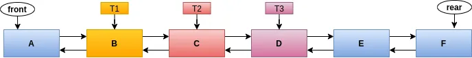

# The Locks API — Reentrant Locks

We have seen the locking mechanism using the synchronized keyword in previous parts of this series. Much of this mechanism is also provided by the classes and interfaces of java.util.concurrent.locks package(introduced in Java 5). The Lock API implementations from java.util.concurrent.locks package provide more extensive locking operations than those that can be obtained using synchronized keyword.

There are important reasons why we need to go for this package. So, to start with, let’s understand that there are two kinds of locking: ***Structured*** and ***Unstructured.***

***Structured Locking:*** *Structured locks *enforce all lock acquisition and release to occur in a block-structured way: This means two things. First, when multiple locks are acquired they must be released in the opposite order. Second, all locks must be released in the same *lexical scope* in which they have been acquired.

What we have seen so far with the synchronized constructs is *Structured Locking. *Consider the code below to understand this better. Assume that we have three synchronized blocks nested in one another as below.

```java
synchronized (L1) {
    synchronized (L2) {
        synchronized (L3) {
        }
    }
}
```

As the thread enters each of the synchronized block, the respective locks are acquired in the order in which they are defined, in our case the order isL1, L2, and L3. And as the thread exits each of these blocks, they are released in the opposite order: L3, L2, and L1. This is the first thing that we specified with structured locking. The second thing is, because of the implicit acquisition and release provided by synchronized constructs, the locks acquired in one block are released in the same block (_Lexical Scope_). In our example, the lock L3 is always released in the same block just before the thread leaves that block. So the release of the locks happens in reverse order. This is what *Structured Locking* means. With the structured locking provided by synchronized, we can implement concurrent programming straight away without much effort or complex code and it also helps avoid many common programming errors. The other point to be noted is, with structured locking the critical region(code block within the synchronized statement) can only be executed by one thread at a time.

**_Unstructured Locking_**: While withsynchronized, it is much easier to program, there are occasions where we need to work with locks in a more flexible way. For example, some algorithms for traversing concurrently accessed data structures require the locking in a different way, such as allowing a lock to be acquired and released in different scopes and in any order. For example, considering traversing a Concurrent Doubly Linked List, there might be a scenario where we need to acquire the lock of node **A**, then node **B**, then release **A** and acquire **C**, then release **B** and acquire **D** and so on. This is also known as “*hand-over-hand” *or\* *“*chain locking” *and is the best example of *Unstructured Locking. *But we* \*will not be able to implement this kind of locking mechanism with the traditional synchronized constructs. This is where the implementations of the Lock API comes and enables the programmer to implement such locking techniques. The Lock API gives the programmers control of explicitly acquiring and releasing in any order of their choice.

So as a summary, with unstructured locking, more than one lock can be acquired by a thread and released in any order. And also the lock acquired in one block can be released in another block.

The Lock API not only gives us the support to deal with *Unstructured Locking* but also helps with the scenarios where synchronized constructs can be avoided. Let’s look at an example of a *Concurrent Doubly Linked List *from which multiple threads want to delete the nodes. This scenario is depicted in the below diagram.

In the above diagram, we have a Doubly Linked List and assume that each node in this list has a lock object associated with it. And there are three threads **T1**, **T2**, and **T3** trying to delete nodes **B**, **C**, and **D** respectively. This needs to be done by **T1**, **T2**, and **T3** in a concurrent thread-safe manner.

Now, for the thread**T1** to delete node **B **, it has to acquire the lock on nodes **A**, **B**, and **C**. Because it needs to modify the links of A, B, and C as follows.

```java
// Pseudo code for deleting a node from doubly linked list with locking.
// Assuming the node to be deleted is neither the first nor last.
// **curr** is the node to be deleted, in our case it is **B**, **curr.prev** is **A **and** curr.next **is** C**DELETE(curr) {
    **LOCK** curr, curr.prev, curr.next
    curr.prev.next = curr.next;
    curr.next.prev = curr.prev;
    **UNLOCK** curr.next, curr, curr.prev
}
```

You can see in the above code that the lock needs to be acquired on the three nodes. But why do we need a lock on all three nodes? Why can’t we simply take a global object and acquire a lock on that object using a synchronized block and perform the node deletion in this block as below?

```java
private static final Object ***MUTEX**** *= new Object();
public void removeNode(DLLNode curr) {
    synchronized(***MUTEX***) {
        curr.prev.next = curr.next;
        curr.next.prev = curr.prev;
    }
}
```

Well, though this is rather simple and easier to code, there are two important reasons why we should NOT go for synchronized block here.

First, there may be a chance of thread ***starvation***. Suppose, let’s say, T1 comes in and acquires the lock on the object **MUTEX**. Now T2 and T3 are BLOCKED as the lock on **MUTEX** is already acquired by T1. After T1deletes**Node-B** and releases the lock, either T2 or T3 will get a chance to acquire the lock. Let's say T2 acquired the lock and doing the process of deleting **Node-C**. Now, assume that, in between, another thread T4 comes and tries to delete another node. So, both T3, and T4 are in BLOCKED state since T2 already acquired the lock. Now, after T2 completing and releasing the lock, either T3 or T4 can acquire the lock. Because with synchronized, there is no guarantee of the order of threads acquiring the locks, let's assume thatT4 acquired the lock. So T3 missed the chance twice in our scenario. Like this, if there are multiple deletions getting triggered by the other threads, a few threads may never get a chance to acquire the lock and they remain in BLOCKED state forever. This is called the *Thread Starvation *— The threads starve for the CPU. This is where the Lock API again helps us. We can avoid this situation by configuring the ReentrantLock object to support a *Fair Locking Policy* or *Guaranteed Ordering — *which means the* threads *get executed on a first come first serve basis. This is depicted as below.

```java
private boolean final **FAIRNESS** = true;
private static final Lock ***MUTEX**** *= new ReentrantLock(**FAIRNESS**);public void removeNode(DLLNode curr) {
    **MUTEX.lock();**
    try {
        curr.prev.next = curr.next;
        curr.next.prev = curr.prev;
    } finally {
        **MUTEX.unlock();**
    }
}
```

Don’t bother about it now. We haven’t introduced the Lock API yet. But I took the liberty of showing what it looks like and this is rather simple to understand. Instead of the synchronized block we have explicit invocations of lock() and unlock() methods on the MUTEX object which is now of the type Lock interface. ReentrantLock is one of implementations of Lock interface and it provides the locking semantics same that of the as synchronized keyword along with *Fair Locking Policy *which ensures *Guaranteed Ordering*. Note the FAIRNESS flag passed to the constructor of ReentrantLock. We will see the fairness in more detail. I just wanted to give you a glimpse of what it looks like.

The second reason for not going with the synchronized block is, we are unnecessarily blocking the other threads. How? Look at the below sequence of acquiring and releasing the lock associated with each node.

```java
*// Unstructured Locking**
*T
-> Locks A, B, and C
T
-> Locks B, C, and D
T
-> Locks C, D, and E
T
-> Locks D, E, and F // Given T
wants to delete Node E
```

From the locking sequence mentioned above, if we look at closely, threads T1 and T4 don’t have to wait on each other. They can go parallelly independently because T1 requires a lock on **A**, **B**, and **C** since it only plays with these pointers and T4 requires the lock on **D**, **E, **and **F**. There is no overlapping of lock acquisitions for T1 and T4. So, T1 and T4 need not be blocked on each other. But if we use synchronized they will get blocked. So Lock API again comes to the rescue. With Lock API, we can only perform the locks on respective nodes rather than locking on a global object, as a result, it does not block the threads unnecessarily thereby increasing the throughput of the overall operations.

Now, with that background set, it is now time to get ourselves introduced to the Lock API(We have already seen a glimpse of it). The package java.util.concurrent.locks contains an interface with the name Lock. And there are several implementations of this interface.

The Lock interface has two main methods:

**lock() **— for\*\* \*\*acquiring the lock.

**unlock()** — for releasing the lock.

Unlike the synchronized, it is the programmers' responsibility to release the lock. This is for better flexibility especially with the *hand-over-hand* or *chain locking*. It is a very common and safer practice of following the try-finally idiom of acquiring a lock just above the try block and releasing it in finally block as below.

```java
Lock l = ...;
l.lock();
try {
    // critical region
    *// access the resource protected by this lock**
*} finally {
    l.unlock();
}
```

Just above thetry block we acquire the lock by calling lock() method. It is always safer to call unlock() in the finally block because if any exception occurs the lock will still be released.

Call to lock() cause the thread to be blocked if the lock is already acquired by another thread. There are other variants like tryLock() and lockInterruptibly() which we will see in later parts of this series.

The Lock API is much more powerful apart from the synchronization mechanisms that it offers as it can provide non-reentrant usage, fair-locking policies.

There are several implementations of Lock interface. The one that we are going to see is ReentrantLock which work the same as synchronized (Note that synchronized has the inbuilt reentrancy).

Below is the thread-safe Counter which is re-written with ReentrantLock.

```java
import java.util.concurrent.locks.Lock;
import java.util.concurrent.locks.ReentrantLock;


class Counter
{


    private final Lock mutex = new ReentrantLock();
    private int value;


    public void increment() {
        mutex.lock();
        try {
            ++value;
        } finally {
            mutex.unlock();
        }
    }


    public int get() {
        mutex.lock();
        try {
            return value;
        } finally {
            mutex.unlock();
        }
    }
}


public class CounterDemo
{


    private static final Counter
counter = new Counter2();


    public static void main(String[] args) throws InterruptedException {
        Runnable incrementTask = () -> {
            for (int i = 0; i < 1000000; i++) {
                counter.increment();
            }
        };


        Thread t
= new Thread(incrementTask, "T1");
        Thread t
= new Thread(incrementTask, "T2");


        long start = System.nanoTime();
        t1.start();
        t2.start();


        t1.join(); // Wait here till T
completes
        t2.join(); // Wait here till T
completes
        long end = System.nanoTime();


        String timeTaken = String.format("%.2f", (end - start) / 1000000.0);
        System.out.println("Final Counter Value: " + counter.get() + " Time Taken: " + timeTaken + " millis");
    }


}
```

Illustration 14.1 Thread-Safe Counter with ReentrantLock

In the above program, we have created an object of ReentrantLockat line 6 and invoked lock() method on this object at lines 10 and 19 to acquire the lock. The call to lock() can be thought of as entering into synchronized block and causes the calling thread to be blocked if another thread was already successful in calling the lock() method and acquired a lock. And we called unlock() at line 14 and 23 to release the lock. This call to unlock() can be thought of as coming out of synchronized block.

_Using ReentrantLock is very simple with the idiom of try and finally._

In later parts of this series, we will see more usages of ReentrantLocks and other methods along with *Condition* objects.
