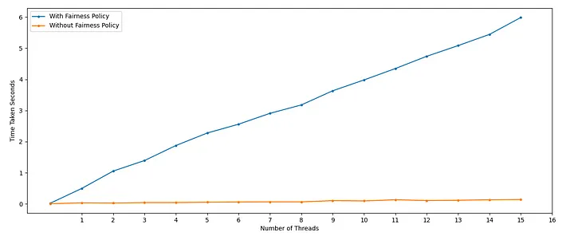

# ReentrantLocks and Fairness Continued

In the previous module, we introduced the `Lock` interface and its implementation class `ReentrantLock`. In this module, we will explore `ReentrantLock` in greater depth. We will examine the advanced methods offered by the Lock API, discuss how `tryLock()` helps prevent deadlocks, and compare the performance of **fair** and **non-fair** locking policies.

---

## The Lock Interface API

The `java.util.concurrent.locks.Lock` interface defines the following contract:

```java
public interface Lock {
    void lock();
    void lockInterruptibly() throws InterruptedException;
    boolean tryLock();
    boolean tryLock(long timeout, TimeUnit unit) throws InterruptedException;
    void unlock();
    Condition newCondition();
}
```

Unlike the blocking `lock()` method, the `tryLock()` method is non-blocking and is highly valuable for writing deadlock-free code.

---

## Deadlock Avoidance with tryLock()

The `tryLock()` method has two overloads:
1.  **`tryLock()` (Untimed/Polled):** Attempts to acquire the lock immediately. If successful, it returns `true`; if the lock is held by another thread, it immediately returns `false` and backs off instead of blocking.
2.  **`tryLock(long timeout, TimeUnit unit)` (Timed):** Attempts to acquire the lock. If it is not immediately available, the thread blocks and waits for up to the specified timeout before returning `false`.

### Standard tryLock() Idiom
```java
Lock lock = new ReentrantLock();
if (lock.tryLock()) { // Enters only if lock is successfully acquired
    try {
        // manipulate protected state
    } finally {
        lock.unlock();
    }
} else {
    // perform alternative actions (back off and retry)
}
```

---

> **Insight: Deadlock Avoidance Mechanics**
> With traditional `synchronized` blocks, if a thread acquires Lock A and blocks waiting for Lock B, it holds onto Lock A indefinitely, which can easily lead to a deadlock. 
> With `tryLock()`, if a thread cannot acquire both locks, it immediately releases the locks it already holds (backs off), sleeps briefly to allow other threads to complete, and retries. This probabilistic locking avoids deadlocks completely.

### Example: Deadlock-Free Fund Transfer
The following example uses `tryLock()` to transfer funds between two accounts without any risk of deadlock:

```java
public class TransactionService {
    public boolean transferFunds(Account fromAccount, Account toAccount, double amount, long timeOutMillis)
            throws InterruptedException, InsufficientFundsException {
        long stopTimeMillis = System.currentTimeMillis() + timeOutMillis;
        
        while (System.currentTimeMillis() < stopTimeMillis) {
            if (fromAccount.getLock().tryLock()) {
                try {
                    if (toAccount.getLock().tryLock()) {
                        try {
                            if (fromAccount.getBalance() - amount < 0) {
                                throw new InsufficientFundsException();
                            } else {
                                fromAccount.debit(amount);
                                toAccount.credit(amount);
                                return true;
                            }
                        } finally {
                            toAccount.getLock().unlock();
                        }
                    }
                } finally {
                    fromAccount.getLock().unlock();
                }
            }
            Thread.sleep(100); // Back off and wait before retrying
        }
        return false; // Transaction timed out
    }
}
```

We can also write this using the **timed version** of `tryLock()` to wait for a specific duration:

```java
while (System.currentTimeMillis() < stopTimeMillis) {
    if (fromAccount.getLock().tryLock(100, TimeUnit.MILLISECONDS)) {
        try {
            if (toAccount.getLock().tryLock(100, TimeUnit.MILLISECONDS)) {
                try {
                    if (fromAccount.getBalance() - amount < 0) {
                        throw new InsufficientFundsException();
                    } else {
                        fromAccount.debit(amount);
                        toAccount.credit(amount);
                        return true;
                    }
                } finally {
                    toAccount.getLock().unlock();
                }
            }
        } finally {
            fromAccount.getLock().unlock();
        }
    }
    Thread.sleep(100);
}
```

---

## Lock Fairness: Fair vs. Non-Fair Locks

The `ReentrantLock` constructor accepts an optional boolean parameter to define its **fairness policy**:

```java
Lock fairLock = new ReentrantLock(true); // Fair lock
Lock nonFairLock = new ReentrantLock(false); // Non-fair lock (Default)
```

*   **Non-Fair Locking (Default):** The lock does not guarantee any particular access order. If a lock is released and a thread happens to request it at that exact moment, it can "barge" in and acquire the lock, jumping ahead of threads that were already waiting in the lock queue.
*   **Fair Locking:** The lock prefers granting access to the longest-waiting thread. It maintains an internal queue and forces threads to join the tail of the queue if the lock is busy.

---

> **Pitfall: The True Cost of Fairness**
> Novice programmers often assume that fair locks are better because they are "fairer". However, in practice, **fair locks are significantly slower than non-fair locks**.
> 
> Why? Because managing the queue, context-switching the suspended threads, and preventing barging requires significant JVM and OS overhead. A non-fair lock allows a currently running thread to quickly acquire and release the lock, maximizing CPU throughput.
> 
> *Note: The untimed `tryLock()` method does not honor the fairness setting. It will immediately barge and acquire the lock if it is available, even if other threads are waiting in the queue.*

---

### Benchmark: Fair vs. Non-Fair Locks
Let's measure the performance of a thread-safe `ConcurrentDoublyLinkedList` performing append operations under both locking policies:

```java
import java.util.ArrayList;
import java.util.List;
import java.util.concurrent.locks.Lock;
import java.util.concurrent.locks.ReentrantLock;

public class ConcurrentDoublyLinkedList<E> {
    private final Lock GLOBAL_MUTEX;

    private class DLLNode {
        private DLLNode prev;
        private E data;
        private DLLNode next;

        private DLLNode(DLLNode prev, E data, DLLNode next) {
            this.prev = prev;
            this.data = data;
            this.next = next;
        }
    }

    private DLLNode front;
    private DLLNode rear;

    public ConcurrentDoublyLinkedList() {
        this(true);
    }

    public ConcurrentDoublyLinkedList(boolean fairness) {
        front = rear = null;
        GLOBAL_MUTEX = new ReentrantLock(fairness);
    }

    public void append(E data) {
        GLOBAL_MUTEX.lock();
        try {
            if (rear == null || front == null) {
                front = rear = new DLLNode(null, data, null);
                return;
            }
            rear.next = new DLLNode(rear, data, null);
            rear = rear.next;
        } finally {
            GLOBAL_MUTEX.unlock();
        }
    }

    public List<E> getAsList() {
        GLOBAL_MUTEX.lock();
        try {
            List<E> list = new ArrayList<>();
            for (DLLNode temp = front; temp != null; temp = temp.next) {
                list.add(temp.data);
            }
            return list;
        } finally {
            GLOBAL_MUTEX.unlock();
        }
    }
}
```

The benchmark runs multiple threads inserting 100,000 elements, measuring the average execution time across 10 iterations:

| Thread Count | Average Time: With Fairness (seconds) | Average Time: Without Fairness (seconds) | Performance Ratio (Non-Fair vs. Fair) |
| :--- | :--- | :--- | :--- |
| **1 Thread** | 0.024738 | 0.006320 | **~3.9x Faster** |
| **2 Threads** | 0.498656 | 0.034800 | **~14.3x Faster** |
| **4 Threads** | 1.393851 | 0.043010 | **~32.4x Faster** |
| **8 Threads** | 2.909224 | 0.066850 | **~43.5x Faster** |
| **12 Threads** | 4.347921 | 0.133540 | **~32.5x Faster** |
| **16 Threads** | 5.986788 | 0.141940 | **~42.1x Faster** |

*Figure 15.2: Fairness Performance Curve*


> **Insight: Starvation is Rare**
> Because non-fair locks outperform fair locks by orders of magnitude (up to 40x faster under high contention), you should **always use non-fair locks** (the default) unless you have a proven, documented risk of thread starvation that benchmark testing shows must be solved via fairness.

---

## Additional ReentrantLock Monitoring Methods

`ReentrantLock` provides several useful methods to inspect the lock state (primarily designed for monitoring and debugging):
*   **`isLocked()`:** Queries if this lock is held by any thread.
*   **`isHeldByCurrentThread()`:** Queries if this lock is held by the current thread.
*   **`getHoldCount()`:** Returns the number of times the current thread has acquired this reentrant lock.
*   **`hasQueuedThreads()`:** Queries whether any threads are waiting to acquire this lock.
*   **`getQueueLength()`:** Returns an estimate of the number of threads waiting to acquire this lock.

---

## Summary

*   **Probabilistic Lock Back-Off:** The `tryLock()` method enables threads to attempt lock acquisition and immediately back off on failure, completely avoiding deadlocks.
*   **Default Non-Fairness:** By default, `ReentrantLock` is non-fair, allowing thread barging. This maximizes CPU throughput and is the recommended policy.
*   **Fairness Performance Cost:** Fair locks prioritize the longest-waiting thread but carry massive performance overhead, running up to 40x slower under high contention.
*   **Reentrancy Tracking:** `ReentrantLock` maintains reentrancy counts, which can be inspected programmatically using `getHoldCount()`.
*   **Debugging API:** Methods like `isLocked()`, `isHeldByCurrentThread()`, and `getQueueLength()` provide powerful hooks for monitoring and debugging concurrent applications.
