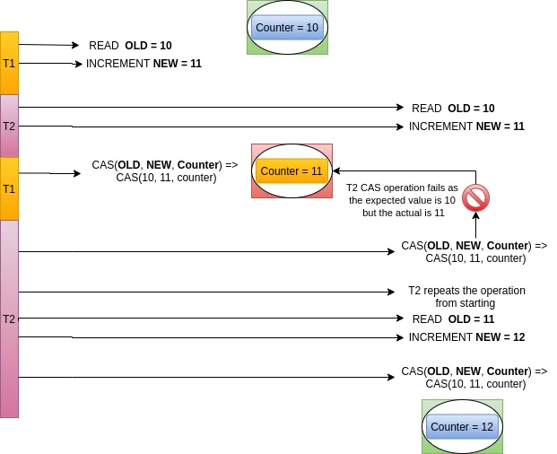

# Introduction to Non-Blocking Concurrency — Compare-And-Swap (CAS)

In the previous module, we explored the `CopyOnWriteArrayList` and saw how it achieves thread safety by copying its underlying array on every write. In this module, we will explore a foundational concept that powers many high-performance concurrent collections (such as `ConcurrentHashMap` and the `Atomic` variables): **Compare-And-Swap (CAS)**.

Understanding CAS is essential for grasping how Java's concurrency framework achieves thread safety without the overhead of traditional thread blocking and locks.

---

## What is Compare-And-Swap?

**Compare-And-Swap (CAS)** is an optimistic, non-blocking technique used in multithreading to achieve thread-safe state updates. 

Traditional synchronization mechanisms—like the `synchronized` keyword and `ReentrantLock`—are **blocking (pessimistic) mechanisms**. They assume that conflict is highly likely, so they block competing threads until the lock holder releases it. While safe, blocking incurs significant overhead due to thread context switches, scheduling delays, and lock acquisition costs.

In contrast, CAS is a **non-blocking (optimistic) mechanism**. It assumes that conflicts are rare, so it allows threads to attempt updates without acquiring a lock. If a conflict occurs, the thread simply retries the operation until it succeeds.

### Hardware-Level Support
CAS is not implemented in software; it is a fundamental hardware-level primitive. Modern CPU architectures support CAS directly within their instruction sets. 
- In the Intel x86 architecture, it is implemented as the **`CMPXCHG`** (Compare-and-Exchange) instruction.
- By executing at the hardware level, CAS operations are guaranteed to be single, atomic instructions, executed in a fraction of the time required to acquire a software lock.

---

## How Compare-And-Swap Works

To understand the mechanics of CAS, let's look at a classic counter increment scenario. Suppose we have a shared `Counter` object, and two threads, **T1** and **T2**, want to increment its value.

We know that a simple increment operation (`value++`) is not atomic; it consists of three distinct steps:
1.  **READ**: Read the current value from memory.
2.  **MODIFY**: Increment the value in the thread's local stack.
3.  **WRITE**: Write the incremented value back to memory.

Let's assume the current value of the counter in main memory is **10**, and trace the execution of **T1** and **T2**:

1.  **T1** reads the value **10** and increments it to **11** in its local execution stack. It has not yet written the value back to memory.
2.  **T2** also reads the value **10** and increments it to **11** in its local stack.
3.  **T1** is the first to attempt to write back to memory using a CAS operation.

> **Mental Model: The CAS Arguments**
> A CAS operation accepts three primary arguments:
> - **Memory Address ($V$)**: The location of the variable to be updated (e.g., the address of our counter variable).
> - **Expected Value ($A$)**: The value the thread expects to find at that memory location (the value it originally read).
> - **New Value ($B$)**: The new value the thread wishes to write to the memory location.
> 
> The CPU will atomically compare the value at $V$ with $A$.
> - If the current value at $V$ equals $A$, no other thread has modified the variable. The CPU writes $B$ to $V$ and returns `true`.
> - If the current value at $V$ does not equal $A$, another thread has modified the variable. The write fails, the memory remains untouched, and the CPU returns `false`.

### Tracing the Write Operations

#### 1. Thread T1's CAS Attempt
- **Memory Address**: Address of `counter`
- **Expected Value**: 10
- **New Value**: 11

The CPU checks the memory address of the counter. The current value is indeed 10 (matching the expected value). The CPU atomically updates the counter to **11** and returns `true`. **T1**'s update is successful.

#### 2. Thread T2's CAS Attempt
- **Memory Address**: Address of `counter`
- **Expected Value**: 10
- **New Value**: 11

The CPU checks the memory address of the counter. The current value is now **11** (since **T1** just updated it), but **T2** expects **10**. Because the current value does not match the expected value, the CPU rejects the write, leaves the memory untouched, and returns `false`.

#### 3. Thread T2's Retry (Spinning)
Because its write failed, **T2** must retry the operation:
1.  **Read**: **T2** reads the new current value **11** from memory.
2.  **Modify**: **T2** increments the value to **12** in its local stack.
3.  **Write (CAS)**: **T2** performs a new CAS operation:
    - **Expected Value**: 11
    - **New Value**: 12

This time, if no other thread has modified the counter, the memory value matches **11**. The CPU atomically updates the counter to **12** and returns `true`. **T2**'s update is now successful.

---

## CAS implementation in Java: sun.misc.Unsafe

Because Java bytecode does not have direct support for hardware-level CAS, the JVM delegates these operations to native code. The low-level class **`sun.misc.Unsafe`** provides the gateway to these native hardware instructions.

Here is a typical CAS method signature from `sun.misc.Unsafe`:

```java
public final boolean compareAndSwapInt(Object o, long offset, int expected, int x) {
    return theInternalUnsafe.compareAndSetInt(o, offset, expected, x);
}
```

*Figure 17.2.1: Native CAS signature in sun.misc.Unsafe*

*   **`o`**: The target object containing the field we want to update.
*   **`offset`**: The memory offset of the field within the object `o` (which acts as the memory address).
*   **`expected`**: The value we expect the field to have.
*   **`x`**: The new value we want to write if the expected value matches.

Below is an illustration of how CAS maps to memory and registers during execution:



*Figure 17.2.2: Visual representation of a Compare-And-Swap execution cycle*

---

## Implementing a Lock-Free Counter

To implement thread safety using CAS, we must run the CAS operation inside a loop (often called a **spin loop** or **retry loop**) until it returns `true`. 

Additionally, the variable participating in the CAS operation **must be declared `volatile`**. This ensures that any update made by one thread is immediately visible to all other threads, preventing them from reading stale expected values.

Here is the pseudocode for a lock-free, thread-safe counter using a CAS loop:

```java
public class LockFreeCounter {
    private volatile int value = 0;

    public int getValue() {
        return value;
    }

    public int increment() {
        boolean success;
        int expectedValue;
        int newValue;
        
        do {
            expectedValue = getValue(); // Read the volatile value
            newValue = expectedValue + 1; // Calculate the new value
            
            // Perform the atomic CAS operation
            success = CAS(expectedValue, newValue, this); 
        } while (!success); // Retry if another thread modified the value first
        
        return newValue;
    }
}
```

By avoiding locks and monitors, this algorithm is completely **non-blocking** and **lock-free**. If a thread is suspended mid-execution, it does not prevent other threads from making progress. 

The `java.util.concurrent.atomic` package (containing `AtomicInteger`, `AtomicLong`, `AtomicBoolean`, etc.) uses this exact strategy under the hood to provide high-performance, lock-free operations.

---

## Summary

*   **Compare-And-Swap (CAS)**: An optimistic, non-blocking hardware-level instruction used to update a shared variable atomically.
*   **Hardware Primitives**: Implemented directly in hardware (e.g., `CMPXCHG` in Intel CPUs), making it extremely fast compared to software-based locking.
*   **Three Arguments**: A CAS operation takes a target memory address, an expected value, and a new value. It only writes the new value if the current memory value matches the expected value.
*   **Retry Loop**: When a CAS operation fails (returns `false`), the calling thread does not block. Instead, it enters a retry loop, reads the updated value, and tries again until it succeeds.
*   **Volatiles are Mandatory**: Variables updated via CAS must be declared `volatile` to guarantee immediate visibility of updates across threads, preventing stale comparisons.
*   **Lock-Free Algorithms**: CAS enables the design of lock-free, non-blocking collections (like `ConcurrentHashMap` and atomic variables) that maximize CPU utilization and scale exceptionally well under high concurrency.
