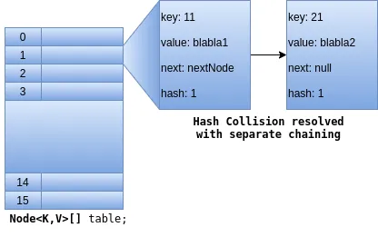

# Deep Diving ConcurrentHashMap’s put operations

In the previous part, we have seen how the Compare-And-Swap(CAS) works. Understanding CAS mechanism is just like a groundwork to understand the depths of ConcurrentHashMap and many concurrent collections that the Java Concurrency Framework offers. Let’s deep dive into Java8 ConcurrentHashMap. We all know that it is after all a hash map works exactly like java.util.HashMap. There is no change in the behavior, except the fact that it gives additional thread safety. We have java.util.Hashtable which is a synchronized collection in which every method is synchronized. That means it is a blocking collection and restricts access to a single thread at a time. But the ConcurrentHashMap provides a much better degree of concurrency by allowing as many concurrent writer threads as the size of the underlying hash table.

The main motive of ConcurrentHashMap is to provide a greater degree of concurrency. It does so using two main points:

*All the concurrent read operations are lock-free* which means non-blocking.

_All concurrent write operations are of minimal blocking — Lock Striping._

It uses an entirely different locking strategy that offers better concurrency and scalability. Instead of synchronizing every method on a common lock, it uses a finer-grained locking mechanism called *lock striping. Lock Striping *allows a greater degree of shared access. We will see *Lock Striping* in more detail as we follow along.

To start with, let’s understand the underlying data structure that java.util.concurrent.ConcurrentHashMap uses. I assume that you already know the internal working of HashMap. If not please do that first otherwise you will not understand this article to the fullest extent. Note that, unless otherwise specified, whatever the internal implementations that we are discussing here are also applicable to java.util.HashMap except the thread-safety mechanisms like locking and CASing. And we will use the word *map* to refer HashMap or ConcurrentHashMap.

The map usually acts as a *bucketed* or *binned* hash table. We will use the words *bucket* and *bin* interchangeably. Both are the same in our context.

The hash table that map uses is actually an array of type Node.

```java
// hash table - An array of type Node<K,V>
transient volatile **Node<K,V>[]** table;
```

So, each bin in the table array is of the type Node having four fields: key, value, hash, and next , as shown below.

```java
static class Node<K,V> implements Map.Entry<K,V> {
    final int hash;
    final K key;
    **volatile** V val;
    **volatile** Node<K,V> next;
    // Constructors
    // Getters
    // equals() and hashcode() overrides
}
```

The variable next here is to implement S*eparate-Chaining* in case of hash collisions. This enables the bins in the hash table to be arranged as a single linked list. So, in a sense, each bin in the table array is a single linked list. Putting in other words, the table is an array of single linked lists of type Node as shown in the below diagram. There are other subclasses that exist for Node. For example, the TreeNode class whose objects are arranged in Balanced Binary Search Trees. The HashMap or ConcurrentHashMap converts the linked list to a Balanced Binary Search Tree when the bin size reaches a certain threshold. More on this later. For now, we will just focus on the depths of put operation.

*The binned hash table is actually an array of single linked lists of type*Node*.*

Note that the variable table is volatile here. And there are volatile variables in the Node class as well. These volatile variables are necessary for CAS(Compare-and-Swap) to provide *Lock-Free* or *Non-Blocking* thread-safety.

From here on please go through carefully. This is what happens for every put operation in ConcurrentHashMap from Java8 onwards.

**\*Point #1\*\*\***
**The hash table(the variable table) is lazily initialized to a power-of-two size upon the first insertion. The initial size is 16 (that is \***2⁴\*\*\*). We will mention the reason for this later in this article.

**\*Point #2\*\*\***
\*\*When the table is first initialized, all the bins in it are empty. The bins here can be represented by indices from 0 to 15 because the hash table is an array of size 16 initially. table[0] is bin-0, table[1] is bin-1, table[2] is bin-2 and so on. As the put operations are going on, each bin in the table gets filled up.

**\*Point #3\*\*\*** \**Java8 ConcurrentHashMap implements a combination of both CASing and Locking. It performs CASing if the bin is empty, otherwise Locking. *Point #5 and Point #6 \*explain these cases in-depth.

**\*Point #4\*\*\*** \**The ConcurrentHashMap *performs the locking on individual segments rather than locking the entire table array object. *Every book and article specifies this statement. But this is the case only till Java7. And this statement is now even incomplete and outdated. Most of the books take the reference from Java7 implementation. The Java7 ConcurrentHashMap implements something known as *Segments*. Each segment in turn contains a hash table. And the lock is performed on the segment rather than the individual bin of the hash table in that segment. So Java7 ConcurrentHashMap can be called a *Segmented Hash-table\*.

But the case is entirely different with Java8. In Java8 there is no concept of *Segments*. There is only a single binned hash table which is an array of objects of type Node<K, V>, and the locking happens on the individual bins. There is a lot more to it.\* \*Please follow it along. It is more exciting. So, in Java8, the locking happens on the individual bin. This technique is known as ***Lock Striping***.

**\*Point #5\*\*\***
**Now, the most important thing here is that, for a bin that is empty, which means it is null and there are no nodes inserted yet, \***the first insertion in that bin is performed by CASing to that bin rather than locking***. This is the most important thing to understand. No other book or article that I know of mentioned this statement ever. What do we mean by this? Well, we have seen CAS(Compare-And-Swap) in  as a technique to bring *lock-free\* or non-blocking thread-safety into the system. And we have seen the example on a counter variable that is a primitive integer. Here we perform the CAS on the object reference of type Node<K,V>. Look at the below code snippet from ConcurrnetHashMap.putVal() method. putVal() method is commonly used for all the insert or update operations performed on the Map. The items in **bold\*\* font in the below code snippet are important to understand.

```java
final V putVal(K key, V value, boolean onlyIfAbsent) {
    for (Node<K,V>[] tab = table;;) {
       if (tab == null || (n = tab.length) == 0)
          tab = **initTable()**;
       else if ((f = ***tabAt***(tab, **i = (n - 1) & hash**)) == null) {
          if (***casTabAt***(tab, ***i***, null,
                           new Node<K,V>(hash, key, value)))
            break; *// no lock when adding to empty bin**
       *}
   }
}
```

**initTable()**: It initializes the table array if not already initialized. Remember this may be used concurrently by multiple threads. So it should be done atomically. For this, it again uses CASing. So, in simple words, it atomically initializes the table array.

**i = (n - 1) & hash**: This operation basically calculates the index of the bin in which the node is to be inserted. This operation ensures the value assigned to i is always less than or equal to n - 1 where n is the table size. In our case, it is 16(which 2⁴). You can experiment with different values. It is a very elegant bitwise operation to calculate the index of a bin in the table, instead of using **hash % (n - 1)**.\*\* \*\*But for this expression to be working as expected( to get the uniform random distribution of the keys), the table size n must be the power of 2. This is one but not the only reason why the hash map or hash table implementations, in general, have their table size is raised to the powers of 2 initially and also at the time of table resizing.

**tabAt(tab, i)**: This *atomically* gets the value at the specified index **i**of the table array. If this returns null, that means the bintab[i] is empty then it performs **casTabAt**.

**\*casTabAt\*\*\***(tab, i, **\***expectedVal**\***, **\***newVal**\***)\**: Performs the CAS on tab[i]. In our case, the expectedVal is null and the newValue is the new Node to be inserted. The result of casTabAt is true if the operation is successful and we break from that infinite loop. If it returns false, that means the CAS has failed as another thread got lucky enough to put the new Node and we continue to the next iteration. In the next iteration, the tabAt() finds non-null value at tab[i] as it has got updated by another thread. So it does not perform CAS. It continues executing the next lines of code which are explained in *Point #6\*.

Let’s look at it again with a small example. Let’s say, we have bin-3 empty, that means table[3] is null, and two threads T1 and T2, both want to put the *key-value* pair into bin-3. What happens is, both T1 and T2 race for bin-3 and find that it is empty. So both T1 and T2 perform the CASing on table[3]. And let’s assume that T1 got lucky enough to have a successful CAS operation and put the node in bin-3. Now when T2 performs the CAS, it fails because that bin has already been updated by T1. So T2 backs off from performing the CAS. But T2 cannot simply ignore the put operation and go back, right? It still needs to put the entry into the same bin. But, since bin-3 is not empty as it is updated by T1, it follows another approach explained in *Point #6*.

**\*Point #6\*\*\*** \**Point #5 explains the scenario of put with CASing where the bin is empty. Now when the bin is not empty, it uses the locking mechanism. Note that in *point #4 *we mentioned that it follows the *Lock Striping.\*

**Lock Striping\*\***
*\*\*Lock Striping* generally means splitting one lock into many — Not to be confused with *Lock Splitting*(Splitting one lock into Two). With *Lock Striping*, it rather performs the lock on the individual bins than the whole table array object. If we perform the lock on the whole table object, only one writer thread to be allowed to perform the put operation. In which case it doesn’t become a concurrent collection but a thread-safe collection. If we perform locking on individual bins, we can allow as many concurrent write threads as the table size. So as the initial HashMap size is 16, it allows 16 concurrent writer threads. But Java8 does this in style.

To lock on individual bins, it needs to maintain the lock object for every bin. This takes some extra space to hold all the lock objects in memory. To optimize the space, what it does is, rather than associating a distinct lock object with each bin, *it instead uses the first node of the bin itself as a lock relying on the builtin synchronized monitors — The Intrinsic Locks.* It does so as a kind of space optimization and also provides ease of implementation. There is also a little more reasoning which we will look at later. To understand this better, let’s have a look at the code snippet from Java8 ConcurrentHashMap.putVal().

```java
final V putVal(K key, V value, boolean onlyIfAbsent) {
    int hash = *spread*(key.hashCode());
    int binCount = 0;
    for (Node<K,V>[] tab = table;;) {**
**       if (tab == null || (n = tab.length) == 0)
          tab = **initTable()**;
       else if ((f = ***tabAt***(tab, **i = (n - 1) & hash**)) == null) {
          if (***casTabAt***(tab, ***i***, null,
                           new Node<K,V>(hash, key, value)))
            break; *// no lock when adding to empty bin**
       *}
       else {
            V oldVal = null;
            **synchronized (f)** {
              **if (*****tabAt*****(tab, i) == f) {**
                if (fh >= 0) {
                  binCount = 1;
                    for (Node<K,V> e = f;; ++binCount) {
                      K ek;
                      if (e.hash == hash &&
                           ((ek = e.key) == key ||
                           (ek != null && key.equals(ek)))) {
                        oldVal = e.val;
                        if (!onlyIfAbsent)
                          e.val = value;
                        break;
                 }
                 Node<K,V> pred = e;
                 if ((e = e.next) == null) {
                    pred.next = new Node<K,V>(hash, key, value);
                    break;
                 }
              }
            }
          }
       }
    }
  }
}
Let’s understand what is happening here.
```

We have already seen and understood the first if and else if blocks. The last else block is where the story of individual bin locking happens. You can see the synchronied block on variable **f. **In our case, the variable f is initialized to table[i]. Just to understand it better go through the below points.
* **table[i]** is the first node of the bin at i.
* **table[i].next** is the second node of the bin at i.
\* **table[i].next.next** is the third node of the bin at i and so on.

Here in our case, **f** is initialized to **table[i] **as a result of **tabAt(tab, i)** in the else if block. So, **synchronized( f )** means **synchronized( table[i] )** and **table[i] **is the first node in the ith bin. This is what we are talking about — The lock happens on the first node of the bin. Hope you understood. Sorry if I am being too verbose here. But I am just trying to connect all the dots, so that, beginners can also understand it better.

Okay. What next?

Did you notice the check **if(\*\*\***tabAt**\***(tab, i) == f) , **right after the **synchronized( f ) \*\*statement. This is again very important to understand. Note this and we will come to this very soon.

Let’s go through the rest of the code below this check. There are two things happening here. First, if the key already exists in the map and if this is NOT called from putIfAbsent, then the new value will override the old value for that key. Second, if the key doesn’t exist, the new Node will be added to the end of the linked list. And the operation completes. So, if you just look at it, the new nodes will be added to the end of the linked list. This is a general behavior of Java’s hash-based map implementations.

Now let’s come back to the condition **if(\*\*\***tabAt**\***(tab, i) == f)**.** **If you look at it carefully, the **tabAt(tab, i)** is already equal to **f\*\*. Then why this additional check is needed at all? Well, there are two cases where simply locking the first node is not enough.

First, ***resizing of the hash table***: As part of resizing or rehashing, the bins are invalidated. Since resizing is again a non-blocking operation, it happens in parallel irrespective of acquiring the lock on the first node in that bin. So we need to check whether this is still the first node of the linked list or not, as the resizing or rehashing must have moved the nodes to different bins.

Second, ***deleting that node***: As a result of the call to remove() the first node may get deleted. Though removing the node from a specific bin also uses a lock on the first node of that bin, there is still an issue lurking here if we don’t perform that check here. Do you know ***Double Checked Locking*** pattern and why we perform that kind of double-checking? Here is the reasoning.

Assume that just before **synchronized( f )**, there is a call to remove() by another thread to remove the first node from the same bin that the put() method is now operating on. And also assume that the first node of that bin got deleted from the table as a result of the call to remove(). Note that the node has just got deleted from the table but not from the memory. It is still in heap and is pointed by the reference **f**. But from the hash-table perspective, the link is broken and it has now become a zombie node. Nothing from thetable array is now pointing to this node. Now if it does not perform that check, the new node will get added to the zombie node which has just got deleted from the table by another thread.

So locking on the first node itself is not enough. After locking we also need to validate whether this is still the first node or not. And if not, we have to retry, as a pattern of *compare-and-swap* loops. This is a double-checked locking pattern that we are most familiar with, while designing thread-safe lazily initialized *Singleton* classes. The name double-check comes from the fact of performing the same check twice: before and after acquiring the lock.

But the question here is, why go for locking? why can’t we perform the CASing here in this scenario? Well, I am not sure about that. I think we can implement CASing here as well with the non-blocking linked list algorithm known as . But I can think of three reasons for not going with CASing here.

Using the synchronized on the first node of the bin would rather be simple than implementing the complex non-blocking insertion here. Also it may not give us significant performance improvement.

Statistically looking at it, with the uniform randomness of hash codes (which are the result of the good hash function), the case that we mentioned in point #5, ie, CASing when the bin is empty, is by far the most common scenario for put operations under most hash distributions. This means, there are very less situations where we need to go for locking.

Implementing CASing might be very complex here. And I think this is a trade-off between simplicity and complexity. Having a lock on the first node of the bin allows 16 concurrent writer threads initially. And if the size of the map goes larger, let’s say to the size of ²⁸=256 bins, it can support 256 concurrent writer threads. Which general-purpose processer has these many cores these days to run these many concurrent threads at a time? Also locking is a very rare scenario to be happened as in most of the cases the insertion of the new entry is happened by CASing as explained in Point #5 (The bin being empty).

I think that’s all about ConcurrentHashMap’s put operation. There is more happening, in terms of *Treefying* the bin and computeIfXXX operations. Please go through the source code of ConcurrentHashMap. I would suggest, and also it is worth spending time to understand ***CASing***, **tabAt**, **casTabAt. **The put operation is just a glimpse of what ConcurrentHashMap is doing. But this is by far the most basic thing to understand. If we understand putVal(), then we can understand other things just by looking at the source code of ConcurrentHashMap. All this story can be explained in two simple sentences.

The first insertion in a bin is performed by CASing to that bin rather than locking.

If the bin is not empty, the first node of the bin itself is used as a lock relying on the builtin synchronized monitors, otherwise known as the Intrinsic Locks, and the insertion happens at the end of the list. And we need to perform double-checking before and after acquiring the lock to make sure that the first node has not been changed.

*Note: Most of the commentary written on *putVal()_ in this article are based on my understanding of the source code comments written by Mr. Doug Lea in \***\*ConcurrentHashMap.java\*\*** file in Java8 source._

## Summary

CAS lets us implement *lock-free *or* non-blocking *algorithms.

The primary goal of ConcurrentHashMap is to provide *lock-free* concurrent read operations and minimally blocking on write operations like put, remove.

The map usually acts as a *bucketed* or *binned* hash table. The hash table that map uses is actually an array of type Node.

The ConcurrentHashMap internally uses an array of single linked lists of type Node.

The hash table(the array table) is lazily initialized to a power-of-two size upon the first insertion.

In Java8, the locking happens on the individual bin. This technique is known as ***Lock Striping***. *Lock Striping* is nothing but splitting one lock into many to get a greater degree of concurrency.

Locking on individual bins allows as many concurrent write threads as the table size.

The first insertion in an empty bin is performed by CASing to that bin rather than locking.

If the bin is not empty, the first node of the bin itself is used as a lock relying on the builtin synchronized monitors.
