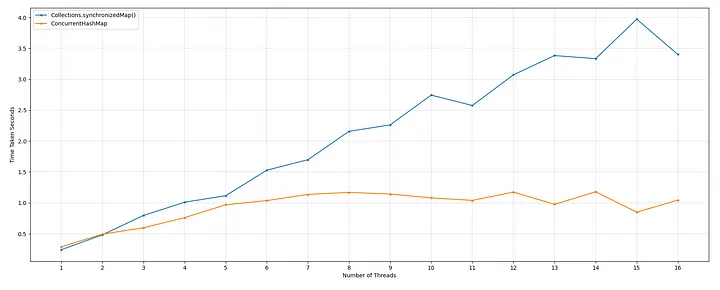
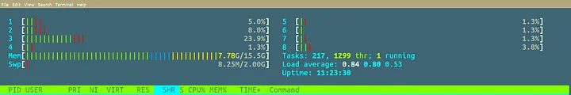
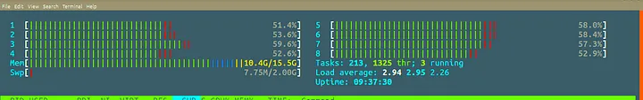
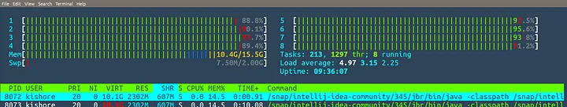

# ConcurrentHashMap Performance Test

This article is the continuation of  and the reader is expected to first read and understand  and . In the last part (Part 17.3) we have understood the ConcurrentHashMap.putVal method. And we have understood how it achieves a high degree of concurrency. But we have just understood what we have seen from the source code and we haven’t done any experiment to check the performance of ConcurrentHashMap. In this article, we will write a simple performance test and compare the numbers between Collections.synchronizedMap() and ConcurrentHashMap.

The performance test in the below GitHub gist is very simple. It just does one million insertions and compares the results between the number of threads that are performing the insertions and the time taken to complete those insertions. It does this for both Collections.synchrnozedMap() and ConcurrentHashMap.

```java
import org.junit.jupiter.api.Test;


import java.util.Collections;
import java.util.HashMap;
import java.util.Map;
import java.util.concurrent.*;


import static org.junit.jupiter.api.Assertions.assertEquals;


public class ConcurrentHashMapPerformanceTest {


    @Test
    public void testHashMap() throws InterruptedException, ExecutionException {
        System.out.println("---------------------------- With Collections.synchronizedMap()  -------------------------");
        for (int nThreads = 1; nThreads <= 16; nThreads++) {
            Long totalTimeNanos = 0L;
            for (int i = 0; i < 10; i++) {
                totalTimeNanos += testMap(nThreads, Collections.synchronizedMap(new HashMap<>()));
            }
            System.out.printf("nThreads: %d, Average Time Taken: %.6f seconds%n", nThreads, totalTimeNanos / (10.
* 1000000000));
        }


        System.out.println("---------------------------- With ConcurrentHashMap -------------------------");
        for (int nThreads = 1; nThreads <= 16; nThreads++) {
            Long totalTimeNanos = 0L;
            for (int i = 0; i < 10; i++) {
                totalTimeNanos += testMap(nThreads, new ConcurrentHashMap<>());
            }
            System.out.printf("nThreads: %d, Average Time Taken: %.5f seconds%n", nThreads, totalTimeNanos / (10.
* 1000000000));
        }
    }


    private Long testMap(int nThreads, Map<String, Integer> map) throws InterruptedException, ExecutionException {
        ExecutorService pool = Executors.newFixedThreadPool(nThreads);
        int approxElements = 1000000;
        int totalElements = approxElements / nThreads;
        Future<Long>[] futures = (Future<Long>[]) new Future[nThreads];
        for (int i = 0; i < nThreads; i++) {
            futures[i] = pool.submit(new Task(totalElements, "Thread-" + i, map));
        }
        Long totalTimeNanos = 0L;
        for (int i = 0; i < nThreads; i++) {
            totalTimeNanos += futures[i].get();
        }
        pool.shutdown();
        while (!pool.awaitTermination(1000, TimeUnit.MILLISECONDS)) ;
        assertEquals(totalElements * nThreads, map.size());
        return totalTimeNanos;
    }


    static class Task implements Callable<Long> {


        private final int nElements;
        private final String id;
        private final Map<String, Integer> map;


        public Task(int nElements, String id, Map<String, Integer> map) {
            this.nElements = nElements;
            this.id = id;
            this.map = map;
        }


        @Override
        public Long call() {
            long start = System.nanoTime();
            for (int i = 1; i <= nElements; i++) {
                map.put(id + ": " + i, i);
            }
            return System.nanoTime() - start;
        }
    }
}
```

hosted with ❤ by 

Illustration 17.4.1 Performance Test between synchronizedMap() and ConcurrentHashMap

Here is the output of the program.

--------- With Collections.synchronizedMap() ----------
nThreads: 1, Average Time Taken: 0.241617 seconds
nThreads: 2, Average Time Taken: 0.482975 seconds
nThreads: 3, Average Time Taken: 0.796638 seconds
nThreads: 4, Average Time Taken: 1.010598 seconds
nThreads: 5, Average Time Taken: 1.115971 seconds
nThreads: 6, Average Time Taken: 1.528649 seconds
nThreads: 7, Average Time Taken: 1.698244 seconds
nThreads: 8, Average Time Taken: 2.157568 seconds
nThreads: 9, Average Time Taken: 2.261998 seconds
nThreads: 10, Average Time Taken: 2.743739 seconds
nThreads: 11, Average Time Taken: 2.575613 seconds
nThreads: 12, Average Time Taken: 3.072078 seconds
nThreads: 13, Average Time Taken: 3.383775 seconds
nThreads: 14, Average Time Taken: 3.333770 seconds
nThreads: 15, Average Time Taken: 3.971915 seconds
nThreads: 16, Average Time Taken: 3.401782 seconds
-------------- With ConcurrentHashMap --------------
nThreads: 1, Average Time Taken: 0.28901 seconds
nThreads: 2, Average Time Taken: 0.49380 seconds
nThreads: 3, Average Time Taken: 0.59719 seconds
nThreads: 4, Average Time Taken: 0.76039 seconds
nThreads: 5, Average Time Taken: 0.96964 seconds
nThreads: 6, Average Time Taken: 1.03647 seconds
nThreads: 7, Average Time Taken: 1.13701 seconds
nThreads: 8, Average Time Taken: 1.16967 seconds
nThreads: 9, Average Time Taken: 1.14299 seconds
nThreads: 10, Average Time Taken: 1.08018 seconds
nThreads: 11, Average Time Taken: 1.04013 seconds
nThreads: 12, Average Time Taken: 1.17429 seconds
nThreads: 13, Average Time Taken: 0.97590 seconds
nThreads: 14, Average Time Taken: 1.17911 seconds
nThreads: 15, Average Time Taken: 0.84981 seconds
nThreads: 16, Average Time Taken: 1.04433 seconds

The following image will display the difference clearly.

You can clearly see the difference between both versions. ConcurrentHashMap produces higher throughput(taking fewer seconds means higher throughput). So in our graph, the lower the value is the better the throughput is. And the most important and interesting thing is to check the load on the CPU. While the testing is running, I have captured the snapshots of  command output to check the load on the cores. I have a 4-core machine with hyperthreading enabled. That means I have an 8-core machine.  shows the output with the logical cores — Number of cores when hyperthreading enabled.

If you are not familiar with Hyperthreading, that’s ok. It just happens at the physical core level. Every physical core, when hyperthreading enabled, works as if it were two physical cores. We call them *Logical Cores*. So one physical core is equal to two logical cores. In my machine, I have 4 physical cores. That means I have 8 logical cores that the HTOP command shows. You can observe this in the below diagrams.

This is the diagram when the performance test is not running. Not much is happening. All the cores are almost ideal. We have total of 8 cores and one thread is running.

Here is the HTOP snapshot while running the test with Collections.synchronizedMap(). The test was running with 10 threads at the time of taking this snapshot.

Here is the HTOP snapshot while the test is running with ConcurrentHashMap.

The thing we have to notice is, in Fig 17.4.3, though the test was running with 10 threads, there is not much load on CPUs. This is because of the synchronized mechanism. The *Intrinsic Locks* are not really capable of allowing us to use all the processing power. Only one thread can ever run at a time. Rest all threads are in BLCKED state. But why does it show that there are 3 running threads in the snapshot? That may probably be because other processes might also be running in the machine. In my machine, IntelliJ IDE is running which itself is a process that has running threads.

But notice Fig 17.4.4 which is with ConcurrentHashMap. All the cores are full-on. All the processing power is getting used to the fullest extent. This is what concurrency means — All the threads run concurrently with the available cores. As a result, we get the performance with ConcurrentHashMap as shown in Fig 17.4.1.

ConcurrentHashMap is a beast in terms of handling the insertions and offers better performance. As we have seen in the previous part, , it can support as many concurrent writers as the size of the underlying table array.
