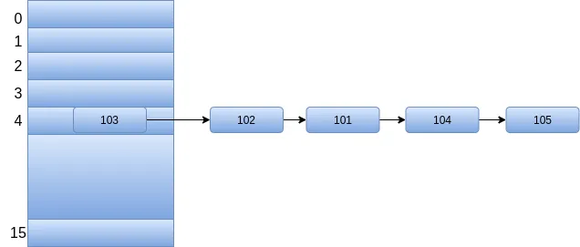
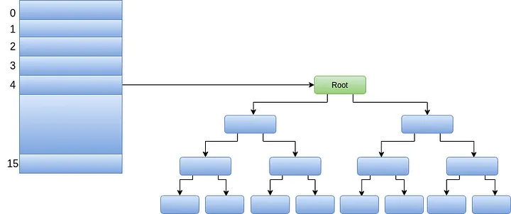

# Understanding Treeifying of HashMaps

In the previous modules, we compared the write performance of `Collections.synchronizedMap()` and `ConcurrentHashMap` under high thread contention. In this module, we will explore an important performance optimization introduced in Java 8 for both `HashMap` and `ConcurrentHashMap`. 

Unlike thread-safety mechanisms, this optimization focuses on reducing the algorithmic complexity of looking up keys within a highly congested bin (bucket) using **`TreeNodes`**.

> [!NOTE]
> **Prerequisite**
> To fully understand this module, you should be familiar with the internal workings of a standard `HashMap` (specifically separate chaining and how the `put()` method resolves hash collisions).

---

## The Problem: High Hash Collisions

Whenever two or more distinct keys produce the same hash code (or map to the same bucket index), they are added to a singly linked list representing that bucket. 

To simulate this scenario and understand the performance impact, let's write a custom class with a deliberately poor hash function that violates the uniform distribution principle:

```java
public final class Student {

    private final int stdId;
    private final String stdName;
    private final int deptNo;

    public Student(int stdId, String stdName, int deptNo) {
        this.stdId = stdId;
        this.stdName = stdName;
        this.deptNo = deptNo;
    }

    // Getters

    @Override
    public int hashCode() {
        // Poor Hashcode implementation: always returns a constant
        return 4; 
    }

    @Override
    public boolean equals(Object o) {
        if (this == o) return true;
        if (o == null || getClass() != o.getClass()) return false;
        Student student = (Student) o;
        return stdId == student.stdId &&
               deptNo == student.deptNo &&
               stdName.equals(student.stdName);
    }
}
```

*Figure 17.5.1: Student class with a deliberately poor hashCode() implementation*

---

## Simulating Collision Chains

If we add several `Student` objects to a `HashMap` as keys, their identical hash codes will cause all entries to land in the exact same bucket. Let's trace this with 5 insertions:

```java
Map<Student, String> studentMap = new HashMap<>();
studentMap.put(new Student(103, "STD03", 1003), "STD03");
studentMap.put(new Student(102, "STD02", 1002), "STD02");
studentMap.put(new Student(101, "STD01", 1001), "STD01");
studentMap.put(new Student(104, "STD04", 1004), "STD04");
studentMap.put(new Student(105, "STD05", 1005), "STD05");
```

Let's calculate the target bucket index $i$ using the standard map indexing formula: 

$$\text{index} = (n - 1) \ \& \ \text{hash}$$

Where $n$ is the table capacity (default is 16) and the hash is 4:

```text
n = 16
n - 1 = 15 (1111 in binary)
hash = 4   (0100 in binary)

index = 15 & 4 
      = 1111 & 0100 
      = 0100 (4 in decimal)
```

Because every key returns a hash code of 4, every single entry lands in **bucket 4**, forming a long singly linked list chain at index 4:



*Figure 17.5.2: Collision chain forming a singly linked list at a single bucket index*

### The Impact of Long Collision Chains

When many keys map to the same bucket, the performance of the map degrades significantly:
- **Search Complexity ($O(n)$)**: The time complexity of `get()` degrades from the ideal constant time $O(1)$ to linear time **$O(n)$** (where $n$ is the number of nodes in that specific bin). The thread must traverse the list node-by-node, executing `.equals()` on each key.
- **Insertion/Update Complexity ($O(n)$)**: Every `put()` operation must traverse the entire list to check if the key already exists before appending a new node, which also takes **$O(n)$** time.
- **Defeating the Purpose**: This completely defeats the purpose of using a hash-based collection, which is designed to provide constant-time $O(1)$ operations for reads, writes, and deletes.

While programmers are responsible for implementing high-quality hash functions, Java 8 provides a safeguard to handle this scenario gracefully.

---

## The Solution: Treeifying Bins

To prevent linear search bottlenecks, Java 8 introduces **Treeification**. When a collision chain grows beyond a specific threshold, the map automatically converts the singly linked list into a **Balanced Binary Search Tree (Red-Black Tree)**. 

Once treeified, the search, insertion, and deletion complexity inside that bucket drops from $O(n)$ to **$O(\log n)$**, providing predictable performance even under extreme collision scenarios.



*Figure 17.5.3: Collision chain converted into a balanced binary search tree (Red-Black Tree)*

---

## The Three Treeification Constants

To balance performance and memory, the JDK defines three critical constants that govern this transition:

1.  **`TREEIFY_THRESHOLD` (8)**: The maximum number of linked nodes allowed in a single bin. If an insertion pushes the bin length to 8, the map attempts to convert the list into a tree.
2.  **`UNTREEIFY_THRESHOLD` (6)**: During removal or resizing operations, if the number of elements in a treeified bin falls to 6 or fewer, the map converts the Red-Black Tree back into a simple singly linked list to save memory.
3.  **`MIN_TREEIFY_CAPACITY` (64)**: The minimum overall table capacity required before treeification is allowed. If a bin reaches 8 elements but the total table size is less than 64, the map will **resize the table** (doubling its capacity) instead of treeifying. Resizing redistributes keys and is often a better way to resolve collisions in small tables.

```java
static final int TREEIFY_THRESHOLD = 8;
static final int UNTREEIFY_THRESHOLD = 6;
static final int MIN_TREEIFY_CAPACITY = 64;
```

---

## Verifying Treeification

We can verify this behavior programmatically. A standard bucket contains nodes of type `java.util.HashMap$Node`. Once treeified, the nodes are replaced by instances of `java.util.HashMap$TreeNode` (which extends `LinkedHashMap.Entry`, which in turn extends `HashMap.Node`).

Let's write a program that inserts 11 colliding keys into a map and prints the underlying class type of each entry:

```java
import java.util.HashMap;
import java.util.Map;

public class TreeifyDemo {
    public static void main(String[] args) {
        Map<Student, String> studentMap = new HashMap<>();
        studentMap.put(new Student(103, "STD03", 1003), "STD03");
        studentMap.put(new Student(102, "STD02", 1002), "STD02");
        studentMap.put(new Student(101, "STD01", 1001), "STD01");
        studentMap.put(new Student(104, "STD04", 1004), "STD04");
        studentMap.put(new Student(105, "STD05", 1005), "STD05");
        studentMap.put(new Student(108, "STD08", 1008), "STD08");
        studentMap.put(new Student(106, "STD06", 1006), "STD06");
        studentMap.put(new Student(107, "STD07", 1007), "STD07");
        studentMap.put(new Student(110, "STD10", 1010), "STD10");
        studentMap.put(new Student(109, "STD09", 1009), "STD09");
        studentMap.put(new Student(111, "STD11", 1011), "STD11");

        studentMap.entrySet().forEach(entry ->
                System.out.println(entry.getClass().getName())
        );
    }
}
```

### Output (With 11 Colliding Nodes)
Since the total number of colliding nodes (11) exceeds the `TREEIFY_THRESHOLD` (8), the bin is treeified. Each node is represented by a `TreeNode` instance:

```text
java.util.HashMap$TreeNode
java.util.HashMap$TreeNode
java.util.HashMap$TreeNode
java.util.HashMap$TreeNode
java.util.HashMap$TreeNode
java.util.HashMap$TreeNode
java.util.HashMap$TreeNode
java.util.HashMap$TreeNode
java.util.HashMap$TreeNode
java.util.HashMap$TreeNode
java.util.HashMap$TreeNode
```

### Output (With 5 Colliding Nodes)
If we only insert 5 colliding nodes (which is below the threshold), the bin remains a simple singly linked list of `Node` instances:

```text
java.util.HashMap$Node
java.util.HashMap$Node
java.util.HashMap$Node
java.util.HashMap$Node
java.util.HashMap$Node
```

---

## Treeification in ConcurrentHashMap

In `ConcurrentHashMap`, the treeification process is identical, but it must occur in a thread-safe manner. 

If a thread performing a `put()` operation detects that a bin has reached the `TREEIFY_THRESHOLD`, it initiates treeification. The thread acquires the **intrinsic monitor lock (`synchronized`) on the head node of that bin**, ensuring that no other thread can modify, insert, or delete nodes in that bin while the linked list is being converted into a Red-Black Tree.

---

## Summary

*   **Hash Collisions**: Occur when multiple keys map to the same bucket index. Poorly written hash functions lead to long collision chains.
*   **Performance Degradation**: Long collision chains degrade map operations (reads, writes, deletes) from constant time $O(1)$ to linear time $O(n)$ search complexity.
*   **Treeification**: An optimization introduced in Java 8 that automatically converts a singly linked list in a highly congested bin into a balanced Red-Black Tree.
*   **Logarithmic Complexity**: Treeification reduces search, insertion, and deletion complexity from $O(n)$ to **$O(\log n)$**, protecting application performance against poor hash code implementations.
*   **The Threshold (8)**: A bin is treeified only if its size reaches **`TREEIFY_THRESHOLD` (8)** and the overall map capacity is at least **64** (`MIN_TREEIFY_CAPACITY`).
*   **Untreeification (6)**: If the bin size falls to **6** (`UNTREEIFY_THRESHOLD`) due to removals or resizing, it is converted back into a singly linked list to conserve memory.
*   **Thread Safety**: In `ConcurrentHashMap`, treeification is guarded by acquiring the intrinsic monitor lock (`synchronized`) on the head node of the target bin.
