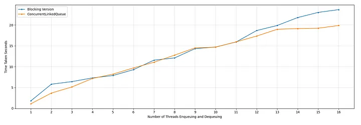

# Concurrent Collections Continued: The ConcurrentLinkedQueue

In previous modules, we explored several concurrent collections: blocking queues (such as `ArrayBlockingQueue`) designed for producer-consumer coordination, and collections optimized for concurrent access (such as `CopyOnWriteArrayList` and `ConcurrentHashMap`). 

In this module, we will explore another highly important, high-performance concurrent collection: the **`ConcurrentLinkedQueue`**. We will analyze its architecture, implement a custom lock-split variant, and compare the performance of blocking vs. non-blocking concurrent queues.

---

## What is ConcurrentLinkedQueue?

A **`ConcurrentLinkedQueue`** is an unbounded, thread-safe, non-blocking queue backed by linked nodes. It orders elements in a strict **FIFO (First-In-First-Out)** manner:
- **Enqueue** (insert) operations append elements to the **tail** of the queue.
- **Dequeue** (remove) operations retrieve and remove elements from the **head** of the queue.

Traditional thread-safe collections (like `Vector` or synchronized wrappers) wrap all operations in a single monitor lock. However, this creates a major bottleneck because enqueuing threads (writing to the tail) and dequeuing threads (reading from the head) block each other, even though they are operating on completely opposite ends of the data structure.

---

## The Michael & Scott Queue Algorithm

To eliminate this bottleneck, researchers Maged M. Michael and Michael L. Scott proposed a landmark concurrent queue design in their 1996 paper: *"Simple, Fast, and Practical Non-Blocking and Blocking Concurrent Queue Algorithms"*.

The core insight of the **Michael & Scott algorithm** is that because enqueue and dequeue operations occur at opposite ends of the queue, they can be synchronized independently using two separate locks:
1.  **`TAIL_LOCK`**: Synchronizes enqueue operations at the tail of the queue.
2.  **`HEAD_LOCK`**: Synchronizes dequeue operations at the head of the queue.

By splitting the lock, producer threads (calling `offer()`) and consumer threads (calling `poll()`) can execute concurrently without blocking each other, significantly increasing throughput.

> **Mental Model: The Sentinel (Dummy) Node**
> When a two-lock queue is empty, or contains only a single element, the head and tail pointers would normally point to the same node. In this state, a simultaneous enqueue and dequeue would cause the head and tail locks to conflict.
> 
> To prevent this, the Michael & Scott algorithm introduces a **sentinel (dummy) node**. 
> - Upon initialization, a dummy node containing no data is created. Both `head` and `tail` point to this dummy node.
> - The `head` pointer does not point to the first actual element; it points to the dummy node that *precedes* the first element.
> - The first actual data node is located at `head.next`.
> - This structural separation guarantees that `head` and `tail` never modify the same node reference simultaneously, keeping the locks completely independent.

---

## Implementing a Two-Lock Blocking Queue

Let's implement the **blocking variant** of the Michael & Scott concurrent queue algorithm in Java:

```java
import java.util.AbstractQueue;
import java.util.ArrayList;
import java.util.Iterator;
import java.util.List;
import java.util.Queue;
import java.util.concurrent.locks.Lock;
import java.util.concurrent.locks.ReentrantLock;

public class BlockingConcurrentLinkedQueue<E> extends AbstractQueue<E> implements Queue<E> {

    private final Lock HEAD_LOCK = new ReentrantLock();
    private final Lock TAIL_LOCK = new ReentrantLock();

    // Independent counters to track queue size
    private int nEnqueues = 0;
    private int nDequeues = 0;

    static final class Node<E> {
        E item;
        Node<E> next;

        Node() {}

        Node(E item) {
            this.item = item;
        }
    }

    private Node<E> head;
    private Node<E> tail;

    public BlockingConcurrentLinkedQueue() {
        // Initialize with a sentinel (dummy) node
        head = tail = new Node<>();
    }

    @Override
    public boolean offer(E e) {
        if (e == null) throw new NullPointerException();
        TAIL_LOCK.lock();
        try {
            tail.next = new Node<>(e);
            tail = tail.next; // Move tail to the new node
            nEnqueues++;
            return true;
        } finally {
            TAIL_LOCK.unlock();
        }
    }

    @Override
    public E poll() {
        HEAD_LOCK.lock();
        try {
            Node<E> first = head.next; // First actual element
            if (first == null) {
                return null; // Queue is empty
            }
            E item = first.item;
            head = first; // Move head forward, turning 'first' into the new dummy node
            nDequeues++;
            return item;
        } finally {
            HEAD_LOCK.unlock();
        }
    }

    @Override
    public int size() {
        // Safe to read because increments/decrements are tracked separately
        return nEnqueues - nDequeues;
    }

    @Override
    public E peek() {
        HEAD_LOCK.lock();
        try {
            Node<E> first = head.next;
            if (first != null) {
                return first.item;
            }
            return null;
        } finally {
            HEAD_LOCK.unlock();
        }
    }

    @Override
    public Iterator<E> iterator() {
        return asList().iterator(); // Simplified iterator for demonstration
    }

    @Override
    public <T> T[] toArray(T[] a) {
        return asList().toArray(a);
    }

    public List<E> asList() {
        List<E> list = new ArrayList<>();
        HEAD_LOCK.lock();
        try {
            for (Node<E> t = head.next; t != null; t = t.next) {
                list.add(t.item);
            }
        } finally {
            HEAD_LOCK.unlock();
        }
        return list;
    }
}
```

*Figure 17.6.1: Custom two-lock BlockingConcurrentLinkedQueue implementation*

### Why Separate Counters are Used for size()
In a standard single-lock queue, a single `size` counter is incremented on enqueue and decremented on dequeue. 
However, in a two-lock queue:
- If we used a single `int size` variable, a concurrent `offer()` (under `TAIL_LOCK`) and `poll()` (under `HEAD_LOCK`) would attempt to modify the `size` variable simultaneously.
- Since incrementing and decrementing are not atomic operations, this would lead to **data races** and corrupt the size value.
- To prevent this without introducing lock contention between head and tail, we maintain two independent counters: `nEnqueues` (only modified under `TAIL_LOCK`) and `nDequeues` (only modified under `HEAD_LOCK`). The `size()` method simply returns the difference: `nEnqueues - nDequeues`.

---

## Blocking vs. Non-Blocking Concurrent Queues

While our two-lock queue allows producers and consumers to run concurrently, it is still a **blocking queue** because:
- Multiple producers calling `offer()` will block each other competing for the `TAIL_LOCK`.
- Multiple consumers calling `poll()` will block each other competing for the `HEAD_LOCK`.

To eliminate this remaining contention, the JDK's **`ConcurrentLinkedQueue`** implements the **non-blocking** version of the Michael & Scott queue algorithm.
- Instead of using locks (`ReentrantLock`), it coordinates updates to the `head` and `tail` pointers using **lock-free CAS operations**.
- If multiple threads attempt to enqueue simultaneously, one succeeds via CAS, and the failing threads simply retry the operation in a spin loop.
- This prevents threads from ever being blocked or suspended by the operating system, maximizing CPU efficiency.

---

## Performance Benchmark

We conduct an experiment to compare our custom two-lock blocking queue against the JDK's non-blocking `ConcurrentLinkedQueue`. The test performs **10 million operations** (5 million enqueues and 5 million dequeues) across varying thread counts:

```java
import org.junit.jupiter.api.Test;
import java.util.Queue;
import java.util.concurrent.*;
import static org.junit.jupiter.api.Assertions.assertEquals;

public class ThreadSafeLinkedQueuePerformanceTest {

    @Test
    public void testLinkedQueue() throws InterruptedException, ExecutionException {
        System.out.println("---------------------------- With Blocking Version -------------------------");
        for (int nThreads = 1; nThreads <= 16; nThreads++) {
            long totalTimeNanos = 0L;
            for (int i = 0; i < 10; i++) {
                totalTimeNanos += testQueue(nThreads, new BlockingConcurrentLinkedQueue<>());
            }
            double averageSeconds = totalTimeNanos / (10.0 * 1_000_000_000.0);
            System.out.printf("nThreads: %d, Average Time Taken: %.6f seconds%n", nThreads, averageSeconds);
        }

        System.out.println("---------------------------- With Non-Blocking Version -------------------------");
        for (int nThreads = 1; nThreads <= 16; nThreads++) {
            long totalTimeNanos = 0L;
            for (int i = 0; i < 10; i++) {
                totalTimeNanos += testQueue(nThreads, new ConcurrentLinkedQueue<>());
            }
            double averageSeconds = totalTimeNanos / (10.0 * 1_000_000_000.0);
            System.out.printf("nThreads: %d, Average Time Taken: %.6f seconds%n", nThreads, averageSeconds);
        }
    }

    private long testQueue(int nThreads, Queue<String> queue) throws InterruptedException, ExecutionException {
        ExecutorService pool = Executors.newFixedThreadPool(nThreads * 2);
        int approxElements = 10_000_000;
        int totalElements = approxElements / nThreads / 2;
        
        @SuppressWarnings("unchecked")
        Future<Long>[] nqFutures = (Future<Long>[]) new Future[nThreads];
        @SuppressWarnings("unchecked")
        Future<Long>[] dqFutures = (Future<Long>[]) new Future[nThreads];
        
        for (int i = 0; i < nThreads; i++) {
            nqFutures[i] = pool.submit(new EnqueueTask(totalElements, "Thread-" + i, queue));
            dqFutures[i] = pool.submit(new DequeueTask(totalElements, "Thread-" + i, queue));
        }
        
        long totalTimeNanos = 0L;
        for (int i = 0; i < nThreads; i++) {
            totalTimeNanos += nqFutures[i].get();
            totalTimeNanos += dqFutures[i].get();
        }
        
        pool.shutdown();
        pool.awaitTermination(30, TimeUnit.SECONDS);
        
        assertEquals(0, queue.size());
        return totalTimeNanos;
    }

    static class EnqueueTask implements Callable<Long> {
        private final int nElements;
        private final String id;
        private final Queue<String> queue;

        public EnqueueTask(int nElements, String id, Queue<String> queue) {
            this.nElements = nElements;
            this.id = id;
            this.queue = queue;
        }

        @Override
        public Long call() {
            long start = System.nanoTime();
            for (int i = 1; i <= nElements; i++) {
                queue.offer(id + ": " + i);
            }
            return System.nanoTime() - start;
        }
    }

    static class DequeueTask implements Callable<Long> {
        private final int nElements;
        private final String id;
        private final Queue<String> queue;

        public DequeueTask(int nElements, String id, Queue<String> queue) {
            this.nElements = nElements;
            this.id = id;
            this.queue = queue;
        }

        @Override
        public Long call() {
            long start = System.nanoTime();
            for (int i = 1; i <= nElements; i++) {
                if (null == queue.poll()) {
                    i--; // Retry if queue was empty
                }
            }
            return System.nanoTime() - start;
        }
    }
}
```

*Figure 17.6.2: Concurrent queue benchmark comparing blocking and non-blocking implementations*

---

## Benchmark Results

Below is the comparative performance data showing average execution times (in seconds) for both versions across 1 to 16 threads, along with the calculated speedup ratio:

| Threads | Blocking Two-Lock Queue (s) | Non-Blocking ConcurrentLinkedQueue (s) | Speedup Ratio |
| :---: | :---: | :---: | :---: |
| **1** | 1.796719 | 1.097190 | 1.64x |
| **2** | 5.799049 | 3.667890 | 1.58x |
| **3** | 6.415782 | 5.130380 | 1.25x |
| **4** | 7.297813 | 7.169760 | 1.02x |
| **5** | 7.878246 | 8.207060 | 0.96x |
| **6** | 9.283406 | 9.696080 | 0.96x |
| **7** | 11.573031 | 11.065830 | 1.05x |
| **8** | 12.092070 | 12.758660 | 0.95x |
| **9** | 14.326374 | 14.502940 | 0.99x |
| **10** | 14.708931 | 14.683610 | 1.00x |
| **11** | 15.925581 | 15.949370 | 1.00x |
| **12** | 18.669342 | 17.341640 | 1.08x |
| **13** | 19.875975 | 18.963850 | 1.05x |
| **14** | 21.784917 | 19.144080 | 1.14x |
| **15** | 23.018592 | 19.226500 | 1.20x |
| **16** | 23.684360 | 19.878610 | 1.19x |

The performance difference is charted in the graph below:



*Figure 17.6.3: Performance comparison between blocking and non-blocking queues (lower is better)*

### Analysis of the Results

1.  **Low Thread Count (1-2 Threads)**: The non-blocking `ConcurrentLinkedQueue` is significantly faster (up to 1.64x speedup). With minimal thread contention, the overhead of acquiring and releasing locks in the blocking version is much higher than performing cheap CAS operations.
2.  **High Thread Count (12-16 Threads)**: As thread contention increases, the non-blocking queue continues to outperform the blocking version. Under high contention, threads in the blocking queue spend a significant amount of time blocked (suspended by the OS) and being rescheduled. In the non-blocking version, threads spin using CAS, avoiding the heavy cost of thread context switches.
3.  **Real-World Considerations**: While this benchmark uses an equal number of producer and consumer threads to create maximum stress, real-world application workloads vary. However, the benchmark clearly demonstrates that non-blocking queues provide superior throughput and efficiency under concurrent write contention.

---

## Summary

*   **FIFO Ordering**: `ConcurrentLinkedQueue` is a thread-safe, unbounded queue that orders elements in a strict First-In-First-Out manner.
*   **Independent Boundaries**: Since enqueueing occurs at the tail and dequeueing occurs at the head, these operations can be synchronized independently to avoid thread contention.
*   **The Michael & Scott Algorithm**: A landmark concurrent queue algorithm that uses separate locks (or CAS operations) for the head and tail of the queue.
*   **The Sentinel Node**: A dummy node is placed at the head of the queue to ensure that head and tail pointers never modify the same node reference simultaneously, keeping the head and tail locks completely independent.
*   **Blocking vs. Non-Blocking**: A blocking two-lock queue resolves producer-consumer contention but still blocks competing producers or competing consumers. A non-blocking queue (like `ConcurrentLinkedQueue`) uses lock-free CAS operations, allowing all threads to proceed without ever blocking.
*   **Throughput Advantage**: Non-blocking queues outperform blocking queues because they avoid the costly overhead of OS-level thread suspension and context switches.
