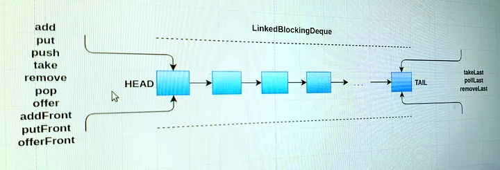

# Deques — ArrayDeque and LinkedBlockingDeque

In previous modules, we focused on traditional queues that enforce a strict FIFO (First-In-First-Out) ordering, where elements are inserted at the tail and removed from the head. 

In this module, we will explore **Deques** (Double-Ended Queues, pronounced *"Decks"*), which allow elements to be inserted or removed from both the head and the tail. We will analyze the thread-safe **`LinkedBlockingDeque`**, contrast it with the non-thread-safe `ArrayDeque`, and understand how deques act as the primary enablers of the high-performance **Work Stealing** pattern.

---

## Deque Operations

A Deque supports insertion, removal, and inspection operations at both ends of the collection. The diagram below illustrates these double-ended operations:



*Figure 17.8.1: Structural representation of double-ended queue (Deque) operations*

The Java Concurrency Utilities provide two primary Deque implementations:
1.  **`ArrayDeque`**: A highly efficient, array-backed Deque. It is **not thread-safe** and does not block threads.
2.  **`LinkedBlockingDeque`**: A thread-safe, node-backed Deque. It is **optionally bounded** (a capacity limit can be set in the constructor) and blocks threads when attempting to insert into a full deque or remove from an empty deque.

### Internal Mechanics of LinkedBlockingDeque
`LinkedBlockingDeque` is structurally straightforward:
- It maintains a doubly-linked list of nodes internally.
- All operations (head and tail) are protected by a **single explicit lock** (`ReentrantLock`).
- Because it is a blocking collection, it uses two `Condition` objects (`notFull` and `notEmpty`) bound to that lock to manage thread blocking and signaling.

---

## Why Deques? The Work Stealing Pattern

While blocking queues are the primary tool for implementing the **Producer-Consumer** pattern, deques are the foundation for a highly scalable, related pattern: **Work Stealing**.

In a traditional **Producer-Consumer** architecture, all consumer threads compete for tasks from a single, shared work queue. Under high thread counts, this single queue becomes a major point of lock contention.

In a **Work Stealing** architecture:
1.  Every worker thread (consumer) maintains its own private, independent `Deque` of tasks.
2.  When a worker thread generates a new task, it pushes that task onto the **head** of its own deque.
3.  When a worker thread is ready to process a task, it pops a task from the **head** of its own deque (acting as LIFO—Last-In-First-Out—which preserves cache locality).
4.  If a worker thread finishes all tasks in its own deque, instead of sitting idle, it attempts to **steal** a task from the **tail** of another worker thread's deque.

> **Mental Model: Work Stealing Contention Reduction**
> By distributing tasks across multiple deques, workers rarely compete for the same lock.
> 
> Furthermore, when a worker thread steals a task from another thread's deque, it accesses the **tail**, while the owner of the deque accesses the **head**. 
> 
> Because the owner and the thief operate on opposite ends of the doubly-linked list, lock contention is drastically reduced. This is conceptually similar to the Michael-Scott split-lock queue algorithm we explored in Module 17-6.

### The Role of Deques in Work Stealing
It is important to note that the work-stealing scheduling logic is not built directly into `LinkedBlockingDeque`. The Deque is simply the data structure that *enables* this pattern. 

To implement work stealing, you need a coordinating framework that manages the worker threads and their stealing behavior. In Java, this is implemented by the **`ForkJoinPool`** framework (which we will explore in later modules), where each worker thread is assigned a custom deque to manage its subtasks.

---

## Demonstration of Deque Methods

Below is a complete, working program demonstrating how elements can be added and removed from both ends of a `LinkedBlockingDeque`:

```java
import java.util.Deque;
import java.util.concurrent.LinkedBlockingDeque;

public class LinkedBlockingDequeDemo {

    public static void main(String[] args) {
        // Instantiate a thread-safe, double-ended blocking queue
        Deque<Integer> ld = new LinkedBlockingDeque<>();
        
        // Add elements to different ends
        ld.add(101);         // Inserts at the tail
        ld.addFirst(100);    // Inserts at the head
        ld.addLast(102);     // Inserts at the tail

        System.out.println("Queue Status Now: " + ld);
        
        // Remove elements from different ends
        Integer first = ld.removeFirst();
        System.out.println("Removed First: " + first + ", Queue Status Now: " + ld);
        
        Integer last = ld.removeLast();
        System.out.println("Removed Last: " + last + ", Queue Status Now: " + ld);
    }
}
```

### Output
```text
Queue Status Now: [100, 101, 102]
Removed First: 100, Queue Status Now: [101, 102]
Removed Last: 102, Queue Status Now: [101]
```

---

## Deque Method Summary

The `Deque` interface provides a rich set of methods to handle different behaviors (throwing exceptions, returning special values, or blocking) across both ends of the collection.

### 1. Insertion Methods
*   **Throw Exception**: `add(e)`, `addFirst(e)`, `addLast(e)`
*   **Special Value**: `offer(e)`, `offerFirst(e)`, `offerLast(e)` (returns `false` if full)
*   **Blocking**: `put(e)`, `putFirst(e)`, `putLast(e)` (blocks if full)

### 2. Removal Methods
*   **Throw Exception**: `remove()`, `removeFirst()`, `removeLast()`
*   **Special Value**: `poll()`, `pollFirst()`, `pollLast()` (returns `null` if empty)
*   **Blocking**: `take()`, `takeFirst()`, `takeLast()` (blocks if empty)

### 3. Stack Operations
Because a Deque supports insertion and removal from the head, it can also act as a **LIFO Stack**. The `Deque` interface provides two convenience methods for this purpose:
*   **`push(e)`**: Equivalent to `addFirst(e)`.
*   **`pop()`**: Equivalent to `removeFirst()`.

---

## Summary

*   **Double-Ended Queue**: A Deque supports efficient insertion, removal, and inspection from both the head and the tail.
*   **LinkedBlockingDeque**: A thread-safe, optionally bounded Deque backed by a doubly-linked list and protected by a single `ReentrantLock` with `Condition` variables.
*   **Work Stealing Pattern**: A highly scalable scheduling pattern where each worker thread has its own private deque. If a worker's deque is empty, it steals tasks from the tail of another worker's deque.
*   **Contention Reduction**: Stealing occurs from the tail, while the owner accesses the head. Because threads operate on opposite ends of the deque, lock contention is minimized.
*   **Enablers of Concurrency**: Deques do not implement work-stealing logic directly; they act as the underlying data structure that enables frameworks like the `ForkJoinPool` to execute work-stealing algorithms.
*   **LIFO Stack Support**: Deques provide `push()` and `pop()` methods, allowing them to be used as high-performance thread-safe stacks.
