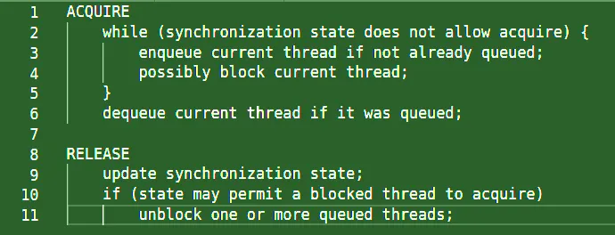

# Introduction to Synchronizers


So far we have looked at the thread-safe collections, which not only act as containers for objects but can also coordinate the control flow of the threads. In this article, we will look at another type of concurrency construct that does the job of coordinating the threads. These are called *Synchronizers.* In this article, we will just get an overview of what a *Synchronizer* is. And in later parts, we will look at a few synchronizers closely.

## What is a Synchronizer

A *Synchronizer* is any object that coordinates the control flow of threads based on a certain state. Blocking queues are a kind of synchronizer as they coordinate the control flow of threads based on the queue emptiness (Remember the notFull and notEmpty Condition objects in ).

There are a number of synchronizer classes provided by the Java Concurrency Framework. Here are a few and we can also create our own synchronizers if the below do not meet our requirements.

Latches

Semaphores

Barriers

FutureTasks

Phaser

Exchanger

## Structural Properties of Synchronizers

All these Synchronizer classes are built on top of a tiny yet powerful sub-framework known as ***AQS*** — The **\*A\*\***bstrat\***\*Q\*\***ueued\***\*S\*\***ynchronizer\* and hence share certain common structural properties which are stated below.

Synchronizers act as a start gate where all the threads arrive and wait for a start event to occur. This start event is otherwise known as a *state change*.

Synchronizer classes encapsulate this *state* and maintain this internally.

Synchronizer class provides methods to manipulate the *state* and provides methods to wait efficiently for the synchronizer to enter the desired state.

## AbstractQueuedSynchronizer — The AQS

AQS is the pillar of the Java Concurrency Framework. A framework not only for building *synchronizers* but also *locks*. A broad range of synchronizers can be built easily and efficiently using it. Not only are ReentrantLock and Semaphore built using AQS, but so are CountDownLatch, ReentrantReadWriteLock, SynchronousQueue, and FutureTask.

Since all these classes are directly or indirectly extended from AbstractQueuedSynchronizer class, they have a lot in common. For example ReentrantLock and Semaphore both classes act as a “gate”, allowing only a permitted number of threads to pass at a time; threads arrive at the gate and are allowed if **lock** or **acquire** operations are successful or made to wait if **lock** or **acquire** blocks, or are turned away if **tryLock** or **tryAcquire** returns false, indicating that the *lock* or *permit* did not become available within the specified amount of time. The basic ideas behind a synchronizer are quite straightforward. There are two main operations ***acquire*** and ***release*** ...

An ***acquire*** operation proceeds as follows.

```java
while (synchronization state does not allow acquire) {
    enqueue current thread if not already queued;
    possibly block current thread;
}
dequeue current thread if it was queued;
```

And a ***release*** operation is:

```java
update synchronization state;
if (state may permit a blocked thread to acquire)
    unblock one or more queued threads;
```

The basic operations that an AQS-based synchronizer performs are some variants of *acquire* and *release*.

The ***acquire*** operation is a state-dependent operation — That means it can block based on a state.

The **\*release\*\*** *is not a blocking operation. The call to *release* may allow threads blocked in *acquire\* to proceed.

Support for these operations requires the careful management of three basic things:

Atomically managing synchronization state.

Blocking and unblocking threads; and

Maintaining FIFO based queues

```java
That is where the AQS framework comes and helps us. AQS handles many of the details of implementing a synchronizer, such as FIFO queue of waiting threads. All the classes extending from AQS are said to be *state-dependent* classes as their sole job is to maintain the state and coordinate the threads based on that state. AQS takes on the task of managing some of this state for the synchronizer class: it manages a single integer of state information that can be manipulated through the protected getState, setState, and compareAndSetState methods. This integer state variable can be used to represent an arbitrary state;
```

For example, ReentrantLock uses it to represent the count of times the owning thread has acquired the lock — Because it is a reentrant lock. The same thread can acquire the lock as many times as it wants. Semaphore uses it to represent the number of permits remaining, and the FutureTask uses it to represent the state of the task (not yet started, running, completed, or canceled). This integer state variable is maintained by AQS and the behavior is synchronizer dependent. But

*Synchronizers* can also manage their own state variables additionally themselves; for example, ReentrantLock keeps track of the current lock owner so it can distinguish between reentrant and contended lock acquisition requests.

That is all the introduction about the Synchronizers. In the next part of this article, we will cover the synchronizer known as *CountDownLatch.*
