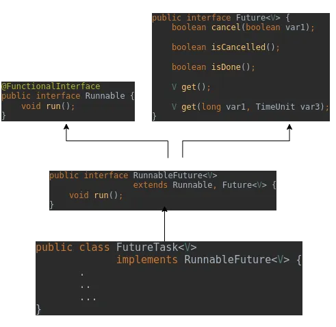

# The FutureTask

In previous modules, we explored `CountDownLatch` and `CyclicBarrier`, which coordinate threads based on events and thread arrival. In this module, we will examine another highly powerful synchronizer in the Java Concurrency Utilities: the **`FutureTask`**.

As the name suggests, a `FutureTask` represents an abstract, result-bearing computation that is expected to run asynchronously and return its results at a later point in the future. It acts as a bridge for asynchronous programming in Java.

---

## FutureTask as a Latch

A `FutureTask` is initialized with an instance of **`Callable<V>`**, which represents a task that executes a computation and returns a result of type `V` (unlike `Runnable`, which does not return a result).

A `FutureTask` also acts as a **latch**. If a thread attempts to retrieve the result of a `FutureTask` before the computation is complete, the thread is blocked.

> **Comparison: Standard Latches vs. FutureTasks**
> - **Standard Latch**: Threads wait for the latch to reach its terminal state (count = 0).
> - **FutureTask**: Threads wait for the computation to reach its completed state so they can retrieve the result.

This makes `FutureTask` the ideal tool for implementing a **result-oriented cache** for heavy, expensive computations (such as calculating player scores in a multiplayer game loop, or downloading and parsing large datasets). By starting the computation early in a background thread, you ensure the result is ready by the time it is needed, minimizing idle waiting time.

---

## 1. The Class Hierarchy of FutureTask

To work with `FutureTask`, you must understand its position within the Java Concurrency API. The class hierarchy is illustrated below:



*Figure 20.4.1: Class hierarchy of FutureTask implementing RunnableFuture*

`FutureTask` implements the **`RunnableFuture<V>`** interface. 
`RunnableFuture` extends both **`Runnable`** and **`Future`**. 
- Because it implements `Runnable`, a `FutureTask` is a task that can be executed by a thread.
- Because it implements `Future`, it exposes methods to cancel the task, check if it is complete, and retrieve its result.

This dual nature allows a `FutureTask` to be passed directly into a `Thread` constructor:

```java
// Create the FutureTask wrapping a Callable computation
FutureTask<MarketData> future = new FutureTask<>(() -> computeScores());

// Pass the FutureTask directly to a Thread
Thread t1 = new Thread(future, "TOP_SCORE_COMPUTER");
t1.start(); // The thread executes the task
```

---

## 2. The States of FutureTask

As a state-dependent synchronizer, a `FutureTask` transitions through a strict sequence of states managed by an internal integer state variable. 

The task can be in one of the following primary states:
*   **`NEW`**: The task has been created but has not yet run, or is currently starting.
*   **`COMPLETING`**: The task is currently finishing and writing its result or exception.
*   **`NORMAL`**: The task completed successfully and holds a valid result.
*   **`EXCEPTIONAL`**: The task completed with an exception.
*   **`CANCELLED`**: The task was cancelled before it completed.
*   **`INTERRUPTED`**: The task was interrupted during execution.

Once a `FutureTask` enters a completed state (`NORMAL`, `EXCEPTIONAL`, `CANCELLED`, or `INTERRUPTED`), it remains in that state forever. It cannot be restarted or run again.

---

## 3. Retrieving Results and Safe Publication

To retrieve the result of a `FutureTask`, threads call the **`get()`** method. The behavior of `get()` depends entirely on the task's state:
- If the task is in a completed state (`NORMAL`), `get()` returns the result immediately.
- If the task is still running or waiting (`NEW` or `COMPLETING`), `get()` **blocks the calling thread** until the task completes, and then returns the result.
- If the task failed or was cancelled, `get()` throws an exception.

### Publication Safety
> [!NOTE]
> **Safe Publication Guarantee**
> `FutureTask` guarantees the **safe publication** of the computation result. 
> 
> The internal memory barriers and AQS state transitions ensure that all memory writes performed by the background thread doing the computation are made visible to the retrieving thread(s) before `get()` returns. You do not need to write additional synchronization logic to make the result visible.

---

## 4. Handling Exceptions in Future.get()

If the `Callable` computation throws an exception (checked or unchecked), the `FutureTask` catches it, wraps it inside an **`ExecutionException`**, and rethrows it when a thread calls `get()`.

This complicates the exception-handling code of the retrieving thread because it must handle:
1.  **`InterruptedException`**: If the retrieving thread was interrupted while waiting.
2.  **`CancellationException`**: If the task was cancelled before completion.
3.  **`ExecutionException`**: A wrapper containing the actual cause of the failure.

The cause of an `ExecutionException` (obtained via `e.getCause()`) can fall into three categories:
- A checked exception thrown by the `Callable` logic.
- A `RuntimeException`.
- An `Error`.

To handle these cases cleanly, the book *Java Concurrency in Practice* recommends a utility method called **`launderThrowable`** to extract and handle these exceptions:

```java
public static RuntimeException launderThrowable(Throwable t) {
    if (t instanceof RuntimeException) {
        return (RuntimeException) t; // Return RuntimeExceptions directly
    } else if (t instanceof Error) {
        throw (Error) t; // Rethrow Errors directly
    } else {
        // Throw an IllegalStateException for checked exceptions
        throw new IllegalStateException("Not unchecked", t); 
    }
}
```

*Figure 20.4.2: Standard launderThrowable utility for cleaning up exception handling*

Before calling `launderThrowable()`, your code should explicitly catch and handle any expected checked exceptions. Unchecked exceptions and errors can then be delegated to `launderThrowable`.

---

## Complete Code Example: FutureTaskDemo

Below is a complete program demonstrating how to use `FutureTask` to perform an expensive, asynchronous market data download and safely retrieve the results:

```java
import java.io.IOException;
import java.nio.file.Files;
import java.nio.file.Path;
import java.time.LocalDateTime;
import java.util.HashMap;
import java.util.Map;
import java.util.concurrent.ExecutionException;
import java.util.concurrent.FutureTask;

public class FutureTaskDemo {

    static class MarketDataDownloader {
        private final String location;
        
        // The FutureTask wrapping our Callable computation
        private final FutureTask<MarketData> marketDataFuture;
        
        // The background thread executing the FutureTask
        private final Thread downloaderThread;

        public MarketDataDownloader(String location) {
            this.location = location;
            // Initialize the FutureTask with a method reference matching Callable
            this.marketDataFuture = new FutureTask<>(this::loadMarketData);
            this.downloaderThread = new Thread(marketDataFuture, "MARKET_DATA_DOWNLOADER");
        }

        private MarketData loadMarketData() throws IOException {
            MarketData md = new MarketData();
            logInfo("Preparing the Market Data...");
            Files.lines(Path.of(location)).forEach(md::addEntry);
            return md;
        }

        public void download() {
            // Start the background thread to execute the FutureTask
            downloaderThread.start();
        }

        public MarketData getMarketData() {
            try {
                // Blocks until the background thread completes the computation
                return marketDataFuture.get(); 
            } catch (InterruptedException e) {
                Thread.currentThread().interrupt();
                throw new RuntimeException("Thread interrupted while waiting", e);
            } catch (ExecutionException e) {
                Throwable cause = e.getCause();
                throw launderThrowable(cause);
            }
        }

        private RuntimeException launderThrowable(Throwable t) {
            if (t instanceof RuntimeException) return (RuntimeException) t;
            else if (t instanceof Error) throw (Error) t;
            else throw new IllegalStateException("Not unchecked", t);
        }
    }

    static class MarketData {
        private final Map<String, MarketDataEntry> cache = new HashMap<>();

        public void addEntry(String fields) {
            String[] data = fields.split(",");
            MarketDataEntry mde = new MarketDataEntry(data[0], data[1], data[2], Double.parseDouble(data[3]));
            logInfo("Downloaded and cached the Market Data Entry for " + data[0]);
            sleep(500); // Simulate expensive network/parsing latency
            cache.put(data[0], mde);
        }

        public int getCount() {
            return cache.size();
        }

        private static class MarketDataEntry {
            private final String name;
            private final String location;
            private final String currency;
            private final double price;

            public MarketDataEntry(String name, String location, String currency, double price) {
                this.name = name;
                this.location = location;
                this.currency = currency;
                this.price = price;
            }
        }
    }

    public static void sleep(long millis) {
        try {
            Thread.sleep(millis);
        } catch (InterruptedException e) {
            Thread.currentThread().interrupt();
            e.printStackTrace();
        }
    }

    public static void main(String[] args) {
        // Initialize the downloader with the target CSV file
        MarketDataDownloader mdl = new MarketDataDownloader("src/main/resources/market_data.csv");
        
        // Start the background download thread
        mdl.download();
        
        logInfo("Waiting for the market data download to complete...");
        
        // Block and retrieve the results when ready
        MarketData md = mdl.getMarketData(); 
        
        logInfo("Market Data downloaded successfully. Number of entries: " + md.getCount());
    }

    private static void logInfo(String msg) {
        System.out.println(LocalDateTime.now() + ": " + Thread.currentThread().getName() + " :: " + msg);
    }
}
```

*Figure 20.4.3: Asynchronous downloader using FutureTask*

#### Output
```text
2026-06-24T20:21:19.881: main :: Waiting for the market data download to complete...
2026-06-24T20:21:19.879: MARKET_DATA_DOWNLOADER :: Preparing the Market Data...
2026-06-24T20:21:20.068: MARKET_DATA_DOWNLOADER :: Downloaded and cached the Market Data Entry for STOCK1
2026-06-24T20:21:20.575: MARKET_DATA_DOWNLOADER :: Downloaded and cached the Market Data Entry for STOCK2
2026-06-24T20:21:21.076: MARKET_DATA_DOWNLOADER :: Downloaded and cached the Market Data Entry for STOCK3
2026-06-24T20:21:21.576: MARKET_DATA_DOWNLOADER :: Downloaded and cached the Market Data Entry for STOCK4
2026-06-24T20:21:22.077: MARKET_DATA_DOWNLOADER :: Downloaded and cached the Market Data Entry for STOCK5
2026-06-24T20:21:22.578: MARKET_DATA_DOWNLOADER :: Downloaded and cached the Market Data Entry for STOCK6
2026-06-24T20:21:23.111: main :: Market Data downloaded successfully. Number of entries: 6
```

---

## Walkthrough of the Code Flow

1.  **FutureTask Creation**: Inside the `MarketDataDownloader` constructor, we instantiate `FutureTask` using a method reference `this::loadMarketData` which acts as the `Callable` task.
2.  **Thread Setup**: We wrap the `FutureTask` inside a standard `Thread` named `MARKET_DATA_DOWNLOADER`.
3.  **Task Execution**: Calling `download()` starts the thread, initiating the `loadMarketData()` computation asynchronously.
4.  **Retrieving the Result**: In the `main` thread, we call `getMarketData()`, which internally invokes `marketDataFuture.get()`. This is a blocking call: the `main` thread blocks until `MARKET_DATA_DOWNLOADER` finishes processing the CSV entries.
5.  **Exception Handling**: If the downloader encounters an `IOException`, the exception is caught, wrapped in an `ExecutionException`, and thrown to the `main` thread. We catch this, extract the root cause via `e.getCause()`, and delegate to `launderThrowable()` to handle it.

---

## Summary

*   **RunnableFuture Implementation**: `FutureTask` implements `RunnableFuture`, meaning it behaves as both a `Runnable` (can be executed by a thread) and a `Future` (can cancel the task and retrieve its result).
*   **Result-Bearing Computation**: It represents an abstract asynchronous computation defined by a `Callable` instance, which returns a result and can throw checked exceptions.
*   **Latch Behavior**: It acts as a latch: threads attempting to call `get()` will block until the background thread completes the computation and the result becomes available.
*   **AQS State Management**: The task transitions through a set of states (e.g., `NEW`, `COMPLETING`, `NORMAL`, `EXCEPTIONAL`, `CANCELLED`) and remains in its completed state permanently once finished.
*   **Safe Publication**: `FutureTask` guarantees that the computed result is safely published to retrieving threads using memory barrier synchronization.
*   **Exception Wrapping**: Any exception thrown during the computation is caught by the task, wrapped inside an `ExecutionException`, and rethrown by `get()`, requiring structured cleaning via `launderThrowable()`.
