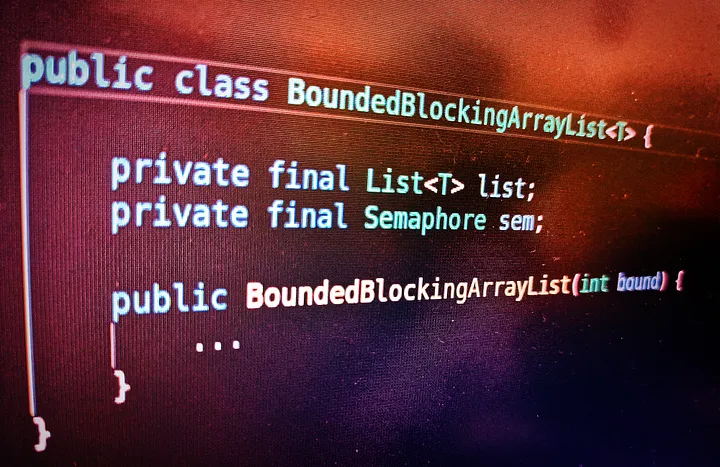

# The Semaphores


We have looked at different synchronizers so far. Every synchronizer blocks or allows the threads in one or the other way, based on a particular state. The Semaphore is yet another synchronizer that deals with permitting the threads to perform some task or access a resource. This works in a little different way. These are otherwise knowns as Counting Semaphores and are used to control the number of threads or the activities that can access a certain resource or perform a given action at the same time.

Counting semaphores can be used to implement connection pools in which we allow only a certain number of connections to be acquired by threads.

The number of activities that it allows is called a ***Permit***. A Semaphore manages a set of virtual permits; the initial number of permits is passed to the Semaphore constructor. Semaphore has two operations: ***Acquire*** and ***Release***.

**Acquire:** The threads can acquire permits if available using the acquire operation. The **tryAcquire()** method is used to acquire the permit. If no permit is available, acquire blocks until one is available or until interrupted or the operation times out. The important thing here to be noted is the same thread can acquire more than one permit based on availability. There is NO restriction that one thread should acquire only one permit.

**Release: **When the threads are done with their task they will release the permit back to the semaphore. The **release()** method does the task of handing over the permit back to the Semaphore.

## Semaphore as a Non-ReentrantLock

Semaphore can also be used to implement the ***Non-Reentrant*** locking semantics. For this, we just simply initialize the Semaphore with count as 1. This is otherwise known as a ***Binary Semaphore ***— A Semaphore with an initial count of one. A ***Binary Semaphore*** can be used as a ***Mutex*** with non-reentrant locking semantics; in the sense that whoever holds the single permit is said to have the lock. After the work is done the permit is simply released back to Semaphore.

## Usages of Semaphore

There are two main usages of Semaphore.

First, Semaphores to implement resource pools such as database connection pools.

Turning any collection into a ***Bounded Collection***.

## 1. Implementing Resource Pools

Implementing *ResourcePool* is very easier with semaphores. We just initialize the Semaphore with the count — The number of resources that our pool supports. And we can expose an API to get and return the resources. The below program illustrates this.

```java
import java.util.ArrayList;
import java.util.List;
import java.util.concurrent.Semaphore;


public class SemaphoreResourcePoolDemo {


    static class ResourcePool {


        private final int POOL_SIZE = 5;
        private final Semaphore PERMITTER = new Semaphore(POOL_SIZE);
        private final List<Object> resources = new ArrayList<>();


        public ResourcePool() {
            for (int i = 0; i < POOL_SIZE; i++) {
                resources.add(new Object());
            }
        }


        public Object getResource() {
            if (PERMITTER.availablePermits() > 0) {
                try {
                    PERMITTER.acquire();
                } catch (InterruptedException e) {
                    e.printStackTrace();
                }
                System.out.println("Permit available! Acquired the resource!!");
                return resources.remove(0);
            }
            System.out.println("No Permits available!");
            return null;
        }


        public void returnResource(Object resource) {
            resources.add(resource);
            PERMITTER.release();
            System.out.println("Released the resource!!");
        }
    }


    public static void main(String[] args) throws InterruptedException {
        ResourcePool resourcePool = new ResourcePool();
        Object[] resources = new Object[7];
        for (int i = 0; i < 7; i++) {
            resources[i] = resourcePool.getResource(); // acquire the resource
            // Perform the task or the computation
            // ...using the acquired resource here
        }


        for (int i = 0; i < 5; i++) {
            resourcePool.returnResource(resources[i]); // release the resource
        }
    }
}
```

hosted with ❤ by 

Illustration 20.5.1 ResourcePool’s using Semaphore

The above program illustrates how to implement a resource pool. The class ResourcePool just wraps the Semaphore and the other related stuff. We just created a semaphore constructor at line 10 with the count represented by POOL_SIZE whose value is 5. And we exposed an interface to get and return the resources from the main method. From lines 43 to 47 we tried to acquire 7 resources while only 5 are available. For the other two, the ***ResourcePool*** says that ***No permit is available***. Look at the below output to understand this better.

Permit available! Acquired the resource!!
Permit available! Acquired the resource!!
Permit available! Acquired the resource!!
Permit available! Acquired the resource!!
Permit available! Acquired the resource!!
No Permits available!
No Permits available!
Released the resource!!
Released the resource!!
Released the resource!!
Released the resource!!
Released the resource!!

## 2. Building Blocking Bounded Collection using Semaphore

We can write a wrapper including the semaphore object on any collection class to make them a ***Bounded Blocking Collection***. The below program illustrates this.

```java
import java.util.ArrayList;
import java.util.Collections;
import java.util.List;
import java.util.concurrent.Semaphore;


public class BoundedBlockingArrayList<T> {
    private final List<T> list;
    private final Semaphore sem;


    public BoundedBlockingArrayList(int bound) {
        this.list = Collections.synchronizedList(new ArrayList<>());
        sem = new Semaphore(bound);
    }


    public boolean add(T o) throws InterruptedException {
        sem.acquire(); // A blocking call
        boolean added = false;
        try {
            added = list.add(o);
            return added;
        } finally {
            if (!added)
                sem.release(); // Very important to do this
        }
    }


    public boolean remove(Object o) {
        boolean removed = list.remove(o);
        if (removed)
            sem.release();
        return removed;
    }


}
```

hosted with ❤ by 

Illustration 20.5.2 BoundedBlockingArrayList with Semaphore

As illustrated in the BoundedBlockingArrayList, the semaphore is initialized to the desired number. This is the key point here to make the collection bound.

The add operation acquires a permit before adding the item into the underlying collection. We have to be really careful while doing this. If the underlying add operation does not actually add anything, then we should release the permit immediately so that there will be no stale permits.

Similarly, a successful remove operation releases a permit, enabling more elements to be added.

You can now check the Illustration-20.5.2 that how we turned the ArrayList into a Bounded Blocking Collection. The underlying list implementation knows nothing about the boundness. The bounded nature is solely handled by BoundedBlockingArrayList.

That’s all about Semaphores. With Semaphores, it is very easy to build resource pools and make bounded collections.

## Summary

Semaphore is yet another synchronizer that deals with permitting the threads to perform some task or access a resource.

Semaphore manages a set of virtual permits; the initial number of permits is passed to the Semaphore constructor. Semaphore has two operations: ***Acquire*** and ***Release***.

tryAcquire() method is used to acquire the permit and release() is used to return back the permit to the semaphore.

Semaphore is used for two purposes:

- Creating ResourcePools.
- Creating Bounded Collections.
