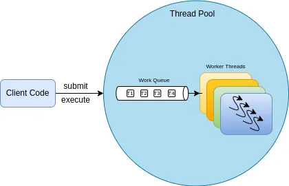

# The Thread Pools

In the previous , we have seen why we need to go for the Executor framework. From here on, we will see how we can use the Executor framework to organize the tasks.

We know that a task is a self-contained logical unit of work run by the threads. And threads are a mechanism by which tasks can run asynchronously. Here in this article, we will understand a very important programming principle called ***Separation of Concerns ***upon which the Executor framework is built upon.

One important thing to note is that in the Executor framework, the tasks are represented by the instances of either Runnable or Callable and the task execution is represented by the Executors but not the threads.

So the primary abstraction for the task execution is the Executor which is an interface.

```java
public interface Executor {
    void **execute**(**Runnable** command);
}
```

The Executor interface acts as a base interface of the whole framework and lays a foundation for the programming principle — The ***Separation of Concerns***.

## Separation of Concerns

What this principle**\* \***says is that when we have multiple needs or concerns, it is better to separate the code for each need into different classes. This makes the application more modular and flexible.

Let us understand this better. You probably looked at the following code snippet in many places.

```java
Runnable **TSK** = () -> someTask(); // Lambda representing Runnable
Thread **T1** = new **Thread(TSK)**;
```

The above code snippet does NOT quite follow the ***Separation of Concerns*** principle. Because, if you notice closely, we are binding the threads with the tasks.

To understand this much better let us look at it this way. We have two concerns in the above code snippet.

First Concern: A Task to be executed — **TSK**

Second Concern: A thread that runs the task — **T1**.

What the line **new Thread(TSK)** essentially does is, it binds the thread **T1** with the task **TSK**. In the other words, the thread **T1** and the task **TSK **are tied together. We attached these two concerns. There are two disadvantages to this.

First, Thread **T1** can only perform the task **TSK** and nothing else.

Second, the Thread T1 is a single-use object.

In the above code snippet, after Thread **T1** finishes, the life cycle ends. That means the **T1 **has been completed and it cannot execute another task as it is no longer alive. If we want to execute another task we have to create another thread and bind them together. That means it is a single-use thread object.

Now, what if we have hundreds of tasks to be executed. Creating hundreds of threads and binding them to the tasks is painful and not scalable and most importantly not so flexible. So what can be done?

The solution here is to decouple the two concerns: the threads and the tasks. Or in other words, we need to separate the task submission from its execution. This is what ***Separation of Concerns*** means. Let’s understand how this principle solves the problem.

The Executor interface comes and bridges that gap. It has a method **execute()** through which the tasks are submitted. There are several implementations of Executor interface which we call as thread pools. And they manage threads and the tasks.

Instead of creating the threads ourselves, we just submit the tasks to the Executor. And the Executor is responsible for managing the threads and tasks. How it manages the threads varies with the type of the thread pool that we are using. But all we need to know is to submit the tasks to the pool from outside.

So with the Executor, we decouple the *Task Submission* from the *Task Execution*. All the work of creating the threads and assigning the tasks is handled internally by the Executor framework. Let's understand further how the thread pools manage the threads and tasks.

## Thread Pool in Practice

In the , we have seen a code snippet. Just copy-pasting the same here.

```java

private static final int NTHREADS
= Runtime.*getRuntime*().availableProcessors();
private static final Executor ***pool***
= Executors.***newFixedThreadPool***(NTHREADS);
ServerSocket socket = new ServerSocket(6000);
while (true) {
final Socket connection = socket.accept();
Runnable clientTask = ()->handleRequest(connection);
pool.**execute**(**clientTask**);
}
```

Line 4 describes how we can create a thread pool object. The class ***Executors, ***not to be confused with the interface Executor, contains static factory methods that return the Thread Pool objects. There are four predefined thread pools offered by the Executor framework. But we can also create our own thread pool. Let's understand them one by one.

## Thread Pools and Their Execution Policy

Before mentioning the built-in thread pools, let's understand one more important advantage of separating out the task execution from the threads as this also makes us understand why there are different thread pools. The separation of the task submission from its execution gives us the flexibility in how the tasks can be executed internally — This is what we refer to as ***Execution Policy***.

***Execution Policy*** specifies the “what, where, when, and how” of the task execution. Such as:

In what threads will the tasks be executed?

In what order should tasks get executed? (FIFO, LIFO, Priority Order)

How many tasks may be executed concurrently?

How many tasks may be queued pending execution?

If a task has to be rejected because the system is overloaded, which task should be selected and how should the application be notified?

What actions should be taken before or after executing a task?

All these are answered by a thread pool object. So the important thing here to understand is that the thread pools come with a certain ***Execution Policy***. A thread pool, as the name suggests, is a pool of worker threads and is tightly bound to a ***Work Queue***. Worker threads, unlike the normal threads, won’t shut down until the pool shuts down. And they have a simple life cycle: request the task from the work queue, execute it, and go back to the waiting state. Let me reiterate because this is what is the core of thread pools.

A thread pool comes with a certain execution policy.

A thread pool contains a pool of worker threads.

A thread pool contains a Work Queue holding the tasks waiting to be executed.

Worker threads have a simple life:
**>>>** Request the task from the Work Queue
**>>>** Execute it
**>>>** Go back to waiting for another task.

The 4th point is the key here. The worker thread life cycle is different from the conventional java thread life cycle. Unlike normal threads, worker threads don’t finish once they complete a task. Instead, they will get ready for the next task, enabling us to submit any number of tasks we want.

_The worker thread life cycle is different from the conventional Java Thread life cycle. Unlike normal threads, worker threads don’t finish once they complete a task. Instead, they will get ready for the next task, enabling us to submit any number of tasks we want._

There are many advantages to the thread-pool approach.

Reusing an existing thread instead of creating a new one reduces the thread creation and teardown costs.

since the worker thread already exists at the time the task submission happens, there won’t be any latency associated with thread creation, as a result, does not delay task execution, thereby, improving responsiveness.

We can properly tune the size of the thread pool to keep the available processors busy and take the tasks as they arrive.

The Java Executor library provides four main thread pool implementations along with some useful predefined configurations. We can create a thread pool by calling one of the static factory methods in Executors class.

**newFixedThreadPool(int size):\*\***

> > >  **A fixed-size thread pool.
> > > **>>>** Creates worker threads, on the fly, as the tasks are submitted.
> > > **>>>** The number of threads that it creates doesn’t exceed the size specified.
> > > **>>>\*\* It always makes sure that the desired number of threads always exists in the pool. Suppose if one thread dies with an exception, it creates a thread to ensure the existence of the desired number of threads.

**newCachedThreadPool:\*\***

> > > ** Creates new worker threads as per the demand and reuses them once they become free.
> > > **>>>** Threads that have been idle for 60 seconds are removed from the pool.
> > > **>>>\*\* No limit on the size of the pool.

**newSingleThreadExecutor:**
**>>>** Contains a single thread to execute the tasks.
**>>>** Tasks that cannot be executed immediately are placed in an unbounded queue for later execution.
**>>>** This is the same as newFixedThreadPool with pool size as 1 but with one difference. With newFixedThreadPool we can change the pool size whenever we want but with newSingleThreadExecutor there is no such option available.

**newScheduledThreadPool:\*\***

> > > ** This is also a fixed-size thread pool.
> > > **>>>\*\* Supports a delayed and periodic task execution, similar to Timer.

We will look at an example with a fixed thread pool and in the next part of this series, we will discuss the thread pools further.

```java
import java.time.LocalDateTime;
import java.util.concurrent.ExecutorService;
import java.util.concurrent.Executors;


public class FixedThreadPoolDemo {


    public static void main(String[] args) {
        ExecutorService pool = Executors.newFixedThreadPool(4);
        for (int i = 0; i < 10; i++) {
            pool.execute(printBinary(i));
        }
        pool.shutdown();
    }


    private static Runnable printBinary(int number) {
        return () -> logInfo(number + " = " + Integer.toBinaryString(number));
    }


    private static void logInfo(String msg) {
        System.out.println(Thread.currentThread() + " :: " + msg);
    }


}
```

hosted with ❤ by 

This is a very simple example. In line 8 we have created a fixed thread pool with size 4. And the lines 15 to 17 return a Runnable that represents a task that prints a binary equivalent of a given integer. On line 10, we submitted that task to the pool. So there are 10 tasks being handled by 4 threads. Here is the output.

Thread[pool-1-thread-4,5,main] :: 3 = 11
Thread[pool-1-thread-3,5,main] :: 2 = 10
Thread[pool-1-thread-4,5,main] :: 4 = 100
Thread[pool-1-thread-3,5,main] :: 5 = 101
Thread[pool-1-thread-4,5,main] :: 6 = 110
Thread[pool-1-thread-3,5,main] :: 7 = 111
Thread[pool-1-thread-4,5,main] :: 8 = 1000
Thread[pool-1-thread-3,5,main] :: 9 = 1001
Thread[pool-1-thread-1,5,main] :: 0 = 0
Thread[pool-1-thread-2,5,main] :: 1 = 1

The new thing that you might have noticed is the ExecutorService class in line 8. ExecutorService is another interface that extends Executor. It provides additional methods to manage the life cycle of the pool as a whole. We will look at them in the next article.

Hope this gives a good understanding of the thread pools and executor framework. More is coming in the subsequent articles.
