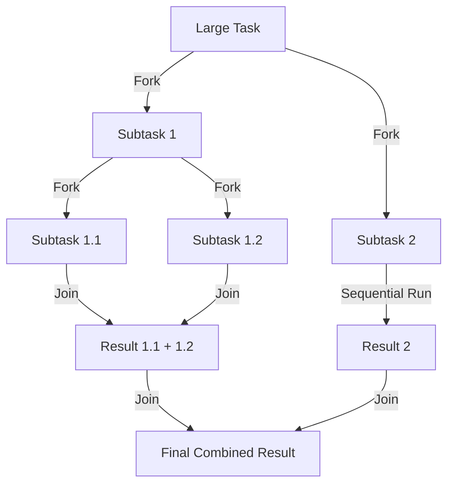

# Guide to the Fork/Join Framework in Java

Java 7 introduced the **Fork/Join Framework** to the `java.util.concurrent` package. The framework is designed to speed up parallel processing by attempting to utilize all available processor cores. It achieves this by implementing a highly efficient **divide-and-conquer** task execution model.

---

## 1. The Divide-and-Conquer Approach

The Fork/Join Framework coordinates parallel execution through two distinct phases:

1.  **The Fork Phase**: A large task is recursively split (**forked**) into smaller, independent subtasks until they are simple enough to be executed sequentially without further division.
2.  **The Join Phase**: The subtasks are executed in parallel, and their results are recursively merged (**joined**) back up the hierarchy into a single final result. If the task returns `void`, the framework simply waits until all subtasks have completed.



*Figure 22.1: Flow of a recursive Fork/Join execution cycle*

To execute these tasks efficiently, the framework manages a specialized thread pool called the **`ForkJoinPool`**, which runs worker threads of type **`ForkJoinWorkerThread`**.

---

## 2. ForkJoinPool and the Work-Stealing Engine

The **`ForkJoinPool`** is the heart of the Fork/Join Framework. It is an implementation of the `ExecutorService` interface designed specifically to execute recursive tasks.

In a standard thread pool, all threads share a single work queue. In a highly parallel environment, thousands of threads competing for a single queue creates a major lock bottleneck. 

To solve this, `ForkJoinPool` implements a **Work-Stealing** architecture:
- Each worker thread in the pool maintains its own private, double-ended queue (**Deque**) to store its subtasks.
- **Local Execution (LIFO)**: By default, a worker thread pushes new subtasks onto the **head** of its own deque, and pops them from the **head** to execute them. This Last-In-First-Out ordering maximizes CPU cache locality.
- **Work-Stealing (FIFO)**: If a worker thread finishes all tasks in its own deque, it becomes idle. To maximize CPU utilization, it attempts to "steal" a task from the **tail** of another busy worker's deque, or from the global submission queue.

> **Mental Model: Work-Stealing in ForkJoinPool**
> Stealing from the **tail** of another thread's deque provides two massive advantages:
> 1.  **Contention Reduction**: The owner thread accesses the deque from the **head**, while the thief accesses it from the **tail**. Since they operate on opposite ends, they rarely block each other.
> 2.  **Largest Chunk First**: Because tasks are split recursively, the largest chunks of undivided work are located at the tail of the deque (the oldest tasks). By stealing from the tail, the thief grabs a large chunk of work that it can then split locally, reducing the need to steal again.

---

## 3. Instantiating ForkJoinPool

There are two ways to obtain or create a `ForkJoinPool` instance:

### 1. The Common Pool (Recommended)
In Java 8, you can access a static, pre-allocated **common pool** using `ForkJoinPool.commonPool()`:

```java
ForkJoinPool commonPool = ForkJoinPool.commonPool();
```

The common pool is the default pool used by all parallel streams, `CompletableFuture`, and any `ForkJoinTask` that is not explicitly submitted to a custom pool. Utilizing the common pool is highly recommended because it reduces resource consumption, preventing the overhead of spawning separate thread pools for different tasks.

### 2. Custom ForkJoinPool
If you need custom thread naming, custom thread factories, or a specific parallelism level, you can construct a custom pool:

```java
// Create a custom pool with a parallelism level of 2 (uses 2 processor cores)
ForkJoinPool forkJoinPool = new ForkJoinPool(2);
```

---

## 4. ForkJoinTask<V>

**`ForkJoinTask`** is the base class for all tasks executed within a `ForkJoinPool`. It is a lightweight representation of a task (much lighter than a standard thread). In practice, you should not extend `ForkJoinTask` directly; instead, you should extend one of its two primary subclasses:

*   **`RecursiveAction`**: Used for tasks that perform computations but do **not** return a result (their return type is `void`).
*   **`RecursiveTask<V>`**: Used for tasks that perform computations and return a result of type `V`.

Both subclasses require you to implement the abstract **`compute()`** method, which contains the recursive divide-and-conquer logic.

---

## 5. Implementing RecursiveAction (No Return Value)

Below is an implementation of a `CustomRecursiveAction` that converts a string to uppercase in parallel. If the string length exceeds a specified threshold, the task forks itself into two subtasks:

```java
import java.util.ArrayList;
import java.util.List;
import java.util.concurrent.ForkJoinTask;
import java.util.concurrent.RecursiveAction;
import java.util.logging.Logger;

public class CustomRecursiveAction extends RecursiveAction {
    private final String workload;
    private static final int THRESHOLD = 4;
    private static final Logger logger = Logger.getAnonymousLogger();

    public CustomRecursiveAction(String workload) {
        this.workload = workload;
    }

    @Override
    protected void compute() {
        if (workload.length() > THRESHOLD) {
            // Split the task into smaller subtasks and execute them in parallel
            ForkJoinTask.invokeAll(createSubtasks());
        } else {
            // Perform the sequential computation
            processing(workload);
        }
    }

    private List<CustomRecursiveAction> createSubtasks() {
        List<CustomRecursiveAction> subtasks = new ArrayList<>();
        String partOne = workload.substring(0, workload.length() / 2);
        String partTwo = workload.substring(workload.length() / 2);
        
        subtasks.add(new CustomRecursiveAction(partOne));
        subtasks.add(new CustomRecursiveAction(partTwo));
        return subtasks;
    }

    private void processing(String work) {
        String result = work.toUpperCase();
        logger.info("Result: (" + result + ") processed by " + Thread.currentThread().getName());
    }
}
```

*Figure 22.2: Parallel String uppercase processing using RecursiveAction*

---

## 6. Implementing RecursiveTask<V> (With Return Value)

Below is an implementation of a `CustomRecursiveTask` that processes an array of integers in parallel, filtering and transforming elements. It recursively divides the array until the size falls below the threshold, and then joins the results:

```java
import java.util.ArrayList;
import java.util.Arrays;
import java.util.Collection;
import java.util.List;
import java.util.concurrent.ForkJoinTask;
import java.util.concurrent.RecursiveTask;

public class CustomRecursiveTask extends RecursiveTask<Integer> {
    private final int[] arr;
    private static final int THRESHOLD = 20;

    public CustomRecursiveTask(int[] arr) {
        this.arr = arr;
    }

    @Override
    protected Integer compute() {
        if (arr.length > THRESHOLD) {
            // Fork subtasks and sum their results upon joining
            return ForkJoinTask.invokeAll(createSubtasks())
              .stream()
              .mapToInt(ForkJoinTask::join)
              .sum();
        } else {
            // Perform the sequential computation
            return processing(arr);
        }
    }

    private Collection<CustomRecursiveTask> createSubtasks() {
        List<CustomRecursiveTask> dividedTasks = new ArrayList<>();
        dividedTasks.add(new CustomRecursiveTask(Arrays.copyOfRange(arr, 0, arr.length / 2)));
        dividedTasks.add(new CustomRecursiveTask(Arrays.copyOfRange(arr, arr.length / 2, arr.length)));
        return dividedTasks;
    }

    private Integer processing(int[] arr) {
        // Filter elements between 10 and 27, multiply by 10, and sum
        return Arrays.stream(arr)
          .filter(a -> a > 10 && a < 27)
          .map(a -> a * 10)
          .sum();
    }
}
```

*Figure 22.3: Parallel integer array summation using RecursiveTask*

---

## 7. Submitting Tasks to ForkJoinPool

You can submit tasks to the `ForkJoinPool` using several methods depending on whether you need synchronous blocking, asynchronous execution, or automated joining:

### 1. `execute(ForkJoinTask)` or `submit(ForkJoinTask)`
Submits the task asynchronously. The submitting thread does not block. You must call `join()` on the task later to retrieve the result:

```java
forkJoinPool.execute(customRecursiveTask);
int result = customRecursiveTask.join(); // Blocks until completed
```

### 2. `invoke(ForkJoinTask)`
Submits the task synchronously. The calling thread blocks until the task is fully executed and returns the result directly, eliminating the need for manual joining:

```java
int result = forkJoinPool.invoke(customRecursiveTask);
```

### 3. `ForkJoinTask.fork()` and `ForkJoinTask.join()`
You can manually coordinate tasks using the `fork()` and `join()` primitives:
- **`fork()`**: Asynchronously submits the task to the pool's work queue. This is a non-blocking call.
- **`join()`**: Blocks the calling thread until the task completes and returns the result.

```java
// Asynchronously fork the first task
task1.fork(); 
// Execute task2 sequentially in the current thread and then join task1
int result2 = task2.compute(); 
int result1 = task1.join(); 
int finalResult = result1 + result2;
```

To avoid subtle ordering bugs and maximize parallelism, it is generally recommended to use **`ForkJoinTask.invokeAll(task1, task2)`** instead of manual fork-and-join sequences.

---

## Guidelines for Efficient Fork/Join Development

To achieve optimal performance and avoid concurrency bottlenecks, follow these four guidelines:

1.  **Minimize Thread Pools**: In almost all cases, you should use **one** thread pool per application or JVM. Share the default `ForkJoinPool.commonPool()` across your application rather than constructing separate pools for different tasks.
2.  **Use the Common Pool by Default**: Only create a custom `ForkJoinPool` if you explicitly need a custom thread factory, custom exception handler, or strict core isolation.
3.  **Choose a Reasonable Threshold**: Choosing the right threshold for splitting tasks is critical:
    - If the threshold is **too small**, the overhead of creating and scheduling millions of lightweight task objects will exceed the computation time, reducing performance.
    - If the threshold is **too large**, the tasks will not be split enough to utilize all available CPU cores, resulting in poor parallelism.
4.  **Avoid Blocking Operations inside Tasks**: 
    > [!WARNING]
    > **Blocking in ForkJoinTasks Pitfall**
    > Never perform blocking I/O (like network or disk calls), lock acquisitions, or sleep operations inside a `ForkJoinTask`. 
    > 
    > Because `ForkJoinPool` worker threads run cooperatively, blocking a thread stalls the work-stealing engine and prevents other tasks in its queue from being stolen or executed, severely degrading pool throughput.

---

## Summary

*   **Fork/Join Framework**: A parallel processing framework in Java designed to speed up large, computationally heavy tasks using a recursive divide-and-conquer approach.
*   **Divide-and-Conquer**:
    - **Fork**: Recursively splits a large task into smaller independent subtasks.
    - **Join**: Merges the subtask results back into a single final result.
*   **Work-Stealing Architecture**: Each worker thread has its own Deque. Threads pull tasks from the head of their own deque (LIFO). Idle threads steal tasks from the tail of busy threads' deques (FIFO), maximizing CPU utilization and reducing lock contention.
*   **Task Types**:
    - `RecursiveAction`: For parallel tasks that do not return a value (`void`).
    - `RecursiveTask<V>`: For parallel tasks that return a result of type `V`.
*   **Common Pool**: The JVM provides a pre-allocated `ForkJoinPool.commonPool()` shared by all parallel streams and CompletableFuture, reducing thread allocation overhead.
*   **No Blocking**: Blocking operations (I/O, locks, sleep) must be avoided inside `ForkJoinTask` to prevent stalling the cooperative worker threads and the work-stealing engine.