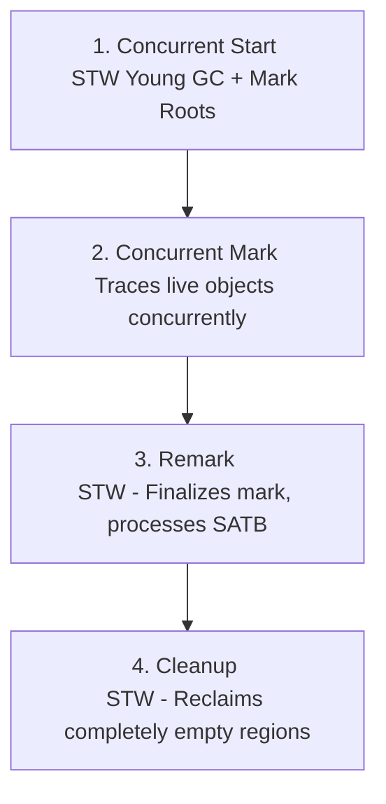

# Advanced Garbage Collection

In Chapter 4, we explained the basic theory of Java garbage collection and analyzed the parallel collector, which is the simplest production collector in concept in HotSpot. Building on that foundation, this chapter examines the theory and design of modern Java garbage collectors. We will start with HotSpot's standard garbage collector, **G1**, and then study a selection of other collectors designed for specific workloads:

- **Shenandoah**
- **Balanced** (from Eclipse OpenJ9)
- **Z Garbage Collector (ZGC)**
- **Legacy HotSpot collectors** (such as CMS and the zero-effort Epsilon collector)

---

## Trade-offs and Pluggable Collectors

An important feature of the Java platform is that while memory management is automated, the Java Language and Virtual Machine Specifications do not require how garbage collection must be implemented. In fact, some specific Java runtimes (such as **Epsilon**, or runtimes designed for Lego Mindstorms) do not implement any memory recovery mechanism at all. $ ^{1} $

Within OpenJDK and Oracle runtimes, the GC subsystem is designed to be **pluggable**. This allows the same compiled Java application to run on different collectors without changing the program's behavior, though its performance, latency, and resource size may vary dramatically depending on the collector in use.

Pluggability is essential because GC is a general-purpose technique; no single algorithm is best for every workload. Every GC implementation represents a set of trade-offs between different performance goals:

- **STW Pause Time**: The length of stop-the-world pauses.
- **Throughput**: The percentage of CPU time used to run application code versus performing garbage collection.
- **Pause Frequency**: How often the collector stops the application.
- **Reclamation Efficiency**: The amount of dead memory recovered in a single GC cycle.
- **Pause Consistency**: The predictability and variation of pause times.

While **pause time** often attracts the most attention from developers, it should not be judged alone.

> [!NOTE]
> For many backend workloads, reducing pause times at all costs is actually harmful.

For example, a highly parallel, offline batch-processing job is highly affected by overall throughput but not affected by pause lengths. If a batch job can complete faster by using a throughput-optimized collector, pauses of even tens of seconds are completely acceptable, as long as the job finishes within its planned time. In this situation, a collector that tunes CPU efficiency (like `Parallel GC`) is much better than a low-latency collector that uses extra CPU cycles to keep pauses short.

Also, **throughput** is a complex metric. While standard definitions define throughput as the comparison of application run time to GC time, a low GC percentage does not automatically show a healthy application. 

For instance, if an application slows down because of an external database slowdown, it will allocate less memory. The resulting drop in allocation rate means the GC runs less frequently, which falsely improves the seeming "GC-to-run-time" throughput ratio, even though the application's real business throughput has dropped fast.

Another important factor is **compaction** (as performed by the `ParallelOld` collector). $ ^{2} $ Compaction moves surviving heap objects into a single connected block, which greatly improves CPU cache locality. Because related objects are placed close together, later reads are very likely to hit the same CPU cache line, making memory access much faster. 

Since Java applications spend a huge part of their cycles allocating and reading memory, spending GC time to compact the heap can result in an overall performance gain for the application as a whole.

As of Java 21, OpenJDK provides four production-level collectors. We have already analyzed the parallel throughput collectors. In this chapter, we will focus on the standard general-purpose collector, **G1**, and then study other low-latency options.

---

## Concurrent GC Theory

As discussed in Chapter 4, the unpredictable nature of GC pauses is driven by application allocation patterns, which are highly changeable and unpredictable. General-purpose garbage collectors do not know when it is most easy to pause the application.

In specific environments, such as graphics rendering engines, a fixed frame rate gives regular, predictable times to run collection. Java, however, provides no way for the application to send these scheduling opportunities to the JVM. The GC must run as a fully managed, independent system, aware only of the live object graph in the heap. This lack of working together ensures a level of runtime unpredictability.

> "The minor disadvantage of this arrangement is the delay of the computation proper; its major disadvantage is the unpredictability of these garbage collecting interludes." $ ^{3} $
> — Edsger W. Dijkstra et al.

Modern garbage collection design tries to solve Dijkstra's classic problem by performing as much of the marking and evacuation work as possible concurrently, while the application threads continue to run. While this greatly reduces STW pause times, it introduces two challenges:
- It uses CPU cycles that would otherwise be used by application threads, potentially reducing overall throughput.
- It adds a lot of complexity to make sure the application does not change the object graph in a way that confuses the collector.

To understand how concurrent collectors solve these challenges, we must first study two basic technologies: **safepoints** and **tri-color marking**.

### JVM Safepoints

For an STW collector to run, it needs a completely stable object graph. This means all application threads must be paused. To achieve this, the JVM uses **safepoints**—chosen points in execution where a thread's internal data structures are in a known, stable state, allowing it to be safely paused.

> [!NOTE]
> The JVM is not a completely preemptive multithreading environment. While the OS can preempt a thread at any time (e.g., when its timeslice expires), the JVM itself cannot forcefully pause a running thread at random instruction boundaries; it must rely on the thread cooperating to pause itself.

To manage this coordination, the JVM follows two strict rules:
1. **The JVM cannot force a thread into a safepoint.**
2. **The JVM can prevent a thread from leaving a safepoint.**

As a result, the JVM runtime puts safepoint checks (polls) into the execution path:
- **Interpreted Code**: The interpreter checks for a global safepoint flag between the execution of any two bytecodes. $ ^{4} $
- **Compiled Code**: The JIT compiler puts safepoint checks at method exits and at the end of loop iterations (specifically, on backward branches).

Reaching a safepoint works as a coordinated workflow:
1. The JVM sets a global **time-to-safepoint** flag.
2. Active application threads check this flag at their next safepoint check.
3. Upon seeing the flag, the threads pause themselves and wait for a signal.

Once all active threads have checked in and paused themselves, the JVM enters a **safepoint state**, allowing the GC to run its STW phase. The time spent waiting for the slowest thread to get to a safepoint is called **Time-To-Safepoint (TTSP)**, which can sometimes cause latency spikes that are not fully shown in the GC pause time metrics.

> [!NOTE]
> This barrier-and-suspend action is similar in concept to a `CountDownLatch` in the `java.util.concurrent` package.

Certain thread states affect safepoint status:
- **Automatically at a Safepoint**: A thread is seen as being at a safepoint if it is blocked waiting on a monitor lock or running native code via the Java Native Interface (JNI).
- **Not at a Safepoint**: A thread is not at a safepoint while it is in the middle of executing a bytecode instruction, if it has been interrupted by the OS, or if it is running JIT-compiled code outside of an explicit check.

### Tri-Color Marking

Dijkstra and Lamport's 1978 tri-color marking algorithm is the theoretical basis of concurrent garbage collection. The algorithm groups objects in the heap using three symbolic colors:

- **White**: Unvisited objects. At the start of a cycle, all objects are colored white. At the end of the cycle, any remaining white objects are unreachable (dead) and can be cleared.
- **Gray**: Visited objects whose referenced objects have not yet been scanned. These represent the active wavefront of the tracing phase.
- **Black**: Visited objects whose referenced objects have all been scanned. These objects are proven to be reachable and will not be collected.

#### The Tri-Color Tracing Workflow
1. Color all **GC roots** gray and all other heap objects white.
2. Select a gray object from the wavefront.
3. Trace all objects referenced by this gray object:
   - If a referenced object is white, color it gray.
4. Once all outgoing references from the gray object have been traced, color the gray object black.
5. Repeat steps 2–4 until no gray objects remain in the heap.
6. Clear all remaining white objects (sweep phase).

This relationship is shown in Figure 5-1.

<div style="text-align: center;"></div>

<div style="text-align: center;"><div style="text-align: center;">Figure 5-1. Tri-color marking</div> </div>

In a concurrent collector, application threads (**mutators**) are actively changing the object graph while GC threads are running the tri-color algorithm. This introduces a critical race condition: a mutator thread could write a reference to an unscanned white object into an already scanned black object, and then delete all references to that white object from any remaining gray objects. 

Because the black object is already processed, the GC will never rescan it, and the white object will remain white at the end of the cycle, resulting in the premature clearing of a live object. This situation is shown in Figure 5-2.

<div style="text-align: center;"></div>

<div style="text-align: center;"><div style="text-align: center;">Figure 5-2. A mutator thread could invalidate tri-color marking</div> </div>

To prevent this, collectors must enforce the **Tri-Color Invariant**:

> [!IMPORTANT]
> **The Tri-Color Invariant**
> No black object may hold a direct reference to a white object during concurrent marking.

To keep this rule, concurrent collectors use two main ways:

1. **Write Barriers (On-the-fly Graying)**: When a mutator thread tries to write a reference to a white object into a black object, a write barrier stops the operation and changes the black object's color back to gray (or colors the white object gray), forcing the GC to scan it again. Although smart, this breaks the mathematical property of **monotonicity** (meaning the black set only grows), making it harder to prove that the marking phase will finish.
2. **Snapshot-At-The-Beginning (SATB)**: The collector takes a logical snapshot of the object graph at the start of the cycle. Any object that was live at the start, or is allocated during the cycle, is seen as live. If a reference is deleted, the write barrier saves the old reference to a local buffer. The JVM processes these buffers during a short, final STW **Remark** phase to clear up any remaining references.

The G1 collector uses the SATB approach to reduce its final STW remark pause. $ ^{5} $

### Forwarding Pointers (Brooks Pointers)

To compact the heap concurrently, the collector must move objects while application threads are actively reading and writing to them. To achieve this safely, collectors in the past used **forwarding pointers** (often called **Brooks pointers**). $ ^{6} $

This technique adds an extra memory word to the header of every object. This word points directly to the object itself, unless the object has been moved. The resulting layout is shown in Figure 5-3.

<div style="text-align: center;"></div>

<div style="text-align: center;"><div style="text-align: center;">Figure 5-3. The Brooks pointer</div> </div>

When the GC moves an object, it:
1. Reserves space for a copy of the object in a new region.
2. Copies the object's contents to the new address.
3. Uses an atomic **Compare-And-Swap (CAS)** CPU instruction to update the original object's Brooks pointer to point to the new copy.
4. Any future reads or writes accessing the old object are sent via the Brooks pointer to the new copy, as shown in Figure 5-4.

<div style="text-align: center;"></div>

<div style="text-align: center;"><div style="text-align: center;">Figure 5-4. Updating the forwarding pointer</div> </div>

The main disadvantage of Brooks pointers is the **memory cost**. Adding a 64-bit word to every single object increases the memory size of a simple `java.lang.Integer` object from 20 bytes to 28 bytes—an overhead of 40%. Modern collectors like ZGC and newer versions of Shenandoah use smart other ways to avoid this cost.

---

## The G1 Collector

**G1 (Garbage First)** is the standard general-purpose collector for HotSpot. First introduced as an experimental feature in Java 6, it was heavily rewritten during Java 7 and became stable and ready for real-world use in Java 8u40.

> [!CAUTION]
> Do not use G1 on any version of Java before **Java 8u40**, as early versions had stability problems and high performance costs.

G1 was designed as a low-pause replacement for the legacy **Concurrent Mark Sweep (CMS)** collector. Its main design goals were:
- Very easy tuning compared to CMS.
- High resistance to premature promotion.
- Predictable, stable pause times on large heaps.
- Reducing the need to go back to expensive full STW collections.

G1 became the standard HotSpot collector in Java 9, replacing the parallel collectors. It has received constant improvements in Java 11, 17, and 21.

### Pause Goals

A key feature of G1 is its support for **pause goals**. Developers can set the wanted maximum time of a GC pause using the flag:

```shell
-XX:MaxGCPauseMillis=200
```

This default goal of 200 ms is a flexible target; the JVM does not promise it will always be met. If the goal is set too low (e.g., 10 ms), G1 will fail to reach it under heavy load. Under normal workloads with single-digit gigabyte heaps, actual pauses are usually far below the 200 ms limit.

### Heap Layout and Regions

G1 is completely different from the contiguous generational layout of older collectors. Instead, it divides the Java heap into thousands of separate, equal-sized **regions** (typically ranging from 1 MB to 32 MB, always a power of 2, up to 512 MB in Java 21). 

Regions are given a generational role dynamically (Eden, Survivor, or Old), allowing generations to be non-contiguous in memory. This region-based structure is shown in Figure 5-5.

<div style="text-align: center;"></div>

<div style="text-align: center;"><div style="text-align: center;">Figure 5-5. G1 regions</div> </div>

By default, G1 aims for between 2,048 and 4,095 regions. At startup, the JVM automatically figures out the region size by dividing the heap size by 2,048 and rounding down to the nearest power of 2:

$$\text{Region Size} = \text{RoundDownToPowerOfTwo}\left(\frac{\text{Heap Size}}{2048}\right)$$

#### Humongous Objects
If an object's size is more than **50% of a single G1 region**, it is seen as a **humongous object**. Humongous objects skip Eden completely and are allocated directly into a connected sequence of specific **humongous regions** within the old generation. The most common source of humongous allocations is large primitive arrays.

### G1 Collection Phases

G1 runs two separate collection cycles:

1. **Young GC (G1New)**: A fully STW, evacuating collection targeting only young regions (Eden and Survivor). G1 estimates how many young regions it can collect within the pause time goal and evacuates their live objects to a survivor or old region, reclaiming the source regions instantly.
2. **Mixed GC (G1Old)**: Started when old generation usage passes the **Initiating Heap Occupancy Percent (IHOP)** limit. The collection set includes all young regions plus the part of old regions that contain the most garbage (hence the name "Garbage First"). G1 evacuates and compacts these regions, getting back a lot of space while staying within the set pause time goal.

G1 figures out the IHOP limit dynamically and adaptively based on the application's historical allocation rates. While the default initial value is 45% of the heap, G1 automatically tunes this threshold up or down to avoid concurrent mode failures.

### G1 Mixed Collection Phases

G1 mixed collections run their marking phase concurrently with application threads using a part of the available CPU cores. The number of concurrent GC threads is calculated by the formula:

$$\text{ConcGCThreads} = \max\left(1, \frac{\text{ParallelGCThreads} + 2}{4}\right)$$

This concurrency has two important results:
- Application throughput is a little lower during concurrent marking.
- A young GC may be triggered while concurrent marking is running. These young GCs may take slightly longer than usual because they must share CPU cores with the concurrent GC threads.

G1Old collections go through four main phases:



1. **Concurrent Start (STW)**: Runs along with a young GC to pause the application and mark the initial GC roots.
2. **Concurrent Mark**: Traces the live object graph concurrently alongside running application threads, using the tri-color marking algorithm.
3. **Remark (STW)**: Stops the application briefly to finish marking and process the SATB reference queues, making sure no live objects are missed.
4. **Cleanup (STW)**: Pauses the application to count the usage, finding completely empty regions and instantly recovering them.

### Remembered Sets (RSets)

To avoid scanning the entire heap during a regional collection, G1 links a **Remembered Set (RSet)** with every region. The RSet tracks all incoming references pointing into that region from other regions. 

During a collection, G1 only needs to check the region's RSet and scan the specific source cards rather than tracing the entire heap, as shown in Figure 5-6.

<div style="text-align: center;"></div>

<div style="text-align: center;"><div style="text-align: center;">Figure 5-6. Remembered Sets</div> </div>

> [!WARNING]
> Regional tracking systems like RSets can lead to **floating garbage**—dead objects that are kept alive because they are referenced by other dead objects in unscanned regions. During the **Cleanup** phase, G1 performs RSet cleaning to clean up outdated references and limit the amount of floating garbage.

### Full Collections in G1

If G1's concurrent marking phase cannot complete before the application uses up all heap space, the JVM suffers a **concurrent mode failure**. When this occurs, G1 must go back to a fully STW **Full GC** to clean and compact the entire heap. 

Full GCs also occur if humongous regions become heavily fragmented, stopping the allocation of a new humongous object even if the total free space is technically enough.

### JVM Configuration Flags for G1

In Java 8, G1 must be manually turned on using the flag:
```shell
-XX:+UseG1GC
```
In Java 9+, G1 is the default and requires no flag.

To avoid concurrent mode failures, you can increase the safety buffer G1 saves for allocations:
```shell
-XX:G1ReservePercent=10
```

If needed, adaptive IHOP calculation can be disabled to set a fixed limit manually:
```shell
-XX:-G1UseAdaptiveIHOP -XX:InitiatingHeapOccupancyPercent=45
```

The G1 region size can be changed manually (must be a power of 2 between 1 and 512, followed by the `m` suffix):
```shell
-XX:G1HeapRegionSize=16m
```

---

## Shenandoah

**Shenandoah** is another low-latency collector developed by Red Hat. Introduced as an experimental feature in Java 12, it was made ready for production in Java 15 and is fully supported in Java 17 and 21. $ ^{8} $

> [!NOTE]
> Red Hat has backported Shenandoah to Java 8 and 11 in its downstream OpenJDK builds (such as those shipped in Red Hat Enterprise Linux).

Shenandoah's main goal is to keep very short pause times (under 10 ms) on huge heaps (tens or hundreds of gigabytes). To achieve this, Shenandoah performs **concurrent compaction**, meaning it moves and compacts objects while application threads are active. 

To do this, Shenandoah uses a highly tuned multi-phase cycle:

1. **Init Mark (STW)**: Pauses the application to mark the GC roots.
2. **Concurrent Mark**: Traces the live object graph concurrently.
3. **Final Mark (STW)**: Pauses the application to finish marking and select the evacuation regions.
4. **Concurrent Evacuation**: Moves live objects from the chosen regions to new, compacted regions concurrently.
5. **Init Update Refs (STW)**: Pauses the application briefly to make sure all evacuation tasks are complete.
6. **Concurrent Update Refs**: Updates all pointers targeting the relocated objects concurrently.
7. **Final Update Refs (STW)**: Pauses the application to update any remaining references (including roots).
8. **Concurrent Cleanup**: Recovers the evacuated regions.

### Concurrent Evacuation Mechanics

During concurrent evacuation, GC threads copy live objects in the background. To prevent race conditions with application threads, the first version of Shenandoah used Brooks pointers:

1. A GC thread allocates a temporary copy of an object in its TLAB.
2. The GC thread tries to update the original object's Brooks pointer to point to the new copy using an atomic **Compare-And-Swap (CAS)** instruction.
3. **CAS succeeds**: The GC thread wins the race. The copy becomes the correct version, and all future thread accesses are sent to it.
4. **CAS fails**: Another thread won the race. The GC thread throws away its temporary copy and follows the winning thread's Brooks pointer.

To run successfully, Shenandoah's concurrent threads must evacuate objects faster than the application creates new garbage; otherwise, the collector goes back to an STW full GC.

Shenandoah is enabled using the flag:
```shell
-XX:+UseShenandoahGC
```

A comparison of Shenandoah's pause times against other collectors is shown in Figure 5-7.

<div style="text-align: center;"></div>

<div style="text-align: center;"><div style="text-align: center;">Figure 5-7. Shenandoah compared to other collectors (Shipilév)</div> </div>

### Shenandoah's Evolution

Shenandoah's design has changed a lot since its start. A big improvement was removing the memory overhead of Brooks pointers.

Rather than adding an extra word of header memory to every object, Shenandoah now uses a previously unused bit pattern within the standard **Mark Word** to show if an object has been forwarded. 

When an object is marked as forwarded, its remaining body space is no longer required by the original instance and is used to store the forwarding pointer. This smart technique completely removes the extra header word overhead. 

This optimization was enabled by the introduction of **load-reference barriers** in Java 13, $ ^{9} $ which allowed Shenandoah to stop and check object reads and find forwarding addresses with very low CPU overhead. $ ^{10} $

Later versions introduced more improvements:
- **Java 14**: Self-fixing barriers and concurrent class unloading.
- **Java 15**: Concurrent reference processing.
- **Java 17**: Concurrent thread-stack processing.

While the Java 17 and 21 versions of Shenandoah are ready for production, it is not a general-purpose collector. It is designed specifically for very large heaps and is currently non-generational, though a generational version is being actively developed. $ ^{11} $

---

## ZGC

**ZGC (Z Garbage Collector)** is Oracle's main ultra-low latency collector. It is designed to move all GC operations that grow with heap or metaspace size out of STW safepoints and into concurrent phases.

The main design goal of ZGC is to make sure **STW pauses never pass 1 millisecond**, even on heaps up to 16 TB.

Introduced as an experimental feature for Linux in Java 11, ZGC was made ready for production in Java 15 and is completely supported across Linux, macOS, and Windows in Java 17 and 21.

ZGC is a **concurrent, region-based, compacting, NUMA-aware** collector that depends on two main technologies: **colored pointers** and **load barriers**.

### Colored Pointers

Instead of storing forwarding metadata in the object header, ZGC stores lifecycle metadata directly inside the object reference pointer (the `oop`) itself.

In a 64-bit reference, ZGC uses the lower 44 bits for object addresses (allowing a maximum heap size of 16 TB). It saves 4 bits for metadata colors, as shown in Figure 5-8.

<div style="text-align: center;"></div>

<div style="text-align: center;"><div style="text-align: center;">Figure 5-8. ZGC colored pointers</div> </div>

These color bits show:
- If the pointed-to object has been moved.
- If the reference is known to be live.

To stop the CPU from throwing segmentation faults when dereferencing these colored pointers, ZGC uses **memory multimapping**. It maps the same physical memory page to three separate virtual address spaces, each matching a different pointer color state.

Because of this color bit usage, **ZGC does not allow compressed oops**; references are always 64 bits.

> [!WARNING]
> Because ZGC maps the same physical heap memory to three virtual address ranges, standard monitoring tools checking **Resident Set Size (RSS)** will report too much memory use by up to **3x**. Engineers should rely on **Proportional Set Size (PSS)** for exact memory reporting.

### Load Barriers

Whenever an application thread reads a reference from the heap, the JIT compiler puts in a **load barrier**. The load barrier checks the color bits of the pointer:
- If the bits match the expected "good" color, the thread continues instantly.
- If the pointer is labeled as "bad" (indicating the pointed-to object has been moved but the reference has not been updated), the load barrier stops the read, finds the new address in a forwarding table, updates the reference to the new address, and changes its color to "good" (a process called *self-healing*). Later reads of this reference skip the slow path.

### Generational ZGC

The first ZGC version was non-generational. While highly effective at keeping low pauses, non-generational collectors are very likely to suffer allocation stalls under heavy, uneven write loads because they must scan the entire heap to recover any memory.

Java 21 introduced **Generational ZGC** (JEP 439) to solve this problem. It divides the heap into young and old generations, running cheap **minor collections** on young objects and deep **major collections** across the entire heap, similar to G1.

Generational ZGC introduces several design improvements:
- **No Multimapping**: It completely removes memory multimapping, fixing the RSS over-reporting problem. Instead, it manages color resolution directly within the load barrier code.
- **Enhanced Color Layout**: It increases the metadata fields, using **12 color bits** instead of 4, as shown in Figure 5-9.
- **Colorless Stack References**: References stored on the thread stack are kept as colorless pointers; the JVM turns them into colored pointers only when writing them to the heap.

<div style="text-align: center;"></div>

<div style="text-align: center;"><div style="text-align: center;">Figure 5-9. Generational ZGC colored pointers</div> </div>

Generational ZGC is enabled using the flags:
```shell
-XX:+UseZGC -XX:+ZGenerational
```
Oracle plans for Generational ZGC to completely replace the legacy non-generational version in future versions.

---

## Balanced (Eclipse OpenJ9)

The Eclipse Foundation manages the open-source **OpenJ9** JVM (originally developed by IBM). OpenJ9 supports several garbage collection policies, including the region-based **Balanced** collector designed for 64-bit heaps larger than 4 GB.

Its main design goals are:
- Improving the behavior of pause times as heaps grow.
- Reducing the worst-case pause times.
- Tuning for Non-Uniform Memory Access (NUMA) architectures.

Like G1, Balanced divides the heap into a goal of 2,048 regions, supporting region sizes from 512 KB to 512 MB. 

Balanced uses a generational model where each region has a linked age. New objects are created in age-zero regions (Eden). When Eden is full, Balanced runs a stop-the-world **Partial Garbage Collection (PGC)**. 

During a PGC, Balanced collects all Eden regions and may automatically include older regions that contain large amounts of garbage, similar to G1 mixed collections. Surviving objects are moved to new regions, and their generational age is increased by 1.

To fight the floating garbage natural to regional collection, Balanced runs a mostly concurrent **Global Mark Phase (GMP)** in the background. The PGC uses the GMP's marking data to choose the best regions to recover. If the heap becomes heavily fragmented, Balanced goes back to a fully STW **Global Garbage Collection (GGC)** to compact the entire heap.

### OpenJ9 Object Headers

The OpenJ9 object header is made of a **Class Slot** (64 bits, or 32 bits when compressed references are enabled). 

> [!NOTE]
> Compressed references in OpenJ9 are usually turned on by default for heaps smaller than 57 GB.

Depending on the object's condition, OpenJ9 automatically adds additional slots:
- **Monitor Slot**: Appended if the object is synchronized.
- **Hashed Slot**: Appended if the object has been hashed.

To avoid wasting memory, OpenJ9 does not require these slots to be next to the class slot; they can be placed anywhere within the object's padding to use empty space, as shown in Figure 5-10.

The upper bits of the Class Slot point to the off-heap class structure, while the lower 8 bits are saved for GC metadata flags.

<div style="text-align: center;"></div>

<div style="text-align: center;"><div style="text-align: center;">Figure 5-10. OpenJ9 object layout</div> </div>

### Large Arrays: Arraylets

In standard regional collectors, allocating a large array that is larger than the region size causes fragmentation and can trigger concurrent mode failures.

To solve this, OpenJ9's Balanced collector represents large arrays as **arraylets**. An arraylet is made of a central **spine** object pointing to multiple **leaves** that contain the actual array elements. This allows the JVM to allocate large arrays across separate regions automatically, avoiding compaction pauses, as shown in Figure 5-11.

<div style="text-align: center;"></div>

<div style="text-align: center;"><div style="text-align: center;">Figure 5-11. Arraylets in OpenJ9</div> </div>

<div style="text-align: center;"></div>

> [!WARNING]
> While hidden from standard Java code, the spine-and-leaf structure of arraylets is shown to native code via JNI. Developers moving JNI libraries to OpenJ9 must make sure their code knows about arraylets.

### NUMA Awareness

On multi-socket servers using **Non-Uniform Memory Access (NUMA)**, memory access latency varies depending on which CPU socket accesses which physical memory node. 

The Balanced collector is highly NUMA-aware: it divides the Java heap across NUMA nodes, links application threads to specific nodes, and tries first to allocate new objects in memory local to the running thread's socket, as shown in Figure 5-12.

<div style="text-align: center;"></div>

<div style="text-align: center;"><div style="text-align: center;">Figure 5-12. Non-uniform memory access</div> </div>

During a PGC, Balanced automatically moves objects closer to the threads that point to them most frequently, improving long-term memory access speed.

---

## Specialized HotSpot Collectors

### Concurrent Mark Sweep (CMS)

**CMS** was HotSpot's first low-pause collector, designed specifically to manage the old generation concurrently. It was paired with **ParNew**, a parallel collector managing the young generation.

CMS is available in Java 8 and 11, but was deprecated in Java 9 and **completely removed in Java 14**. $ ^{12} $ On Java 8, CMS can still run faster than G1 for specific low-latency workloads, but G1's fast growth in Java 11, 17, and 21 has made CMS outdated.

CMS is enabled using:
```shell
-XX:+UseConcMarkSweepGC
```

Like G1, if Eden fills up while CMS is running in the background, a young GC pauses the application. If the young GC tries to promote more objects than the tenured space can hold, the JVM suffers a concurrent mode failure and goes back to a fully STW, single-threaded `ParallelOld` collection.

### Epsilon: The No-Op Collector

**Epsilon** (JEP 318) is a zero-effort, no-op garbage collector. It handles memory allocation but **has no way to recover memory**. Once the heap is used up, the JVM immediately throws an `OutOfMemoryError` and shuts down.

> "Develop a GC that only handles memory allocation, but does not implement any actual memory reclamation mechanism. Once available Java heap is exhausted, perform the orderly JVM shutdown."
> — JEP 318: Epsilon: A No-Op Garbage Collector

Epsilon must **never be used in real-world live systems**. It is designed strictly for:
- Performance testing and microbenchmarking to separate application code from GC activity.
- Memory allocation regression testing.
- Ultra-low latency, zero-allocation microservices.

Epsilon is enabled using the flags:
```shell
-XX:+UnlockExperimentalVMOptions -XX:+UseEpsilonGC
```

---

## Summary

Java's variety of pluggable garbage collectors is one of the platform's best features. By understanding the core trade-offs between throughput, latency, and memory size, performance engineers can select and configure the best collector for their specific workload:

- **G1**: The standard general-purpose collector, ideal for most multi-gigabyte heaps where moderate pause goals (50–200 ms) are acceptable.
- **Parallel**: The throughput champion, best suited for batch processing and offline computations where STW pauses do not impact business goals.
- **Shenandoah / ZGC**: Low-latency specialists, designed to keep pauses under 10 ms (Shenandoah) or 1 ms (ZGC) on massive, multi-terabyte heaps.
- **Balanced (OpenJ9)**: A specialized regional collector optimizing for NUMA architectures and large heaps on OpenJ9.
- **Epsilon**: A diagnostic, no-op collector designed exclusively for benchmarking and isolation testing.

In Chapter 6, we will turn our attention to how the JVM executes application code, analyzing bytecode interpretation, JIT compilation, and profile-guided optimization.
