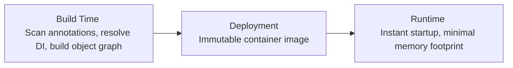

# Code Execution on the JVM

The two main services that any **Java Virtual Machine (JVM)** provides are memory management and an execution container for application code. We studied garbage collection in detail in Chapters 4 and 5; in this chapter, we focus on code execution.

<div style="text-align: center;"></div>

The official Java Virtual Machine Specification (the VM Spec) defines how a valid Java implementation must behave, defining code execution in terms of an interpreter. However, purely interpreted environments have poor performance compared to runtimes that execute native machine code directly. Modern production-level Java environments solve this by using dynamic compilation.

As introduced in Chapter 3, this feature is known as **Just-In-Time (JIT) compilation**. It is a way by which the JVM monitors executing bytecode to determine which methods are run frequently enough to make compiling them directly into optimized native machine code worth the cost.

In this chapter, we will:
- Describe the lifecycle of a traditional Java application.
- Explore the mechanics of bytecode interpretation, showing how HotSpot's approach differs from standard interpreters.
- Study the main concepts of JIT compilation and **Profile-Guided Optimization (PGO)**.
- Examine the **code cache** and the design of HotSpot's compilation subsystem.
- Discuss recent developments in Java program execution—such as **Ahead-Of-Time (AOT)** compilation and frameworks like **Quarkus**—driven by the shift toward cloud native and containerized deployments.

---

## Lifecycle of a Traditional Java Application

Let's begin by tracing exactly what occurs at the system level when you launch a class:

```shell
java HelloWorld
```

On any operating system, a standard process execution workflow starts to bootstrap the JVM:

1. **Process Launch**: The shell locates the `java` launcher binary (typically in `$JAVA_HOME/bin/java`) and starts a new process, passing the command-line arguments and target class name.
2. **Environment Analysis**: The newly started JVM process analyzes command-line flags and checks the physical host. It checks important hardware parameters: the number of available CPU cores, the amount of physical RAM, and the specific instruction sets supported by the processor (e.g., AVX, SSE).
   
   <div style="text-align: center;"></div>

   > [!IMPORTANT]
   > This auto-checking and self-configuring behavior is essential to understand when deploying Java applications in containerized environments (such as Kubernetes or Docker). We will discuss this in detail in Chapter 8.

3. **Memory Reservation**: The JVM reserves a contiguous block of user-space virtual memory from the operating system (equivalent to the maximum heap size set by `-Xmx`, or a default value calculated during the check phase).
4. **Metaspace Initialization**: The JVM initializes **Metaspace**, a dedicated area of native memory used to store loaded class metadata.
5. **VM Thread Startup**: The launcher calls the native function `JNI_CreateJavaVM` to initialize the core virtual runtime on a new thread. The VM then starts its own internal threads, including garbage collection (GC) threads, JIT compiler threads, and the service thread.
6. **Class Loading & Startup**: The JVM loads and prepares core runtime classes (bootstrap classes). Bytecode execution starts instantly during class loading—specifically when executing class initializers (`static {}` blocks, compiled into `<clinit>` methods) for the bootstrap classes.

### Warm-up and Steady State

Because core JVM functions like JIT compilation and GC are active from the very beginning, significant VM activity occurs even before the main entrypoint class (`HelloWorld.main`) is reached. 

For most production applications, the **startup phase** is marked by a high amount of class loading, JIT compilation, and GC activity as the application initializes and warms up. 

Once the application reaches its **steady state**, this background compilation activity drops sharply because:
- The complete set of classes required for normal execution has been loaded.
- The "hot" methods that handle the bulk of the workload have already been compiled into native machine code.

However, a steady state does not mean zero activity. The JVM remains dynamic. The loading of new classes or JIT **deoptimization** and **reoptimization** can occur at any time, such as when the application encounters a rarely executed code path for the first time.

#### Two-Phase Class Loading
A common change in this lifecycle is **two-phase class loading**, typical in frameworks that rely on dependency injection (like Spring or Micronaut):
1. **Framework Boot**: The JVM loads the core framework classes.
2. **Application Wiring**: The framework scans the classpath, builds an object dependency graph, and triggers a second phase of intensive class loading to load the application classes and their dependencies.

While the GC pattern also stabilizes once the steady state is reached, GC events continue to occur regularly as the application allocates and throws away temporary objects—which is the core purpose of automated memory management.

This traditional lifecycle is referred to as **dynamic VM mode**. However, the rise of Cloud Native Java has driven intense interest in other deployment modes better suited for containers, which prioritize instant startup and a minimal memory size. We will discuss these developments later in this chapter.

---

## Overview of Bytecode Interpretation

As introduced in Chapter 3, the JVM interpreter runs as a **stack machine**. Unlike physical CPUs, which use registers as immediate holding areas for calculations, a stack machine performs operations using an **evaluation stack** (or execution stack) associated with the currently executing method.

The JVM provides three primary memory areas to manage execution data:
- **The Evaluation Stack**: Local to a specific method invocation; used to store intermediate operands and calculation results.
- **Local Variables**: Local to a specific method invocation; temporarily stores local variables and parameters.
- **The Object Heap**: Shared globally across all methods and threads; stores object instances and arrays.

Figures 6-1 through 6-5 show how the stack machine evaluates the expression `x = 3 + 1`:

<div style="text-align: center;"></div>

<div style="text-align: center;"><div style="text-align: center;">Figure 6-1. Initial interpretation state</div> </div>

The interpreter must evaluate the right-hand side of the expression to obtain a value to compare with or store in `x`.

<div style="text-align: center;"></div>

<div style="text-align: center;"><div style="text-align: center;">Figure 6-2. Subtree evaluation</div> </div>

The first value, the integer constant `3`, is pushed onto the evaluation stack.

<div style="text-align: center;"></div>

<div style="text-align: center;"><div style="text-align: center;">Figure 6-3. Subtree evaluation (Step 2)</div> </div>

Next, the integer constant `1` is pushed onto the stack. On a real JVM, these values are loaded either from the class file's constant pool or via specialized "shortcut" instructions for common, small constants.

<div style="text-align: center;"></div>

<div style="text-align: center;"><div style="text-align: center;">Figure 6-4. Subtree evaluation (Step 3)</div> </div>

The addition instruction (`iadd`) pops the top two elements off the stack, adds them together, and pushes the resulting value (`4`) back onto the stack.

<div style="text-align: center;"></div>

<div style="text-align: center;"><div style="text-align: center;">Figure 6-5. Final subtree evaluation</div> </div>

The calculated value (`4`) on the top of the stack is now ready to be compared with or stored in `x`, which has remained on the stack below the evaluated expression.

### Introduction to JVM Bytecode

Every stack machine operation code (**opcode**) is represented by a single byte, hence the name **bytecode**. This limits the JVM to a maximum of 256 instructions, of which roughly 200 are actively in use as of Java 23.

Bytecode instructions are strictly **typed**. For instance, the addition instructions `iadd` and `dadd` expect to find two `int` values and two `double` values, respectively, at the top of the stack.

Many instruction families contain specific variants for each primitive type and for object references:
- `dstore`: Pops a `double` from the stack and stores it in a local variable.
- `astore`: Pops an object reference (`oop`) and stores it in a local variable.

To ensure portability, the JVM specification requires that all multi-byte bytecode structures follow **big-endian** byte ordering. Hardware platforms that natively use little-endian must handle this conversion automatically in software.

#### Shortcut Instructions
To keep class files compact, common instructions have "shortcut" variants that omit explicit arguments. For example, `aload_0` loads the local variable at index `0` (which represents the `this` reference in non-static methods) onto the stack. Since loading `this` is extremely frequent, providing `aload_0` as a single-byte instruction yields massive savings in class file size. 

While less critical in the era of high-speed networks, this compact design was vital in the early days of Java when applets were downloaded over 14.4 Kbps dial-up modems.

<div style="text-align: center;"></div>

> [!NOTE]
> Since Java 1.0, only one new bytecode opcode—`invokedynamic`—has been added to the instruction set, while two—`jsr` (jump to subroutine) and `ret`—have been deprecated.

The use of typed variants and shortcuts results in a large number of individual opcodes, but the underlying conceptual operations are very simple. The core instructions can be categorized into five main families:

#### 1. Load and Store Category
These instructions move data between local variables, the constant pool, and the evaluation stack.

| Family Name | Arguments | Description |
| :--- | :--- | :--- |
| `load` | `(i1)` | Loads a value from local variable `i1` onto the stack. |
| `store` | `(i1)` | Stores the top of the stack into local variable `i1`. |
| `ldc` | `c1` | Loads a constant from constant pool index `c1` onto the stack. |
| `const` | None | Loads a simple literal constant (e.g., `iconst_0`, `aconst_null`) onto the stack. |
| `pop` | None | Discards the top value on the stack. |
| `dup` | None | Duplicates the top value on the stack. |
| `getfield` | `c1` | Reads a field from the object on the stack (using constant pool index `c1`) and pushes the value. |
| `putfield` | `c1` | Writes the value on the stack into an object's field (using constant pool index `c1`). |
| `getstatic` | `c1` | Reads a static field (using constant pool index `c1`) and pushes it onto the stack. |
| `putstatic` | `c1` | Writes the value on the stack into a static field (using constant pool index `c1`). |

The distinction between `ldc` and `const` is simple: `ldc` performs a lookup to load complex constants (like strings, class literals, or method handles) from the class's constant pool, $ ^{1} $ while `const` instructions take no arguments and load simple hardcoded primitive values directly (such as `aconst_null`, `dconst_0`, or `iconst_m1` which loads `-1` as an integer).

#### 2. Arithmetic Category
These pure stack-based instructions perform math on primitive values. They take no arguments.

| Family Name | Description |
| :--- | :--- |
| `add` | Adds the top two values on the stack. |
| `sub` | Subtracts the top two values on the stack. |
| `div` | Divides the top two values on the stack. |
| `mul` | Multiplies the top two values on the stack. |
| `cast` | Casts the value on the top of the stack to a different primitive type. |
| `neg` | Negates the value on the top of the stack. |
| `rem` | Computes the remainder (modulo) of the top two values on the stack. |

#### 3. Flow Control Category
These instructions implement branching, looping, and jumping, translating high-level Java constructs (like `if`, `for`, `while`, and `switch`) into bytecode.

| Family Name | Arguments | Description |
| :--- | :--- | :--- |
| `if` | `(i1)` | Branches to a target offset if the comparison condition is met. |
| `goto` | `i1` | Performs an unconditional branch to the specified offset. |
| `return` | None | Returns from the current method, optionally passing back the value on the top of the stack. |
| `tableswitch` | None | Jumps to a target index using a contiguous lookup table. |
| `lookupswitch` | None | Jumps to a target index using a sparse key-value lookup. |

<div style="text-align: center;"></div>

While the flow control table is small, the actual instruction count is large due to the numerous conditional branches in the `if` family (e.g., `if_icmpge`, `ifnull`, `if_acmpeq`).

#### 4. Method Invocation Category
Method invocation is the only way the JVM permits to transfer control to a new method. The JVM strictly separates local flow control (jumping within a method) from inter-method control transfers.

| Opcode Name | Arguments | Description |
| :--- | :--- | :--- |
| `invokevirtual` | `c1` | Invokes an instance method via virtual (dynamic) dispatch. |
| `invokespecial` | `c1` | Invokes an instance method via exact, non-virtual dispatch (constructors, private methods, super). |
| `invokeinterface` | `c1, count, 0` | Invokes an interface method using interface offset table lookup. |
| `invokestatic` | `c1` | Invokes a static method (no receiver object required). |
| `invokedynamic` | `c1, 0, 0` | Dynamically resolves which method to call at runtime and executes it. |

At the VM level, there is no generic "call" instruction. Instead, we refer to a **call site** (the location in the caller method where the callee is invoked). For non-static calls, the object on which the method is called is the **receiver object**, and its actual runtime class is the **receiver type**.

<div style="text-align: center;"></div>

> [!NOTE]
> Calls to static methods are always compiled to `invokestatic` and have no receiver object.

<div style="text-align: center;"></div>

It is an excellent exercise to write a simple Java class and disassemble it using `javap -c` to observe which invocation bytecodes are generated for different method calls.

#### The Role of invokedynamic
Introduced in Java 7 to support dynamic languages (like JRuby and Groovy) on the JVM, `invokedynamic` has become the architectural foundation of modern Java features. It was first leveraged in Java 8 to implement lambda expressions.

Consider this simple lambda program:

```java
public class LambdaExample {
    private static final String HELLO = "Hello";

    public static void main(String[] args) throws Exception {
        Runnable r = () -> System.out.println(HELLO);
        Thread t = new Thread(r);
        t.start();
        t.join();
    }
}
```

Disassembling this class reveals how the lambda is represented in bytecode:

```text
public static void main(java.lang.String[]) throws java.lang.Exception;
  Code:
     0: invokedynamic #2,  0              // InvokeDynamic #0:run:()Ljava/lang/Runnable;
     5: astore_1
     6: new           #3                  // class java/lang/Thread
     9: dup
    10: aload_1
    11: invokespecial #4                  // Method java/lang/Thread."<init>":(Ljava/lang/Runnable;)V
    14: astore_2
    15: aload_2
    16: invokevirtual #5                  // Method java/lang/Thread.start:()V
    19: aload_2
    20: invokevirtual #6                  // Method java/lang/Thread.join:()V
    23: return
```

The `invokedynamic` instruction at offset `0` hands over to a bootstrap method, which dynamically constructs and returns an instance of `Runnable` wrapping the lambda body. This design avoids generating boilerplate inner classes at compile time, reducing class file sizes and allowing the JVM to optimize the lambda creation path dynamically at runtime.

#### 5. Platform Opcodes Category
These instructions perform VM-level operations, such as allocating heap memory or managing object monitor locks.

| Opcode Name | Arguments | Description |
| :--- | :--- | :--- |
| `new` | `c1` | Allocates uninitialized heap space for an object of the type at constant pool index `c1`. |
| `newarray` | `prim` | Allocates a primitive array of type `prim` (size must be popped from stack). |
| `anewarray` | `c1` | Allocates an array of object references of type `c1` (size must be popped from stack). |
| `arraylength` | None | Pops an array reference and pushes its length onto the stack. |
| `monitorenter` | None | Acquires the intrinsic monitor lock of the object on the top of the stack. |
| `monitorexit` | None | Releases the intrinsic monitor lock of the object on the top of the stack. |

Opcodes vary widely in complexity:
- **Fine-Grained**: Simple operations like `iadd` are translated into native assembly instructions within the interpreter.
- **Coarse**: Complex operations like `invokevirtual` or `new` require constant pool resolution and allocation checks, requiring calls back into the core HotSpot C++ runtime.

### Safepoints in the Interpreter

Recall that a safepoint is a state where the JVM requires all application threads to be suspended so it can perform coordinated operations (like GC). 

Because every JVM thread is a native OS thread, $ ^{2} $ when a thread is executing interpreted bytecode, it is executing interpreter code rather than raw native instructions. 

This makes the boundary between bytecode instructions an ideal, safe point to pause a thread. The interpreter simply checks the safepoint poll flag before dispatching the next opcode, making interpreted code highly cooperative and easy to safepoint. $ ^{3} $

---

## Writing a Simple Interpreter

To understand the core mechanics of a stack machine, we can model a basic interpreter in Java. The following class implements a simple interpreter loop capable of executing a small subset of JVM bytecodes to perform basic arithmetic: $ ^{4} $

```java
public class SimpleInterpreter {
    private final Opcode[] table = Opcode.values();
    private final int[] localVariables = new int[256];

    public EvalValue execMethod(final byte[] instr) {
        if (instr == null || instr.length == 0) {
            return null;
        }

        EvaluationStack eval = new EvaluationStack();
        int current = 0;

        while (true) {
            byte b = instr[current++];
            Opcode op = table[b & 0xff];
            if (op == null) {
                System.err.println("Unrecognized opcode byte: " + (b & 0xff));
                System.exit(1);
            }
            byte num = op.numParams();
            switch (op) {
                case IADD:
                    eval.iadd();
                    break;
                case ISUB:
                    eval.isub();
                    break;
                case ICONST_0:
                    eval.iconst(0);
                    break;
                case STORE:
                    store(instr[current++]);
                    break;
                case IRETURN:
                    return eval.pop();
                // Dummy implementations for VM-level operations
                case ALOAD:
                case ALOAD_0:
                case ASTORE:
                case GETSTATIC:
                case INVOKEVIRTUAL:
                case LDC:
                    System.out.print("Executing " + op + " with param bytes: ");
                    for (int i = current; i < current + num; i++) {
                        System.out.print(instr[i] + " ");
                    }
                    current += num;
                    System.out.println();
                    break;
                case RETURN:
                    return null;
                default:
                    System.err.println("Saw " + op + " : can't happen. Exit.");
                    System.exit(1);
            }
        }
    }

    private void store(int index) {
        // Implementation for storing variables
    }
}
```

This interpreter reads bytecodes sequentially from the instruction stream. For instructions that accept parameters, it reads the subsequent bytes to advance the program counter correctly. Operands are pushed onto and popped from the local `EvaluationStack`. 

While this simple model lacks method invocation (which would require recursively spawning a new execution frame and calling `execMethod` on the callee's bytecode), it shows the core loop of a virtual stack machine.

---

## HotSpot Template Interpreter

A production JVM like HotSpot requires maximum execution speed. Instead of a simple `switch` interpreter, HotSpot uses a **Template Interpreter**. 

At startup, the JVM dynamically generates native assembly code for every single bytecode instruction, tailoring the code specifically to the host CPU architecture. This generated assembly forms a jump table. When executing bytecode, the interpreter jumps directly to the pre-generated native assembly blocks, bypassing the overhead of a C++ dispatch loop.

Moreover, HotSpot defines private, internal bytecodes that are not part of the official VM specification. These are used to optimize common execution paths.

### Case Study: Final Methods and invokespecial
To show the need for dynamic VM optimizations, consider the Java Language Specification rule regarding binary compatibility:

> "Changing a method that is declared final to no longer be declared final does not break compatibility with pre-existing binaries."
> — JLS 13.4.17

Suppose we have these classes:

```java
public class A {
    public final void fMethod() {
        // ... implementation
    }
}

public class CallA {
    public void otherMethod(A obj) {
        obj.fMethod();
    }
}
```

If the compiler assumed `fMethod()` would always remain `final` and compiled the call to `invokespecial` (which performs direct, static dispatch):

```text
public void otherMethod(A obj)
  Code:
     0: aload_1
     1: invokespecial #4                  // Method A.fMethod:()V
     4: return
```

If a developer later updates class `A` to make `fMethod()` non-final, and extends it in class `B` to override the method:
- If a client passes an instance of `B` to `otherMethod()`, executing `invokespecial` would bypass the override and statically invoke class `A`'s implementation.

This breaks the **Liskov Substitution Principle (LSP)**, which states that any subclass must be usable in place of its superclass. 

To maintain binary compatibility, `javac` must compile all calls to final methods as `invokevirtual`. However, since the VM knows at runtime that a specific method is final and cannot be overridden, the HotSpot interpreter dynamically rewrites the instruction to a private, optimized bytecode. This converts the dynamic dispatch into a direct, statically bound call at runtime, avoiding virtual table lookup overhead.

HotSpot's private bytecodes (found in `src/hotspot/share/interpreter/bytecodes.cpp`) also include markers to register objects for finalization immediately after their superconstructors complete.

---

## JIT Compilation in HotSpot

While the template interpreter is highly optimized, maximum performance requires compiling bytecode into native machine instructions. Mainstream JVMs achieve this via **Just-In-Time (JIT) compilation**, using runtime profiling data to guide code optimization.

### Profile-Guided Optimization (PGO)

JIT compilation is a form of **Profile-Guided Optimization (PGO)**. As the application runs in interpreted mode, the JVM gathers statistics about method execution counts and loop backedge frequencies to build a runtime profile.

<div style="text-align: center;"></div>

> [!TIP]
> JIT compilation occurs at runtime, meaning it shares CPU and memory resources with the active application. The JVM must balance the resource cost of compiling and profiling against the expected performance gains over the application's lifespan.

To minimize overhead, HotSpot compiles code rarely. As shown in Figure 3-3, when a method's execution frequency crosses a JIT compilation threshold, the VM queues it for compilation on a background compiler thread.

<div style="text-align: center;"></div>

> [!NOTE]
> Modern Java compilers (`javac`) emit "dumb bytecode" containing very few compile-time optimizations. This provides a clean, structured representation of the program that is easy for the JIT compiler to analyze and optimize at runtime.

#### The Value of Runtime Profiling
Warming up a JVM allows PGO to compile code specifically for the application's actual runtime behavior. 

For example, consider a financial trading system. Its standard traffic profile is highly predictable, but on major financial news days, the system experiences unusual, high-volume order flows. 
- If the system used static, pre-compiled code optimized for standard days, it would perform poorly under news-day workloads. 
- Under PGO, the JVM detects the shift in traffic patterns and re-optimizes the hot execution paths instantly, making sure the system remains competitive when performance matters most.

<div style="text-align: center;"></div>

Because profiles are highly dynamic, HotSpot does not save compilation state to disk; all profiling data is discarded when the VM shuts down, and the warm-up phase must rebuild the profile on the next launch.

### Vtables and Pointer Swizzling

JIT compiler threads run in the background. The basic unit of compilation is a complete method. When the emitter subsystem queues a method, the compiler thread translates its entire bytecode representation into optimized native machine code.

Once the native machine code (stored in the heap as an `nmethod` structure) is ready, the JVM performs **pointer swizzling**: it updates the target method's entry in the class's virtual function table (`vtable`) to point to the new native code address.

<div style="text-align: center;"></div>

<div style="text-align: center;"><div style="text-align: center;">Figure 6-6. Simple compilation of a single method</div> </div>

<div style="text-align: center;"></div>

Later calls to the method jump directly to the native machine code. Threads currently executing the interpreted version of the method continue in interpreted mode until they return, picking up the compiled native version on their next invocation.

#### On-Stack Replacement (OSR)
If a method contains a very hot loop but the method itself is rarely called, the method invocation counter will not trigger compilation. To prevent the JVM from stalling in the interpreter, HotSpot uses **On-Stack Replacement (OSR)**. 

The JVM compiles only the hot loop body. While the interpreter is executing the loop, the JVM swaps the active stack frame on the fly, redirecting execution to the compiled native loop code mid-flight.

---

## Compilers Within HotSpot

HotSpot contains two distinct JIT compilers:
- **C1** (the *Client Compiler*): Designed for rapid compilation and minimal memory overhead. It applies simple, fast optimizations, making it ideal for GUI applications and fast startup.
- **C2** (the *Server Compiler*): Designed for maximum peak performance. It performs highly sophisticated, aggressive optimizations (like escape analysis, loop unrolling, and global value numbering), which requires more compilation time and CPU resources.

Both compilers use **Single Static Assignment (SSA)**, transforming the code into a representation where variables are never reassigned (equivalent to making all local variables `final`), which makes dependency analysis much simpler.

### Tiered Compilation

Historically, developers had to choose between C1 and C2 at startup. Modern HotSpot runtimes use **Tiered Compilation** by default, blending the strengths of both. The JVM manages five distinct execution levels:

- **Level 0**: Bytecode Interpreter.
- **Level 1**: C1-compiled native code with full optimizations, but no profiling.
- **Level 2**: C1-compiled native code with basic invocation and backedge counters.
- **Level 3**: C1-compiled native code with full profiling active.
- **Level 4**: C2-compiled native code.

Tiered compilation manages execution pathways dynamically based on system load and compilation queues:

| Pathway | Description |
| :--- | :--- |
| **0 → 3 → 4** | Interpreter → C1 with full profiling → C2 (Standard path). |
| **0 → 2 → 3 → 4** | Interpreter → C1 with counters (C2 queue is busy) → C1 with full profiling → C2. |
| **0 → 3 → 1** | Trivial Method (The method is simple; profiling proves C2 cannot optimize it further, so it stays at Level 1). |
| **0 → 4** | Straight to C2 (Tiered compilation disabled). |

Tiered compilation is highly stable and rarely requires manual tuning.

---

## The Code Cache

JIT-compiled native code (`nmethods`) and interpreter entry points are stored in a dedicated, off-heap memory region called the **Code Cache**.

The code cache has a fixed maximum size configured at startup. If the cache fills up, **JIT compilation shuts down completely**. The JVM will continue executing all remaining uncompiled methods in the interpreter, severely degrading application performance.

The JVM sweeper periodically reclaims space in the code cache when:
- Compiled methods are de-optimized.
- A C1-compiled method is replaced by an optimized C2 version.
- The class containing the compiled method is unloaded.

You can configure the maximum size of the code cache using the flag:
```shell
-XX:ReservedCodeCacheSize=246m
```

Under Java 8, the default maximum sizes are:
- **240 MB** with Tiered Compilation enabled (`-XX:+TieredCompilation`).
- **48 MB** with Tiered Compilation disabled (`-XX:-TieredCompilation`).

### Segmented Code Cache

Because the traditional code cache did not perform compaction, it suffered from severe memory fragmentation as C1 methods were discarded and replaced by C2 methods.

To resolve this, Java 9 introduced the **Segmented Code Cache** (JEP 197). It divides the cache into three independent heaps based on code type and expected lifetime:

1. **Non-Method Code Heap**: Stores permanent JVM structures (like the compiler buffers and interpreter code). Configured via `-XX:NonMethodCodeHeapSize`.
2. **Profiled Code Heap**: Stores lightweight, C1-compiled methods with short lifetimes. Configured via `-XX:ProfiledCodeHeapSize`.
3. **Non-Profiled Code Heap**: Stores fully optimized, C2-compiled native methods with long lifetimes. Configured via `-XX:NonProfiledCodeHeapSize`.

<div style="text-align: center;"></div>

This segmentation prevents fragmentation and improves CPU instruction cache locality.

### Logging JIT Compilation

To monitor compilation activity, developers can enable JIT logging using the flag:
```shell
-XX:+PrintCompilation
```

When running an application, this flag prints compilation events to standard output:

```text
     50    1       3       java.lang.Object::<init> (1 bytes)
     55    2       3       java.lang.String::hashCode (60 bytes)
     55    3             3       jdk.internal.util.ArraysSupport::signedHashCode (37 bytes)
     56    5       3       java.util.ImmutableCollections$SetN::probe (56 bytes)
     56    6       3       java.lang.Math::floorMod (20 bytes)
     56    4       3       jdk.internal.util.ArraysSupport::vectorizedHashCode (158 bytes)
     58    7       3       java.lang.StringLatin1::hashCode (52 bytes)
     58    8       3       java.lang.String::equals (56 bytes)
     58    9       3       java.lang.StringLatin1::equals (36 bytes)
     58   11       4       java.lang.Object::<init> (1 bytes)
     59   10       3       java.util.Objects::equals (23 bytes)
     59   12       3       java.lang.module.ModuleDescriptor$Exports::<init> (20 bytes)
     59    1       3       java.lang.Object::<init> (1 bytes) made not entrant
     59   13       3       java.util.Objects::requireNonNull (14 bytes)
     59   16       3       java.util.Set::of (4 bytes)
     59   14       3       java.util.AbstractCollection::<init> (5 bytes)
     60   15       3       java.util.ImmutableCollections$AbstractImmutableCollection::<init> (5 bytes)
     60   17       3       java.lang.module.ModuleDescriptor::modsHashCode (43 bytes)
     60   18       3       java.util.Set::of (68 bytes)
     61   19       3       java.lang.String::coder (15 bytes)
     61   21       3       java.lang.String::length (11 bytes)
     61   20       1       java.lang.module.ModuleDescriptor::name (5 bytes)
     62   22       3       java.lang.String::isLatin1 (19 bytes)
     62   23       1       java.lang.module.ModuleReference::descriptor (5 bytes)
     65   24       3       java.lang.String::charAt (25 bytes)
     66   25       3       java.lang.StringLatin1::charAt (15 bytes)
```

The output contains the following columns:
- **Timestamp**: Time in milliseconds since VM startup.
- **Compilation ID**: Unique sequential ID of the compilation task.
- **Compilation Level**: The tiered compilation target level (1–4).
- **Flags**:
  - `n`: Method is native.
  - `s`: Method is synchronized.
  - `!`: Method contains exception handlers.
  - `%`: Method was compiled via on-stack replacement (OSR).
  - `made not entrant`: The compiled code is no longer valid (e.g., due to deoptimization) and will be swept.

<div style="text-align: center;"></div>

For detailed JIT optimization logs, developers can unlock diagnostic options and enable verbose XML logging:

```shell
-XX:+UnlockDiagnosticVMOptions -XX:+LogCompilation
```

These verbose XML logs can be parsed and visualized using the open-source **JITWatch** tool (which we will cover in Chapter 7).

### Simple JIT Tuning Checklist

To ensure your application is taking full advantage of JIT compilation, follow this basic tuning workflow:

1. Run the application with `-XX:+PrintCompilation` enabled.
2. Verify that your core business transaction paths and hot methods appear in the compilation logs.
3. Check if compilation activity stops unexpectedly. If the log displays messages indicating the code cache is full, increase its size: `-XX:ReservedCodeCacheSize=512m`.
4. Rerun the application and verify that the compiled method count increases, confirming that the JIT compiler is no longer resource-constrained.

---

## Evolving Java Program Execution

The standard dynamic lifecycle of a Java application is shown in Figure 6-7.

<div style="text-align: center;"></div>

<div style="text-align: center;"><div style="text-align: center;">Figure 6-7. Simple lifecycle of a Java application</div> </div>

While highly effective for long-running processes, the dynamic warm-up phase (which can last from several seconds to minutes) is a significant drawback for modern cloud environments, which demand instant scaling, microservices, and serverless architectures.

### Ahead-of-Time (AOT) Compilation

To eliminate warm-up overhead, developers can compile Java applications **Ahead-Of-Time (AOT)** into standalone native binaries.

<div style="text-align: center;"></div>

> [!WARNING]
> Compiling code ahead of time means the compiler has only a single opportunity to apply optimizations, without access to real-world runtime profiling data.

Because AOT compilation must produce a binary that runs across various target host configurations, it must make conservative assumptions about available CPU features, often leaving significant hardware-specific performance optimizations on the table. 

In contrast, HotSpot's JIT compiler probes the host CPU at startup and dynamically injects hardware-specific **compiler intrinsics**, allowing the same Java class to run faster simply by upgrading the JVM. $ ^{5} $

Furthermore, Java is a highly dynamic runtime environment. Heavy reliance on features like **Reflection** (which allows loading classes and invoking methods dynamically by name at runtime) poses a major challenge for AOT compilers, which require a closed-world assumption where all code paths must be known at build time.

<div style="text-align: center;"></div>

> [!NOTE]
> For an in-depth review of Java's dynamic reflection capabilities, see *The Well-Grounded Java Developer* (2nd Edition) by Benjamin J. Evans et al. (Manning, 2022).

### Quarkus

**Quarkus** is a modern, Kubernetes-native Java framework developed by Red Hat. It is optimized for containerized environments, serverless architectures, and fast startup.

Quarkus introduces a new phase to the application lifecycle: the **Build Phase**. By shifting heavy startup operations from runtime to compile time, Quarkus dramatically accelerates application initialization.



Specifically, Quarkus:
- Shifts classpath annotation scanning and dependency injection resolution to build time using **ArC** (a build-time CDI library). $ ^{8} $
- Uses **Jandex** to index classes and **Gizmo** to generate optimized bytecode, eliminating the need for runtime reflection.
- Since container deployments are immutable, shifting this computation to build time is highly efficient and generates clean, static Java code that is easier for the JIT compiler to optimize.

#### Dynamic VM Mode vs. Native Mode
Quarkus applications can run in two modes:
1. **Dynamic VM Mode**: Runs on a standard HotSpot JVM, benefiting from JIT compilation.
2. **Native Mode**: Uses GraalVM to compile the application into a standalone native binary.

By aggressively shifting work to build time, Quarkus achieves very fast startup times even in standard JIT mode, often making native compilation unnecessary for typical microservices:

| Stack / Mode | Startup & First Response Time |
| :--- | :--- |
| **Traditional Java Stack** | ~4.3 seconds |
| **Quarkus + JIT (Dynamic VM)** | ~0.943 seconds |
| **Quarkus + Native (AOT)** | ~0.016 seconds |

This workflow is shown in Figure 6-8.

<div style="text-align: center;"></div>

<div style="text-align: center;"><div style="text-align: center;">Figure 6-8. Quarkus build and deploy</div> </div>

### GraalVM

**GraalVM** is a high-performance JDK distribution developed by Oracle. It features the **Graal compiler**—an optimizing compiler written in Java that can function as both a high-performance JIT compiler and an Ahead-of-Time (AOT) compiler to generate standalone native images. $ ^{10} $

To build a native image, GraalVM performs a static analysis of the application's bytecode to identify all reachable code paths under a closed-world assumption. 

If the application uses complex reflection, dynamic proxies, or class loading, developers must provide configuration files specifying these elements manually to prevent the compiler from stripping them out during build time. 

Quarkus integrates tightly with GraalVM to handle this configuration automatically, making native compilation straightforward compared to building native images from scratch.

---

## Summary

The JVM's code execution architecture is highly sophisticated, transitioning dynamically from bytecode interpretation to high-performance native machine code:

- **The Interpreter**: Dynamically generated at startup using templates to execute bytecode instructions on a virtual stack machine.
- **JIT Compilation**: Leverages runtime profiling (PGO) to compile hot methods into optimized native code, performing pointer swizzling to update virtual tables seamlessly.
- **The Code Cache**: A dedicated off-heap memory region that must be monitored and sized to prevent JIT compilation from shutting down.
- **Cloud Native Evolution**: Shifting startup computation to build time (Quarkus) and compiling ahead of time (GraalVM) are powerful techniques to achieve instant startup and minimal footprints in containerized environments.

In Chapter 7, we will explore the underlying hardware architectures and operating system mechanics that form the foundation of JVM execution.
