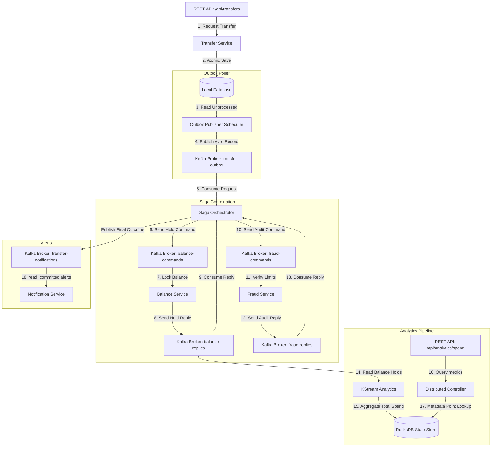
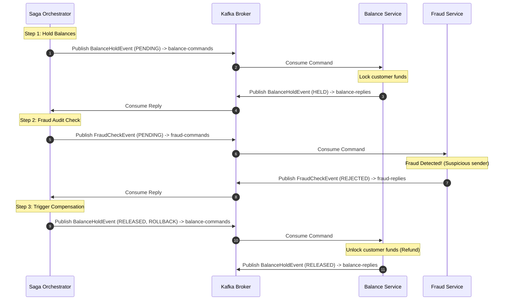

# Final Project — Simple Distributed Money Transfer System (Modular Monolith)

In this final project, you will build and run a production-ready, distributed money transfer ledger. We implement this system using a **modular monolith architecture** to simplify execution, compilation, and testing, while fully demonstrating advanced Spring Kafka patterns.

---

## 1. System Design & Communication Flow

Even though the codebase runs as a single Spring Boot application, it is divided into decoupled packages (`outbox`, `saga`, `balance`, `fraud`, `analytics`, `notification`). These packages do not share database transactions or invoke each other synchronously. Instead, they communicate exclusively by publishing and consuming events from Apache Kafka.

### Architectural Component Topology



### Money Transfer Saga Sequence (Rollback Scenario)

If the transaction amount exceeds limits or hits a flagged account, the Fraud Service rejects the request. The Saga Orchestrator then coordinates a compensating transaction:



---

## 2. Advanced Spring Kafka Concepts Implemented

| Concept | File Location & Implementation Details | Key Parameters / Code |
| :--- | :--- | :--- |
| **Transactional Outbox** | [TransferService.java](file:///c:/Users/Admin/Desktop/projects/learning-repo/courses/spring-kafka-production-course/final-project/src/main/java/com/springkafka/course/outbox/TransferService.java) inserts outbox records into `outbox_events`. [OutboxPublisher.java](file:///c:/Users/Admin/Desktop/projects/learning-repo/courses/spring-kafka-production-course/final-project/src/main/java/com/springkafka/course/outbox/OutboxPublisher.java) polls, publishes to Kafka, and marks records as processed in a database transaction. | Guarantees atomic writes between database and Kafka without 2PC. |
| **Exactly-Once Semantics (EOS)** | [TransferSagaOrchestrator.java](file:///c:/Users/Admin/Desktop/projects/learning-repo/courses/spring-kafka-production-course/final-project/src/main/java/com/springkafka/course/saga/TransferSagaOrchestrator.java) uses `@Transactional` bound to `KafkaTransactionManager` defined in [KafkaTransactionConfig.java](file:///c:/Users/Admin/Desktop/projects/learning-repo/courses/spring-kafka-production-course/final-project/src/main/java/com/springkafka/course/config/KafkaTransactionConfig.java). | `spring.kafka.producer.transaction-id-prefix: tx-monolith-` |
| **Non-blocking Retries** | [BalanceService.java](file:///c:/Users/Admin/Desktop/projects/learning-repo/courses/spring-kafka-production-course/final-project/src/main/java/com/springkafka/course/balance/BalanceService.java) configures attempts, delay multipliers, and dead-letter topics. | `@RetryableTopic(attempts = "3", backoff = @Backoff(delay = 1000, multiplier = 2.0))` |
| **Stateful KStreams** | [AnalyticsTopology.java](file:///c:/Users/Admin/Desktop/projects/learning-repo/courses/spring-kafka-production-course/final-project/src/main/java/com/springkafka/course/analytics/AnalyticsTopology.java) transforms balance-replies, re-keys them, aggregates double spend amounts, and materializes state. | `Materialized.as("customer-spend-store")` |
| **Interactive Queries & Routing** | [DistributedQueryController.java](file:///c:/Users/Admin/Desktop/projects/learning-repo/courses/spring-kafka-production-course/final-project/src/main/java/com/springkafka/course/analytics/DistributedQueryController.java) checks key partition owners. Routes lookup calls to remote nodes using WebClient. | `streams.queryMetadataForKey(...)` |
| **read_committed Isolation** | [NotificationService.java](file:///c:/Users/Admin/Desktop/projects/learning-repo/courses/spring-kafka-production-course/final-project/src/main/java/com/springkafka/course/notification/NotificationService.java) listens for completed alerts. | `spring.kafka.consumer.isolation-level: read_committed` |

---

## 3. Directory Layout

The codebase is structured under `courses/spring-kafka-production-course/final-project/`:

```
final-project/
├── pom.xml
├── docker-compose.yml
└── src/
    ├── main/
    │   ├── avro/
    │   │   ├── TransferEvent.avsc
    │   │   ├── BalanceHoldEvent.avsc
    │   │   └── FraudCheckEvent.avsc
    │   ├── java/com/springkafka/course/
    │   │   ├── FinalProjectApplication.java
    │   │   ├── config/             # Configures transaction managers and listener bindings
    │   │   ├── outbox/             # DB outbox repository, entity and scheduler
    │   │   ├── saga/               # Saga orchestrator flow coordination
    │   │   ├── balance/            # Account balances and retry topics
    │   │   ├── fraud/              # Security limit checking rules
    │   │   ├── analytics/          # KStreams spend aggregates and IQ HTTP APIs
    │   │   └── notification/       # Final alerts receiver (read_committed)
    │   └── resources/
    │       └── application.yml     # Configuration profiles
    └── test/
        └── java/com/springkafka/course/
            └── MoneyTransferE2eTest.java # Integration testing (Testcontainers)
```

---

## 4. Local Run & Verification Guide

### Step 1: Spin Up Infrastructure
Launch the local broker, schema registry, and database containers:
```bash
docker-compose up -d
```

### Step 2: Build and Compile
Use Maven to compile the application and trigger Avro code generation:
```bash
mvn clean compile
```

### Step 3: Run the Application
Start the monolith:
```bash
mvn spring-boot:run
```

### Step 4: Initiate a Money Transfer
Trigger a successful money transfer request using HTTP POST:
```bash
curl -X POST "http://localhost:8080/api/transfers?senderId=acc-123&receiverId=acc-456&amount=150.0"
```
Observe the logs:
1. **TransferService** logs saving outbox records.
2. **OutboxPublisher** schedules, reads, and publishes `TransferEvent` to Kafka.
3. **TransferSagaOrchestrator** picks up the event, executes balance holds.
4. **BalanceService** processes the hold command and publishes `HELD` status.
5. **FraudService** executes the check, approves, and notifies back.
6. **NotificationService** logs receipt alerts only upon successful commit.

### Step 5: Verify Fraud Check Rollback Compensation
Trigger a transfer containing the keyword `SUSPICIOUS`:
```bash
curl -X POST "http://localhost:8080/api/transfers?senderId=acc-SUSPICIOUS-9&receiverId=acc-456&amount=500.0"
```
Look at the logs:
- **FraudService** rejects the request due to risk policy.
- **TransferSagaOrchestrator** triggers compensation, publishing `RELEASED` commands with `ROLLBACK` account indicators.
- **BalanceService** prints logs releasing locked balances.

### Step 6: Query Analytics (Interactive Queries)
Fetch cumulative spend metrics from the RocksDB store:
```bash
curl http://localhost:8080/api/analytics/spend/acc-123
```
Expected JSON output returning aggregated values:
```json
150.0
```

---

## 5. Operations & Troubleshooting

> [!WARNING]
> - **Schema Registry Connection Issues**: Ensure your docker-compose schema registry container is healthy. If you get connection errors, verify registry listeners port `8081`.
> - **Kafka Transaction Failures**: Ensure you run multiple partition configurations. If transaction metadata fails, ensure `transaction.state.log.replication.factor` matches broker cluster size.
