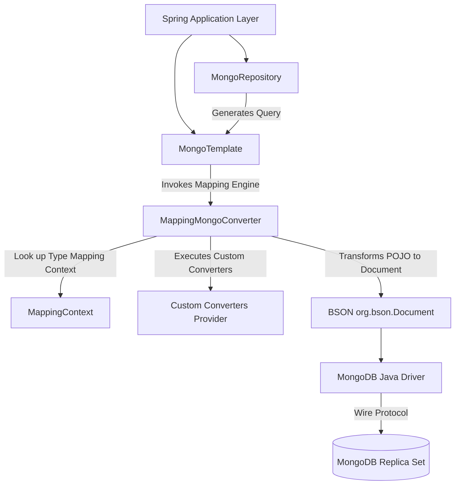

# Module 01: Spring Data MongoDB Fundamentals

Welcome class. Today we analyze the core configuration architectures of **Spring Data MongoDB (CS-530)**.

When building enterprise applications on top of a document database, you must map Java domain objects (POJOs) to BSON documents. Today we study object conversion, Spring Data mapping annotations, custom type converters, auditing, and class metadata optimizations.

---

## 1. Academic Lecture: Object Serialization & Auditing

### Basic Level: Object Mapping Abstraction
When saving a Java object (like a `Customer` class instance) to MongoDB, you do not write raw database commands. Instead, Spring Data MongoDB intercepts your call, serializes your Java object into a BSON document, and sends it to the database. This process is called Object-Document Mapping (ODM).

### Intermediate Level: Mapping Annotations & Custom Converters
We configure mappings using declarative Spring Data annotations:
*   `@Document(collection = "customers")`: Marks the class as a persistent database collection record.
*   `@Id`: Specifies the primary key field. Can map to standard Strings or ObjectIds.
*   `@Field("first_name")`: Maps a Java variable to a custom BSON key on disk.
*   **Custom Converters**: Spring Data MongoDB doesn't store native Java `ZonedDateTime` timezone information (BSON dates are only UTC milliseconds). We write custom writing (`Converter<ZonedDateTime, Document>`) and reading (`Converter<Document, ZonedDateTime>`) converters to store timezone metadata in the database.
*   **Auditing**: Annotations like `@CreatedDate` and `@LastModifiedDate` auto-populate timestamps during document conversion events.

### Advanced Level: `MappingMongoConverter` Context & `_class` Field Optimization
*   **The Converter Engine**: Under the hood, Spring Data uses the `MappingMongoConverter` class. During startup, it scans target entities and populates the `MappingContext` metadata cache. During persistence operations, it executes registered custom converters, transforms POJOs to BSON `Document` maps, and hands them to the MongoDB Java Driver.
*   **The `_class` Overhead**: By default, Spring Data appends a `_class` field containing the fully qualified class name to every BSON document (e.g. `"com.masterclass.mongodb.domain.Customer"`). This allows Spring to resolve class inheritance during reads. In collections holding millions of documents, this metadata wastes gigabytes of RAM cache and disk space.
*   **Aliasing & Disabling**: We can optimize storage by overriding the default type mapper in our config to use short aliases (`@TypeAlias("cust")`) or disabling the `_class` field entirely if polymorphism is not required.



---

## 2. API Mapping: Raw MongoDB Java Driver vs. Spring Data MongoDB

When migrating from raw MongoDB Java development or comparing it to the Spring Data ecosystem, you will find a similar paradigm shift as moving from JDBC/JPA to Spring Data JPA. Below is the comprehensive structural mapping:

### A. Conceptual Mapping Matrix

| Feature / Concept | Raw MongoDB Java Driver (Sync) | Spring Data MongoDB (MongoTemplate & Repositories) |
| :--- | :--- | :--- |
| **Config & Client Initialization** | Manual `MongoClient` setup via URI, database and collection access blocks. | Declarative `AbstractMongoClientConfiguration` bean configurations & `@EnableMongoAuditing`. |
| **Document Schema & POJO mapping** | Raw BSON `Document` mappings or reflection-based registries via `PojoCodecProvider`. | Declarative POJO entities annotated with `@Document`, `@Id`, `@Field`, and `@Version`. |
| **Query Filters** | BSON `Filters` builder helper factory (e.g. `Filters.eq()`, `Filters.and()`). | Spring's Criteria query context (`Criteria.where("key").is()`) inside a `Query` model. |
| **Data Modifications (Updates)** | BSON `Updates` builder helper factory (e.g. `Updates.set()`, `Updates.inc()`). | Spring's `Update` fluent modifier query API (`new Update().set().inc()`). |
| **Aggregations** | Static helper pipeline arrays compiled via `Aggregates` and `Accumulators` classes. | Type-safe `Aggregation` pipeline stages (`Aggregation.match()`, `Aggregation.group()`). |
| **Logical Transactions** | Manually managed `ClientSession` try-with-resources with manual commits and aborts. | Declarative transactional proxy boundaries utilizing standard Spring `@Transactional`. |

---

### B. Side-by-Side Architectural Code Mappings

#### 1. Configuration & Connection Setup
* **Raw Java Driver**: Handles driver initialization and connection pools directly in standard static blocks or manual lifecycle beans.
* **Spring Data MongoDB**: Managed by the container. Properties are read from `application.yml` and injected directly into `MongoTemplate`.

```java
// === RAW JAVA DRIVER CONNECTION SETUP ===
import com.mongodb.client.MongoClient;
import com.mongodb.client.MongoClients;
import com.mongodb.client.MongoDatabase;
import com.mongodb.client.MongoCollection;
import org.bson.Document;

public class NativeMongoConnection {
    private static final MongoClient mongoClient = MongoClients.create("mongodb://localhost:27017");
    
    public static MongoCollection<Document> getCollection(String collectionName) {
        MongoDatabase database = mongoClient.getDatabase("mastery_db");
        return database.getCollection(collectionName);
    }
}
```

```java
// === SPRING DATA CONFIGURATION CONFIG ===
import com.mongodb.client.MongoClient;
import com.mongodb.client.MongoClients;
import org.springframework.context.annotation.Configuration;
import org.springframework.data.mongodb.config.AbstractMongoClientConfiguration;

@Configuration
public class SpringMongoConfig extends AbstractMongoClientConfiguration {
    @Override
    protected String getDatabaseName() {
        return "mastery_db";
    }

    @Override
    public MongoClient mongoClient() {
        return MongoClients.create("mongodb://localhost:27017");
    }
    // Spring boot automatically exposes a MongoTemplate bean using this client configuration
}
```

---

#### 2. Entity Modeling & Conversion
* **Raw Java Driver**: Relies on raw BSON mappings or configures a complex reflection-based `CodecRegistry` to automatically serialize and deserialize POJOs.
* **Spring Data MongoDB**: Uses standard Spring annotations. Spring's mapping context reads these properties to handle type conversions and primary key mapping automatically.

```java
// === RAW JAVA DRIVER POJO REGISTRY CONFIG ===
import com.mongodb.MongoClientSettings;
import com.mongodb.client.MongoCollection;
import org.bson.codecs.configuration.CodecRegistry;
import org.bson.codecs.pojo.PojoCodecProvider;
import static org.bson.codecs.configuration.CodecRegistries.fromProviders;
import static org.bson.codecs.configuration.CodecRegistries.fromRegistries;

public class NativePojoMapping {
    public static MongoCollection<Customer> getCustomerCollection() {
        CodecRegistry pojoCodecRegistry = fromRegistries(
            MongoClientSettings.getDefaultCodecRegistry(),
            fromProviders(PojoCodecProvider.builder().automatic(true).build())
        );
        return NativeMongoConnection.getCollection("customers")
                .withCodecRegistry(pojoCodecRegistry)
                .withDocumentClass(Customer.class);
    }
}
```

```java
// === SPRING DATA ENTITY DECLARATION ===
import org.springframework.data.annotation.Id;
import org.springframework.data.annotation.Version;
import org.springframework.data.mongodb.core.mapping.Document;
import org.springframework.data.mongodb.core.mapping.Field;
import java.util.List;

@Document(collection = "customers")
public class Customer {
    @Id
    private String id; // Automatically maps to MongoDB's ObjectId _id field

    @Field("full_name")
    private String name;

    private int age;
    private List<String> roles;

    @Version
    private Long version; // Optimistic locking mechanism managed by Spring
}
```

---

#### 3. Find & Query Filters
* **Raw Java Driver**: Queries are defined using static helper utility methods in `Filters`, `Projections`, and `Sorts` models.
* **Spring Data MongoDB**: Expressed via Spring's chainable `Criteria` builder. Results are bound to POJOs, records, or projection interfaces automatically.

```java
// === RAW JAVA DRIVER FILTER QUERY ===
import com.mongodb.client.model.Filters;
import com.mongodb.client.model.Projections;
import com.mongodb.client.model.Sorts;
import org.bson.conversions.Bson;
import java.util.ArrayList;
import java.util.List;

public List<Document> queryNativeCustomers() {
    Bson filter = Filters.and(
        Filters.eq("status", "ACTIVE"),
        Filters.gte("age", 21)
    );
    Bson projection = Projections.fields(
        Projections.include("name", "email"),
        Projections.excludeId()
    );
    Bson sort = Sorts.descending("age");

    List<Document> list = new ArrayList<>();
    NativeMongoConnection.getCollection("customers")
        .find(filter)
        .projection(projection)
        .sort(sort)
        .limit(10)
        .into(list);
    return list;
}
```

```java
// === SPRING DATA TEMPLATE & REPOSITORY QUERIES ===
import org.springframework.data.domain.Sort;
import org.springframework.data.mongodb.core.MongoTemplate;
import org.springframework.data.mongodb.core.query.Criteria;
import org.springframework.data.mongodb.core.query.Query;
import org.springframework.data.mongodb.repository.MongoRepository;
import java.util.List;

// Approach A: MongoTemplate Criteria API
public List<CustomerProjection> querySpringCustomers(MongoTemplate mongoTemplate) {
    Query query = new Query();
    query.addCriteria(Criteria.where("status").is("ACTIVE").and("age").gte(21));
    query.fields().include("name").include("email").exclude("id");
    query.with(Sort.by(Sort.Direction.DESC, "age"));
    query.limit(10);

    return mongoTemplate.find(query, Customer.class, CustomerProjection.class);
}

// Approach B: Declarative Query Repository
public interface CustomerRepository extends MongoRepository<Customer, String> {
    @org.springframework.data.mongodb.repository.Query(
        value = "{ 'status': 'ACTIVE', 'age': { '$gte': ?0 } }", 
        fields = "{ 'name': 1, 'email': 1, '_id': 0 }"
    )
    List<CustomerProjection> findActiveCustomers(int minAge, Sort sort);
}
```

---

#### 4. Modifications & In-place Updates
* **Raw Java Driver**: Modifying specific fields without loading the entity is handled via `Updates` combined with a query filter.
* **Spring Data MongoDB**: Uses `Update` class modifications executed through `MongoTemplate.updateFirst()` or `updateMulti()`.

```java
// === RAW JAVA DRIVER IN-PLACE UPDATE ===
import com.mongodb.client.model.Filters;
import com.mongodb.client.model.Updates;
import org.bson.conversions.Bson;
import org.bson.types.ObjectId;

public void updateNativeCustomer(String customerId) {
    Bson filter = Filters.eq("_id", new ObjectId(customerId));
    Bson update = Updates.combine(
        Updates.set("status", "VIP"),
        Updates.inc("points", 15),
        Updates.push("history", "Upgraded via native driver")
    );
    NativeMongoConnection.getCollection("customers").updateOne(filter, update);
}
```

```java
// === SPRING DATA IN-PLACE UPDATE ===
import org.springframework.data.mongodb.core.MongoTemplate;
import org.springframework.data.mongodb.core.query.Criteria;
import org.springframework.data.mongodb.core.query.Query;
import org.springframework.data.mongodb.core.query.Update;

public void updateSpringCustomer(MongoTemplate mongoTemplate, String customerId) {
    Query query = Query.query(Criteria.where("id").is(customerId));
    Update update = new Update()
        .set("status", "VIP")
        .inc("points", 15)
        .push("history", "Upgraded via Spring Data");
        
    mongoTemplate.updateFirst(query, update, Customer.class);
}
```

---

#### 5. Aggregation Pipelines
* **Raw Java Driver**: Pipelines are created as lists of BSON aggregation documents, using `Aggregates` and `Accumulators` helpers.
* **Spring Data MongoDB**: Pipelines are constructed dynamically using Spring's fluent `Aggregation` API, which enforces type safety on mappings.

```java
// === RAW JAVA DRIVER AGGREGATION ===
import com.mongodb.client.model.Accumulators;
import com.mongodb.client.model.Aggregates;
import com.mongodb.client.model.Filters;
import com.mongodb.client.model.Sorts;
import org.bson.conversions.Bson;
import java.util.ArrayList;
import java.util.List;

public List<Document> runNativeAggregation() {
    List<Bson> pipeline = List.of(
        Aggregates.match(Filters.eq("status", "ACTIVE")),
        Aggregates.group("$country", 
            Accumulators.sum("totalCount", 1),
            Accumulators.avg("averageAge", "$age")
        ),
        Aggregates.sort(Sorts.descending("totalCount"))
    );
    
    List<Document> list = new ArrayList<>();
    NativeMongoConnection.getCollection("customers").aggregate(pipeline).into(list);
    return list;
}
```

```java
// === SPRING DATA AGGREGATION ===
import org.springframework.data.domain.Sort;
import org.springframework.data.mongodb.core.MongoTemplate;
import org.springframework.data.mongodb.core.aggregation.Aggregation;
import org.springframework.data.mongodb.core.aggregation.AggregationResults;
import org.springframework.data.mongodb.core.query.Criteria;
import java.util.List;

public List<CountrySummary> runSpringAggregation(MongoTemplate mongoTemplate) {
    Aggregation agg = Aggregation.newAggregation(
        Aggregation.match(Criteria.where("status").is("ACTIVE")),
        Aggregation.group("country")
            .count().as("totalCount")
            .avg("age").as("averageAge"),
        Aggregation.sort(Sort.Direction.DESC, "totalCount")
    );

    AggregationResults<CountrySummary> results = mongoTemplate.aggregate(
        agg, Customer.class, CountrySummary.class
    );
    return results.getMappedResults();
}
```

---

#### 6. Transaction Management
* **Raw Java Driver**: Requires starting a session and managing transaction blocks manually within try-catch blocks to guarantee rollback on errors.
* **Spring Data MongoDB**: Uses Spring's transaction support via `@Transactional` annotations on services, relying on the `MongoTransactionManager` to automatically coordinate driver sessions.

```java
// === RAW JAVA DRIVER TRANSACTION ===
import com.mongodb.client.ClientSession;
import com.mongodb.client.model.Filters;
import com.mongodb.client.model.Updates;
import org.bson.Document;

public void processNativeTransaction(Document orderDoc, String itemId, int qty) {
    try (ClientSession session = NativeMongoConnection.mongoClient.startSession()) {
        session.startTransaction();
        try {
            NativeMongoConnection.getCollection("orders").insertOne(session, orderDoc);
            NativeMongoConnection.getCollection("inventory").updateOne(
                session,
                Filters.eq("_id", itemId),
                Updates.inc("stock", -qty)
            );
            session.commitTransaction();
        } catch (Exception e) {
            session.abortTransaction();
            throw e;
        }
    }
}
```

```java
// === SPRING DATA DECLARATIVE TRANSACTION ===
import org.springframework.data.mongodb.core.MongoTemplate;
import org.springframework.data.mongodb.core.query.Criteria;
import org.springframework.data.mongodb.core.query.Query;
import org.springframework.data.mongodb.core.query.Update;
import org.springframework.stereotype.Service;
import org.springframework.transaction.annotation.Transactional;

@Service
public class OrderService {
    private final MongoTemplate mongoTemplate;

    public OrderService(MongoTemplate mongoTemplate) {
        this.mongoTemplate = mongoTemplate;
    }

    @Transactional
    public void placeOrder(Order order, String itemId, int qty) {
        mongoTemplate.insert(order);
        
        Query query = Query.query(Criteria.where("id").is(itemId));
        Update update = new Update().inc("stock", -qty);
        mongoTemplate.updateFirst(query, update, Inventory.class);
    }
}
```

---

## 3. Theory vs. Production Trade-offs

Compare data mapping options:

| Mapping Configuration | Storage Overhead | Polymorphic Reads Support | Query Latency | Implementation Complexity |
| :--- | :--- | :--- | :--- | :--- |
| **Default `_class` Tracking** | High (Stores full package class path) | Fully Supported (Subclasses resolved automatically) | Low | Low (Default configuration) |
| **Class Aliases (`@TypeAlias`)** | Low (Stores short string value) | Fully Supported | Low | Moderate |
| **Disabled Type Mapping** | Zero (No `_class` metadata) | Not Supported (Casts all reads to base class) | Low | High (Requires custom mapping beans) |

---

## 4. How to Use: Configuring Custom Converters in Spring

Let us configure Spring Data. We contrast a default, un-optimized config (saving class metadata) with a hardened configuration that registers custom converters and disables the `_class` field.

### A. The Default Un-optimized Configuration (Anti-Pattern)
Avoid leaving default settings active in high-scale collections:

```java
// DANGER: Storing the default class path in every document wastes storage:
// { "_id": "1", "name": "Alice", "_class": "com.masterclass.mongodb.domain.Customer" }
@Configuration
public class DefaultMongoConfig {
    // No custom converters or type mapping optimizations defined
}
```

### B. The Production-Grade Custom Converter Configuration (Production Pattern)
Create custom converters and override the default type mapping settings inside a configuration bean:

```java
import org.bson.Document;
import org.springframework.context.annotation.Bean;
import org.springframework.context.annotation.Configuration;
import org.springframework.data.convert.ReadingConverter;
import org.springframework.data.convert.WritingConverter;
import org.springframework.core.convert.converter.Converter;
import org.springframework.data.mongodb.config.EnableMongoAuditing;
import org.springframework.data.mongodb.core.convert.DefaultDbRefResolver;
import org.springframework.data.mongodb.core.convert.DefaultMongoTypeMapper;
import org.springframework.data.mongodb.core.convert.MappingMongoConverter;
import org.springframework.data.mongodb.core.convert.MongoCustomConversions;
import org.springframework.data.mongodb.core.mapping.MongoMappingContext;
import org.springframework.data.mongodb.MongoDatabaseFactory;
import java.time.ZonedDateTime;
import java.time.ZoneId;
import java.util.Date;
import java.util.List;

@Configuration
@EnableMongoAuditing
public class MongoConfig {

    private final MongoDatabaseFactory mongoDbFactory;

    public MongoConfig(MongoDatabaseFactory mongoDbFactory) {
        this.mongoDbFactory = mongoDbFactory;
    }

    @Bean
    public MongoCustomConversions customConversions() {
        return new MongoCustomConversions(List.of(
            new ZonedDateTimeWriteConverter(),
            new ZonedDateTimeReadConverter()
        ));
    }

    @Bean
    public MappingMongoConverter mappingMongoConverter(MongoMappingContext context, MongoCustomConversions conversions) {
        var resolver = new DefaultDbRefResolver(mongoDbFactory);
        var converter = new MappingMongoConverter(resolver, context);
        converter.setCustomConversions(conversions);
        
        // Remove "_class" metadata from documents to optimize storage
        converter.setTypeMapper(new DefaultMongoTypeMapper(null));
        return converter;
    }

    @WritingConverter
    public static class ZonedDateTimeWriteConverter implements Converter<ZonedDateTime, Document> {
        @Override
        public Document convert(ZonedDateTime source) {
            return new Document()
                    .append("date", Date.from(source.toInstant()))
                    .append("zone", source.getZone().getId());
        }
    }

    @ReadingConverter
    public static class ZonedDateTimeReadConverter implements Converter<Document, ZonedDateTime> {
        @Override
        public ZonedDateTime convert(Document source) {
            Date date = source.getDate("date");
            String zone = source.getString("zone");
            return ZonedDateTime.ofInstant(date.toInstant(), ZoneId.of(zone));
        }
    }
}
```

### Line-by-Line Code Explanation:
1.  `@EnableMongoAuditing`: Enables Spring Data's auditing lifecycle interceptors.
2.  `MongoCustomConversions(...)`: Registers the custom converters with the Spring converter registry.
3.  `converter.setTypeMapper(new DefaultMongoTypeMapper(null))`: Overrides the default type mapper, telling the converter engine to omit the `_class` field during serialization.
4.  `ZonedDateTimeWriteConverter`: Extracts the UTC date instant and timezone string, storing them inside a nested document.

---

## 5. Common Errors & Pitfalls

### Pitfall 1: Non-Blocking Context Violations in Auditing
*   **Why it fails**: When using Reactive Spring Data, auditing requires fetching the user context asynchronously (e.g. from reactive Spring Security). If you implement auditing using blocking operations (like querying a database on the main thread), you block the Netty event loop, crashing application throughput.
*   **Mitigation**: Use `ReactiveAuditorAware` to retrieve the current auditor asynchronously via Reactor `Mono` publishers.

---

## 6. Socratic Review Questions

### Question 1
Why does Spring Data MongoDB require custom converter classes to handle timezone-aware date objects?

#### Answer
The standard BSON date specification maps dates to UTC Unix milliseconds since the epoch, which does not store timezone offsets. If you insert a Java `ZonedDateTime` directly, the driver discards the timezone metadata and stores only the UTC time. When read back, the timezone defaults to the server's local zone. Writing custom converters to store dates as nested documents (holding the timestamp and the timezone ID) preserves the timezone offset.

### Question 2
Under what circumstances might you bypass the Spring Data MongoDB mapper and write raw BSON queries or use the native MongoClient client library in an enterprise Spring Boot application?

#### Answer
For performance-critical tasks like streaming bulk inserts of millions of records (bypassing Spring's `MappingMongoConverter` reflection overhead), or when utilizing advanced server features not yet natively mapped by the Spring Data repository layers (e.g. specialized administrative operations or specific Atlas Search configuration hooks). Spring's `MongoTemplate` enables this escape hatch via `mongoTemplate.execute(db -> ...)` or `mongoTemplate.getCollection(...)` to run native driver operations while reusing the connection pool and transaction context.

---

## 7. Hands-on Challenge: Custom Document Converter

### The Challenge
In this challenge, you will implement a custom Spring Data Converter to handle a value object.
Your task:
1. Complete `MoneyWriteConverter` and `MoneyReadConverter` classes.
2. `Money` is a value object holding `amount` (BigDecimal) and `currency` (String).
3. The write converter must serialize `Money` to a string formatted as `"currency:amount"` (e.g., `"USD:19.99"`).
4. The read converter must parse the database string back into a `Money` instance.

Complete the implementation stub:

```java
package com.masterclass.mongodb.miniproject.converter;

import org.springframework.core.convert.converter.Converter;
import java.math.BigDecimal;

public class MoneyConverters {

    public static class Money {
        private final BigDecimal amount;
        private final String currency;
        
        public Money(BigDecimal amount, String currency) {
            this.amount = amount;
            this.currency = currency;
        }
        public BigDecimal getAmount() { return amount; }
        public String getCurrency() { return currency; }
    }

    public static class MoneyWriteConverter implements Converter<Money, String> {
        @Override
        public String convert(Money source) {
            // TODO: Serialize to currency:amount
            return null;
        }
    }

    public static class MoneyReadConverter implements Converter<String, Money> {
        @Override
        public Money convert(String source) {
            // TODO: Parse back to Money object
            return null;
        }
    }
}
```

### Verification Test
Verify your code with this JUnit 5 test class:

```java
package com.masterclass.mongodb.miniproject.converter;

import org.junit.jupiter.api.Test;
import java.math.BigDecimal;
import static org.junit.jupiter.api.Assertions.*;

class MoneyConvertersTest {

    @Test
    void testWriteAndReadConverters() {
        var money = new MoneyConverters.Money(new BigDecimal("99.95"), "USD");
        var writer = new MoneyConverters.MoneyWriteConverter();
        var reader = new MoneyConverters.MoneyReadConverter();

        String serialized = writer.convert(money);
        assertEquals("USD:99.95", serialized);

        var deserialized = reader.convert(serialized);
        assertNotNull(deserialized);
        assertEquals(new BigDecimal("99.95"), deserialized.getAmount());
        assertEquals("USD", deserialized.getCurrency());
    }
}
```
