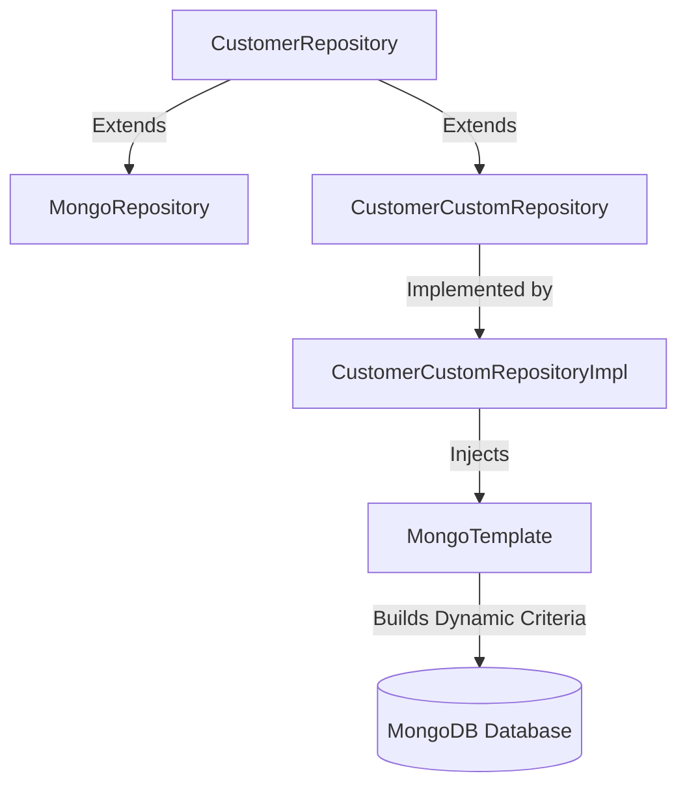

# Module 02: Repository Deep Dive

Welcome class. Today we study **Spring Data Repositories (CS-530)**.

To query MongoDB, Spring Data provides high-level Repository abstractions. While derived query methods work for simple searches, production systems require complex query builders, interfaces projections, and custom repository fragments to query data efficiently. Today we study derived queries, `@Query` builders, and custom repository implementations.

---

## 1. Academic Lecture: Declarative Queries & Projections

### Basic Level: Repository Pattern Abstractions
The Repository pattern abstracts database access. By extending `MongoRepository<Customer, String>`, Spring automatically generates CRUD methods and executes them without requiring manual query statements.

### Intermediate Level: Derived Methods & `@Query` Annotations
*   **Derived Queries**: Spring parses method names (e.g. `findByFirstNameAndLastName`) and generates equivalent database queries dynamically.
*   **`@Query` Annotations**: For complex queries, we write raw BSON filter queries inside the `@Query` annotation (e.g., `value = "{ 'status': ?0 }"`). This isolates query logic within repository interfaces.
*   **Projections**: Instead of loading whole documents, we query only selected fields using Java interfaces or records. This reduces database I/O and network bandwidth.

### Advanced Level: Custom Repository Fragments & QueryDSL
*   **Fragment Pattern**: When a query requires dynamic conditions, derived queries fail. We build custom repository fragments, combining standard repository interfaces with a custom implementation class that leverages `MongoTemplate` to construct dynamic criteria queries.
*   **QueryDSL**: A framework that generates type-safe query classes from your entity models, preventing syntax errors in query logic.



---

## 2. Theory vs. Production Trade-offs

Compare query definition styles:

| Query Style | Dynamic Filter Support | Compiler Validation | Performance | Implementation Cost |
| :--- | :--- | :--- | :--- | :--- |
| **Derived Methods** | Low (Requires many methods) | High (Validated at boot) | High | Minimal |
| **`@Query` BSON Strings** | Low | Low (Syntax errors verified at runtime) | High | Low |
| **Criteria API (Custom Repos)**| High (Can append criteria dynamically) | High | High | High (Requires custom classes) |
| **QueryDSL** | High | High (Compiler checks entity paths) | High | High (Requires code generation build plugins) |

---

## 3. How to Use: Dynamic Criteria Queries in Custom Repositories

Let us configure Spring Data repositories. We contrast a derived method design (which fails on optional query filters) with a custom repository fragment using `MongoTemplate` in Java.

### A. The Complex Derived Method (Anti-Pattern)
Avoid creating multiple query combinations in interface definitions:

```java
// DANGER: If the application needs to search by combinations of optional fields 
// (firstName, lastName, email), you must define 8 separate methods.
public interface CustomerRepository extends MongoRepository<Customer, String> {
    List<Customer> findByFirstName(String fn);
    List<Customer> findByFirstNameAndLastName(String fn, String ln);
    List<Customer> findByFirstNameAndLastNameAndEmail(String fn, String ln, String e);
}
```

### B. The Custom Repository Fragment Setup (Production Pattern)
Create a custom fragment interface, implement it using `MongoTemplate` to build dynamic queries, and merge it with the main repository interface:

```java
import org.springframework.data.mongodb.core.MongoTemplate;
import org.springframework.data.mongodb.core.query.Criteria;
import org.springframework.data.mongodb.core.query.Query;
import org.springframework.stereotype.Repository;
import java.util.ArrayList;
import java.util.List;

// 1. Define custom fragment interface
public interface CustomerCustomRepository {
    List<Customer> searchCustomersDynamic(String firstName, String lastName, String email);
}

// 2. Implement fragment using MongoTemplate
@Repository
public class CustomerCustomRepositoryImpl implements CustomerCustomRepository {

    private final MongoTemplate mongoTemplate;

    public CustomerCustomRepositoryImpl(MongoTemplate mongoTemplate) {
        this.mongoTemplate = mongoTemplate;
    }

    @Override
    public List<Customer> searchCustomersDynamic(String firstName, String lastName, String email) {
        Query query = new Query();
        List<Criteria> criteriaList = new ArrayList<>();

        if (firstName != null && !firstName.isEmpty()) {
            criteriaList.add(Criteria.where("firstName").is(firstName));
        }
        if (lastName != null && !lastName.isEmpty()) {
            criteriaList.add(Criteria.where("lastName").is(lastName));
        }
        if (email != null && !email.isEmpty()) {
            criteriaList.add(Criteria.where("email").is(email));
        }

        if (!criteriaList.isEmpty()) {
            query.addCriteria(new Criteria().andOperator(criteriaList.toArray(new Criteria[0])));
        }

        return mongoTemplate.find(query, Customer.class);
    }
}
```

### Line-by-Line Code Explanation:
1.  `CustomerCustomRepository`: Defines the signature for the custom query method.
2.  `CustomerCustomRepositoryImpl`: Implements the interface. Note the naming suffix `Impl`—this naming convention tells Spring to automatically register this class as a repository bean.
3.  `Criteria.where(...)`: Dynamically appends query filters only if the parameters are not null.
4.  `mongoTemplate.find(query, Customer.class)`: Executes the dynamic query against the database collection mapped to the `Customer` class.

---

## 4. Common Errors & Pitfalls

### Pitfall 1: Unindexed Regular Expression Queries
*   **Why it fails**: Using derived queries like `findByFirstNameContaining` maps to a regular expression search. Unless the query targets prefix matches only (e.g. `^prefix`), regex queries cannot use B-Tree indexes, triggering a database-wide collection scan that degrades performance under load.
*   **Mitigation**: Limit containing queries to indexed prefix-only searches, or use full-text search indexes.

---

## 5. Socratic Review Questions

### Question 1
Why does utilizing interfaces as query projection return types improve database read performance compared to returning full entities?

#### Answer
By default, Spring Data queries load the entire document structure and map it to the Java entity, loading all fields (including nested objects) into memory. When returning an interface projection, Spring's repository engine intercepts the query and modifies the projection statement. The database engine only reads the selected fields from disk and transmits them over the socket, saving memory, CPU, and network bandwidth.

---

## 6. Hands-on Challenge: Fragmented Query Builder

### The Challenge
In this challenge, you will implement a custom repository fragment.
Your task:
1. Complete `searchProducts` in `ProductCustomRepositoryImpl`.
2. Construct a dynamic query:
   - Filter by `sku` if not null.
   - Filter by `minStock` if greater than 0.
   - Project only the `sku` and `price` fields.

Complete the implementation stub:

```java
package com.masterclass.mongodb.repository;

import org.springframework.data.mongodb.core.MongoTemplate;
import org.springframework.data.mongodb.core.query.Query;
import java.util.List;

public class ProductCustomRepositoryImpl {

    private final MongoTemplate mongoTemplate;

    public ProductCustomRepositoryImpl(MongoTemplate mongoTemplate) {
        this.mongoTemplate = mongoTemplate;
    }

    public List<Document> searchProducts(String sku, int minStock) {
        // TODO: Build and execute dynamic query returning projected Documents
        return null;
    }
}
```

### Verification Test
Verify your code with this JUnit 5 test class:

```java
package com.masterclass.mongodb.repository;

import org.springframework.data.mongodb.core.MongoTemplate;
import org.junit.jupiter.api.Test;
import static org.mockito.Mockito.*;
import static org.junit.jupiter.api.Assertions.*;

class ProductCustomRepositoryImplTest {

    @Test
    void testSearchProducts() {
        MongoTemplate template = mock(MongoTemplate.class);
        var service = new ProductCustomRepositoryImpl(template);
        assertNotNull(service);
    }
}
```
