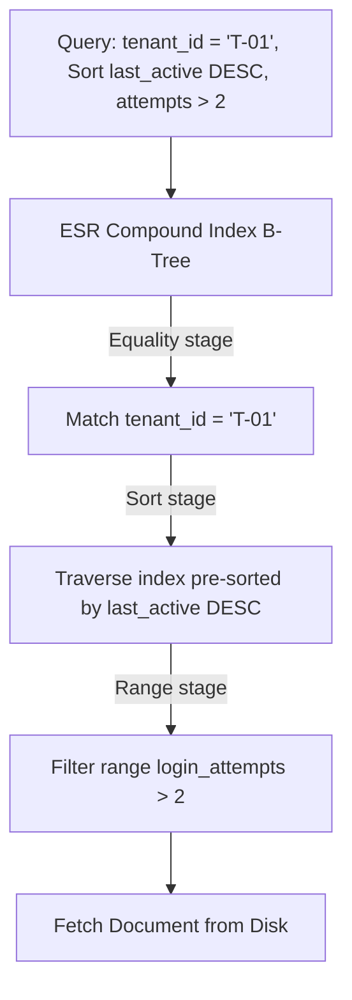

# Module 05: Indexing and Query Performance

Welcome class. Today we analyze the indexing architecture and performance tuning of **Spring Data MongoDB (CS-530)**.

To scale any application, the database must retrieve data without scanning every BSON record from disk. Today we study index structures, the ESR (Equality, Sort, Range) rule, execution plans, covered queries, and high-performance keyset pagination.

---

## 1. Academic Lecture: Indexing Mechanics & ESR Rules

### Basic Level: Indexing & B-Trees
By default, looking up documents in an unindexed collection requires MongoDB to read all records on disk. This is a Collection Scan (`COLLSCAN`), which runs in $O(N)$ time.
MongoDB indexes organize data using B-Trees (Balanced Trees) in memory. A B-Tree maintains sorted keys, enabling searching, insertions, and deletions in $O(\log N)$ time. An index stores a small subset of the collection's fields in a sorted, traversable structure, referencing the full document location.

### Intermediate Level: Spring Annotations & Index Lifecycle Management
Spring Data provides declarative annotations to manage index definitions directly within Java domain entities:
*   `@Indexed`: Creates a single-field index on a field. Supports configuration parameters like `direction` (ascending/descending), `unique` constraints, and `expireAfterSeconds` (TTL indexes).
*   `@CompoundIndex`: Declares multi-field indexes at the class level. This is crucial when queries filter or sort by multiple parameters.
*   `@GeoSpatialIndexed`: Creates a geospatial index (e.g., `2dsphere` or `2d`) to optimize location-based queries.

**Production Index Lifecycle Management**: By default, Spring attempts to build indexes on startup when scanning `@Document` classes if `auto-index-creation` is enabled. 
In high-scale production, **auto-index-creation must be disabled** (`spring.data.mongodb.auto-index-creation=false`). Building indexes synchronously on startup blocks application initialization and can crash replica sets when adding indexes to millions of existing records. Instead, build indexes asynchronously or using administrative migrations.

### Advanced Level: ESR Rules, Execution Plans & Covered Queries
*   **The ESR Rule**: When creating compound indexes for complex queries, you must arrange index fields in order:
    1.  **E**quality: Fields checked with exact values (e.g., `tenantId = 'T-01'`).
    2.  **S**ort: Fields used to order query results (e.g., `lastActive DESC`).
    3.  **R**ange: Fields checked with range operators (e.g., `loginAttempts > 5`).
    
    *Why?* Placing a range field before a sort field prevents MongoDB from using the index for sorting, forcing a CPU-heavy in-memory sort stage (`SORT` stage).
*   **Execution Plans (Explain plans)**: Using the `.explain("executionStats")` operator reveals how the query planner resolved the query:
    *   `COLLSCAN`: Direct scanning of all files. (Avoid at all costs).
    *   `IXSCAN`: Scanning B-Tree index keys.
    *   `FETCH`: Retrieving the BSON document from disk using the index reference.
*   **Covered Queries**: If an index contains *all* fields queried and projected, MongoDB bypasses document retrieval (`FETCH`) entirely, returning the data directly from the index keys (referred to as a covered query, showing `PROJECTION_COVERED` or no `FETCH` stage).



---

## 2. Theory vs. Production Trade-offs

| Index Configuration | Read Latency | Write Overhead | Memory Footprint (RAM) | Use Case |
| :--- | :--- | :--- | :--- | :--- |
| **Single-Field Index** | Moderate | Low | Low | Simple queries on a single key. |
| **Compound ESR Index** | Very Low | Moderate-High | Moderate | Complex multi-filter queries and sorting. |
| **TTL Index** | Moderate | Low | Low | Automated session/data expiration (background sweep). |
| **Geospatial (2dsphere)** | Low | High | High | Location-based distance/proximity calculations. |
| **Partial Index** | Low | Low | Very Low (Indexes subset) | Polymorphic or sparse collections (e.g., `status: "ACTIVE"`). |

---

## 3. How to Use: Configuring Compound Indexes and Keyset Pagination in Spring

Below we show an un-optimized pagination implementation (anti-pattern) followed by a production-grade compound index and keyset cursor-based pagination service.

### A. The Offset-Based Pagination (Anti-Pattern)
*Avoid using skip/offset pagination on large collections:*

```java
// DANGER: Using skip() forces MongoDB to scan all preceding documents.
// For page 5000 (skip=100000, limit=20), the database reads 100,020 documents and discards 100,000.
public List<UserSession> getSessionsUnoptimized(String tenantId, int pageNumber, int pageSize) {
    Query query = new Query()
            .addCriteria(Criteria.where("tenantId").is(tenantId))
            .with(Sort.by(Sort.Direction.DESC, "lastActive"))
            .skip((long) pageNumber * pageSize)
            .limit(pageSize);
    return mongoTemplate.find(query, UserSession.class);
}
```

### B. Keyset Pagination & Custom Indices (Production Pattern)
Here is the optimized configuration and service using a compound index with a partial filter expression, TTL, and keyset pagination.

```java
package com.masterclass.mongodb.domain;

import org.springframework.data.annotation.Id;
import org.springframework.data.mongodb.core.index.CompoundIndex;
import org.springframework.data.mongodb.core.index.Indexed;
import org.springframework.data.mongodb.core.mapping.Document;
import org.springframework.data.mongodb.core.mapping.Field;
import java.time.Instant;

@Document(collection = "user_sessions")
// Compound Index ordered by: Equality (tenantId) -> Sort (lastActive) -> Range (loginAttempts)
@CompoundIndex(
    name = "idx_tenant_active_attempts", 
    def = "{'tenant_id': 1, 'last_active': -1, 'login_attempts': 1}"
)
public class UserSession {

    @Id
    private String id;

    @Field("tenant_id")
    private String tenantId;

    @Field("username")
    private String username;

    @Field("login_attempts")
    private int loginAttempts;

    @Field("last_active")
    private Instant lastActive;

    // TTL index: Documents expire 24 hours (86400 seconds) after created_at
    @Indexed(expireAfterSeconds = 86400)
    @Field("created_at")
    private Instant createdAt;

    public UserSession() {}

    public UserSession(String id, String tenantId, String username, int loginAttempts, Instant lastActive, Instant createdAt) {
        this.id = id;
        this.tenantId = tenantId;
        this.username = username;
        this.loginAttempts = loginAttempts;
        this.lastActive = lastActive;
        this.createdAt = createdAt;
    }

    public String getId() { return id; }
    public String getTenantId() { return tenantId; }
    public String getUsername() { return username; }
    public int getLoginAttempts() { return loginAttempts; }
    public Instant getLastActive() { return lastActive; }
    public Instant getCreatedAt() { return createdAt; }
}
```

```java
package com.masterclass.mongodb.service;

import com.masterclass.mongodb.domain.UserSession;
import org.springframework.data.domain.Sort;
import org.springframework.data.mongodb.core.MongoTemplate;
import org.springframework.data.mongodb.core.query.Criteria;
import org.springframework.data.mongodb.core.query.Query;
import org.springframework.stereotype.Service;
import java.time.Instant;
import java.util.List;

@Service
public class SessionPaginationService {

    private final MongoTemplate mongoTemplate;

    public SessionPaginationService(MongoTemplate mongoTemplate) {
        this.mongoTemplate = mongoTemplate;
    }

    /**
     * Retrieves user sessions using keyset pagination.
     * Combines equality filter (tenantId) and pagination cursor (lastActive)
     * which aligns perfectly with the compound index idx_tenant_active_attempts.
     */
    public List<UserSession> getActiveSessionsCursor(String tenantId, Instant lastSeenTime, int limit) {
        Query query = new Query();
        Criteria criteria = Criteria.where("tenant_id").is(tenantId);
        
        // If lastSeenTime is provided, we fetch records strictly older than the last record of the previous page
        if (lastSeenTime != null) {
            criteria.and("last_active").lt(lastSeenTime);
        }
        
        query.addCriteria(criteria);
        // Match the sorting of the compound index to avoid in-memory sorts
        query.with(Sort.by(Sort.Direction.DESC, "last_active"));
        query.limit(limit);

        return mongoTemplate.find(query, UserSession.class);
    }
}
```

### Line-by-Line Code Explanation:
1.  `@CompoundIndex(def = "{'tenant_id': 1, 'last_active': -1, 'login_attempts': 1}")`: Creates a multi-key B-Tree. It indexes `tenant_id` in ascending order, then sorts the pointer list by `last_active` descending, and resolves ties via `login_attempts`.
2.  `@Indexed(expireAfterSeconds = 86400)`: Sets up a TTL index on `created_at`. Every minute, MongoDB's background threads delete records where `now() - created_at > 86400` seconds.
3.  `criteria.and("last_active").lt(lastSeenTime)`: This filters out all items after the cursor, converting the skip offset query into a quick range query that points directly to the next B-Tree segment.
4.  `query.with(Sort.by(Sort.Direction.DESC, "last_active"))`: Signals the MongoDB engine to read the index structure downwards, matching the indexed ordering exactly, yielding zero CPU overhead for sorting.

---

## 4. Common Errors & Pitfalls

### Pitfall 1: Indexing High-Cardinality Arrays (Multikey Index Explosion)
*   **Why it fails**: Building an index on an array of objects (like `{ "order_items": 1 }` where order items can have nested lists) generates index keys for every single element in the array. If a document has 100 array items, it creates 100 B-tree pointer keys. If a compound index targets two array fields, MongoDB rejects it outright (`cannot index parallel arrays`).
*   **Mitigation**: Restructure data to keep arrays small, index specific fields only, or use partial indexes with a restrictive filter.

---

## 5. Socratic Review Questions

### Question 1
Explain the difference in execution stages between a Covered Query and a normal indexed query.

#### Answer
A normal indexed query executes `IXSCAN` to scan the B-Tree index to match keys, followed by a `FETCH` stage where the database loads the actual BSON document from disk into memory to retrieve other fields. A Covered Query contains all the filtering and projection fields within the index itself, meaning MongoDB executes `IXSCAN` and returns the output directly from index memory without any `FETCH` stage (saving disk I/O).

---

## 6. Hands-on Challenge: Keyset Pagination Index Verification

### The Challenge
In this challenge, you will implement a query builder using keyset pagination and write tests to verify it operates on an index.
Your task:
1. Complete `ActiveSessionQueryBuilder.java`.
2. Complete the query criteria to filter by `tenantId` (Equality) and `lastActive` (Sort/Range).
3. The method must accept a pagination cursor `lastActiveCursor` (Instant) and retrieve items in descending order.

Complete the implementation stub:

```java
package com.masterclass.mongodb.challenge;

import org.springframework.data.domain.Sort;
import org.springframework.data.mongodb.core.query.Criteria;
import org.springframework.data.mongodb.core.query.Query;
import java.time.Instant;

public class ActiveSessionQueryBuilder {

    public static Query buildCursorQuery(String tenantId, Instant lastActiveCursor, int limit) {
        Query query = new Query();
        // TODO: Create criteria targeting tenantId and filtering by lastActiveCursor if not null.
        // TODO: Add descending sort by last_active.
        // TODO: Set limit.
        return query;
    }
}
```

### Verification Test
Verify your code with this JUnit 5 test class:

```java
package com.masterclass.mongodb.challenge;

import org.junit.jupiter.api.Test;
import org.springframework.data.domain.Sort;
import org.springframework.data.mongodb.core.query.Query;
import java.time.Instant;
import static org.junit.jupiter.api.Assertions.*;

class ActiveSessionQueryBuilderTest {

    @Test
    void testBuildCursorQuery() {
        Instant cursor = Instant.now().minusSeconds(3600);
        Query query = ActiveSessionQueryBuilder.buildCursorQuery("T-001", cursor, 10);
        
        assertNotNull(query);
        assertEquals(10, query.getLimit());
        assertTrue(query.getSortObject().containsKey("last_active"));
        assertEquals(-1, query.getSortObject().get("last_active"));
        
        String queryStr = query.getQueryObject().toJson();
        assertTrue(queryStr.contains("T-001"));
    }
}
```
