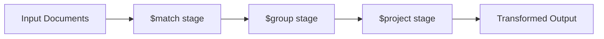

# Module 06: Aggregation Framework with Spring

Welcome class. Today we study the multi-stage data processing pipeline of the **MongoDB Aggregation Framework (CS-530)**.

To compile complex business metrics, join collections, and execute recursive tree queries, standard CRUD queries are insufficient. Today we analyze pipeline processing models, MongoTemplate aggregation builders, advanced stages, and RAM footprint management.

---

## 1. Academic Lecture: The Pipeline Processing Model

### Basic Level: Aggregation Pipeline Concept
An aggregation pipeline functions as an assembly line. An input document stream passes through sequence stages. Each stage performs a specific operation (e.g., filtering, grouping, reshaping, sorting) and outputs the transformed stream to the next stage.
The aggregation engine operates directly on the database server, minimizing the network overhead of sending raw records to client applications.

### Intermediate Level: Spring Aggregation Builders
Spring Data MongoDB exposes the Aggregation framework through the `MongoTemplate` helper class:
*   `Aggregation`: Main class used to construct the pipeline with static builders (`Aggregation.newAggregation(...)`).
*   `AggregationOperation`: Interface representing individual pipeline steps.
*   Common Stages:
    *   `$match` (`Aggregation.match(...)`): Filters documents using query criteria (uses indexes when run at the start).
    *   `$project` (`Aggregation.project(...)`): Reshapes document fields, adds calculated fields, or drops keys.
    *   `$group` (`Aggregation.group(...)`): Aggregates documents by a key and calculates totals, averages, or sums.

### Advanced Level: Join Operands, Facets, and Disk Allocation
*   **Collection Joins (`$lookup`)**: Executes a left outer join to combine documents from another collection based on matching attributes.
*   **Multi-Dimensional Categorization (`$facet`)**: Evaluates multiple pipelines in parallel over a single input document stream, allowing you to return search results alongside search filters (e.g., category count facets) in a single round-trip.
*   **Recursive Traversal (`$graphLookup`)**: Recursively traverses relationships (like organizational charts, nested parts lists) within collections, specifying start and depth parameters.
*   **Memory Optimization & Disk Spilling**: By default, an aggregation stage cannot exceed **100MB of RAM**. If a `$group` or `$sort` stage exceeds this threshold, MongoDB throws an error. We configure `allowDiskUse(true)` to spill intermediate sort files to the database's temporary directories.



---

## 2. Theory vs. Production Trade-offs

| Processing Model | Execution Location | Network Latency | Resource Overhead | Complexity |
| :--- | :--- | :--- | :--- | :--- |
| **MongoDB Aggregation** | Database Server | Very Low (Returns aggregate) | Moderate-High (CPU/RAM on DB) | Moderate |
| **Client-Side JVM Processing** | Application Server | Very High (Fetches raw BSONs) | Low DB, High App JVM | Low |
| **Old MapReduce (Deprecated)**| Database Cluster | Low | Extremely High (Single-threaded JS engine) | High |

---

## 3. How to Use: Executing Multi-stage Aggregations with MongoTemplate

Below we show an un-optimized client-side aggregation (anti-pattern) followed by a production-grade Aggregation pipeline built with Spring `MongoTemplate`.

### A. Client-Side Aggregation Processing (Anti-Pattern)
*Avoid downloading massive datasets to aggregate in application memory:*

```java
// DANGER: If the database contains millions of sales, this queries and transfers
// gigabytes of BSON records over the network to calculate a simple average in Java memory,
// causing out-of-memory (OOM) failures.
public double getAverageSaleValueJVM(String category) {
    Query query = Query.query(Criteria.where("category").is(category));
    List<Sale> sales = mongoTemplate.find(query, Sale.class);
    return sales.stream().mapToDouble(Sale::getAmount).average().orElse(0.0);
}
```

### B. MongoDB Aggregation Pipeline (Production Pattern)
Here is the optimized implementation executing `$match`, `$group`, `$lookup`, and `$project` stages natively inside the database cluster.

```java
package com.masterclass.mongodb.domain;

import org.springframework.data.annotation.Id;
import org.springframework.data.mongodb.core.mapping.Document;
import org.springframework.data.mongodb.core.mapping.Field;
import java.math.BigDecimal;

@Document(collection = "sales")
public class Sale {
    @Id
    private String id;
    
    @Field("product_id")
    private String productId;
    
    private String category;
    private BigDecimal amount;

    public Sale() {}
    public String getId() { return id; }
    public String getProductId() { return productId; }
    public String getCategory() { return category; }
    public BigDecimal getAmount() { return amount; }
}
```

```java
package com.masterclass.mongodb.dto;

import java.math.BigDecimal;

public class SalesSummary {
    private String id; // maps to grouped key (category)
    private double totalRevenue;
    private double averageSale;
    private long salesCount;

    public SalesSummary() {}

    public String getId() { return id; }
    public double getTotalRevenue() { return totalRevenue; }
    public double getAverageSale() { return averageSale; }
    public long getSalesCount() { return salesCount; }

    public void setId(String id) { this.id = id; }
    public void setTotalRevenue(double totalRevenue) { this.totalRevenue = totalRevenue; }
    public void setAverageSale(double averageSale) { this.averageSale = averageSale; }
    public void setSalesCount(long salesCount) { this.salesCount = salesCount; }
}
```

```java
package com.masterclass.mongodb.service;

import com.masterclass.mongodb.dto.SalesSummary;
import com.masterclass.mongodb.domain.Sale;
import org.springframework.data.mongodb.core.MongoTemplate;
import org.springframework.data.mongodb.core.aggregation.Aggregation;
import org.springframework.data.mongodb.core.aggregation.AggregationResults;
import org.springframework.data.mongodb.core.query.Criteria;
import org.springframework.stereotype.Service;
import java.util.List;

@Service
public class SalesAggregationService {

    private final MongoTemplate mongoTemplate;

    public SalesAggregationService(MongoTemplate mongoTemplate) {
        this.mongoTemplate = mongoTemplate;
    }

    /**
     * Aggregates sales statistics by category using high-performance aggregation stages.
     * Enforces the allowDiskUse flag to protect against memory failures.
     */
    public List<SalesSummary> getSalesSummaryByCategory(String targetCategory) {
        var matchStage = Aggregation.match(Criteria.where("category").is(targetCategory));
        
        var groupStage = Aggregation.group("category")
                .sum("amount").as("totalRevenue")
                .avg("amount").as("averageSale")
                .count().as("salesCount");

        var projectStage = Aggregation.project()
                .andExpression("_id").as("id")
                .andExpression("totalRevenue").as("totalRevenue")
                .andExpression("averageSale").as("averageSale")
                .andExpression("salesCount").as("salesCount");

        // Assemble the pipeline
        var aggregation = Aggregation.newAggregation(
                matchStage,
                groupStage,
                projectStage
        ).withOptions(Aggregation.newAggregationOptions().allowDiskUse(true).build());

        AggregationResults<SalesSummary> results = mongoTemplate.aggregate(
                aggregation, 
                Sale.class, 
                SalesSummary.class
        );

        return results.getMappedResults();
    }
}
```

### Line-by-Line Code Explanation:
1.  `Aggregation.match(Criteria.where("category").is(targetCategory))`: Creates the `$match` stage. Placed first in the pipeline to utilize collection indexes, filtering out irrelevant records immediately.
2.  `Aggregation.group("category").sum("amount").as("totalRevenue")...`: Sets up the `$group` step, aggregating records sharing the same category and calculating fields via database accumulators.
3.  `Aggregation.newAggregation(...)`: Chains the steps together sequentially.
4.  `.withOptions(AggregationOptions.builder().allowDiskUse(true).build())`: Commands the database engine to spill excess buffer objects to disk directories, preventing memory crashes if sorting large groups.

---

## 4. Common Errors & Pitfalls

### Pitfall 1: Accumulating Nested Arrays into a Single BSON Document (16MB Limit Violation)
*   **Why it fails**: Aggregation stages like `$group` combined with `$push` to construct lists of sub-documents can produce output records exceeding the **16MB BSON document size limit**. If a category group has millions of transaction objects pushed inside it, MongoDB throws a size limit violation error.
*   **Mitigation**: Restructure the aggregation. Avoid pushing massive lists into parent objects. Keep outputs tabular or limit records using `$limit` and `$unwind` streaming.

---

## 5. Socratic Review Questions

### Question 1
Why must the `$match` stage be positioned at the absolute start of an aggregation pipeline?

#### Answer
Placing the `$match` stage first allows MongoDB to query index structures to quickly filter down input sets. If you place a `$project` or `$group` stage before `$match`, MongoDB is forced to scan the entire collection (making index lookup impossible), resulting in massive CPU waste and index degradation.

---

## 6. Hands-on Challenge: Building a Hierarchical Aggregation Pipeline

### The Challenge
In this challenge, you will write a Spring Aggregation pipeline builder that summarizes logs by severity level.
Your task:
1. Complete `LogLevelAggregationBuilder.java`.
2. Construct matching filter criteria on target `serviceName`.
3. Group records by log level field `severity` and compute the total event counts.

Complete the implementation stub:

```java
package com.masterclass.mongodb.challenge;

import org.springframework.data.mongodb.core.aggregation.Aggregation;
import org.springframework.data.mongodb.core.query.Criteria;

public class LogLevelAggregationBuilder {

    public static Aggregation buildSeverityCountPipeline(String serviceName) {
        // TODO: Build aggregation pipeline:
        // 1. Match serviceName
        // 2. Group by "severity" counting occurrences as "totalLogs"
        return Aggregation.newAggregation(
            Aggregation.match(Criteria.where("serviceName").is(serviceName)),
            Aggregation.group("severity").count().as("totalLogs")
        );
    }
}
```

### Verification Test
Verify your code with this JUnit 5 test class:

```java
package com.masterclass.mongodb.challenge;

import org.junit.jupiter.api.Test;
import org.springframework.data.mongodb.core.aggregation.Aggregation;
import org.springframework.data.mongodb.core.aggregation.AggregationOperation;
import java.util.List;
import static org.junit.jupiter.api.Assertions.*;

class LogLevelAggregationBuilderTest {

    @Test
    void testBuildSeverityCountPipeline() {
        Aggregation aggregation = LogLevelAggregationBuilder.buildSeverityCountPipeline("auth-service");
        assertNotNull(aggregation);
        
        List<AggregationOperation> operations = aggregation.getPipeline().getOperations();
        assertTrue(operations.size() >= 2);
        
        String matchStr = operations.get(0).toDocument(Aggregation.DEFAULT_CONTEXT).toJson();
        assertTrue(matchStr.contains("auth-service"));
    }
}
```
