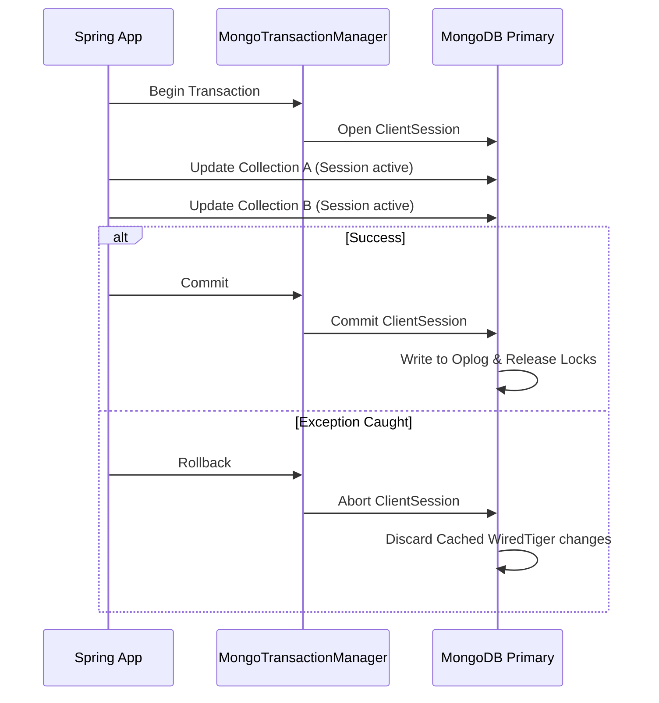

# Module 07: Transactions and Consistency

Welcome class. Today we analyze multi-document consistency models using **Spring Data MongoDB Transactions (CS-530)**.

To preserve integrity across database structures in enterprise platforms, write operations must satisfy ACID properties. Today we study session context isolation, `@Transactional` boundaries, replica set synchronization, WiredTiger storage caching, and saga design patterns.

---

## 1. Academic Lecture: Transactions & Consistency

### Basic Level: ACID in Document Databases
Historically, document databases only supported atomic updates on a single document. Starting with version 4.0, MongoDB introduced multi-document ACID transactions. 
Transactions allow engineers to bundle multiple update statements across collections. If one update statement fails, the database rolls back all modifications inside that transaction, preserving database integrity.

### Intermediate Level: `@Transactional` & `MongoTransactionManager`
Spring Data integrates MongoDB transaction sessions into the standard `@Transactional` boundary manager:
*   `MongoTransactionManager`: The core transaction manager bean which coordinates ClientSession context loops.
*   `@Transactional`: Declarative annotation that wraps code in a transaction.
*   **Replica Set Prerequisite**: MongoDB transactions require a multi-node replica set or sharded cluster. They cannot execute on a standalone database process because transactions use the oplog replication channel to broadcast atomic changes across secondary nodes.

### Advanced Level: WiredTiger Caching, Lock Mechanisms & Saga Design
*   **WiredTiger Transaction Log**: During a transaction, WiredTiger caches modified documents in memory and writes operations to the journal. The transaction session holds locks on keys.
*   **Lock Overheads**: Long-running transactions accumulate locks, blocking other operations. WiredTiger limits write transaction blocks (typically 60 seconds maximum) to prevent cache depletion and replication lag.
*   **Optimistic Concurrency Control (`@Version`)**: Spring Data uses a `@Version` field on documents. When saving changes, Spring compares version numbers. If another thread changed the document in the meantime, Spring throws an `OptimisticLockingFailureException`, aborting the execution.
*   **Sagas vs Transactions**: In distributed systems, local multi-document transactions across microservices can cause high resource locking. Engineers apply the **Saga Pattern** (orchestrations or choreographies using Kafka event outbox updates) to manage state transactions through compensation workflows instead of long-lived DB sessions.



---

## 2. Theory vs. Production Trade-offs

| Consistency Strategy | Isolation Level | Performance Impact | Lock Scope | Implementation Complexity |
| :--- | :--- | :--- | :--- | :--- |
| **No Transactions (Atomic Document)** | Document-Level | Zero | Single document lock | Low |
| **Spring `@Transactional`** | Snapshot Isolation | High (WiredTiger locks) | Multi-document key locks | Low (Declarative) |
| **Optimistic Locking (`@Version`)** | Optimistic check | Very Low | Check on write | Low-Moderate |
| **Distributed Saga (Event Outbox)**| Eventual Consistency | Very Low | Async event queues | High |

---

## 3. How to Use: Configuring Transactions and Optimistic Locking

Below we show an un-isolated manual update (anti-pattern) followed by a production-grade transaction service with Optimistic Concurrency Control configuration.

### A. The Manual Un-isolated Order Workflow (Anti-Pattern)
*Avoid executing multi-step updates without transaction session isolation:*

```java
// DANGER: If the database updates order log details but crashes before reducing product inventory,
// the store database is left in an inconsistent state: payment processed, but inventory unchanged.
public void createOrderUnsafe(Order order) {
    orderRepository.save(order);
    Product product = productRepository.findById(order.getProductId()).get();
    product.setStock(product.getStock() - 1);
    productRepository.save(product);
}
```

### B. High-Performance Transactional Allocation (Production Pattern)
Here is the robust implementation configuration, adding transaction coordination and optimistic version protection.

```java
package com.masterclass.mongodb.config;

import org.springframework.context.annotation.Bean;
import org.springframework.context.annotation.Configuration;
import org.springframework.data.mongodb.MongoDatabaseFactory;
import org.springframework.data.mongodb.MongoTransactionManager;

@Configuration
public class TransactionConfig {

    /**
     * Registers the MongoTransactionManager required to enable @Transactional boundaries.
     */
    @Bean
    public MongoTransactionManager transactionManager(MongoDatabaseFactory dbFactory) {
        return new MongoTransactionManager(dbFactory);
    }
}
```

```java
package com.masterclass.mongodb.domain;

import org.springframework.data.annotation.Id;
import org.springframework.data.annotation.Version;
import org.springframework.data.mongodb.core.mapping.Document;

@Document(collection = "products")
public class Product {
    @Id
    private String id;
    private String name;
    private int stock;
    
    @Version
    private Long version; // Enables Optimistic Concurrency Control

    public Product() {}
    public Product(String id, String name, int stock) {
        this.id = id;
        this.name = name;
        this.stock = stock;
    }

    public String getId() { return id; }
    public String getName() { return name; }
    public int getStock() { return stock; }
    public Long getVersion() { return version; }

    public void setStock(int stock) { this.stock = stock; }
}
```

```java
package com.masterclass.mongodb.service;

import com.masterclass.mongodb.domain.Product;
import com.masterclass.mongodb.domain.Order;
import org.springframework.stereotype.Service;
import org.springframework.transaction.annotation.Transactional;
import org.springframework.data.mongodb.core.MongoTemplate;

@Service
public class OrderProcessingService {

    private final MongoTemplate mongoTemplate;

    public OrderProcessingService(MongoTemplate mongoTemplate) {
        this.mongoTemplate = mongoTemplate;
    }

    /**
     * Creates an order and allocates inventory atomically inside a transaction.
     * Throws OptimisticLockingFailureException if version conflicts arise.
     */
    @Transactional
    public void processOrderSecure(String productId, int quantity) {
        // Find product
        Product product = mongoTemplate.findById(productId, Product.class);
        if (product == null) {
            throw new IllegalArgumentException("Product not found");
        }

        if (product.getStock() < quantity) {
            throw new IllegalStateException("Insufficient stock allocation");
        }

        // Deduct inventory
        product.setStock(product.getStock() - quantity);
        mongoTemplate.save(product); // Increments version, validates write lock

        // Log transaction log
        Order order = new Order(productId, quantity, "PENDING_DELIVERY");
        mongoTemplate.save(order);
    }
}
```

### Line-by-Line Code Explanation:
1.  `MongoTransactionManager transactionManager(...)`: Instantiates the Spring transaction lifecycle manager.
2.  `@Version private Long version`: Marks the variable as a version checker. If two threads load the same object and both save modifications, the second save fails because its payload's version is lower than the incremented database record version.
3.  `@Transactional`: Surrounds database calls in a transaction. If any runtime exception is thrown during runtime, the operations roll back.

---

## 4. Common Errors & Pitfalls

### Pitfall 1: Transient Transaction Errors in Replica Set Failovers
*   **Why it fails**: When a primary replica node crashes, the secondary nodes elect a new primary. If a transaction is executing during the transition, MongoDB drops the connection and aborts active sessions, raising a `TransientTransactionError`.
*   **Mitigation**: Connect using retryable write configurations in your URI (`mongodb://host/?retryWrites=true`) and configure Spring Data's transaction manager with a custom transactional retry handler.

---

## 5. Socratic Review Questions

### Question 1
Why are MongoDB multi-document transactions unable to run on standalone MongoDB processes?

#### Answer
Standalone MongoDB processes do not produce replication oplogs (operations logs). MongoDB transactions rely on the oplog channels to track state changes, replicate transaction stages, and synchronize index maps. Thus, a minimum of a single-node replica set config is required to initiate transaction sessions.

---

## 6. Hands-on Challenge: Inventory Allocation Transaction

### The Challenge
In this challenge, you will implement a transaction service using `@Transactional` to transfer balance between accounts.
Your task:
1. Complete `AccountTransferService.java`.
2. Find source and destination accounts.
3. Deduct amount from source, check balance boundaries, and add amount to destination.
4. Execute inside a transactional method.

Complete the implementation stub:

```java
package com.masterclass.mongodb.challenge;

import org.springframework.stereotype.Service;
import org.springframework.transaction.annotation.Transactional;
import org.springframework.data.mongodb.core.MongoTemplate;
import java.math.BigDecimal;

@Service
public class AccountTransferService {

    private final MongoTemplate mongoTemplate;

    public AccountTransferService(MongoTemplate mongoTemplate) {
        this.mongoTemplate = mongoTemplate;
    }

    @Transactional
    public void transferBalance(String sourceId, String destId, BigDecimal amount) {
        // TODO: Load accounts
        // TODO: Perform safety checks (nulls, balance thresholds)
        // TODO: Update balances and save back
        // TODO: Raise RuntimeException if balance is insufficient to trigger rollback
    }
}
```

### Verification Test
Verify your code with this JUnit 5 test class:

```java
package com.masterclass.mongodb.challenge;

import org.junit.jupiter.api.Test;
import org.springframework.transaction.annotation.Transactional;
import java.lang.reflect.Method;
import static org.junit.jupiter.api.Assertions.*;

class AccountTransferServiceTest {

    @Test
    void testTransactionAnnotationPresence() throws Exception {
        Method method = AccountTransferService.class.getMethod("transferBalance", String.class, String.class, java.math.BigDecimal.class);
        assertNotNull(method);
        assertTrue(method.isAnnotationPresent(Transactional.class));
    }
}
```
