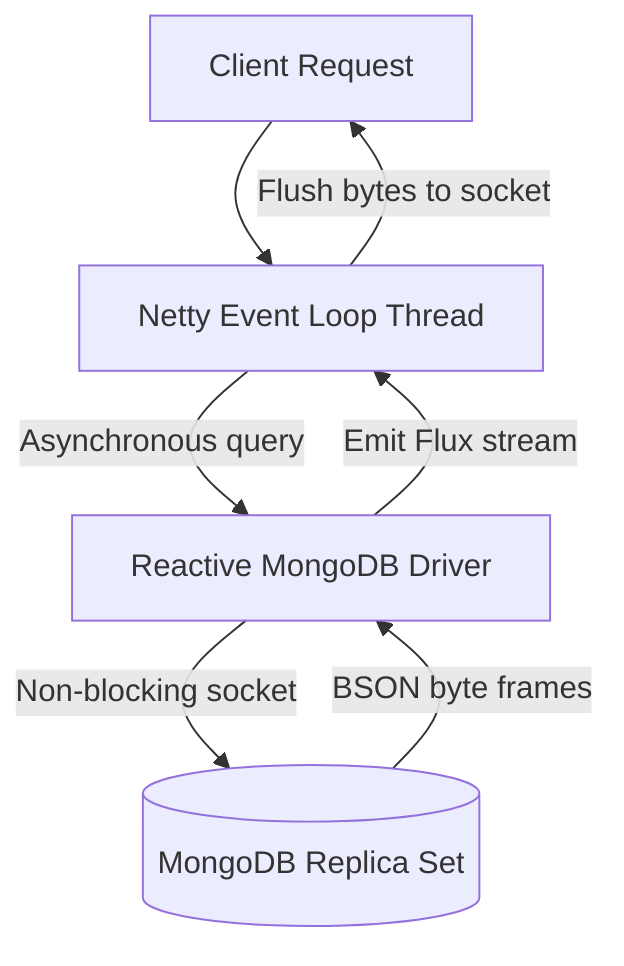

# Module 08: Reactive Spring Data MongoDB

Welcome class. Today we explore asynchronous, non-blocking data access using **Reactive Spring Data MongoDB (CS-530)**.

To build responsive microservices that handle thousands of concurrent queries without blocking runtime threads, we must bypass blocking driver APIs. Today we study Project Reactor streaming patterns (`Mono`/`Flux`), Netty event loops, backpressure controls, and Change Stream streaming event pipelines.

---

## 1. Academic Lecture: Reactive Data Architecture

### Basic Level: Non-Blocking Architecture
In a standard blocking application, each request consumes a thread from the servlet container (Thread-per-Request model). If the application queries the database, the thread goes idle, waiting for the database to return records.
A Reactive application runs on a tiny thread pool (usually equal to the CPU core count) using an Event Loop architecture. Instead of waiting, threads register a callback handler and immediately process other tasks. When the database finishes retrieving data, it notifies the thread, which then returns the result.

### Intermediate Level: Project Reactor & Reactive Mongo Repositories
Spring Boot implements reactive programming using Project Reactor:
*   `Mono<T>`: A publisher that emits at most one item (like saving a document, or finding by ID).
*   `Flux<T>`: A publisher that emits zero to many items (like streaming collection queries).
*   `ReactiveMongoRepository`: Extends Spring's repository model to support reactive return types:
    ```java
    public interface ReactiveCustomerRepository extends ReactiveMongoRepository<Customer, String> {
        Flux<Customer> findByStatus(String status);
    }
    ```
*   `ReactiveMongoTemplate`: Reactive implementation of the core template class.

### Advanced Level: Reactive Drivers, Netty Events, and Backpressure
*   **Netty Event Loop**: Non-blocking network I/O is managed by Netty. Netty maps network requests to non-blocking OS channels (like epoll/kqueue).
*   **Driver Layer**: The Reactive MongoDB Driver communicates via asynchronous TCP sockets, encoding data to BSON frames and streaming them back to Reactor publishers.
*   **Backpressure Flow Control**: If the database emits documents faster than the application can process them, backpressure mechanisms regulate the stream. Using Reactor operators (e.g., `.limitRate(50)`), the application requests items in chunks, preventing buffer saturation.
*   **Tail Keeps Capped Collections**: Capped collections can be tailed. Using tailing queries, a `Flux` acts as a push-based event bus, streaming updates as they arrive.



---

## 2. Theory vs. Production Trade-offs

| Runtime Architecture | Active Concurrent Connections | Memory footprint | CPU Utilization | Implementation Complexity |
| :--- | :--- | :--- | :--- | :--- |
| **Blocking (Servlet/Tomcat)** | Limited by thread pool (e.g. 200) | High (1MB per thread stack) | Idle during network waits | Low (Linear execution) |
| **Reactive (Netty/WebFlux)** | High (Thousands per thread) | Very Low (Static buffer reuse) | High (Constant event loop work) | High (Non-linear streams) |

---

## 3. How to Use: Building a Real-time Change Stream Publisher

Below we show an un-optimized blocking polling loop (anti-pattern) followed by a production-grade reactive Change Stream event emitter.

### A. The Blocking Database Polling Loop (Anti-Pattern)
*Avoid polling collections in active loops:*

```java
// DANGER: Running a while(true) loop blocks the CPU core thread and generates
// constant query noise inside MongoDB's active connection list.
public void pollEventsUnoptimized() throws InterruptedException {
    while (true) {
        List<Event> events = mongoTemplate.find(Query.query(Criteria.where("processed").is(false)), Event.class);
        for (Event e : events) {
            process(e);
        }
        Thread.sleep(1000);
    }
}
```

### B. Reactive Change Stream Event Pipeline (Production Pattern)
Here is the reactive implementation that tails change streams, handles backpressure, and pipes data asynchronously.

```java
package com.masterclass.mongodb.domain;

import org.springframework.data.annotation.Id;
import org.springframework.data.mongodb.core.mapping.Document;

@Document(collection = "application_events")
public class AppEvent {
    @Id
    private String id;
    private String eventType;
    private String payload;

    public AppEvent() {}
    public AppEvent(String id, String eventType, String payload) {
        this.id = id;
        this.eventType = eventType;
        this.payload = payload;
    }

    public String getId() { return id; }
    public String getEventType() { return eventType; }
    public String getPayload() { return payload; }
}
```

```java
package com.masterclass.mongodb.service;

import com.masterclass.mongodb.domain.AppEvent;
import org.springframework.data.mongodb.core.ReactiveMongoTemplate;
import org.springframework.data.mongodb.core.ChangeStreamEvent;
import org.springframework.data.mongodb.core.ChangeStreamOptions;
import org.springframework.stereotype.Service;
import reactor.core.publisher.Flux;

@Service
public class ReactiveEventService {

    private final ReactiveMongoTemplate reactiveMongoTemplate;

    public ReactiveEventService(ReactiveMongoTemplate reactiveMongoTemplate) {
        this.reactiveMongoTemplate = reactiveMongoTemplate;
    }

    /**
     * Subscribes to real-time database modifications inside the application_events collection.
     * Integrates flow control backpressure using the limitRate operator.
     */
    public Flux<AppEvent> streamEvents(String filterType) {
        ChangeStreamOptions options = ChangeStreamOptions.builder()
                .filter(org.springframework.data.mongodb.core.query.SerializationUtils.serializeToJsonPattern(
                        org.springframework.data.mongodb.core.query.Criteria.where("operationType").is("insert")
                )).build();

        return reactiveMongoTemplate.changeStream("application_events", options, AppEvent.class)
                .map(ChangeStreamEvent::getBody)
                // Filter elements matching target type
                .filter(event -> filterType.equalsIgnoreCase(event.getEventType()))
                // Prevent buffer exhaustion by pulling in groups of 32
                .limitRate(32)
                .onErrorResume(throwable -> Flux.empty()); // Gracefully recover on errors
    }
}
```

### Line-by-Line Code Explanation:
1.  `ReactiveMongoTemplate`: The reactive version of MongoTemplate which relies on the async reactive Java driver.
2.  `reactiveMongoTemplate.changeStream(...)`: Initiates a change stream listener on the target database collection.
3.  `.map(ChangeStreamEvent::getBody)`: Unwraps BSON operation details to retrieve only the converted Java object payload.
4.  `.limitRate(32)`: Backpressure control. Dictates that the reactor event subscriber will request batches of 32 events at a time, protecting memory pipelines from crashing under heavy write traffic.

---

## 4. Common Errors & Pitfalls

### Pitfall 1: Executing Blocking Code in the Event Loop Thread
*   **Why it fails**: If you execute a blocking operation (such as `Thread.sleep()`, file system reads, or blocking database calls) inside a reactive stream handler, you block the entire Netty Event Loop. Since there are only a few Event Loop threads, blocking one thread freezes processing for hundreds of clients.
*   **Mitigation**: Run blocking calculations on a separate thread pool using the `.publishOn(Schedulers.boundedElastic())` operator.

---

## 5. Socratic Review Questions

### Question 1
What does the `.limitRate(n)` operator accomplish inside a Project Reactor stream, and how does it prevent memory exhaustion?

#### Answer
The `.limitRate(n)` operator coordinates backpressure flow by adjusting downstream demand requests. Instead of allowing the source database to publish millions of records immediately into JVM memory buffers, `limitRate` specifies that the stream will only fetch `n` records initially. Once the subscriber has processed 75% of that buffer, it requests the next batch, keeping the memory foot-print constant.

---

## 6. Hands-on Challenge: Reactive Event Flow Builder

### The Challenge
In this challenge, you will implement a reactive pipeline method that processes user events.
Your task:
1. Complete `ReactiveStreamBuilder.java`.
2. Filter the events stream `Flux<AppEvent>` to only keep events where the `eventType` matches `"LOGIN"`.
3. Map the event to extract the payload string.

Complete the implementation stub:

```java
package com.masterclass.mongodb.challenge;

import com.masterclass.mongodb.domain.AppEvent;
import reactor.core.publisher.Flux;

public class ReactiveStreamBuilder {

    public static Flux<String> buildLoginPayloadStream(Flux<AppEvent> eventFlux) {
        // TODO: Filter stream to only keep events with type "LOGIN"
        // TODO: Map each event to its payload string
        return eventFlux
            .filter(event -> "LOGIN".equals(event.getEventType()))
            .map(AppEvent::getPayload);
    }
}
```

### Verification Test
Verify your code with this JUnit 5 test class:

```java
package com.masterclass.mongodb.challenge;

import com.masterclass.mongodb.domain.AppEvent;
import org.junit.jupiter.api.Test;
import reactor.core.publisher.Flux;
import reactor.test.StepVerifier;

class ReactiveStreamBuilderTest {

    @Test
    void testBuildLoginPayloadStream() {
        Flux<AppEvent> source = Flux.just(
            new AppEvent("1", "LOGIN", "user_1"),
            new AppEvent("2", "LOGOUT", "user_2"),
            new AppEvent("3", "LOGIN", "user_3")
        );

        Flux<String> result = ReactiveStreamBuilder.buildLoginPayloadStream(source);

        StepVerifier.create(result)
            .expectNext("user_1")
            .expectNext("user_3")
            .verifyComplete();
    }
}
```
