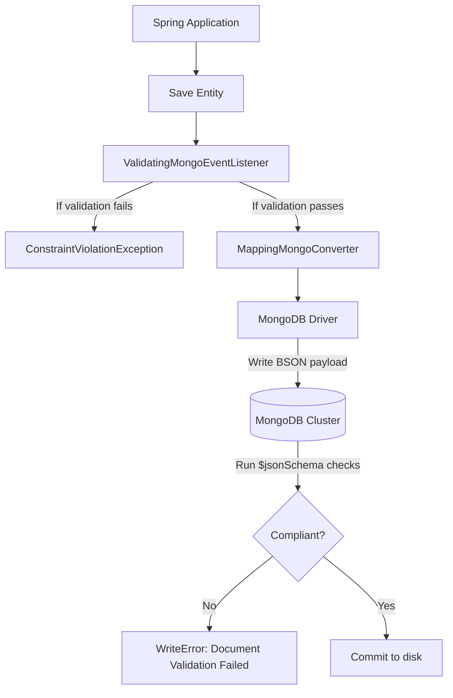

# Module 09: Validation and Schema Control

Welcome class. Today we analyze validation strategies and schema evolution rules using **Spring Data MongoDB (CS-530)**.

To protect database consistency, data payloads must be verified before serialization and persistence. Today we study application-level validations, database-level JSON schemas, validation event listeners, and blue-green zero-downtime schema migration strategies.

---

## 1. Academic Lecture: Validation & Schema Control

### Basic Level: Schema-less vs. Schema-enforced
MongoDB is famously schema-less, meaning documents within the same collection do not need to share the same structure. However, "schema-less" is an implementation detail, not a architectural policy. Without validation, corrupted or malformed documents (e.g., missing mandatory primary attributes or negative price values) degrade downstream service execution.

### Intermediate Level: Spring Validator Annotations & Event Listeners
We enforce validation at two levels in Spring Boot:
1.  **JSR-380 Validator Annotations**: Standard annotations like `@NotNull`, `@Min`, `@Size`, and `@Pattern` placed on domain fields.
2.  **ValidatingMongoEventListener**: A Spring bean listener that intercepts database save events (`onBeforeSave`), triggers the local JSR-380 validator factory, and throws constraint violation exceptions if objects are invalid, preventing the driver from serialization.

### Advanced Level: MongoDB JSON Schema Validation & Blue-Green Migrations
*   **Database JSON Schema (`$jsonSchema`)**: MongoDB supports document validation using JSON Schema definitions configured via administrative commands (`collMod`). The database engine evaluates insert and update BSON documents against this schema, rejecting non-compliant payloads at the cluster level.
*   **Blue-Green Schema Migrations**: When updating a schema (e.g., changing a single string `address` field into a nested structure), you cannot halt production. We use a **three-step migration**:
    1.  *Phase 1*: Double-write and read compatibility. Code is updated to read the old or new field, but always writes the old field and writes the new field as optional.
    2.  *Phase 2*: Backfill. A background runner migrates old records to populate the new structure.
    3.  *Phase 3*: Deprecation. The database schema rules are updated to mark the new structure as mandatory, and old code pathways are removed.



---

## 2. Theory vs. Production Trade-offs

| Validation Level | Executed By | Performance Overhead | Dynamic Rules Support | Network Latency Savings |
| :--- | :--- | :--- | :--- | :--- |
| **Application (JSR-380)** | JVM (Spring Thread) | Low (Local JVM CPU) | High (Java code logic) | High (Aborts before DB call) |
| **Database (`$jsonSchema`)**| MongoDB Cluster | High (DB CPU check) | Low (Requires collMod) | Low (Validates on DB node) |
| **No Validation** | None | Zero | N/A | N/A |

---

## 3. How to Use: Configuring Application Validation and DB JSON Schema

Below we show an un-validated domain model (anti-pattern) followed by a production-ready validation setup using Spring.

### A. The Schema-less Un-validated Setup (Anti-Pattern)
*Avoid letting un-validated objects enter the database:*

```java
// DANGER: Without validation, users can save null emails, negative prices, 
// or corrupt phone string lengths, resulting in runtime NullPointerExceptions in backend jobs.
@Document(collection = "users")
public class User {
    @Id
    private String id;
    private String email;
    private int age;
}
```

### B. Production-Grade Validator Configuration (Production Pattern)
Here is the clean validation architecture registering `ValidatingMongoEventListener` and applying validation rules.

```java
package com.masterclass.mongodb.config;

import org.springframework.context.annotation.Bean;
import org.springframework.context.annotation.Configuration;
import org.springframework.data.mongodb.core.mapping.event.ValidatingMongoEventListener;
import org.springframework.validation.beanvalidation.LocalValidatorFactoryBean;

@Configuration
public class MongoValidationConfig {

    /**
     * Registers the event listener that intercepts Spring Data persistence steps,
     * triggering validation checks before BSON conversion.
     */
    @Bean
    public ValidatingMongoEventListener validatingMongoEventListener(LocalValidatorFactoryBean validatorFactory) {
        return new ValidatingMongoEventListener(validatorFactory);
    }

    @Bean
    public LocalValidatorFactoryBean validator() {
        return new LocalValidatorFactoryBean();
    }
}
```

```java
package com.masterclass.mongodb.domain;

import org.springframework.data.annotation.Id;
import org.springframework.data.mongodb.core.mapping.Document;
import org.springframework.data.mongodb.core.mapping.Field;
import jakarta.validation.constraints.Email;
import jakarta.validation.constraints.Min;
import jakarta.validation.constraints.NotBlank;
import jakarta.validation.constraints.Size;

@Document(collection = "students")
public class Student {

    @Id
    private String id;

    @NotBlank(message = "Student name cannot be blank")
    @Size(min = 2, max = 50, message = "Name must be between 2 and 50 characters")
    private String name;

    @NotBlank(message = "Email is mandatory")
    @Email(message = "Invalid email format")
    private String email;

    @Min(value = 18, message = "Student must be at least 18 years old")
    private int age;

    public Student() {}
    public Student(String id, String name, String email, int age) {
        this.id = id;
        this.name = name;
        this.email = email;
        this.age = age;
    }

    public String getId() { return id; }
    public String getName() { return name; }
    public String getEmail() { return email; }
    public int getAge() { return age; }
}
```

### Line-by-Line Code Explanation:
1.  `ValidatingMongoEventListener`: Hooks into Spring Data lifecycle steps, specifically intercepting the `BeforeConvertEvent` and running validation checks.
2.  `LocalValidatorFactoryBean`: Configures the default JSR-380 Hibernate Validator backend.
3.  `@NotBlank` and `@Email`: JSR-380 constraints. If an entity is saved with a null or invalid email, `ValidatingMongoEventListener` intercepts the save and throws a `ConstraintViolationException`, rolling back any local transaction block.

---

## 4. Common Errors & Pitfalls

### Pitfall 1: Bypassing JSR-380 Validation via Direct DB Updates
*   **Why it fails**: JSR-380 annotations are validated on the JVM during Spring Data persistence cycles (e.g. `mongoTemplate.save()`). If developers bypass these calls by executing raw updates (like `Update.set("age", -5)` inside `mongoTemplate.updateFirst()`), Spring does not instantiate the entity lifecycle, allowing invalid records into the database.
*   **Mitigation**: Always implement a database-level `$jsonSchema` matching the application-level constraints as a secondary line of defense.

---

## 5. Socratic Review Questions

### Question 1
What happens when you run a Spring Data MongoDB update using `Update.set()`? Does JSR-380 validation execute? Explain why.

#### Answer
No, JSR-380 validation does not execute. `ValidatingMongoEventListener` listens to conversion events of full Java domain objects. Direct update operations like `mongoTemplate.updateFirst(query, update, ...)` bypass object serialization entirely, sending raw query instructions straight to the database driver without passing through the converter validation loop.

---

## 6. Hands-on Challenge: Validation Rules Configuration

### The Challenge
In this challenge, you will implement validation fields on a product class.
Your task:
1. Complete `ManagedProduct.java`.
2. Add JSR-380 annotations to ensure:
   - `sku` is not blank and matches the regex pattern `"^[A-Z]{3}-\d{3}$"` (e.g., `"PRO-101"`).
   - `price` is at least `0.01`.

Complete the implementation stub:

```java
package com.masterclass.mongodb.challenge;

import org.springframework.data.annotation.Id;
import org.springframework.data.mongodb.core.mapping.Document;
import jakarta.validation.constraints.*;
import java.math.BigDecimal;

@Document(collection = "managed_products")
public class ManagedProduct {

    @Id
    private String id;

    // TODO: Require SKU matching pattern "three uppercase letters - three numbers"
    private String sku;

    // TODO: Price must be at least 0.01
    private BigDecimal price;

    public ManagedProduct() {}
    public ManagedProduct(String id, String sku, BigDecimal price) {
        this.id = id;
        this.sku = sku;
        this.price = price;
    }

    public String getId() { return id; }
    public String getSku() { return sku; }
    public BigDecimal getPrice() { return price; }
}
```

### Verification Test
Verify your code with this JUnit 5 test class:

```java
package com.masterclass.mongodb.challenge;

import org.junit.jupiter.api.Test;
import jakarta.validation.Validation;
import jakarta.validation.Validator;
import jakarta.validation.ValidatorFactory;
import java.math.BigDecimal;
import static org.junit.jupiter.api.Assertions.*;

class ManagedProductTest {

    private final Validator validator;

    ManagedProductTest() {
        ValidatorFactory factory = Validation.buildDefaultValidatorFactory();
        this.validator = factory.getValidator();
    }

    @Test
    void testValidationFailure() {
        var product = new ManagedProduct("1", "invalid-sku", new BigDecimal("0.00"));
        var violations = validator.validate(product);
        assertFalse(violations.isEmpty());
    }
}
```
